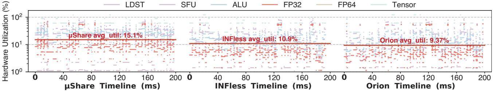
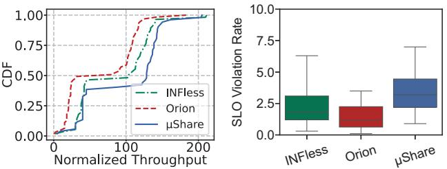
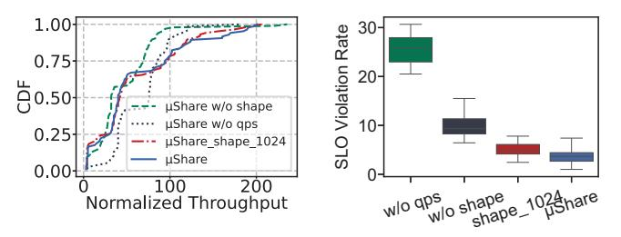
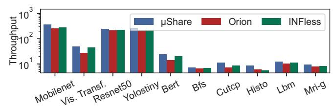

# F. Performance on A800 GPU

High Throughput:  $\mu$ Share improves system throughput by 16.45%-52.29% on NVIDIA A800 GPUs while guaranteeing the SLO. We compare the throughput of  $\mu$ Share, INFless, and Orion on A800 GPU. The normalized throughputs of  $\mu$ Share and INFless and Orion are 99.39 and 85.35 and 65.26 (Figure 21(a)), respectively.  $\mu$ Share improves system normalized throughput by 16.45%-52.29%. Additionally, as the proportion of unmodifiable kernels decreases from 100% to the default 48.37%, the throughput of  $\mu$ Share improves from 86.13 to 98.50 (Figure 13(b)). And the average violation rates across  $\mu$ Share, INFless, and Orion are 3.40%, 2.29%, and 1.42% (Figure 21(b)), respectively.  $\mu$ Share shows only a 1.11%-1.98% increase in SLO violations but achieves a throughput improvement of 16.45%-52.29%.

In addition, the improvement in  $\mu Share$  on the A800 GPU is slightly smaller than on the A40 GPU. This is because the A800 uses 1/3-plus shaping compared to the half-plus

Fig. 20: Comparison of six low-level hardware utilization timelines between  $\mu Share$  and baselines.

Fig. 21: (a) Normalized throughput on NVIDIA A800. (b)SLO violation on NVIDIA A800.

shaping of the A40, which increases the upper limit of blocks utilizing the same resources within a single SM core from 1/2 to 2/3 (i.e., two 1/3-plus blocks per SM), which may lead to slightly unbalanced SM thread allocation, resulting in lower improvement on the A800 compared to the A40.

#### G. Performance Analysis Breakdown

**Shaping Improvement:** Half-plus blocksize Shaping can effectively improve the throughput by 19.40% while reducing SLO violation rate. We analyze the impact of the μShare system's multiple components on throughput and SLO. We set up four breakdown scenarios: (1) μShare, where blocksize dynamically adjusts according to kernel launch time. (2) μShare\_shape\_1024, where blocksize is set to a fixed value, e.g., 1024. (3) μShare w/o shape, where blocksize is no longer adjusted. (4) μShare w/o batch, where inference task's batch size is no longer adjusted based on latency feedback.

Fig. 22: Breakdown analysis of the  $\mu Share$ : impact on (a) throughput and (b) SLO violation rate.

When µShare fixes the blocksize of all modifiable kernels at 1024, the system throughput decreases by 3.36% in Figure 22(a) and the SLO violation rate increases by 1.32% in Figure 22(b). This is because fixing the blocksize prevents further optimization of SLO through adjusting the number of threads for the kernels. In contrast, when µShare does not modify the

blocksize of any kernels, the system throughput decreases by 30.95% in Figure 22(a) and the SLO violation rate increases by 6.33% in Figure 22(b). This is because the system shifting from kernel-level scattered co-location to kernel-level stacked co-location, leading to inefficient utilization of intra-SM hardware resources. Furthermore, when  $\mu Share$  no longer adjusts the batch size of inference requests, the system throughput increases by 10.67% while the SLO violation rate increases by 21.90%. This is because the system loses the ability to adapt batch sizes based on inference latency feedback, resulting in a sharp throughput increase when the input load exceeds system capacity, but at the cost of significantly higher SLO violations.

#### H. Co-locating Scientific Computing Workloads

**Broad Applicability:** μShare supports all applications that execute workloads as CUDA kernels. With the rise of AI for science (co-locating scientific computing, inference, and training workloads) [26], [28], LLM+RAG (co-locating LLM inference and RAG) [23], [41], and other technologies [17], [58], the variety of applications running in datacenters has become increasingly diverse. As a result, we evaluate μShare by co-locating five scientific computing applications from the Parboil benchmark [47] with five inference models listed in Table III. Unlike inference models deployed as services, scientific computing applications are compiled into binary executables. We randomly select and execute these executables, allowing the same application to be invoked multiple times. As shown in Figure 23, μShare improves the overall system throughput by 18.18%–28.62%.

Fig. 23: Throughput evaluation under co-location scientific computing and inference applications.

These improvements are achieved because scientific computing applications typically utilize FP64 cores, whereas inference applications mainly rely on FP32 cores, LDST units, and Tensor Cores. By co-locating kernels with complementary hardware demands within the same SM, *µShare* improves hardware utilization and enhances overall system throughput.

