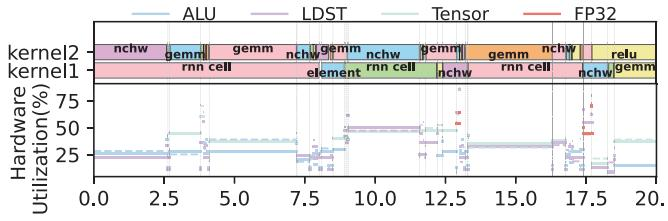
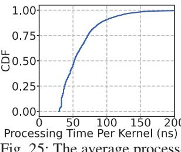
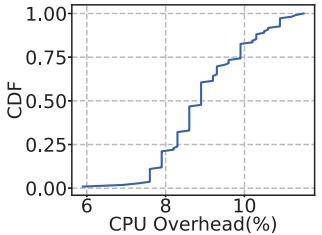

# *I. Kernels and Utilization in SM at Runtime*

The co-located kernels within each SM and the dominant utilization of two kernels in *μShare* (two solid lines) and one kernel in INFless (one dashed line) are shown in Fig. 24. *μShare* significantly improves hardware utilization.

Fig. 24: Kernels and utilization in SM at runtime.

## *J. Overhead*

Low Overhead: We measure the online execution overhead of *μShare*. The resource consumption of the system is shown in Figure 26 revealing that the CPU overhead during runtime is a mere 6.85% of a single core, suggesting an exceedingly low resource overhead. Additionally, we employ shared memory to enhance communication between the inference and control processes, the average system control overhead for a single kernel is merely 60.35 nanoseconds, as illustrated in Figure 25. Moreover, the offline profiling cost for each model ranges from 105 to 393 seconds. For Llama2-7b, which contains significantly more kernels, the profiling time is 7,160 seconds.

Fig. 25: The average processing time for each kernel.

Fig. 26: The overhead during system runtime.

## VI. RELATED WORK

GPU Spatial Sharing: Spatial sharing enhances throughput by enabling multitasking on shared GPUs: NVIDIA's Multi-Instance GPU (MIG) [30], Multi-Process Service (MPS) [32] and AMD CU masking [1] divide a single GPU into multiple partitions to serve several tasks. Orion [46] reduces interference by coupling the execution of SM-intensive and memory-intensive kernels. INFless [55] minimizes resource fragmentation through uneven allocation of SM and memory. INFless and Batchmaker [15] dynamically adjust batch sizes to guarantee latency. REEF [21] and LAX [56] ensure performance through dynamic resource allocation at runtime. Baymax [6], Prophet [5], and Gpulet [10] perform scheduling optimization by predicting QoS or interference. GPU spatial sharing techniques can improve the utilization of SMs and memory. However, they still face the problem of stacked colocation, which cannot effectively increase the utilization of hardware resources within the SM.

GPU Temporal Sharing: Temporal sharing enhance throughput by switching tasks across GPU time slices: AntMan [54] improves utilization through dynamic management of memory and compute units. IADeep [9] co-optimizes task assignments and interference mitigation. Clockwork [19] avoids long-tail delays by calculating task execution time. PipeSwitch [2] achieves efficient pipeline execution through concurrent loading and inference of model layers. However, GPU temporal sharing can only execute one kernel per unit of time, and a single kernel typically cannot fully utilize both SM and memory resources, resulting in underutilization of the GPU. Intra-SM Sharing: Intra-SM sharing techniques enable multiple kernels to share the same SM core, fall into two primary categories: intrusive kernel modifications and intrusive hardware modifications. Intrusive kernel modifications include kernel fusion and persistent kernel. Kernel fusion, such as Tacker [62], T3 [37], Rammer [29], COMBO [4], and SpDNNs [14], merges the code of multiple kernels with different hardware resource demands into a single new kernel. Persistent kernel, such as ISPA [61], Plasticine [63], and Elastic kernel [36], launches an empty non-terminating kernel, and user kernels are then submitted to this non-terminating kernel for execution. Intrusive hardware modifications, such as CCWS [43], Prema [11], and PriorityRR [38], redesign the GPU to expose kernel scheduling interfaces and are validated through simulators. However, due to the closed-source nature of Nvidia GPU and the prohibition of accessing and modifying user code on public cloud platforms, the application scenarios of intrusive

Non-SM Resource Sharing: Resources shared across SMs include memory bandwidth and the L2 cache. SGDRC [60] reverse-engineers GPU drivers to identify VRAM channel mappings and places data from different kernels into specific channels, achieving memory bandwidth isolation. This work is orthogonal to our intra-SM co-location approach.

modifications are severely limited.

