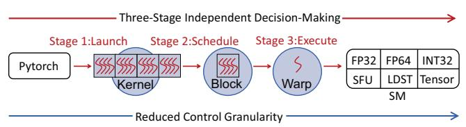
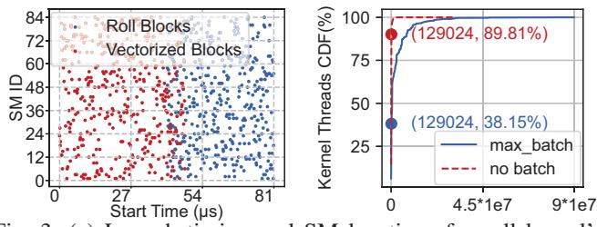
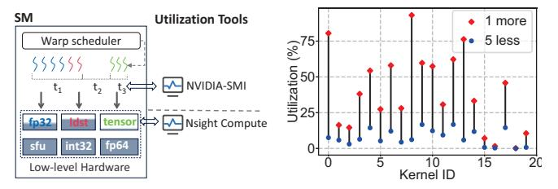
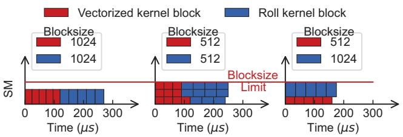
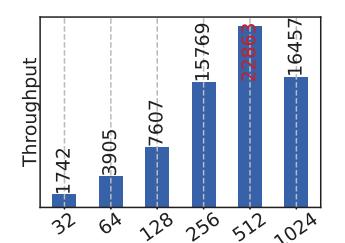
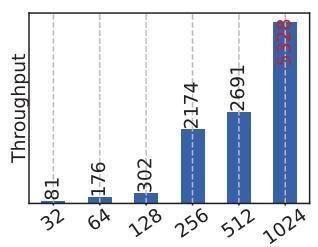
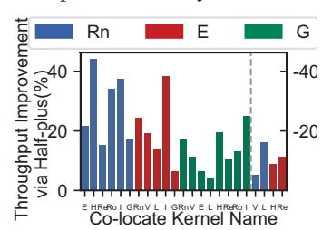
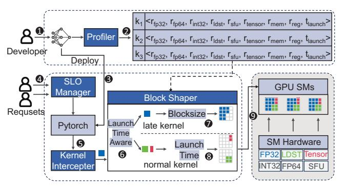
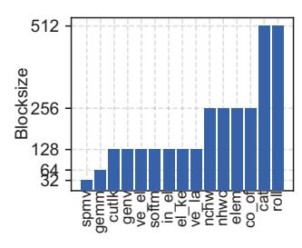
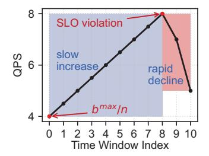

# II. BACKGROUND & MOTIVATION

## *A. The GPU Scheduling Process*



Fig. 2: A kernel's lifecycle includes three distinct stages: launching, scheduling, and execution.

The execution process of a CUDA kernel can be divided into three stages: (1) *launching*, (2) *scheduling*, and (3) *execution*. As shown in Figure 2, the three stages proceed sequentially, each implementing a specific task: the launching of *kernels*, the scheduling of *blocks*, and the execution of *warps*.

In the *launching* stage, a *kernel* is launched by the inference framework (e.g., TF-Serving [49], Pytorch [40], TVM [7] and TensorRT [50] ) on the CPU side, and it reaches the CUDA stream via the GPU's Command Processor. A *kernel* is a specialized function executed on the GPU, serving as a basic unit of the inference model. For example, *matrix multiplication* is one of the most commonly used kernels in inference models.

In the *scheduling* stage, each *kernel* is divided into several equally sized *blocks*, with each *block*'s size referred to as the *blocksize*. The GPU's dispatch unit, implemented in hardware [3], will assign blocks to SM cores based on the availability of resources.

In the *execution* stage, each block is further divided into several equally sized *warps*, i.e., a set of 32 threads executed together through single instruction multiple threads. A *warp* is the basic unit of execution. The GPU's *warp* scheduler, also implemented in hardware [3], will select warps from blocks and start the execution.

As the three decision-making stages throughout the execution process are distinct and the granularity of the scheduled objects gradually decreases, it is highly challenging to achieve the optimal resource-efficient scheduling [44].

## *B. Low Utilization of Low-Level Hardware*

To understand kernel's use of low-level hardware, we select 10 commonly used models from MLPerf [42] and Pytorch benchmark [39], as shown in Table III. The maximum batch size for each model is determined under the condition that inference latency does not exceed 200 milliseconds (i.e., the common SLO for inference services in production environments [55]). All data are collected on NVIDIA A40 GPU.

*Observation #1*: *During the scheduling of stage #2, multiple blocks from the same kernel are stacked and co-located in SM cores. The next kernel's blocks cannot execute until the current kernel nears completion.*

To evaluate the scheduling of kernels, we select and launch two commonly used kernels in inference tasks: the *vectorized* kernel (i.e., performs vectorized layer normalization, mainly using LDST hardware) and the *roll* kernel (i.e., loops through the elements in the displacement array, mainly using INT32 hardware). These two kernels account for 28.90% of the total invocations among all open-source kernels, and we obtain the SM location and start time for each block by using CUDA inline assembly instructions [24] to read the GPU SM ID register and the GPU clock counter register, respectively. Figure 3(a) shows the scheduling results. We see that, although both *vectorized* kernel and *roll* kernel are launched concurrently on two CUDA streams, blocks of *vectorized* kernels are scheduled for execution first, leaving *roll* kernel's blocks to wait until *vectorized* kernel's blocks are completed.



Fig. 3: (a) Launch timing and SM locations for roll kernel's blocks and vectorized kernel's blocks, with roll kernel's blocks executing after nearly all vectorized kernel's blocks have completed. (b) Under max batch, only 38.15% of kernels have thread requirements less than one GPU, while the remaining kernels fully occupy the GPU.

The reason for the above phenomenon is that after a kernel launch, the GPU's dispatch unit schedules all blocks of a kernel to SM cores [22]. When the number of threads in a kernel exceeds the total thread capacity of the GPU (i.e., the NVIDIA A40 GPU has 129,024 threads), the blocks of a kernel occupy all SM cores. Figure 3(b) shows the statistical analysis of thread counts from 6,802 executions of kernels across the 10 models. Under max batch, 61.85% have more threads than the GPU can accommodate, and these kernels account for 70.83% of the total execution time. As a result, all blocks of a kernel are stacked and co-located within the SM cores, and the blocks of another kernel cannot begin execution until the current blocks are close to completion.

*Observation #2*: *During the execution of stage #3, the utilization of six hardware resources by the kernels follows a "1 more, 5 less" pattern. Therefore, under the stacked scheduling of blocks, the overall hardware resource utilization within the SM cores becomes inefficient.*

GPU resource utilization can be measured using two main methods (Figure 4(a)): (1) measure the actual usage time of GPU resources relative to the total time using the NVIDIA-SMI tool [34]; (2) measure the low-level hardware utilization of kernels during the execution using the Nsight Compute tool [33]. NVIDIA-SMI uses the active time ratio as the criterion for GPU utilization, even if only one thread in one SM is active, it will display 100% GPU utilization, significantly exaggerating the actual utilization. We analyze kernel-level resource utilization based on 6,802 executions using the above two tools: NVIDIA-SMI reports 81.16% utilization, while Nsight Compute reports only 9.28% for low-level hardware.



Fig. 4: (a) The schematic diagram of NVIDIA-SMI and Nsight Compute tools. (b) The utilization of the six hardware resources follows a "1 more, 5 less" pattern, where the "1 more" refers to the highest utilization among the six hardware types, and the "5 less" represents the average utilization of the remaining five.

The utilization of six hardware resources by kernels follows a "1 more, 5 less" pattern. Figure 4(b) presents the hardware utilization of the top 20 most frequently executed kernels, totaling 6,063 executions. In the figure, red dots indicate the utilization of the primary hardware resource for each kernel, with an average utilization of 30.19%, while blue dots represent the average utilization of the remaining five hardware types, which is only 5.07%. As all blocks of a kernel have identical hardware resource demands, when a kernel runs on a dedicated SM under stacked co-location, five types of hardware resources typically exhibit low utilization.

## *C. Blocksize Shaping Improves Utilization*

*Observation #3*: *Blocksize shaping helps: Given that the NVIDIA GPU hardware scheduler is closed-source, shaping the blocksize is the only thing we can do to influence the colocating decisions. By setting the blocksize to half-plus of SM threads, it becomes indirectly possible for blocks to break the "stacked co-location" pattern.*

As shown in Figure 2, the launching stage of kernels is controlled by the inference framework, where the blocksize parameter is exposed. However, the scheduling and execution stages are managed by closed-source GPU hardware scheduler. Therefore, we can only manipulate the launching stage to indirectly optimize scheduling and execution.

When the remaining available thread capacity inside an SM is greater than the blocksize, the scheduler can schedule the block to the SM. To prevent multiple blocks of the same kernel from being co-located on the same SM core, we can set the blocksize to slightly more than half of the SM's thread capacity (i.e., *half-plus*). This ensures that the combined thread count of any two blocks exceeds the maximum thread limit per SM core, thereby preventing multiple blocks of the same kernel from being scheduled to the same SM.



Fig. 5: (a) When both kernels use large blocks: serial execution. (b) When both kernels use small blocks: serial execution. (c) When one kernel uses a large block and the other a small block: parallel execution.

We analyze the execution process within an SM using the roll and vectorized kernels with different blocksize. As shown in Figure 5(a), when the blocksize of the two kernels is both set to exceed half of the thread capacity (i.e., blocksize = 1024 > 1536/2, where the thread limit of an SM in NVIDIA A40 is 1536), after the threads of SM are allocated to the first block, the remaining threads cannot accommodate the second block, the blocks of the two kernels can only execute serially. In Figure 5(b), when the blocksize of the two kernels is set to less than half of the thread capacity (i.e., blocksize = 512 < 1536/2), blocks of vectorized are stacked and executed first; upon completion, the execution of roll begins. However, in Figure 5(c), if one kernel is configured with a large blocksize (i.e., 1024) and the other with a small blocksize (i.e., 512), after placing the large block into an SM, only the small block can fit with the remaining threads, allowing blocks from different kernels to be co-located within the SM. This enables the SM to utilize multiple types of hardware resources simultaneously.

In addition, CUDA allows configuring the amount of additional shared memory during kernel launch; however, our experiments show that large shared memory does not enable co-location of different kernels within the same SM. Hence, we focus solely on modifying the blocksize.

Observation #4: Before a kernel is launched in stage #1, its blocksize is typically preset to a non-half-plus value. Since the available resources within SM cores fluctuate dynamically, this static setting can lead to inefficient use of resources.





Fig. 6: (a) The blocksize of the roll kernel is statically preset to 512, which results in the highest resource efficiency for this kernel. (b)When the roll kernel is executed concurrently with a preceding vectorized kernel, the blocksize with the highest resource efficiency for the roll kernel changes to 1024.

Existing inference frameworks use a statically preset method to set the blocksize of kernels. By default, typical frameworks like PyTorch [40], TVM [7] and TensorRT [50] use an "enumerate and choosing the best" policy to set the blocksize, i.e., evaluating the resource efficiency at various blocksize and choose the one with the highest efficiency. As a result, the blocksize is never set to a *half-plus* value, as it is not divisible by the SM thread count and results in wasted threads during single-kernel execution. For example, as shown in Figure 6(a), PyTorch presets the blocksize of the roll kernel to 512, while the SM thread count is 1,536, achieving the highest throughput of 22,863. This is at least 1.39 times more efficient compared to other blocksize.

However, the available resources within SM cores dynamically change as kernels are continuously scheduled and executed. The statically preset blocksize, initially designed for dedicated GPU usage, no longer achieves optimal throughput. For example, as shown in Figure 6(b), when the *roll* kernel is co-located with a *vectorized* kernel configured with blocksize 256, the blocksize of the *roll* kernel that achieves the highest throughput shifts from 512 to 1,024, yielding at least a 1.98× improvement compared to other blocksize settings. Moreover, in production systems, the static setting of blocksize is susceptible to resource availability, which can prevent the system from achieving higher throughput.



Fig. 7: Throughput improvement via half-plus.

We select three kernels dominant with different hardware to co-locate with other kernels. When the dominant resources differ, the half-plus configuration throughput by improves 19.94% (first 19 bars); otherwise, throughput decreases by 10.37%(last 4 bars).

#### D. Implications

In summary, we find that the low utilization of low-level hardware within SM cores is mainly due to two reasons: (1) the *stacked co-location* of blocks from the same kernel (**Observation 1**) and (2) the *uneven utilization* of resources

by blocks (**Observation 2**). Existing works achieve intra-SM co-location through intrusive modifications to GPU hardware or kernel code, which are not supported in public cloud environments.

To enable non-intrusive co-location of different kernels, we find that setting the blocksize to *half-plus* of SM threads is a possible way (**Observation 3**). However, existing inference systems typically *statically preset* the blocksize to a non-*half-plus* value, which fails to improve resource efficiency under co-location scenarios (**Observation 4**). Therefore, we design a method to dynamically adjust the blocksize of kernels to enable co-location of different kernels at runtime.

#### III. DESIGN

In this section, we present the design of  $\mu Share$ .

#### A. Overview



Fig. 8: The system architecture of μShare.

The insight of  $\mu$ Share is to adjust the blocksize of kernels to "half-plus" of SM thread capacity to achieve scattered co-location of kernels. Figure 8 shows the overall architecture of  $\mu$ Share. After an AI model is developed  $\bullet$ , the profiler will analyze the model to find the maximum batchsize that meets the SLO (Service Level Objective). Then, under the maximum batchsize, it profiles each kernel's low-level hardware usage as well as its shared memory and register consumption to support the co-location of kernels with complementary resource demands  $\bullet$ .

After profiling, the model is deployed to the inference framework (e.g., Pytorch). When user requests arrive, the batch manager batches multiple requests and sends the batch to PyTorch for execution. PyTorch then sequentially launches the kernels to the GPU for computation. To avoid intrusive modifications to Pytorch and CUDA, we design a kernel interceptor which can intercept the launched kernel and send it to shaper. For kernels with a late launch time that could potentially cause SLO violations, the shaper modifies their blocksize parameters to half-plus to accelerate computation. For other normal kernels, the shaper does not modify their blocksize but adjusts their launch time. For a time-shifted launch. That is, according to kernel profiles, only kernels that are complementary in resource utilization to those currently executing on the GPU will be launched, while others will be

queued. In this way, the blocks with half-plus blocksize can be co-located with those with smaller blocksize for deployment (Observation #3).

## B. Kernel Profiler

The *profiler* mainly characterizes the resource demands of each kernel to facilitate the co-locating of kernels with complementary resource demands. To meet the latency SLO, it also profiles the launch time of each kernel when executed with the maximum batchsize allowed within the SLO. In particular, it runs the inference with the maximum batchsize in model exclusive GPU environment and records a 9-tuple for each kernel k:

$$k = \{r_{fp32}^k, r_{fp64}^k, r_{int32}^k, r_{ldst}^k, r_{sfu}^k, r_{tensor}^k, r_{mem}^k, r_{reg}^k, t_{launch}^k\}$$
(1)

where  $\{r_{fp32}^k, r_{fp64}^k, r_{int32}^k, r_{ldst}^k, r_{sfu}^k, r_{tensor}^k\}$  denotes the low-level hardware utilization during the execution of kernel k, including FP32 core, FP64 core, INT32 core, LD/ST unit, SFU unit, and Tensor core,  $\{r_{mem}^k, r_{reg}^k\}$  denotes the shared memory and register usage of kernel k, respectively; and  $t_{launch}^k$  denotes its launch time.

We utilize NVIDIA's Night Compute tool [33] to record the utilization rate of six low-level hardware during the execution of each kernel. Additionally, we utilize NVIDIA's Night Systems tool [35] to record the kernel launch time.

#### C. Kernel Interceptor

When the inference requests begin execution, their kernels are launched by the inference framework. Then, µShare intercepts the launched kernels through its kernel interceptor without modifying the kernel code or GPU hardware scheduler. Hence, such a non-intrusive design can significantly reduce development complexity.

Since CUDA's kernel launch functions (e.g., cudaLaunchKernel or cublasSgemm in cuBLAS) explicitly expose input parameters, and the addresses of their compiled dynamic link libraries (e.g., libcudart.so, libcublas.so, libcudnn.so) can be obtained easily, it is possible to interception kernels in a non-intrusive way. Specifically, the *kernel intercepter* captures dynamic link libraries using the LD\_PRELOAD [27] and the dlopen and dlsym [13] functionalities provided by Unix systems. It creates functions with the same names as CUDA's kernel launch functions. By using LD\_PRELOAD, these homonymous functions are loaded first. Then, dlopen and dlsym get the original addresses and input parameters (e.g., blocksize) of the CUDA's kernel launch functions. This allows us to modify the input parameters before passing them back to the original functions, restoring their execution.

Furthermore, CUDA's kernel launch functions can be divided into two categories based on whether the kernel block-size parameters can be modified. The first category is modifiable, such as the cudaLaunchKernel shown in Listing 1. All CUDA kernels launched using CUDA syntactic sugar <<<gri>directed to this function. Among these, the blocksize and gridsize

parameters are used for subsequent parameter modification operations, representing the number of threads within a modified block and the number of blocks, respectively. The parameters of this syntactic sugar correspond to the gridDim and block-Dim in List 1.

```
extern __host__ cudaError_t CUDARTAPI
    cudaLaunchKernel(
    const void *func,
    dim3 gridDim,
    dim3 blockDim,
    void **args,
    size_t sharedMem,
    cudaStream_t stream
);
```

Listing 1: Blocksize modifiable launch function.

The second category is unmodifiable, which utilize CUDA wrapper libraries (such as cuDNN or cuBLAS) for launching, like the cublasSgemm shown in Listing 2. These functions hide the blocksize parameters within closed-source code. Additionally, kernels that produce incorrect results after blocksize modification are also *unmodifiable* (e.g., tiling-based kernels like Conv2d, which trigger a CUDA internal error when modified).

```
void CUBLASWINAPI cublasSgemm(
   char transa,
   char transb,
   void **args
);
```

Listing 2: Blocksize unmodifiable launch function.

We analyze 67 kernels of 10 models (Table III) during inference, which are executed a total of 6,802 times. Among these, modifiable kernels are executed 3,512 times, accounting for 51.63% of the total executions, while unmodifiable kernels are executed 3,290 times, accounting for 48.37%. Table I and II provide a detailed breakdown of each kernel's name, execution count, and percentage. Since modifiable kernels account for more than half of the total executions, there is significant potential for optimizing kernel co-location.

TABLE I: Statistics of blocksize modifiable kernels

| Name         | FP32  | FP64 | INT32 | LDST  | SFU   | Tensor | Count | Time(µs) |
|--------------|-------|------|-------|-------|-------|--------|-------|----------|
| RNN Cell     | 9.39  | 0.00 | 12.64 | 16.05 | 6.96  | 0.00   | 1002  | 40378    |
| Vec Element  | 7.91  | 0.00 | 9.29  | 13.06 | 4.08  | 0.00   | 971   | 159150   |
| Elemwise     | 11.12 | 0.00 | 38.12 | 17.18 | 0.00  | 0.00   | 947   | 116440   |
| Layer Norm   | 13.43 | 0.00 | 33.08 | 58.02 | 11.03 | 0.00   | 128   | 27497    |
| Histo        | 1.60  | 0.00 | 4.36  | 2.39  | 0.00  | 0.00   | 80    | 138      |
| Reduction    | 23.50 | 0.00 | 57.43 | 32.29 | 0.00  | 0.00   | 66    | 9974     |
| Roll         | 20.82 | 0.00 | 33.25 | 12.47 | 24.94 | 0.00   | 44    | 14713    |
| Indexed Elem | 1.21  | 0.00 | 0.92  | 0.29  | 0.00  | 0.00   | 26    | 141      |
| Other        | -     | -    | -     | -     | -     | -      | 248   | 2278     |
| Total        | -     | _    | -     | -     | _     | -      | 3512  | 370709   |

#### D. Shaper

While it is not possible to develop a new co-locating policy under closed-source GPU hardware scheduler (**Observation** 3), the *shaper* can indirectly influence the scheduling results

TABLE II: Statistics of blocksize unmodifiable kernels

| Name         | FP32  | FP64 | INT32 | LDST  | SFU  | Tensor | Count | Time(µs) |
|--------------|-------|------|-------|-------|------|--------|-------|----------|
| CUTLASS Gemm | 5.93  | 0.00 | 11.44 | 17.51 | 0.00 | 80.49  | 1293  | 223538   |
| CUDNN NCHW   | 21.36 | 0.00 | 54.34 | 48.78 | 0.00 | 0.00   | 560   | 55438    |
| BatchNorm    | 29.79 | 0.00 | 5.81  | 7.64  | 5.39 | 0.00   | 496   | 44829    |
| CUBLAS Gemv  | 10.37 | 0.00 | 19.29 | 59.31 | 0.00 | 0.00   | 495   | 49980    |
| MatMul       | 2.54  | 0.26 | 6.51  | 16.59 | 0.00 | 92.39  | 141   | 33665    |
| CUDNN NHWC   | 7.59  | 0.00 | 14.53 | 55.10 | 0.00 | 0.00   | 116   | 9560     |
| CUTLASS Comb | 1.39  | 0.00 | 10.96 | 18.63 | 0.00 | 77.11  | 99    | 104      |
| Conv         | 21.39 | 0.00 | 57.75 | 42.98 | 8.15 | 0.00   | 86    | 93       |
| Other        | -     | -    | -     | -     | -    | -      | 4     | 107      |
| Total        | -     | -    | -     | -     | -    | -      | 3290  | 417314   |

by adjusting their *blocksize* and the *relaunch time* (i.e., the time when the *shaper* relaunches the kernel to GPU after it has been intercepted.).

Denote by O the set of kernels intercepted by the *kernel interceptor*. We divide the set O into two subsets X and Y, such that  $O = X \cup Y$  and  $X \cap Y = \emptyset$ , where X refers to the set of kernels for which we are going to modify their *blocksize*, and Y refers to the remaining set of kernels for which we are going to modify their *relaunch time*. To obtain the set X, we calculate the kernel launch slack:

$$s^{k} = t_{launch}^{k} - t_{intercept}^{k}, \quad \forall k \in O$$
 (2)

where  $t_{intercept}^k$  is the real-time launch time of kernel k, and  $t_{launch}^k$  is the profiled launch time of kernel k by the *profiler* (Formula 1). We then sort these kernels in an ascending order of  $s^k$ . The first x kernels in this sorted list are added to the set X (i.e., |X| = x), while the remaining kernels are added to the set Y. Hence, kernels in set X have tighter latency constraints and we need to reshape their blocksize and launch them immediately.

**Half-plus Blocksize Shaping:** For a kernel  $k_i \in X$ ,  $\forall i \in [1,...,x]$ , the *shaper* sets  $k_i$ 's *blocksize* to *half-plus*:  $t_{half} + \alpha$ , where  $t_{half}$  denotes the half number of the SM thread capacity (e.g.,  $t_{half} = 768$  in NVIDIA A40) and  $\alpha$  is a small positive integer. In this way, it is not possible to place more than one  $k_i$ 's block in a single SM simultaneously. This enforces the distribution of  $k_i$ 's blocks across different SMs, avoiding the "stacked co-location" problem. Meanwhile, larger *blocksize* improves kernel execution efficiency, reducing SLO violations. Note that, the value of x is determined by the smallest x such that the number of blocks of the first x kernels exceeds the number of SMs.

We consider two principles that guide our definition of  $\alpha$ :

- (1) The parameter  $\alpha$  should be able to reduce resource fragmentation. Since the default *blocksize* is typically powers of 32, such as 32, 64, 128, 256, 512, or 1024, the value of  $\alpha$  should also follow this pattern.
- (2) The parameter  $\alpha$  should be able to reduce SLO violations. When the kernel launch time slack (i.e.,  $s^k$  in Formula 2) is positive, we set  $t_{half}+\alpha$  as the smallest number greater than half of SM thread capacity. For example, since the SM thread capacity is 1,536 in NVIDIA A40, we have  $t_{half}+\alpha=768+32=800$  (note that 32 is the number of

threads in a warp, which is the smallest unit of execution). When the kernel launch slack  $s^k$  is negative, we gradually increase  $\alpha$  by 32 to speed up the execution of the kernel.

**Time-shifted Launch:** For a kernel  $k_j \in Y$ ,  $j \in [x+1,...,x+y]$ , the *block shaper* sets  $k_j$ 's *relaunch* time and uses their default *blocksize*. The reason is as follows:

- (1) Default *blocksize*: The *blocksize* of all kernels of models (Table III) ranges from 32 to 512, all of which are less than half of the SM thread capacity (Figure 9), making them easily co-locatable with the *half-plus* kernels in set X within the same SM core. Therefore, the *blocksize* of  $k_j \in Y$  does not need to be modified.
- (2) Relaunch time: Kernel  $k_j$  is relaunched directly if both of the following conditions hold: For each of the six hardware resource types, the combined utilization of  $k_i$  and  $k_j$  does not exceed 100%, and available shared memory, registers (i.e., the limiting factors for GPU scheduling other than blocksize, profiled in Formula 1) are sufficient.

Otherwise,  $k_j$  waits for  $\beta$  microseconds for a *time-shifted launch* before rechecking the above conditions, and its kernel launch slack is updated according to Formula 2. After updating the slack values and reordering all kernels in the set O based on the updated slack, if  $k_j$  moves into the top-x positions of the list, its *blocksize* will be set to *half-plus*, like the other kernels in X, and it will be immediately launched for execution. This process is repeated until all kernels have been launched.





Fig. 9: The default blocksize of kernels is less than half of SM threads.

Fig. 10: The control process of batch size after each time window.

#### E. Batch Manager

The *batch manager* is responsible for managing the *batch size*, which determines how many user requests the system can process in a single inference [15]. Aggregating user requests into a large batch can improve system throughput. However, when the request arrival rate is low, the waiting time required to accumulate a large batch may lead to SLO (Service Level Objective) violations. In addition, when multiple models share a GPU, resource contention between models may increase latency, further risking SLO violations [8], [9]. Therefore, it is necessary to adjust the batch size in real time based on both interference and request frequency.

We adopt a *feedback-based* strategy for adjusting the *batch-size*, i.e., adjusting the *batchsize* based on the monitored real-time latency. If the monitored latency is less than the SLO, increase the *batchsize*. Otherwise, decrease the *batchsize*. To avoid oscillations caused by short-term workload bursts, we

monitor the response latency over a time window and employ an *exponential decay* algorithm [12] to derive the SLO slack (denoted by  $(s_i)$ ) within the window j:

$$\overleftrightarrow{s_j} = \sum_{i=1}^{n_j} 2^{1-i} (t_{SLO} - t_i)$$

where  $n_j$  refers to the number of requests in window j,  $t_{SLO}$  is the latency target defined in SLO, and  $t_i$  is the actual response latency for request i. Note that i is the index of the requests sorted in reverse chronological order.

Since the inference time is positively correlated with the *batchsize*, we set the initial *batchsize* of a model to  $b^{max}/n$ , where n is the number of co-locating models on the current GPU, and  $b^{max}$  is the maximum *batchsize* that satisfies the SLO for that model on the current GPU. Whenever a time window j ends,  $\mu Share$  updates  $\overrightarrow{s_j}$  and adjusts the *batchsize* accordingly. To ensure that the SLO is not violated as much as possible, the principle of adjusting the *batchsize* is to be conservative when increasing it, but aggressive when decreasing it (Figure 10).

When the SLO slack  $\overleftrightarrow{s_j}$  is positive, increase the *batchsize* used in the next window j+1 (denoted by  $b_{j+1}$ ) linearly. That is,

$$b_{j+1} = b_j + k \times \overleftrightarrow{s_j}$$

where k is a positive coefficient.

When the SLO slack  $\overleftrightarrow{s_j}$  is negative, decrease the *batchsize* used in the next window j+1 exponentially. That is,

$$b_{i+1} = \max\{b_i - e^{\lambda \times \overrightarrow{s_j}}, 1\}$$

where  $\lambda$  is a negative coefficient.

