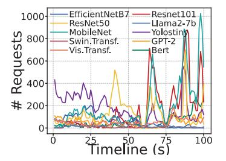
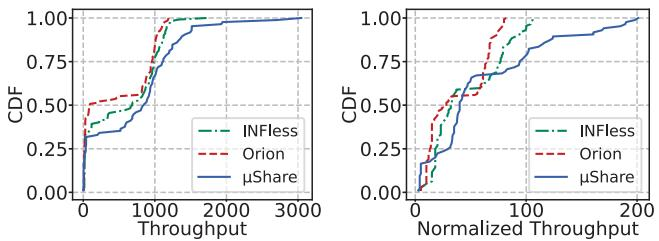
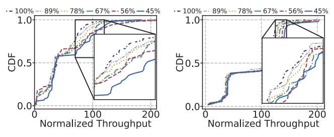
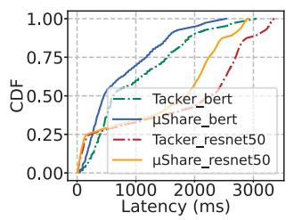
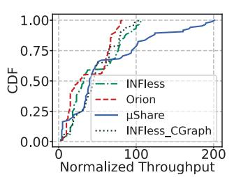

# V. EVALUATION

#### A. Methodology

**Testbed:** We deploy *µShare* across eight servers, each equipped with an Intel Xeon Gold 6338 CPU and either an NVIDIA A40 or A800 GPU, due to the different SM thread limits of these GPUs. Each CPU has 128 logical cores, with a base frequency of 2.00 GHz and a maximum frequency of 3.20 GHz, along with 251GB of server memory. We utilize PyTorch 2.2.0 as the inference framework.

(1) NVIDIA A40 GPU: The NVIDIA A40 GPU has 84 SMs and 44.784GB of memory, each SM has 1536 threads, 102,400 bytes of shared memory, and 65,536 registers. The CUDA version is 11.8.

TABLE III: The benchmark models.

| Model Name      | max_batch | Architecture | Weight(MB) | App Field |
|-----------------|-----------|--------------|------------|-----------|
| Llama2-7b       | 14        | LLM          | 14,336     | Txt Proc  |
| GPT-2           | 50        | LLM          | 548        | Txt Proc  |
| Bert            | 46        | Transformer  | 507.44     | Txt Proc  |
| ResNet50-v1.5   | 295       | CNN          | 97.71      | Img Class |
| MobileNet_v2    | 427       | CNN          | 13.54      | Obj Det   |
| Swin. Transf.   | 8         | Transformer  | 331.49     | Img Class |
| Vis. Transf.    | 77        | Transformer  | 327.37     | Img Class |
| Yolostiny       | 295       | CNN          | 24.82      | Obj Det   |
| Resnet101       | 199       | CNN          | 170.58     | Obj Det   |
| EfficientNet_B7 | 93        | CNN          | 254.68     | Img Class |

(2) NVIDIA A800 GPU: The NVIDIA A800 GPU has 108 SMs and 80GB of memory, each SM has 2048 threads, 167,936 bytes of shared memory, and 65,536 registers. The CUDA version is 12.1.

Workloads: We select 10 commonly used models from MLPerf [42] and Pytorch benchmark [39] as shown in Table III. The selected models cover CNN, Transformer, RNN, as well as large language models (LLMs). Following the common setting in production environments [55], the SLO for inference models is set to 200ms. For Llama2-7b, which has a relatively long execution time, the request SLO is set to 400ms, and both the input and output lengths of the LLM are fixed to ten tokens.

We use Azure's inference trace (Fig. 11) from INFless [55] and scale it according to the number of GPUs used at runtime. During inference, each model runs 4 replicas, for a total of 40 replicas distributed across eight GPUs.

Comparison Systems: We Fig. 11: The ten production trace examples.

compare  $\mu Share$  against the state-of-the-art systems including INFless and Orion:

Orion [46]: Orion co-locates kernels with different computational and memory resource demands on the GPU by controlling their launch time.

INFless [55]: INFless profiles the resource capacity requirements of models, and co-locates models within SMs and memory that can be accommodated by the GPU capacity.

**Parameter Configuration:**  $\mu Share$  sets three parameters k,  $\lambda$ , and  $\beta$ , where k is the linear trend increase parameter of the batch size,  $\lambda$  is the exponential trend decrease parameter of the batch size, and  $\beta$  is the interval parameter for delaying kernel launches. These parameters can be customized before the system runs. Through multiple experiments, we determine that the optimal values for ensuring SLO guarantees are k =0.05,  $\lambda = -0.1$ , and  $\beta = 10$ .

#### B. Throughput Evaluation

**High Throughput:** μShare increases the system throughput by 26.90%-54.09%. We compare the throughput of  $\mu Share$ , INFless, and Orion in co-located scenarios, including the system throughput comparison (Figure 12(a)), and the normalized system throughput comparison (Figure 12(b)). The normalized throughput is the throughput of each model divided by the unit batch size. The unit batch size is the batch size under the model's use of MPS (Multi-Process Service) [32] and the memory control interface of PyTorch to evenly distribute the unit's SM and memory resources of the GPU. *μShare* has the highest throughput in all scenarios.

Fig. 12: (a) Actual throughput comparison. (b) Normalized throughput comparison.

Compared to *INFless*, *μShare* improves the throughput of each model by 15.02%-66.59%. The throughput of the two systems is 716.53 and 564.28, with peak throughput values of 3046 and 1722, respectively, and the normalized throughput of the two systems is 58.91 and 46.42, respectively. *μShare* shows a 26.90% improvement over *INFless*. The reason for the higher throughput of *μShare* is that it can achieve scattered colocation of kernels with different low-level hardware requirements within an SM, reducing idle hardware within the SM and thus improving resource efficiency. In contrast, *INFless* adopts stacked co-location and cannot effectively utilize the various hardware resources within the SM.

Compared to *Orion*, *μShare* improves the throughput of each model by 21.65%-92.66%. The system throughput of *Orion* is 464, with peak throughput value of 1192, and the normalized throughput is 38.23. *μShare* shows a 54.09% improvement over *Orion*. Although *Orion* is a kernel-level inference system, it adopts stacked co-location and cannot fully utilize the lowlevel hardware resources within the SM. Moreover, *Orion* uses a more conservative co-location strategy, allowing at most one compute-intensive kernel and one memory-intensive kernel to be co-located on the GPU to strictly control interference.

Fig. 13: The normalized throughput at different proportions of unmodifiable kernels on (a) A40 GPU and (b) A800 GPU.

Proportion of Unmodifiable Kernels: *The throughput of* μShare *increases as the proportion of unmodifiable kernels decrease.* By default, the proportion of unmodifiable kernels across 10 models is 48.37%, while modifiable kernels account for 51.63% (Section 3.3). To analyze the impact of the proportion of unmodifiable kernels on throughput, we control the number of modifiable kernels by modifying only 0, 1, 2, 3, 4, 5 out of every 5 modifiable kernels, with the remaining kernels considered unmodifiable. This gradually reduces the proportion of unmodifiable kernels from 100% to 89.67%, 79.35%, 69.02%, 58.70%, and 48.37%, and *μShare*'s throughput increases from 47.59 to 48.23, 51.42, 52.79, 54.42 and 58.81 (Figure 13(a)). Therefore, the throughput of *μShare* increases as the proportion of unmodifiable kernels decreases, and even in the worst-case scenario where all kernels are unmodifiable, *μShare*'s performance only falls back to kernellevel co-location based on resource coupling, which is equivalent to *INFless* throughput and higher than that of *Orion*.

Compare Intra-SM Co-location Technique: *Tacker* [62] is an intra-SM co-location system based on kernel fusion. It provides fused ResNet50 and BERT models. Since *Tacker* does not support SLO management across multiple inference models during co-location, for fairness we also disable *μShare*'s latency management mechanism.

Under inference trace 11, *μShare* reduces the end-to-end latency of Bert and Resnet50 by 24.71% and 16.00%, respectively (Figure 14), achieving an overall throughput improvement of 20.38%. Because kernel fusion approaches merge only adjacent intra-model kernels, whereas *μShare* co-locates kernels across tasks, providing more co-location opportunities.

Fig. 14: Latency comparison with intra-SM co-location.

Fig. 15: Throughput compare with cuda graph technique.

Compare CUDA Graph: CUDA Graph fuses multiple kernels into a single graph for unified launch, which is beneficial when launch overhead is significant. However, in large-batch or colocation scenarios, the kernel execution time overshadows the launch time, so CUDA Graphs have little impact in our case.

We compare *μShare* with *INFless* after adding CUDA Graph optimization, as is shown in Figure 15, where *INFless* itself improves throughput by only 2.97%, while *μShare* still achieves a throughput improvement of 26.44%.

