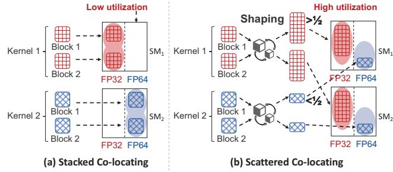

# μShare: Non-Intrusive Kernel Co-Locating on NVIDIA GPUs

Wenhao Huang1, Zhaolin Duan1, Laiping Zhao1\*, Yuhao Zhang1, Yanjie Wang1, Yiming Li1, Yihan Wang1, Yichi Chen1, Zhihang Tang1, Kang Chen2, Deze Zeng3, Wenxin Li1, and Keqiu Li1

1Tianjin University 2Tsinghua University 3China University of Geosciences {hwh, duanzhaol, laiping, yuhaozhang, wangyanjie, l\_ym, ehein, chenyichi, tangzhihang, toliwenxin, keqiu}@tju.edu.cn, chenkang@tsinghua.edu.cn, deze@cug.edu.cn

Abstract—The hardware scheduler on NVIDIA GPUs is highly inefficient in utilizing micro-architectural hardware resources. It places blocks from the same kernel within the same GPU Streaming Multiprocessor (SM) core, resulting in a stacking colocating problem, where identical blocks are placed within the same SM core, saturating only a subset of intra-SM hardware resources while leaving others underutilized.

The primary challenge in addressing this issue is that the NVIDIA hardware is closed-source, preventing us from directly modifying the hardware scheduler. To bridge the semantic gap between the resource demands of kernels and the scheduler, we introduce  $\mu Share$ , which enables intra-SM scattered colocating of kernels through a non-intrusive half-plus blocksize shaping method. It shapes the blocksize of kernels to a half-plus blocksize (i.e., slightly more than half of the SM's thread capacity), scattering identical blocks of the same kernel across different SMs. It further adopts a time-shifted launching method to reduce intra-SM resource contention. Compared to state-of-the-art systems,  $\mu Share$  does not require intrusive modifications to hardware or kernel code, yet it can still improve inference throughput by 26.90%-54.09% and increases low-level hardware utilization by 38.53%-61.15%.

#### I. Introduction

Software-defined resource control can leverage the open interfaces provided by hardware to improve resource efficiency [18], [20], [31], [45]. For example, Intel's Resource Director Technology (RDT) [25] supports fine-grained partitioning of shared CPU-socket resources, allowing multiple applications to coexist with minimal interference. Similarly, GPUs offer inter-SM (Streaming Multiprocessor) isolation mechanisms (e.g., MIG [30], MPS [32], and CU masking [1]), and some systems leverage these techniques to co-locate multiple tasks on a single GPU with lower interference [5], [6], [10], [48], [53], [55], [57], [59].

Despite these advancements at the inter-SM level, intra-SM resource utilization remains inefficient. Modern GPUs, such as NVIDIA's Ampere-based A100, include 108 SMs, each comprising 32 FP64 cores, 64 FP32 cores, 64 INT32 cores, 4 Tensor cores, 16 SFU units, and 32 load/store (LDST) units. However, NVIDIA GPUs do not expose interfaces for fine-grained resource allocation within individual SMs, resulting in inefficient management of these on-chip resources. Our experiments demonstrate that kernel execution on GPUs frequently exhibits a resource-utilization pattern we term "1

Fig. 1: (a) Stacked co-locating: blocks of a kernel are stacked within the same SM. (b) Scattered co-locating: shaped blocks from different kernels are scattered and co-located within a single SM.

more, 5 less" wherein one hardware resource is heavily utilized while the other five resources remain significantly underutilized. For example, during the execution of the common matrix multiplication kernel in inference workloads, the utilization of Tensor cores is 88.52%, while the average utilization of the other five hardware resources is only 5.45%.

The major reason for low hardware utilization is the semantic gap between the resource demands of kernels and the resource allocation by the GPU hardware scheduler, which refers that the actual hardware resource requirements of the kernels are not conveyed to the scheduler, and the scheduler can not perform scheduling based on the hardware demands of multiple kernels. As shown in Figure 1(a), when a kernel is launched, its multiple blocks are queued in the CUDA stream and scheduled one by one in order. This block-oriented sequential scheduling often results in the "stacked co-location" problem, where identical blocks are placed within the same SM core. As identical blocks share the same resource requirements, this results in low intra-SM hardware utilization.

To improve intra-SM hardware resource utilization, existing works have proposed *intrusive modification* methods. These modifications fall into two main categories: (1) *intrusive modifications to CUDA kernels* [4], [14], [29], [36], [61]–[63], which fuse multiple kernels with complementary resource requirements into a single, more complex kernel, and (2) *intrusive modifications to hardware* [11], [38], [43], where the GPU is redesigned to open up kernel scheduling interfaces, typically validated through simulators. However, in public cloud where NVIDIA GPUs are widely used, and with the

\*Corresponding Author

hardware scheduler being closed-source, intrusive hardware modifications and cross-user kernel fusion are not feasible.

Thus, the first challenge in bridging the semantic gap is determining how to non-intrusively convey kernel resource demands and enable the GPU hardware scheduler to perform resource-coupled scheduling effectively. Under the closedsource nature of NVIDIA GPUs, the only thing we can do is to perform control-based optimizations before the kernels are launched on the GPU, such as configuring the launching timing and kernel parameters (e.g., blocksize, which refers to the thread count for each block, and shared memory). Thus, the challenge is divided into three subproblems: (1) The closed-source nature of NVIDIA GPUs prevents us from fully understanding the hardware scheduler's strategy; how can modifying kernel parameters enable the hardware scheduler to achieve intra-SM co-location? (2) CUDA kernels have multiple configurable parameters; which kernel parameters can serve as a general-purpose solution to be modified? (3) Certain CUDA kernels (e.g., cuDNN) are closed-source and unmodifiable; how should kernels with unmodifiable parameters be co-located?

To address this challenge, we propose a hardware–software co-design approach that enables intra-SM co-location of kernels without modifying kernel code or GPU hardware. This method consists of the following key components: For the first subproblem, we perform extensive profiling under diverse parameter configurations and execution scenarios (i.e., exclusive and concurrent), collecting data on block placements within SMs and their execution timings, which enables us to further understand the block scheduling process. Specifically, under the GPU's left-over scheduling strategy [36], [51], [52] (i.e., blocks are scheduled to SM cores that meet the required thread count), we propose the "*half-plus blocksize shaping*" technique to separate blocks of kernels with similar dominant resource demands. As shown in Figure 1(b), by shaping the kernel's *blocksize* to *half-plus* (i.e., slightly more than half of the SM's thread capacity), multiple blocks from the same kernel are scattered across different SMs, the remaining threads in each SM can be allocated to blocks of other kernels, thereby improving intra-SM hardware utilization. For the second subproblem, our profiling reveals that the blocksize parameter is the only general-purpose solution that effectively scatters identical blocks across different SMs. In contrast, other parameters, such as shared memory, do not achieve this effect. For the third subproblem, we propose the "*time-shifted launching*" technique to co-launch kernels with different resource requirements. For kernels with unmodifiable parameters, we control their launch timing to enable scattered co-location with other kernels that have modifiable parameters.

Based on the "*scattered co-locating*" method, we develop *μShare*, an inference system that bridges the semantic gap between kernel resource demands and hardware scheduler resource allocation. *μShare* is the first to simultaneously achieve three capabilities: kernel-level control, intra-SM co-location, and non-intrusiveness to hardware and kernels' code. *μShare* operates in Linux user space, without generating any additional CPU-GPU communication, and without requiring the reading or modification of any user code, it can increase the system throughput of an NVIDIA GPU from 1722 QPS (queries per second) to 3046 QPS, and improve the aggregate utilization of the six intra-SM hardware units from 56.22% to 90.60%, with only several nanoseconds of control overhead per kernel. Contributions. Our contributions are as follows:

- Analysis and discovery: The primary cause of low resource utilization of GPU SMs is the "*stacked colocating*" problem in the hardware scheduler.
- Half-plus blocksize shaping method: Achieves kernellevel scattered co-location by simply shaping the blocksize of some kernels to half-plus of SM thread capacity.
- *μShare* prototype: A non-invasive system including kernel interception, parameter modification, scattered colocating and inference latency guarantee.
- Experimental evaluations: Compared to state-ofthe-art, *μShare* improves throughput by 26.90%- 54.09% and increases low-level hardware utilization by 38.53%–61.15%, while guaranteeing the latency SLO (Service Level Objective).

