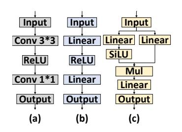
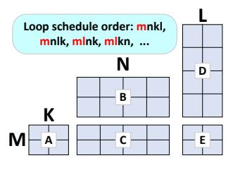
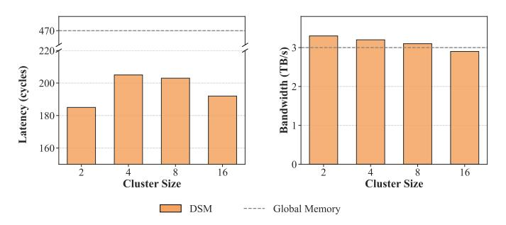
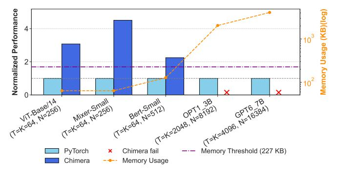
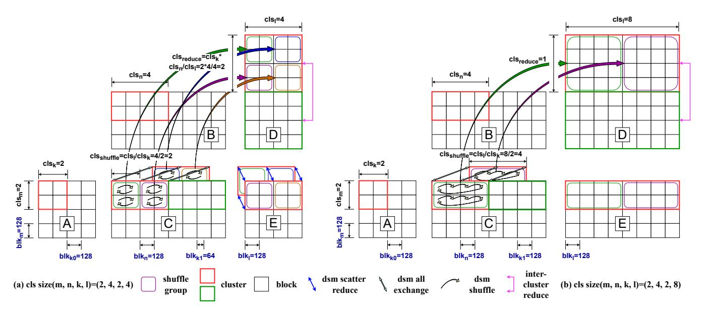
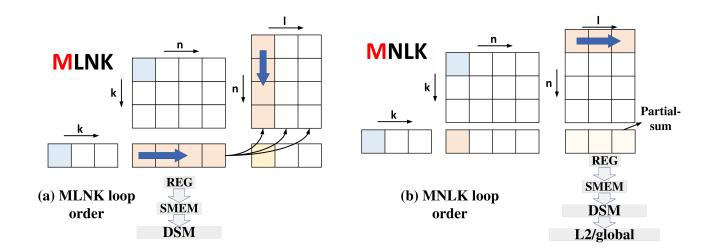

# FlashFuser: Expanding the Scale of Kernel Fusion for Compute-Intensive Operators via Inter-Core Connection

Ziyu Huang1,2,<sup>∗</sup> , Yangjie Zhou3,<sup>∗</sup> , Zihan Liu1,2,¶ , Xinhao Luo1,<sup>2</sup> , Yijia Diao1,<sup>2</sup> , Minyi Guo<sup>1</sup> , Jidong Zhai<sup>4</sup> , Yu Feng<sup>1</sup> , Chen Zhang<sup>1</sup> , Anbang Wu<sup>1</sup> , Jingwen Leng1,2,¶ <sup>1</sup>Shanghai Jiao Tong University <sup>2</sup>Shanghai Qi Zhi Institute <sup>3</sup>National University of Singapore <sup>4</sup>Tsinghua University <sup>∗</sup>*Equal contribution* ¶*Corresponding authors* {huang\_ziyu, altair.liu, lxh666, diao\_yijia, guo-my, y-feng, chenzhang.sjtu, anbang, leng-jw}@sjtu.edu.cn, yj\_zhou@nus.edu.sg, zhaijidong@tsinghua.edu.cn

*Abstract*—The scaling of computation throughput continues to outpace improvements in memory bandwidth, making many deep learning workloads memory-bound. Kernel fusion is a key technique to alleviate this problem, but the fusion strategies of existing compilers and frameworks are limited to using local scratchpad memory. When the intermediate results exceed the limited capacity (such as FFN), the fusion fails. Although modern GPUs (like the NVIDIA H100) now incorporate an inter-core connection mechanism known as Distributed Shared Memory (DSM)—providing a larger, high-bandwidth, and low-latency on-chip memory pool—this hardware potential has yet to be exploited by software frameworks.

To bridge this gap, we present FlashFuser, the first compiler framework to utilize inter-core connection for kernel fusion on modern GPUs. FlashFuser extends established fusion techniques to the DSM domain through three core contributions. First, we propose a powerful DSM-based communication abstraction that formalizes complex cluster-based data exchange patterns, such as reduce, shuffle and multiply. Second, we introduce a dataflow analyzer that generalizes loop scheduling, resource mapping, and tile selection to the distributed memory hierarchy; it determines the optimal execution order and tile sizes by quantifying data movement across memory levels. Finally, FlashFuser integrates these components into a unified search engine that employs analytical cost modeling and DSM-aware pruning strategies to efficiently discover the optimal execution plan. Our evaluation on an NVIDIA H100 GPU shows that FlashFuser reduces memory access by 58% and delivers kernel speedups of 3.3x against highly-tuned libraries and 4.1x against state-of-the-art compilers, resulting in a 1.24× end-to-end speedup.

## I. INTRODUCTION

With the rapid evolution of deep learning techniques [\[2\]](#page-11-0), [\[8\]](#page-12-0)–[\[11\]](#page-12-1), [\[14\]](#page-12-2), [\[23\]](#page-12-3), [\[24\]](#page-12-4), [\[52\]](#page-13-0), [\[64\]](#page-13-1)–[\[66\]](#page-13-2) and the expanding scale of deep learning models, the growing inference demands from multi-modal and large language models (LLM) mean that memory bandwidth is increasingly struggling to keep up with the growth of computational power.

In new generation GPU, H100, the peak FP16 compute capability has increased to approximately 1000 TFLOPS from the 300 TFLOPS of the previous-generation A100 (3.3× increase), while the global HBM bandwidth has only grown from 2 TB/s to 3 TB/s (1.5× increase) [\[1\]](#page-11-1), [\[4\]](#page-12-5), [\[5\]](#page-12-6), [\[26\]](#page-12-7).

<span id="page-0-0"></span>TABLE I: Percentage of Execution Time Spent in FFN Layers across Different Models.

| Model    | FFN Time (%) |
|----------|--------------|
| GPT-6.7B | 61.28        |
| LLaMA-1B | 57.44        |
| OPT-1.3B | 53.08        |
| BERT     | 47.03        |
| GPT-2    | 41.64        |

This disparity, known as the memory wall, in growth rates makes memory bandwidth a primary bottleneck. In workloads dominated by General Matrix Multiplication (GEMM), such as Transformer Feed Forward Network (FFN) layers and convolutional blocks, insufficient HBM bandwidth often becomes a significant bottleneck. As shown in Table [I,](#page-0-0) under a typical inference configuration with a sequence length of 512, the FFN in various models consumes 40%–60% of the total execution time [\[47\]](#page-13-3) and exhibits memory-bound characteristics.

To mitigate the aforementioned bandwidth bottleneck, modern GPUs such as the H100 have introduced inter-core connected architecture, which provides a high-speed data exchange path known as Distributed Shared Memory (DSM) within a cluster composed of multiple Streaming Multiprocessors (SMs) [\[33\]](#page-12-8). The traditional approach relies on a costly round-trip path through global memory, whereas our approach leverages DSM to open up a direct on-chip path. This shift in the data path has two benefits. First, by avoiding the redundant "write-then-read" operation, the total volume of data transferred to and from global memory is significantly reduced. Second, this direct on-chip path provides both higher bandwidth and lower latency than global memory access [\[26\]](#page-12-7).

Kernel fusion is an effective method for addressing the aforementioned memory-bound problem. However, current kernel fusion techniques fail to fuse large-scale operator chains. Existing software frameworks—including libraries like cuBLAS [\[32\]](#page-12-9) and CUTLASS [\[41\]](#page-13-4), inference frameworks

<span id="page-1-1"></span>

Fig. 1: Three common GEMM chains: (a) conv, (b) standard FFN, (c) gated FFN.



Fig. 2: A fused GEMM operator chain, showing its loop dimensions (M, N, K, L) and possible execution orders (mnkl, etc.).

like SGLang [57], or compilers like Chimera [60], BOLT [51]—typically handle smaller operator chains by placing intermediate results in the shared memory (SMEM) or registers(reg) of a single SM. When the intermediate data becomes larger (like FFN), these methods will abandon fusion, resorting to an inefficient round-trip to global memory. The inter-core connection mechanism can effectively alleviate this constraint. By interconnecting the SMEM of multiple SMs, it creates what can be viewed as an expanded on-chip memory pool. However, the complex communication patterns required to leverage this capability remains an unexplored domain.

To bridge the gap between new hardware features and existing software frameworks, we propose FlashFuser, the first deep learning (DL) compiler to leverage DSM for kernel fusion on compute-intensive operator chains. By creatively introducing DSM, FlashFuser expands the scope of fusible operators. It progressively places intermediate results to on-chip memory, including reg, SMEM, and DSM, thereby introducing a vast search space. Through corresponding pruning rules and cost model, it finds an execution order that minimizes data movement, thus achieving a performance improvement.

We use compute intensive operator chains from various LLM and CNNs for performance evaluation, running on an NVIDIA H100 GPU. FlashFuser achieves a speedup of up to 4.1x over the state-of-the-art (SOTA) baseline. In summary, the contributions of this paper are as follows:

- We identify the operator fusion bottleneck caused by SMEM capacity limitations, and point out the widespread deficiency in the current software ecosystem in utilizing inter-core connection property (§III).
- We propose a new abstraction to describe inter-core communication patterns, enabling it to support the various requirements of kernel fusion (§IV-A).
- We propose a dataflow analyzer that quantifies datamovement cost across the memory hierarchy and schedules data to spill progressively from fast to slow caches (§IV-B).
- We present a fusion search engine that employs pruning techniques and an analytical cost model to efficiently navigate the greatly expanded search space introduced by DSM (§IV-C).
- Compared to highly-tuned libraries and state-of-the-art com-

<span id="page-1-2"></span>

Fig. 3: The memory hierarchy of the H100 GPU, including registers, SMEM, DSM, L2 cache, and global memory.

pilers, our method delivers kernel speedups of  $3.3 \times$  and  $4.1 \times$ , respectively, along with a 58% reduction in memory access. These kernel-level improvements result in a  $1.24 \times$  end-to-end speedup, validating the effectiveness of our approach (§VI).

#### II. BACKGROUND

Mainstream LLM and Convolutional Neural Networks (CNNs) consist of numerous tensor operators, which are often organized into chains. As shown in Figure 1, these include convolution blocks that can be converted to GEMM chains via im2col (a), standard FFN (b), and Gated FFNs with branched structures (e.g., SwiGLU) (c). Due to their data-intensive nature, these GEMM-based operator chains are often limited by memory bandwidth, which makes kernel fusion a key optimization method. Figure 2 shows an example of a GEMM chain, where the dimensions of each matrix are marked as M, N, K, and L. In parallel computing, we need to split the tensors into small blocks and then iterate through these blocks according to different iteration orders. This traversal order is called a loop schedule, and as shown in the Figure 2, can be mnk1, mnlk, etc.

DSM is one tier in the multi-level cache hierarchy. Figure 3 illustrates the entire cache hierarchy of the H100 GPU. The innermost cache is the L0 cache [38], also known as the register file (reg). This is the fastest cache, but it is only visible to each thread and has a small capacity. The next tier is the L1 cache, or SMEM [34], where all threads within a single compute core can access the values in SMEM. Starting from the H100, the SMEMs of different SMs can be connected via DSM, which is also considered an L1.5 cache [6], [15], [16]. Only cores within a single cluster can exchange data, different clusters cannot directly interact and must exchange data through the next tier, the L2 cache and the global memory.

## III. MOTIVATION

<span id="page-1-0"></span>The gap between new hardware features and the software ecosystem is characterized by two core limitations in existing

<span id="page-2-1"></span>

Fig. 4: Bandwidth and latency of DSM under different cluster sizes. The corresponding performance of global memory is marked in the figure for comparison.

<span id="page-2-2"></span>TABLE II: Comparison of FlashFuser with representative previous works. Cache Hierarchy 0,1,1.5 means register(reg), shared memory(SMEM) and dsm

| Framework     | Cache Hier. | Strategy    | GPU Supp. | Fusion |
|---------------|-------------|-------------|-----------|--------|
| BOLT [51]     | 0/1         | Tuning      | yes       | yes    |
| Chimera [60]  | 1           | Analytical  | yes       | yes    |
| Welder [40]   | 0/1         | Analytical  | yes       | yes    |
| MCFuser [55]  | 1           | Analytical  | yes       | yes    |
| T10 [22]      | 1/1.5       | Analytical  | no        | no     |
| WaferLLM [12] | 1/1.5       | Handcrafted | no        | no     |
| Ours          | 0/1/1.5     | Analytical  | yes       | yes    |

works:

(a) Fusion is constrained by on-chip memory capacity: Current kernel fusion frameworks are constrained by SMEM capacity, which prevents the fusion of large-scale operator chains. Current frameworks only consider reg and SMEM for data reuse and make the overly simplistic assumption that intermediate results can always be accommodated on-chip; however, this assumption does not hold true in many scenarios. As illustrated in Figure 5, while Chimera [60] can still store intermediate results on-chip when memory usage is relatively small, it encounters fusion failures when executing larger-scale GEMM chains, such as those in OPT1\_3B and GPT6\_7B. As shown by the purple dotted line in the figure, the upper limit of SMEM for a single SM on H100 is 227KB. When the intermediate result exceeds this size, the fusion will fail.

(b) DSM can expand on-chip memory, however, its performance is non-trivial: By connecting multiple SMs, DSM provides an effectively larger SMEM space, which can solve the problem of SMEM size limitation. However, its complex characteristics make it difficult to utilize directly. Firstly, the bandwidth and latency of DSM vary with cluster size. As shown in Figure 4, as the cluster size increases, its latency tends to increase while its bandwidth gradually decreases. For all cluster sizes, the DSM latency is lower than that of global memory, and for all but the largest cluster size, its bandwidth is faster [18], [25], [26], making the selection of an appropriate cluster size a non-trivial problem. Secondly, the introduction of clusters adds another layer to the memory hierarchy, making dataflow more complex. Since prior works did not incorporate

DSM, they are unable to analyze how data should be placed on DSM or the resulting data movement volume across various cache levels. This analysis involves crucial details such as how tiles are partitioned, their execution order, their sizes, and resource mapping. **Finally,** the introduction of DSM makes many previously infeasible fusion scenarios possible. This is because considering DSM is equivalent to expanding the on-chip memory space, making more strategies feasible that would have been directly pruned in prior works. As detailed in Section IV-C, for GPT6\_7B, the number of possibilities with traditional methods [55] after pruning is approximately  $10^4$ , whereas with DSM, this expands to  $10^6$ . Therefore, an analysis framework specifically targeted for DSM is essential.

Prior works, as summarized in Table II, have only partially addressed the aforementioned issues. Chimera [60] and MC-Fuser [55] considered how to fuse GEMM chains, but because they only use SMEM to store intermediate results, they are severely limited by the SMEM capacity of a single SM and thus cannot be used for scenarios with larger intermediates, such as FFNs. BOLT [51] considered how to use registers or SMEM to perform GEMM chain fusion; however, it did not consider different computation orders and used manual tuning to find parameters, meaning its search results are not necessarily optimal. Welder [40] used an analytical method to explore data reuse for reg and SMEM, but it also did not consider DSM. Previous papers on DSM, such as T10 [22] and WaferLLM [12], are works on Graphcore and Cerebras, respectively; both utilized inter-core connect features but did not consider kernel fusion, nor were they explored on GPUs.

## IV. DESIGN

We now introduce FlashFuser, a compiler designed to optimize kernel fusion for operator chains on processors with inter-core connection. An overview of FlashFuser is presented in Figure 6:

(1) FlashFuser defines a DSM-communication primitive that compactly encodes SM partitioning and inter-SM dataflow, yielding a unified representation of DSM-based fusion plans under the given model and hardware (see §IV-A).

<span id="page-2-0"></span>

Fig. 5: Relative performance of Chimera to torch. The work-load consists of two consecutive GEMM operations. M is set as 128 here.

<span id="page-3-1"></span>

Fig. 6: System overview of FlashFuser

- (2) Based on this representation, our dataflow analyzer evaluates the feasibility and cost—in terms of data movement volume—of any given plan. It models the entire onchip memory hierarchy, determining how intermediate data is progressively spilled from high-speed caches to slower tiers (like DSM) when capacity is exceeded (see [§IV-B\)](#page-4-0).
- (3) The incorporation of DSM unlocks many new fusion possibilities, thereby creating an enormous search space. To navigate this, FlashFuser employs a fusion search engine. Guided by a cost model and a set of pruning rules, the engine efficiently searches for the optimal execution plan (see [§IV-C\)](#page-6-0).

Methodologically, FlashFuser adapts established techniques from prior kernel fusion works, including loop scheduling, tile selection, and resource mapping (see [§IV-B\)](#page-4-0), as well as cost modeling and pruning (see [§IV-C\)](#page-6-0). However, our fundamental novelty lies in integrating DSM into these methods specifically, by introducing DSM-level tiling, accounting for DSM bandwidth variations across cluster sizes, and respecting maximum cluster size limits, etc.

## <span id="page-3-0"></span>*A. dsm\_comm primitive*

Conventional GPU programming models have primarily focused on a single tiling hierarchy at the thread block level. The introduction of DSM necessitates a higher-level tiling at the thread block cluster level, which in turn requires explicit handling of intra-cluster and inter-cluster communication.

To elaborate on this design, we use a fused kernel containing two GEMM operations as an example. The execution of this fused kernel is divided into three distinct phases: *GEMM*0, *GEMM*1, and Store phase (as illustrated in Figure [7\)](#page-4-1). In this context, a bold rectangle denotes a Cluster, a non-bold rectangle denotes a Block, and a rounded rectangle represents a Shuffle Group, where Blocks within it perform shuffle operations to exchange data. We define two base parameters: *cls<sup>i</sup>* , representing the number of parallel Blocks within a Cluster along dimension *i*, and *blk<sup>i</sup>* , representing the data granularity computed by a Block along dimension *i*.

Crucially, the dataflow between blocks in the GEMM chain is uniquely determined by the declared cluster size. In the two-GEMM scenario, these dimensions correspond to *clsm*,*clsn*,*cls<sup>k</sup>* ,and *cls<sup>l</sup>* . As shown in Figure [7\(](#page-4-1)a), the cluster size is (2, 4, 2, 4). In the *GEMM*<sup>0</sup> phase, *cls<sup>k</sup>* = 2 signifies that the K-dimension is spatially partitioned across two parallel Blocks. Consequently, these Blocks must perform an intracluster accumulation along the K-dimension. We introduce the dsm\_all\_exchange primitive for this purpose, ensuring each Block holds the complete, fully-accumulated intermediate result before proceeding.

In the *GEMM*<sup>1</sup> and Store phases, data must be shared among the Blocks to compute the final matrix E. We employ two complementary strategies—shuffle and reduce—to compute matrix E. The first strategy is a shuffle, where data is exchanged during the *GEMM*<sup>1</sup> computation. As shown in Figure [7\(](#page-4-1)a), calculating one Block of matrix E requires access to an entire row of data from matrix C. Therefore, Blocks within the same Shuffle Group exchange their respective slices of matrix C using the dsm\_shuffle primitive.

The second strategy is reduce, which postpones data exchange to the final Store phase. Here, each Block first independently computes a partial sum of the output matrix E. This is followed by a two-level hierarchical reduction. The intra-cluster reduction is performed first, where multiple contributing Shuffle Groups perform an accumulation via the dsm\_reduce\_scatter operation. The Scatter pattern is employed because each Block is only responsible for writing back a portion of the final result, thus avoiding data redundancy. This is followed by the inter\_cluster\_reduce, which aggregates partial sums from all participating clusters. This step is implemented by leveraging the NVIDIA Hopper architecture's Tensor Memory Accelerator (TMA). Through its cp.reduce.async.bulk instruction, the TMA can asynchronously perform atomic reductions across clusters.

To precisely describe these communication patterns, we derive two key variables based on the established cluster parameters: *cls*shuffle, the number of Blocks within a single Shuffle Group, and *cls*reduce, the number of Shuffle Groups participating in a Reduce operation. Their derivations are *cls*shuffle = *clsl*/*cls<sup>k</sup>* and *cls*reduce = *clsn*/*cls*shuffle = (*cls<sup>n</sup>* ×*clsk*)/*cls<sup>l</sup>* . For instance, Figure [7\(](#page-4-1)b) illustrates an alternative configuration where the cls size is (2, 4, 2, 8). Here, *cls*reduce = 1, meaning no inter-group reduction is needed during the Store phase. The trade-off is that the larger *cls*shuffle increases the communication volume for the shuffle operations, while decreasing the number of required dsm\_reduce\_scatter operations. Moreover, this flexibility to configure the shuffle and reduce dimensions is crucial for efficiently mapping problem sizes that are small or not perfectly divisible onto the hardware.

Based on the aforementioned DSM communication primitives, we can abstract complex fused kernels into an intuitive tile graph to describe the dataflow. As shown in Figure [8,](#page-4-2) the graph clearly demonstrates the flexibility of our framework: it can support not only standard FFNs composed of consecutive GEMMs (Figure [8\(](#page-4-2)a)) but also the more structurally complex Gated FFN variant (Figure [8\(](#page-4-2)b)).

We use the standard FFN in Figure [8\(](#page-4-2)a) to illustrate the detailed dataflow. A symbol such as *B*0,<sup>0</sup> denotes the tile of matrix B at coordinate (0,0). The process begins with tiles like *A*0,<sup>0</sup> and *B*0,<sup>0</sup> being multiplied to produce a partial sum of the intermediate matrix C, denoted as *C*0,0(0). After all

<span id="page-4-1"></span>

Fig. 7: Conceptual illustration of the cluster and tile geometries.

<span id="page-4-2"></span>

Fig. 8: Tile graph of kernel fused with the dsm\_comm primitive (only show one cluster). (a) standard FFN. (b) gated FFN

parallel partial sums (e.g.,  $C_{0,0}(0)$  and  $C_{0,0}(1)$ ) are computed, the dsm\_all\_exchange primitive performs an All-Reduce operation within the cluster to produce the complete intermediate tile  $C_{0,0}$ . Subsequently,  $C_{0,0}$  serves as input to GEMM1 and is distributed by the dsm\_shuffle primitive (red arrows) to different compute units to be multiplied with different tiles of matrix D, yielding new partial sums for matrix E (e.g.,  $E_{0,0}(0)$  and  $E_{0,1}(0)$ ). Finally, during the Store phase, these partial sums of E are accumulated by the dsm\_scatter\_reduce primitive to obtain the complete output tiles  $E_{0,0}$  and  $E_{0,1}$ .

For the Gated FFN in Figure 8(b), the core difference is that its Up-FFN portion executes two parallel GEMM branches,

where the result of one branch, after a SiLU activation, is element-wise multiplied with the other. This impacts the function of the first DSM primitive: dsm\_all\_exchange now performs a Mul operation instead of an Add, which is why we chose the generic name "exchange" to reflect its operational flexibility. To implement the two parallel GEMM branches, our framework supports two approaches. The first is to leverage spatial partitioning by setting cls\_k = 2, which assigns the two GEMM branches to different groups of Blocks. The final element-wise multiplication is then performed by the dsm\_all\_exchange primitive, which executes a Mul operation to combine the results. The second approach is to execute the two GEMMs sequentially within a single Block, which effectively transforms the computation into the pattern of a standard FFN, but with a doubled K-dimension.

The two approaches allow for optimizing different goals: the first, spatial partitioning across the cluster, is designed to maximize parallelism, while the second, sequential execution within each Block, aims to minimize DSM communication overhead.

## <span id="page-4-0"></span>B. Dataflow Analyzer

After introducing the dsm\_comm primitive, we incorporate it into our **Dataflow Analyzer**. This analyzer is designed to tackle the complex dataflow challenges introduced by intercore connection. While conventional methods only need to consider the register and SMEM hierarchy, our approach must also orchestrate the newly introduced DSM tier. To address this, FlashFuser employs a tile-based analysis method. For a given set of parameters, the analyzer determines how to efficiently place intermediate data for reuse across the memory levels. Crucially, it also analyzes the data movement in detail, allowing it to calculate critical performance costs, such as the data transfer volume for each tier of the memory hierarchy.

## Algorithm 1: Dataflow Analyzer

```
Input: Graph g, Device d,
             Loop schedule s = \{s_1, s_2, \dots, s_x\},\
             Tile sizes t = \{t_1, t_2, ..., t_x\},\
             Initial resource mapping r
   Output: Data movement volume D_V, Final plan p_{final}
1 Function DataflowAnalyzer (g,d,s,t,r):
       mapping_plan ← new ResourceMapping();
2
       D_V \leftarrow 0;
3
       hierarchy \leftarrow d.getMemoryHierarchy();
4
       S \leftarrow g.getDimensionSizes();
5
       foreach tensor in g.tensors() do
 6
           DF \leftarrow \text{GetFootprint}(t.block)
 7
           if tensor \in g.IOTensors() then
 8
                DM \leftarrow DF;
                foreach s_i in reversed(s) do
10
                    if s_i accesses tensor then
11
12
                       DM \leftarrow DM \times \lceil S_i/t_i.block \rceil
                D_V[global] \leftarrow D_V[global] + DM;
13
14
           else
                remaining \leftarrow DF;
15
                mapping \leftarrow new TensorMapping();
16
                // Greedily place tensor
                     across memory hierarchy
                foreach level in hierarchy do
17
                    if remaining \leq 0 then
18
                     break;
20
                    alloc \leftarrow \min(remaining, level.capacity);
21
                    mapping[level] \leftarrow alloc;
22
                    remaining \leftarrow remaining - alloc;
23
                    foreach s_i in reversed(s) do
24
                        if s_i accesses tensor then
25
                            D_V[level] \leftarrow
26
                              update\_dv(t_i.cluster, DF);
27
                mapping\_plan[tensor] \leftarrow mapping;
28
       p_{final} \leftarrow (s, t, mapping\_plan)
29
       return (D_V, p_{final});
```

1) Loop Scheduling: The LoopSchedule defines the loop execution order for a operator chain. First, we unify the codependent loop dimensions from all operators into a single independent set, formally denoted as  $\mathscr{X} = \{x_0, x_1, \ldots, x_{J-1}\}$ . This set is then scheduled by defining a permutation s to set the nesting order and partitioning the dimensions into spatial  $(\mathscr{S})$  or temporal  $(\mathscr{T})$ . Spatial refers to using multiple parallel processing units to compute a dimension simultaneously, while temporal refers to using a single processing unit to sequentially compute an entire dimension over time.

Different loop schedules affect the size of the tensor that needs to be cached. As illustrated in Figure 9, the MLNK order in (a) requires the local block to store the complete tensor C. Depending on the hardware speculation and problem size, this may require spilling from reg to SMEM, or further to DSM. In contrast, the MNLK order in (b) produces a partial E after each iteration of the LK loops. Although accumulating in registers

<span id="page-5-0"></span>

Fig. 9: An example of the hierarchical spilling plan, illustrating different spilling strategies. The red 'M' denotes the spatial dimension, while the black letters represent temporal dimensions.

is most efficient, the limited register space may necessitate spilling to SMEM, DSM, or even L2/global.

2) Tile Selection: The tile size is defined across three hierarchical levels: a cluster-level vector (tile.cluster) that dictates how work is distributed across clusters, a block-level vector (tile.block) that governs the tile size computed by each block.

This tiling directly impacts memory usage and dataflow patterns. The block-level factors (tile.block) determine the data tile size each thread block must hold, influencing the decision of whether to use registers or shared memory. The cluster-level factors (tile.cluster) influence data distribution across SMs, thereby determining whether intermediate data must spill to global memory and dictating the inter-block data exchange patterns.

3) Resource Mapping: Our framework binds tensors to different memory tiers through a heuristic-driven approach. This process, detailed in Algorithm 1, analyzes the memory usage of reusable tensor —as determined by the LoopSchedule and TilingSize—and then generate its data reuse plan across the cache hierarchy.

We use the DataflowAnalyzer to generate a concrete spilling plan for reused tensor. This function takes a computation graph (g), device information (d), a loop schedule (s), a tile size (t), and an initial resource mapping (r) as its inputs.

First, we obtain the size of each dimension (M, N, K, L) from the graph. If a dimension is spatial, a full traversal is not required, so its effective size is set to the corresponding tile size (line 5). We use the 'getFootprint' function to obtain the data access volume within a single tile (line 7). For input and output tensors, we calculate their total data movement volume from global memory. This is achieved by iterating through all dimensions; for each dimension relevant to the tensor, the data movement is multiplied by a factor that accounts for the increased accesses caused by tiling (lines 8-13). For a reused tensor, it is not necessarily placed in a single memory level; it can be distributed across multiple levels. Its data footprint (DF) determines the required memory size. A greedy algorithm is then employed to place the tensor on the highest-level memory possible. If a level's capacity is exceeded, the remaining portion is spilled to the subsequent level in the hierarchy (lines 17-23). Throughout this process, the data movement volume

TABLE III: Pruning results based on rules

| Pruning Step    | # of Cand.                    | Reduc. Rate |
|-----------------|-------------------------------|-------------|
| Original Space  | $\approx 2.75 \times 10^{13}$ | -           |
| + Rule 1        | $\approx 1.14 \times 10^8$    | > 99.99%    |
| + Rule 2        | $\approx 2.47 \times 10^7$    | 78.3%       |
| + Rule 3        | $\approx 1.44 \times 10^7$    | 41.5%       |
| + Rule 4        | $\approx 9.62 \times 10^6$    | 33.3%       |
| + Rule 5        | $\approx 1.15 \times 10^6$    | 88.0%       |
| Total Reduction |                               | > 99.99%    |

for each cache level is calculated. Since DSM has a lower bandwidth than SMEM, our analysis primarily focuses on the DSM traffic. As described in dsm\_comm, we calculate the DSM traffic for either Standard FFN or Gated FFN based on the cluster size and data footprint, thereby deriving the data movement volume(lines 23-26). Finally, the algorithm outputs the total data movement volume and the final plan, which consists of the determined resource mapping, together with loop schedule and tile size (lines 27-29).

