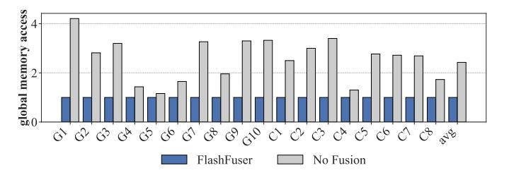
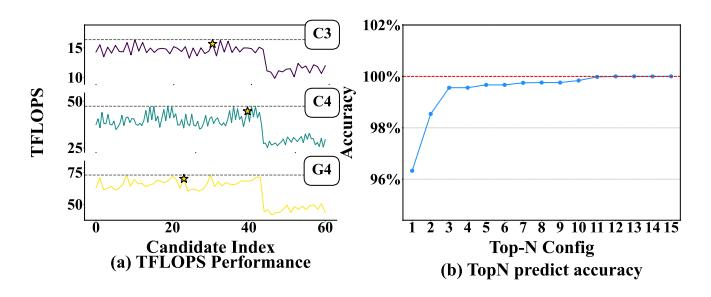
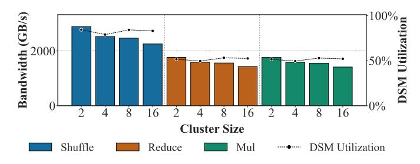
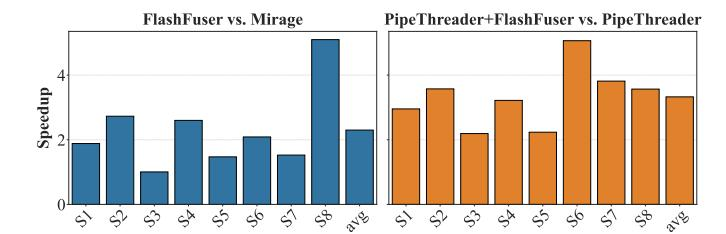
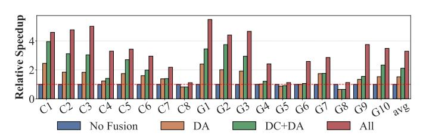

# A. Experimental Setup

a) Platforms: Our evaluation is conducted on a serverclass accelerator featuring an NVIDIA H100 GPU (SXM). The host system is a dual-socket server equipped with two Intel(R) Xeon(R) Platinum 8468 CPUs (96 cores in total) clocked at 2.10GHz. The primary software stack used in our experiments includes CUDA 12.4, PyTorch 2.6, TVM 0.9, Triton 3.2, and Nsight Compute 2025.2.0.

Fig. 10: Performance results in various scenarios: (a) GEMM chains, (b) Convolutional chains, and (c) Gated FFNs.

TABLE V: The configuration of conv chain.

| ID | IC  | Н  | W  | OC1  | OC2  | k1 | k2 |
|----|-----|----|----|------|------|----|----|
| C1 | 64  | 56 | 56 | 256  | 64   | 1  | 1  |
| C2 | 128 | 28 | 28 | 512  | 128  | 1  | 1  |
| C3 | 256 | 14 | 14 | 1024 | 256  | 1  | 1  |
| C4 | 512 | 7  | 7  | 2048 | 512  | 1  | 1  |
| C5 | 64  | 56 | 56 | 64   | 256  | 3  | 1  |
| C6 | 128 | 28 | 28 | 128  | 512  | 3  | 1  |
| C7 | 256 | 14 | 14 | 256  | 1024 | 3  | 1  |
| C8 | 512 | 7  | 7  | 512  | 2048 | 3  | 1  |

TABLE VI: The configuration of gated FFN.

| ID         | m   | n     | k    | l    | Model        |
|------------|-----|-------|------|------|--------------|
| S1         | 128 | 8192  | 3072 | 3072 | llama-3.2-3B |
| S2         | 128 | 5632  | 2048 | 2048 | llama-1.1B   |
| <b>S</b> 3 | 128 | 11008 | 4096 | 4096 | Llama-2-7b   |
| S4         | 128 | 8192  | 2048 | 2048 | Qwen2.5-2.1B |
| S5         | 128 | 11008 | 2048 | 2048 | Qwen2.5-3B   |
| <b>S6</b>  | 128 | 8960  | 1536 | 1536 | Qwen2.5-1.5B |
| <b>S</b> 7 | 128 | 9728  | 2560 | 2560 | Qwen3-4B     |
| S8         | 128 | 3072  | 1024 | 1024 | Qwen3-0.6B   |

b) Baselines: We compare FlashFuser against a comprehensive set of baselines, covering industry-standard libraries and state-of-the-art research compilers.

**Libraries:** We compare against PyTorch [35] 2.6 (which utilizes cuBLAS for its GEMM implementation) and NVIDIA's TensorRT [31], a highly optimized inference engine. For the PyTorch baseline, we enable torch.compile, which significantly reduces kernel launch overhead.

Compilers: We select several state-of-the-art machine learning compilers, including relay [39], TASO [17], BOLT [51], and Chimera [60]. TVM/Relay [39] effectively fuses kernels with a compute-activation pattern. TASO automatically performs subgraph substitutions, replacing parts of the graph with functionally equivalent but more performant alternatives (e.g., reordering consecutive matrix multiplications), but it does not support the fusion of compute-intensive operators. BOLT fuses consecutive GEMMs based on using smem and reg. Chimera implements fusion for consecutive GEMMs while also exploring different block execution orders.

c) Subgraph Configurations: The configurations of the subgraphs are detailed in Tables VII, VI, and V. In Ta-

TABLE VII: The configuration of gemm chain.

| ID  | m   | n     | k    | l    | Model         |
|-----|-----|-------|------|------|---------------|
| G1  | 128 | 512   | 32   | 256  | DLRM-0        |
| G2  | 128 | 256   | 512  | 64   | DLRM-1        |
| G3  | 128 | 512   | 416  | 256  | DLRM-2        |
| G4  | 128 | 3072  | 768  | 768  | GPT-2-Small   |
| G5  | 128 | 16384 | 4096 | 4096 | GPT-6.7B      |
| G6  | 128 | 4096  | 1024 | 1024 | GPT2-medium   |
| G7  | 128 | 768   | 768  | 768  | nlp_gpt3_base |
| G8  | 128 | 8192  | 2048 | 2048 | OPT-1.3B      |
| G9  | 128 | 2048  | 512  | 512  | Performer     |
| G10 | 128 | 1536  | 384  | 384  | BERT          |

bles VII [13], [21], [43] and VI, the dimensions of GEMM1 are  $(m \times n \times k)$  and GEMM2 are  $(m \times l \times n)$ . In Table V, the dimensions are  $(IC,H,W) \times (OC1,IC,K1,K1)$  for conv1 and  $(OC1,H,W) \times (OC2,OC1,K2,K2)$  for conv2, where OC1 and OC2 are the output channel sizes of conv1 and conv2, respectively; H and W are the height and width of the feature map; and K1 and K2 are the respective kernel sizes.

## B. Subgraph Performance

- a) Performance Results: The performance evaluation results for GEMM and convolution chains are presented in Figure 10, with performance normalized to PyTorch.
- b) GEMM Chains: In the GEMM chain scenario, Flash-Fuser achieves significant speedups over all baselines, with average speedups of 5.4x over BOLT, 4.6x over Chimera, 4.7x over Relay, 3.4x over TASO, 2.4x over TensorRT, and 3.1x over PyTorch. Although compilers like BOLT and Chimera also perform operator fusion, their methods have inherent limitations. Chimera's fusion capability is strictly limited by the SMEM size, causing it to fail on configurations with large intermediate tensors. BOLT utilizes CUTLASS templates within TVM but is constrained by its fixed block execution order, which may not be optimal. In contrast, FlashFuser's analytical model can explore a more diverse range of block execution orders. Other baselines like TASO and Relay do not fuse the two GEMMs, leading to separate kernel launches and additional global memory access overhead. Crucially, none of the above baselines leverage DSM, which fundamentally restricts their fusion scope. FlashFuser overcomes these limitations by using DSM to expand the fusion boundary.

c) Convolution Chains: For convolution chains extracted from real-world ResNet models, FlashFuser achieves average speedups of 6.3x over BOLT, 6.4x over Chimera, 5.6x over Relay, 4.3x over TASO, 3.3x over TensorRT, and 3.9x over PyTorch. For smaller problem sizes, BOLT performs kernel fusion to achieve significant performance gains. However, when the problem sizes become large, BOLT abandons fusion, resulting in comparatively poorer performance. Chimera fails when convolution sizes become too large. Other baselines execute independent, non-fused convolution kernels. FlashFuser utilizes DSM as a larger on-chip buffer to expand the scope of fusible operations, resulting in substantial performance gains.

Fig. 11: Comparison of global memory access between Flash-Fuser and PyTorch.

#### C. Performance Analysis

To verify the source of the observed performance gains, we profiled the generated kernels using NVIDIA's Nsight Compute, focusing on memory access patterns. As shown in Figure 11, FlashFuser significantly reduces global memory access compared to non-fused approaches like PyTorch. The analysis indicates that PyTorch, due to its lack of fusion, writes intermediate results to global memory before reading them back into shared memory for the next operator. In contrast, FlashFuser enables data reuse at higher levels of the memory hierarchy, including DSM. On average, PyTorch kernels exhibit  $2.4\times$  more global memory traffic than FlashFuser kernels, confirming that reduced off-chip memory access is a primary source of our acceleration.

Fig. 12: Validation of cost model and Analysis of top-K.

To validate our cost model and search strategy, we evaluate its capability to identify optimal configurations, the selection of an appropriate topk value, and the compilation time overhead. Figure 12a illustrates the search efficacy across the C3, C4, and G4 benchmarks. In the figure, the vertical axis

TABLE VIII: Search Time Comparison (search engine (TopK=11) vs. Brute-Force).

|    | <b>Brute-Force Time</b> | Search-Engine Time | Speedup        |
|----|-------------------------|--------------------|----------------|
| G3 | 1.2 hr                  | 362.1 s            | 12.25×         |
| G4 | 3.0 hr                  | 380.3 s            | $29.05 \times$ |
| G5 | 8.1 hr                  | 381.0 s            | $68.26 \times$ |

represents the computing performance in TFLOPS, and different colored lines denote different models. The star markers indicate the configurations selected by our cost model. The results demonstrate that our cost model consistently identifies the performance-optimal or near-optimal configurations. Our analysis of topk selection (Figure. 12b), using data from Table VII and Table V, computes accuracy as the average ratio of predicted performance to the true optimal performance. The figure shows that performance approaches 100% as K increases beyond 11, making K=11 our chosen value. Furthermore, our search engine accelerates compilation by 12–864× compared to a brute-force search (Table VIII), demonstrating its efficiency. This overhead primarily consists of the cost model's prediction (typically 1-2s) and the compilation time for the top-K kernels. This highlights the importance of selecting an appropriate K.

Fig. 13: Bandwidth and its utilization of dsm\_comm primitive

To validate the performance of our three proposed dsm\_comm primitives, we measured their bandwidth and utilization across different cluster sizes. The benchmark transfers a 32768×32768 tensor, slicing it into 128x128 tiles to execute dsm\_comm operations within the cluster (excluding global read/store overhead), which is looped 1000 times to measure the bandwidth. Bandwidth utilization is calculated by dividing the measured bandwidth by the peak DSM bandwidth for the corresponding cluster size. As shown in Figure. 13, while the bandwidth decreases as the cluster size increases, the bandwidth utilization remains stable. The Shuffle primitive outperforms Reduce and Mul because the latter two incur computational overhead in addition to data transfer.

We conduct a detailed ablation study on our three key designs: dsm\_comm (DC), dataflow analyzer (DA), and search engine (SE). We evaluate the full system ('All'), 'DC+DA' (using a random configuration), and 'DA' (using only SMEM/global memory for fusion). As shown in Figure. 15, compared to a no-fusion baseline, the 'All', 'DC+DA', and 'DA' config-

Fig. 14: Comparison to mirage and pipethreader.

urations yield speedups of  $3.29 \times$ ,  $2.11 \times$ , and  $1.52 \times$ , respectively. This demonstrates the effectiveness of our methods.

We evaluate our end-to-end inference performance against the SGLang framework on a suite of real-world models (Table VII/VI). As illustrated in Figure. 17, our approach achieves an average performance improvement of  $1.32\times$ . We further extend our evaluation to larger models and input sizes in Figure. 16, testing Llama3-70B, Qwen2.5-14B and 32B. Figure 16a presents a roofline analysis, which indicates that these models are primarily compute-bound, thus offering limited room for kernel-level optimization. In Figure 16b, we showcase the E2E speedup. For this setup, we fix the sequence length at 256 and change batch size from 1 to 32. Across these configurations, our kernel achieves an average performance improvement of  $1.22\times$ , leading to an average E2E speedup of  $1.16\times$ . When considering all scenarios, including both small and large inputs, the overall E2E speedup reaches  $1.24\times$ .

While our evaluation is conducted on the NVIDIA H100, the proposed fusion strategy is not limited to a specific architecture. FlashFuser's core abstraction, dsm\_comm, is a topology-agnostic collective communication concept at the design level. At the implementation level, for architectures with crossbar interconnects (e.g., Graphcore IPU [20], H100), our approach is directly applicable. For mesh architectures (e.g., Cerebras WSE [29]), a potential mapping distributes shuffle groups (defined in §IV-A) to neighboring cores to perform shuffle and reduce operations.

### VII. RELATED WORK

While extensive research exists in both kernel fusion and Distributed Shared Memory (DSM), the intersection of these fields—how to perform efficient, automated kernel fusion on modern GPUs with DSM—remains largely explored.

Fig. 15: Ablation study of FlashFuser by Isolating the Contributions of Search Engine (SE), dsm\_comm (DC), and Dataflow Analyzer (DA)

Fig. 16: Kernel performance and end-to-end performance of larger LLM.

Fig. 17: End-to-end performance evaluation based on SGLang.

## A. Research on Kernel Fusion

The development of kernel fusion [50], [59], [68], a key compiler optimization, can be broadly categorized by the types of operators being fused.

The first primary category of fusion pairs a compute-intensive operator with subsequent memory-intensive consumers (e.g., activations, bias additions). *Halide* [37] pioneered this for image processing pipelines with powerful schedule primitives, although for operators less complex than typical GEMMs or convolutions. Modern compilers like *TVM* [3] and *Ansor* [56] advanced this by transforming loop nests to keep intermediate data in registers. To further expand the fusion scope, works like *Fusion Stitching* [63] and *AStitch* [62] used shared memory as an intermediate buffer to fuse operators.

Another category is the fusion of compute-intensive operator chains (e.g., GEMM  $\rightarrow$  GEMM). BOLT [51] matches common patterns and invokes optimized Cutlass [41] templates, though it is limited by the fixed loop schedules of Cutlass. More general transformation-based approaches include TASO [17], which employs graph substitution to combine convolutions that can run in parallel, yet it lacks the capability to fuse sequential convolutions, and Chimera [60], which optimizes at a finer grain by rescheduling dataflow between thread blocks to maximize locality.

However, a common limitation across all these works is their confinement to the resources of a single SM. This reliance forces fusion to fail when intermediate results exceed smem's limited capacity. To overcome this problem, emerging hardware features like DSM have been introduced to expand the on-chip memory space.

## *B. Research on DSM*

The study of DSM has gained traction in recent years. Researchers have explored how to design and utilize its features through various approaches, including architectural simulations and performance studies on specialized hardware.

Some research focuses on architectural exploration through simulation, proposing novel mechanisms for inter-core data sharing. For instance, Ibrahim et al. [\[15\]](#page-12-13) proposed a "shared L1" organization to reduce redundant data replication on different L1 caches and analyzed which applications benefit from this data sharing. Falahati et al. [\[6\]](#page-12-12) also interconnected L1 caches and used a predictor to determine if a cache block exists in another SM.

Other studies involve performance explorations on physical hardware that incorporates DSM. The Graphcore IPU, targeted by *T10* [\[22\]](#page-12-16), has a GPU-like crossbar smem interconnection but assumes no HBM, a key difference from modern GPUs. The Cerebras processor, targeted by *WaferLLM* [\[12\]](#page-12-17), uses a mesh interconnect L1 cache, which differs from standard GPU topology. Thus, these works have two limitations: their conclusions are not directly transferable to mainstream GPUs, and they typically focus on single-operator scheduling scenarios. Additionally, *ClusterFusion* [\[27\]](#page-12-29) explores utilizing DSM for kernel fusion on GPUs; however, it focuses on hand-written kernels and lacks a compiler-based method for parameter selection and code generation.

While these studies highlight the potential of inter-core data sharing, a systematic compilation framework for modern GPUs is still missing. Interestingly, the concept of leveraging inter-core connections for dataflow—relatively new to generalpurpose GPUs—has long been a foundational design principle in domain-specific spatial architectures.

## *C. Fusion on Spatial Architectures*

Research on kernel fusion for specialized spatial architectures (e.g., ASIC accelerators and systolic arrays) primarily focuses on leveraging explicit on-chip Networks-on-Chip (NoC) between Processing Elements (PEs) to construct efficient dataflows. *FLAT* [\[19\]](#page-12-30) targets memory bottlenecks in Transformer models by proposing a "Fixed-Loop-Aligning Tiling" strategy. It utilizes direct data reuse between PEs in a spatial array to stage intermediate results in on-chip buffers, thereby fusing originally discrete operators into a pipelined execution. *COMET* [\[30\]](#page-12-31) introduces primitives containing explicit collectives to formally model the dataflow of compound operations, supporting the mapping of complex fusion patterns. Additionally, *DESA* [\[46\]](#page-13-16) designs a dataflow-efficient systolic array that achieves fully fused attention computation by decoupling computation from data transfer. While these works demonstrate the efficacy of spatial dataflow, they typically rely on specific hardware interconnect topologies or systolic array structures. In contrast, FlashFuser targets on GPU. It exploits the emerging DSM mechanism on modern GPUs (e.g., NVIDIA H100) to enable direct inter-core communication.

## *D. Emerging GPU Compilers and DSLs*

To facilitate efficient code generation and optimize dataflow on GPUs, extensive research has been dedicated to machine learning compilation and Domain-Specific Languages (DSLs) [\[7\]](#page-12-32), [\[28\]](#page-12-33), [\[36\]](#page-12-34), [\[48\]](#page-13-17), [\[49\]](#page-13-18), [\[53\]](#page-13-19), [\[54\]](#page-13-20), [\[58\]](#page-13-21), [\[61\]](#page-13-22), [\[62\]](#page-13-15), [\[67\]](#page-13-23).

Notably, *Triton* [\[42\]](#page-13-24) and its derivatives simplify highperformance kernel development through a block-based programming model and have been widely adopted for operator fusion. The recently proposed *TileLang* [\[44\]](#page-13-25) (and its underlying low-precision library *Ladder* [\[45\]](#page-13-26)) advances this direction by proposing a composable tiled language and hardware-aware tensor transformations. These tools allow developers to explicitly define parallel tiling strategies and pipeline schedules across multiple memory levels via a Python interface. Although these DSLs offer powerful representation capabilities, they primarily focus on the traditional memory hierarchy and often rely on expert users to manually specify scheduling strategies. FlashFuser distinguishes itself by integrating DSM into the compiler's automated search space.

