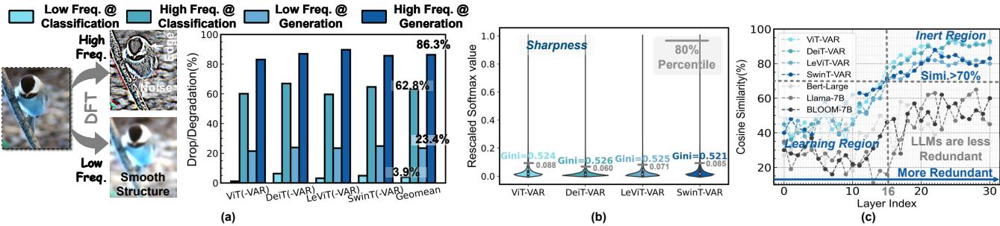
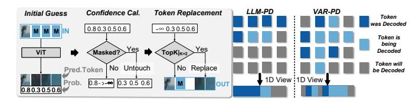
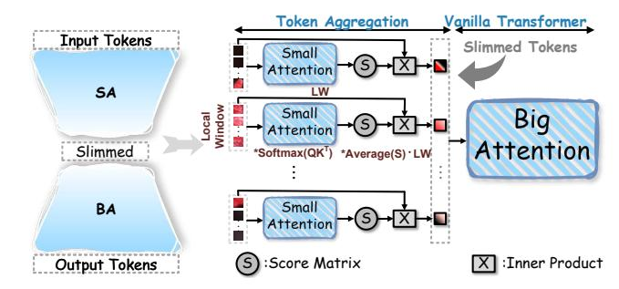
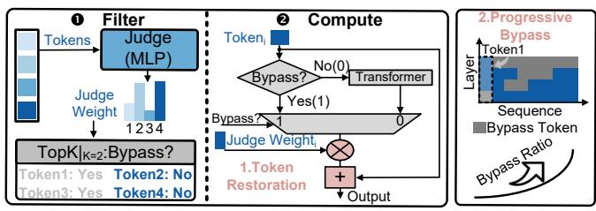
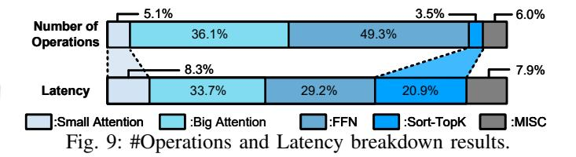
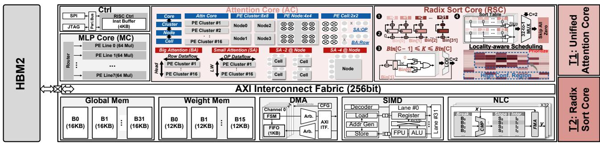
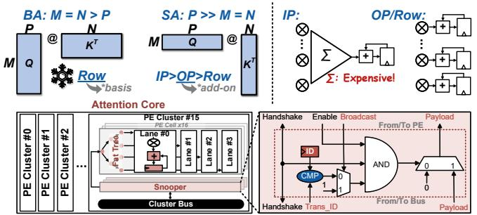
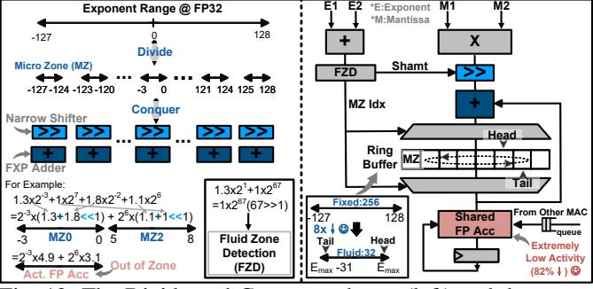
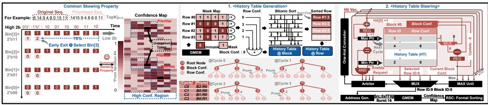

# B. Image Redundancy

In this section, we will analyze and quantize the image redundancy from the angle of Information Theory [67], i.e., Entropy. Taking a gray scale image as an example, the entropy is calculated as  $H = -\sum_{i=1}^{256} p_i log p_i$ . Besides, the maximum

entropy  $H_{\rm max}$  is achieved when gray levels are evenly distributed, i.e.,  $P_i = \frac{1}{256}$ , yielding Hmax = log(256) = 8 bit [67]. As shown in Fig. 4 (a), we select a patch featuring highly similar to measure its entropy, which is only 1.81 bit, far less than its max entropy, 8 bit. In other words, the patch could be represented with only 1.81 bit/pixel instead of the raw 8 bit/pixel. The 6.19 bit gap is known as information redundancy [67]. This redundancy arises because when pixel values in a patch are highly similar, they occupy only a narrow range of the full spectrum (see the blue curve in Fig. 4 (a), only spanning from 177 to 192), resulting in a highly skewed distribution with broad regions unused. Therefore, based on the above analysis, entropy can serve as a theoretically grounded proxy to quantify the image redundancy. Besides, we can also conclude that the more redundant the image is, the more skewed its pixel distribution, and thus the lower its entropy. Next, we'll prove that image is more redundant than language both before and after tokenization.

Since the max entropy Hmax varies case by case, we use Redundancy Level (RL), defined as  $1-\frac{H}{Hmax}$ , to fairly quantify redundancy (the higher the RL, the greater the redundancy). At the input-modality level, Fig. 4 (b) shows that most images yield entropy  $H \in (6.4, 7.3)$ , giving image's RL  $\in (0.09, 0.20)$ . In contrast, according to Shannon's letter entropy [67], English's RL is  $1-\frac{9.96}{10}=0.004$  and Chinese's RL is  $1-\frac{10.77}{11.46}=0.06$ . Thus, image is more redundant than language at the input-modality level. Furthermore, we dive into the token level's redundancy for image and language (Fig. 4 (c)). At this level, Hmax is computed as  $log_2(Codebook\_Size)$ . Empirically, across a wide range of models and datasets, the average RL for image tokens is 0.595, whereas for language tokens, it is only 0.43. Consequently, we conclude that both at the input-modality level and the token level, image exhibits greater redundancy than language.

In terms of the optimization leveraging redundancy to reduce latency, Speculative Decoding in NLP employs distilled small language models as Draft Models to draft multiple candidate tokens in parallel, then verifies the candidate tokens by LLM and only accepts the Top-K confident tokens as the final LLM's output [53]. This method has two inherent limitations: the extra cost of running Draft Models and low parallelism for parallel decoding (2-3 tokens per iteration). Motivated by the observation that images intrinsically contain richer redundancy than language, we hypothesize that VAR models can decode more correlated visual tokens per iteration without relying on draft models. To this end, we introduce **Draft-free Parallel Decoding**, a method designed to fully unleash the parallel decoding potential of VAR models, thereby achieving substantial acceleration at the inter-iteration level (Sec. III-A).

#### C. Model Redundancy

Model redundancy refers to the redundancy stemmed from the Transformer, more specifically, from the "low-pass" attribute of the attention. Despite its prevalence in Transformers, none of prior works formally identify this kind of redundancy and mathematically prove it. This section first proves the "low-

Fig. 5: (a) The Top-1 accuracy drop/FID degradation on various ViTs and VARs with two distinct frequency input. Dataset: ImageNet-1K. (b) The violin plot about the statistics for the rescaled value in attention maps on various VAR models (Intra-Layer Similarity). (c) The cosine similarity of the attention maps from adjacent layers (Inter-Layer Similarity).

pass" nature of attentions and elaborates on its role as the underlying cause of model redundancy. Second, it reveals the layer-wise variations in such redundancy.

The attention is formulated as  $O = Softmax(Q \times K^T) \times A$ . Due to the row-wise dependency of Softmax [39], we use the Gustavson's algorithm to conduct matrix multiplication [91]. So, for every row of O, we have  $o = Softmax(q \times K^T) \times A = \sum_{i=1}^{N} (e^{q \cdot k_i^T} v_i) / \sum_{i=1}^{N} e^{q \cdot k_i^T}$ . Then, we assume that vectors in Q and K are normalized to have a fixed L2 norm, denoted as  $C_1$  and  $C_2$  respectively, we have:

$$\begin{aligned} \boldsymbol{q} \cdot \boldsymbol{k_i^T} &= -\frac{1}{2} (||\boldsymbol{q} - \boldsymbol{k_i}||_2^2 - C_1^2 - C_2^2) \\ \Rightarrow \boldsymbol{o} &= \sum_{i=1}^N (e^{-\frac{||\boldsymbol{q} - \boldsymbol{k_i}||_2^2}{2}} \boldsymbol{v_i}) / \sum_{i=1}^N e^{-\frac{||\boldsymbol{q} - \boldsymbol{k_i}||_2^2}{2}} \\ \Rightarrow \boldsymbol{o} &= \frac{\int e^{-\frac{||\boldsymbol{q} - \boldsymbol{k_i}||_2^2}{2}} (\sum_{i=1}^N \delta(\boldsymbol{k} - \boldsymbol{k_i}) \boldsymbol{v_i}) d\boldsymbol{k}}{\int e^{-\frac{||\boldsymbol{q} - \boldsymbol{k_i}||_2^2}{2}} (\sum_{i=1}^N \delta(\boldsymbol{k} - \boldsymbol{k_i})) d\boldsymbol{k}} \\ \Rightarrow \boldsymbol{o}(\boldsymbol{q}) &= Gau(\boldsymbol{q}, 1) * I(\boldsymbol{q}, \boldsymbol{K}, \boldsymbol{V}) / const(\boldsymbol{q}) \end{aligned}$$

It is noticeable that  $\delta(x)$  is the Dirac delta function [30], Gau(x) is the Gaussian kernel featuring low passing [63], I(q, K, V) is a sparsely sampled multi-dimensional signal and const(q) is a constant function with respect to q. Therefore, the attention mechanism can be conceptualized into "an input signal I(q, K, V) is firstly filtered by a low-pass Gaussian kernel Gau(q, 1), and then scaled by a scalar const(q)". Specifically, after tokenization, the attention acts as a lowpass filter: tokens containing low-frequency image content are propagated smoothly, whereas those with high-frequency content are attenuated or even truncated. Consequently, the high-frequency part of image characterized by sharp transitions like edges and noise (Fig. 5 (a), leftmost) are progressively overlooked as attentions stack, while the low-frequency part like smooth structures are well preserved and processed. If this conjecture holds, feeding only the high-frequency component to a Transformer should degrade accuracy more severely than feeding only the low-frequency component. To test this, we use DFT (filter size = 180) to split images into high- and low-frequency parts and test them separately on ViT, LeViT, DeiT, and SwinT. As shown in Fig. 5 (a), the low-frequency part incurs a 3.9% accuracy drop @ classification, while the high-frequency part causes a 62.8% drop. For VAR models with these Transformers as backbones, the FID degradation is 23.4% for the low-frequency part and 86.2% for the high-frequency part. These results confirm that attention intrinsically acts as a low-pass filter.

Consequently, the attention will yield a low-frequencydominated, smoothed representation, which underpins the observed model redundancy. As depth increases, this low-pass characteristic accumulates—akin to cascading low-pass filters—causing the attention maps in deeper layers to converge toward near-identical patterns. Empirically, we uncover two manifestations of this redundancy: (1) Intra-Layer Similarity. As shown in Fig. 5 (b), attention maps exhibit a pronounced polarization: broad regions of smoothness punctuated by sparse and sharp spikes, with 80% value clustered below 0.06-0.088. Therefore, the Gini coefficient for all four VAR models exceeds 0.5. Such drastic skewness confirms a high degree of similarity in the attention. (2) Inter-Layer Similarity. We quantify the resemblance between consecutive-layer attention maps using cosine similarity [44]. Fig. 5 (c) shows that for VAR models, the inter-layer similarity ranges from 32% to 93%, whereas for LLMs it ranges only from 11% to 63%. Hence, the model redundancy is markedly more pronounced in VAR models than in LLMs. In addition, the distribution of inter-layer similarity splits into two distinct regimes: (1) Learning Region (layer index < 16). In this region, the cosine similarity fluctuates widely, indicating that the model is acquiring diverse information. (2) Inert Region, not shown in LLMs (layer  $\geq$  16). The cosine similarity in this region stabilizes at or above 70%, revealing consistent, redundant attention patterns. This implies that VAR models within this region exhibit very limited capacity to acquire new features. It is worth noting that the boundary between the learning region and the inert region in this study is defined by the observation that none of the baseline LLMs exhibit interlayer cosine similarities exceeding 70%. In contrast, layers of VAR with indices equal or greater than 16 demonstrate interlayer similarities above this threshold. Consequently, the 70% threshold is not arbitrary but is grounded in the distributional properties of the baseline LLMs' inter-layer similarity.

Based on the above observations, two key insights emerge. First, the significant intra- and inter-layer redundancy in VAR models indicates substantial potential for reducing the com-

putational budget of their Transformers at the intra-iteration level. Second, leveraging the heterogeneous distribution of inter-layer redundancy identified earlier, a hybrid optimization strategy is adopted. In the Learning Region, where inter-layer similarity is limited, a Token Aggregation (TA) scheme is employed to capture intra-layer similarity: Small Attentions first merge tokens, followed by a Big Attention for long-distance modeling (Sec. III-B). In the distinct Inert Region, high inter-layer similarity enables more aggressive acceleration via Dynamic Bypass (DB), which skips entire Transformer layers for tokens classified as uninformative (Sec. III-C).

#### III. PROPOSED VAR-TURBO ALGORITHM

The analysis in Section II provided a theoretical and empirical foundation, characterizing Image Redundancy as an inter-iteration opportunity and Model Redundancy as an intra-iteration opportunity with distinct "Learning" and "Inert" regions. Building upon these insights, this section introduces the three core algorithmic optimizations of the VAR-Turbo software framework. We first present **Draft-Free Parallel Decoding (PD)**, which leverages image redundancy to reduce the number of sampling steps. We then introduce our hybrid strategy to exploit model redundancy: **Token Aggregation (TA)** to reduce computation in the Learning Region and **Dynamic Bypass (DB)** to aggressively skip operations in the Inert Region.

## A. Draft-Free Parallel Decoding

Draft-Free Parallel Decoding (PD) comprises three core steps: 1) Initial Guess, 2) Confidence Calculation, and 3) Token Replacement (see Fig. 6 left and Algo. 1). Initial Guess: The generative Transformer will predict a visual token for each input token. Gumbel Sampling Trick is employed here to make this step differentiable (Line 6 in Algo. 1) [43]. Confidence Calculation: In this step, firstly, we will gather every predicted visual token's probability, which stands for the confidence of the predicted token. Then, we will set the unmasked tokens' confidence to  $-\infty$  to make sure they will not be replaced by the predicted tokens in Step 3, since they're already decoded. Token Replacement: In each iteration, we will set a pre-defined number of tokens to be unmasked to balance the generation speed and quality, which is controlled by the schedule function introduced in [54] (e.g., r(t) in Algo. 1, the mask ratio in each step). Then, we use the Sort\_TopK operator to determine the TopK confident tokens (i.e., tokens with the TopK highest probability), which are replaced by the predicted visual tokens (Line 15 in Algo. 1). In addition, those "unconfident" tokens or already decoded tokens and their corresponding Mask indicators remain unchanged (Line 17 in

Fig. 6 right shows that while parallel decoding in LLM decodes 2–4 tokens sequentially [53], our Draft-Free Parallel Decoding enables unstructured decoding of significantly more tokens (up to 64) per iteration. This efficiency gain stems from leveraging the substantial spatial redundancy intrinsic to images, a characteristic not present in the linguistic data

processed by LLMs. Such a design also obviates the need for a separate draft model in VAR models, thereby further enhancing the overall efficiency [9], [18], [36], [79].

Fig. 6: An illustration of Draft-free Parallel Decoding (left) and a comparison between LLM-PD and VAR-PD (right).

## **Algorithm 1** Draft-free Parallel Decoding

Input: V:Viusal Token, M:Mask Array, T:Iteration Step; Output: IMG:Generated Image;

1:  $V_0 = \text{Concat}(\text{Text Token, Visual Token})$ 

- 1:  $V_0 = \text{Concat}(\text{ lext Token}, \text{ Visual Token})$ 2:  $M_0 = \text{ALL True}$ 3: **for** t = 1 to T **do**
- 4:  $logits = ViT(V_{t-1})$ 5: // Initial Guess
- 6: prob = log(Softmax(logits)) + Gumbel Noise
   7: pred\_Vt = argmax(prob)
   8: // Confidence Calculation
   9: Conf = prob.gather(idx=pred\_Vt)
   10: Conf[~ Mt-1.bool()] = -∞
- 11: // Token Replacement 12:  $K = N \times (1 - r(t))$ 13: Sort-TopK(Conf,K=K) 14: if  $Conf \in TopK\_Region$  then
- 15:  $V_t = \text{pred}\_V_t$ ,  $M_t = \text{False}$ 16: **else**
- 17:  $V_t = V_{t-1}, M_t = M_{t-1}$ 18: **end if**
- 19: **end for** 20: IMG = Decoder( $V_T$ )
- 21: Return IMG

Fig. 7: A simplified illustration of Token Aggregation (TA).

#### B. Token Aggregation

Token Aggregation (TA) primarily consists of two attentions: Small Attention (SA) and Big Attention (BA). SA is a learnable lightweight attention to adaptively aggregate the neighboring tokens' information into one representative token

and then BA is employed to conduct global modeling for those representative tokens generated by SA. Fig. 7 illustrates how TA works. First, the token sequence is segmented into multiple non-overlapped Local Windows (LWs), within which the visual tokens are sent to their respective SA modules. Here, an LW denotes the segmented local input tokens corresponding to an SA module (i.e., one LW  $\leftrightarrow$  one SA). SA can be formulated as  $Q_lw, K_lw = LW \times W_Q, LW \times W_K$ ; S = $Softmax(Q \times K^T)$ . Each row of the score matrix S = $Softmax(Q \times K^T)$  is averaged to generate a coefficient vector whose length is LW.size. For each LW, the coefficient vector undergoes an inner-product with its corresponding input tokens to produce one final representative token. All representative tokens from SAs are then concatenated and sent to the regular BA module, such as multi-head self-attention. Notably, TA is applied only to shallow layers (layer #0-15), since these layers are in the Learning Region (see Fig. 5 (c)) and TA can greatly preserve the information. Finally, unlike prior hierarchicalattention methods such as BigBird [89], Longformer [4], and ViTCoD [85], TA provides two key advantages. First, TA avoids irregular computing, ensuring minimal hardware overhead. Second, it does not impose a fixed attention pattern on VAR models, thus preserving generation quality. For instance, BigBird and ViTCoD cause a 3.6% and 2.9% quality drop respectively on the DeiT-VAR model, while TA results in a quality degradation of less than 0.5%.

Fig. 8: An illustration of Dynamic Bypass (DB) and its two key features: 1) Token Restoration and 2) Progressive Bypass.

## C. Dynamic Bypass

As depicted in Fig. 8, Dynamic Bypass (DB) consists of two stages. Stage **0** Filter: Each input token is first sent into a lightweight MLP that outputs an importance score (or weight). A Top-K operation then retains only the K highestscoring tokens; the remainder are marked for bypass. Stage 2 Compute: Only the tokens with the highest TopK scores are forwarded to the Transformer layer. Therefore, DB optimizes for both Attentions and FFNs in terms of the computational budget. In addition, DB has two unique features to safeguard model capability and further lower the computational load, respectively: 1) Token Restoration (apricot-colored blocks in Fig. 8 middle). Tokens bypassed at the current layer are reinstated via element-wise multiplication and addition before sent to the next layer (i.e.,  $Token_i \times Judge\ Weight_i + Token_i$ ), mitigating cumulative information loss that could arise if previously bypassed tokens later become informative. For example, as shown in Fig. 8 right, Token1 which is bypassed in layer1 is considered informative in the subsequent three layers. If we just discard Token1 from layer1 like prior early exit work, SpecEE [12], it will degrade generation quality by 1.6% @ DeiT-VAR. In contrast, DB only degrades quality by less than 0.5% due to the token restoration (see Sec. V-F). 2) **Progressive Bypass.** Motivated by the monotonic increase in redundancy within the highly redundant Inert Region of VAR models (Fig. 5 (c)), DB gradually raises the bypass ratio as layers deepen (Fig. 8 right), saving more computations.

## IV. PROPOSED VAR-TURBO ACCELERATOR

The software optimizations detailed in Section III—Draft-Free Parallel Decoding, Token Aggregation, and Dynamic Bypass —successfully reduce the theoretical iteration count and computational complexity of VAR models. However, these algorithmic innovations introduce unique and demanding execution patterns that are not efficiently addressed by existing hardware. Specifically, TA creates heterogeneous attention computations (Small and Big Attention), while PD and DB rely heavily on large-scale, variable-length sorting operations. This section presents the VAR-Turbo accelerator, a dedicated hardware architecture co-designed to execute this algorithm pipeline seamlessly and unlock its full acceleration potential.

## A. Hardware Challenges

First, Token Aggregation (TA) instantiates two heterogeneous attentions, i.e., Small Attention (SA) and Big Attention (BA). The SA features being lightweight and multi-threaded, while the BA is bulky and monolithic. In addition, SA, despite accounting for only 5.1% #Operations, consumes a relatively higher proportion of latency, reaching 8.3% (see Fig. 9), necessitating a unit to accelerate it. Presenting two separated attention cores for the two attentions respectively will decrease the hardware utilization. Second, the value K of TopK would be very large in variable-length input sequences for Draft-Free Parallel Decoding (PD) and Dynamic Bypass (DB), e.g., K=1936 in N=4096. As shown in Fig. 9, the Top-K operator, although contributing to only 3.5% #Operations, occupies a significant 20.9% latency. Prior TopK units predominantly adopt Bitonic Sort + Merge sort to arrange the input sequence [49], [61], [75], [77], which is highly efficient when K is small (e.g., K.max = 64). However, this efficiency drastically diminishes for large K values [66], as it involves numerous re-reads, re-sorts and re-writes for the input sequence, like Top64, Top128, up to Top1936. To efficiently address the above two challenges, respectively, VAR-Turbo accelerator introduces two architectural innovations, i.e., **Technique T1:** Unified Attention Core and Technique T2: Radix Sort Core.

Fig. 10: An overview of VAR-Turbo's hardware architecture.

Fig. 11: The reason we adopt Row+OP for AC (top) and an overview of the unified Attention Core (bottom).

Fig. 12: The Divide-and-Conquer scheme (left) and the corresponding optimized MAC unit for Row+OP dataflow (right).

#### B. Architecture Overview

Fig. 10 outlines the architecture of VAR-Turbo accelerator. First, we architect the chip with drawing inspiration from NVDLA [22] and TPU [38]. We begin by adopting a busbased topology similar to NVDLA. Then, following TPU's lead, our memory hierarchy includes a global memory for input and output, as well as a weight memory dedicated for the weight. Lastly, we construct a computation pipeline that includes a MLP Core (MC), an Attention Core (AC), a Radix Sort Core (RSC), a Non-Linear Core (NLC), and a SIMD Core to facilitate layer fusion [57] [39]. MLP Core comprises 8 PE Lines, with each PE Line consisting of 64 multipliers. This unit only handles the "activation-weight" operators [39]. SIMD Core is a vector co-processor, handling the elementwise operators. Non-Linear Core is inspired by NN-LUT [86], which leverages the piece-wise linear approximation to implement the non-linear operators. For ensuring a more compact SOC schedule, we add a 24bit specialized field within instructions to explicitly specify the "Producer-Consumer" data dependency among different units, as detailed in [87].

#### C. Attention Core

Numerous studies have demonstrated the superiority of Row-wise (Row) dataflow for Transformers [39] [76] [47]. Thus, for the major kernel, BA, we adopt the Row dataflow, which is regarded as a basis dataflow. However, as shown in Fig. 11 top, the matrices for SA have a unique feature, i.e., P >> M/N, where P=embedding.size and M/N=LW.size (LW.size  $\in$  (2,4), see Sec. V-F), which makes the inner product (IP) dataflow the most suitable. In addition, as shown in the top right of Fig. 11, IP favors the spatial adder tree and OP (outer product) and Row favor the temporal accumulator. Thus, if we adopt "IP + Row" to construct a unified architecture for AC, the hardware overhead will be skyrocketed due to the duality of adders (25.8% area  $\uparrow$  and 30.4% power  $\uparrow$  @1GHz). To make a reasonable trade-off, we opt for this combination, "OP for SA + Row for BA", which renders AC to improve the throughput by 29.2% with the overhead of only extra 8.5% area and 7.2% power, compared to NVDLA (a fixed-dataflow baseline). The reconfigurability of Attention Core can be seen in Fig. 10 top middle. In BA mode, each PE Cell manages the Row dataflow and each PE Cluster handles an attention head. In contrast, in SA mode, each PE Cell executes the OP dataflow. Additionally, when LW.size is 2, each PE Cell handles a local window; when LW.size is 4, each PE Node (i.e. four PE cells) processes a local window.

The key of the dataflow switching is to construct a flexible distribution bus, as shown in Fig. 11 bottom, which comprises two level of routing networks, i.e., **Snooper** and **Fat Tree**. **Snooper**. The packet in the Cluster Bus has three primary fields: ID, Type and payload. The ID field is 4b, with high 2b indicating the index of PE Node and low 2b indicating the index of PE Cell. The Type field indicates the data type, i.e., streaming data or stationary data. The payload field is the data to be consumed. During the packet transfer, Snoopers will snoop the packets on the Cluster Bus and then only transfers the packet with the same ID to the PE Cell. Thus, to support flexible transfer patterns, we need to configure the ID reg for each PE Cell in advance. **Fat Tree**. Fat Tree is a typical tree based network [45], which can distribute the payload from the Snooper to the computing lanes in a non-blocking manner.

Fig. 13: The common skewing property between the Radix Select (RS) algorithm and the confidence map in PD (left). An overview of the Locality-aware Scheduling (LAS) scheme (middle and right).

However, Samsung pointed out that the accumulator-based PE consumes higher power than the adder-tree-based PE due to the high circuit activity of the FP accumulator [37] (34%) ↑ @ TSMC+N28). To address this critical issue, we propose a **Divide-and-Conquer** scheme to minimize the activity of the energy-hungry FP accumulator, which is inspired by the Zone-based IPU in [40] [50]. First, as shown in Fig. 12 left, we divide the wide exponent range into multiple Micro Zones (MZs) and then employ the low-cost FXP adder and narrow shifter to conquer each MZ. Only in the event of an Out-of-Zone case, e.g.,  $2^{-3} \times 4.9 + 2^{6} \times 3.1$  (see Fig. 12), is the areaand power-hungry FP Acc activated. Consequently, the activity of FP Acc is lowered by 82%. Further, we notice that the exponent range can be fluid (i.e., Fluid Zone Detection, FZD, see Fig. 12) due to the limited mantissa bit-width (e.g., 24bit for FP32), which can greatly narrow down the Exp detection range (8×  $\downarrow$ ). For example,  $1.3 \times 2^1 + 1 \times 2^{67} = 1 \times 2^{67}$ , because the former number is completely shifted out in the mantissa alignment caused by the excessively large exponent difference, i.e., 66. Thus, as depicted in Fig. 12 right, we employ a Ring buffer to facilitate FZD. The head pointer points to the slot referring to the  $[E_{max} - 3, E_{max}]$  MZ. When there is an incoming larger Exp than current  $E_{max}$ , we will store the larger Exp in the tail slot which now becomes the head slot. Working in this circular way,  $E_{max}$  can be fluid, i.e., detected in an on-the-fly way rather than fixed to 128. Additionally, thanks to the extremely low activity of FP Acc, we can share one area-hungry FP Acc across two MAC units. To address the collision issue where two multipliers attempt to occupy the same Shared FP Acc, each MAC unit is equipped with a queue. Given the low collision probability (<7%), the queue depth is only set to 2. Collectively, this Divide-and-Conquer scheme with FZD and a shared FP Acc reduces the power by 59% and area by 11% per pair of MAC units.

#### D. Radix Sort Core

Radix Sort Core (RSC) is based on the Radix Select (RS) algorithm [66] [69]. The basic idea of Radix Select is to split the M-bit elements into smaller d-bit digits, resulting in a small enough radix  $r=2^d$ . Then, the amount of sorting iteration is a deterministic value,  $\lceil \frac{M}{d} \rceil$ , which is irrespective of K and the sequence length. After  $\lceil \frac{M}{d} \rceil$  iterations, RS picks the K-th largest element and then we just apply another comparison pass to input sequence to accomplish the TopK operation. Therefore,

RS exhibits much higher efficiency for large K and long variable-length input sequences than the prior art like Merge Sort, which renders RS a perfect candidate for implementing the TopK operator in VAR-Turbo. The procedure of RS can be divided into four main steps: **0** CountBin, **2** PrefixSum, **3** SelectBin and **4** Filter (see Fig. 10). **1** CountBin. Every bin will count the number of input elements with the same binary number (i.e., hit counts), which involves a set of parallel counters [71]. Then, **②** PrefixSum. A set of parallel prefix adders [16] will accumulate the hit counts from all the previous bins up to the current bin. Afterwards, 3 SelectBin. SelectBin will identify the bin potentially containing the pivot (i.e., Kth element), which involves a set of parallel comparators. Then, the output of comparators will be sent to a Leading-One-Detector (LOD) to finally detect the Candidate Bin. At last, **4** Filter. Filter will exclude all elements whose binary numbers don't match the index of the Candidate Bin. Next, we will introduce a Locality-aware Scheduling (LAS) scheme to maximize the efficiency of the original RS algorithm.

First, as shown in Fig. 13 left, RS algorithm inherently exhibits the skewing property [69]. The sooner and the more frequently the input sequence populates the larger bins (e.g., Bin[3]), the faster the sorting completes. For the Prioritized Seq., number 14 and 15 have already hit Bin[3] twice in total, triggering an early-exit opportunity that cuts latency by 75% relative to the Original Sequence. Then, as stated in Sec. II-B, there is one unique feature of the TopK in VAR-Turbo: Tokens to be decoded are correlated spatially, which is visualized in the Confidence Map in Fig. 13 left. Masked tokens adjacent to unmasked ones tend to receive higher confidence scores. In short, the Confidence Maps are intrinsically skewed. To capitalize on this unique opportunity (i.e., **common skewing property**), we propose the LAS scheme to prioritize the sorting for these High Conf. Regions to minimize the latency.

As shown in Fig. 13 middle, LAS firstly generates History Tables (HTs) that are derived from the Mask Maps. Each token is first given a 1-bit Mask flag. Prefix-sum adders then compute, for every row, the number of unmasked tokens (Row Conf.). A block's overall confidence (Block Conf.) is the sum of the Row Conf. within that block. After the Bitonic Sort unit orders the rows inside each block according to their Row Conf., this ranking information is stored in the HTs. During the Formal Sorting phase, we always prioritize the most confident row from the most confident block, as shown in Fig. 13

right. The MAX unit is used to ensure that we only select the most confident block by comparing their Current Block Confidences. Then, the Arbiter asserts the "Hit" signal to the most confident block (e.g., Block #0) and the most confident row in that block indicated by the Max Ptr (e.g., Row 9) is selected. At last, the selected Row & Block IDs are used to generate the address of the selected row. In the next cycle, because the selected row has been consumed, that row's Row Conf. is subtracted from the corresponding Block Conf. (e.g., "–8"), and the Max Ptr is incremented (an example can be seen in Fig. 13 in the middle bottom). With the inherent advantage of the RS algorithm and the guidance of LAS, RSC yields 4.0x and 5.1x speedups compared to the Mapping unit in [49] and the Topk-engine in [75], respectively. Compared to RSC w/o LAS, RSC w/LAS cuts latency by 23.2% at the cost of a 12.8% area increase.

