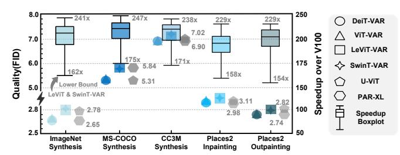

# G. Generalization Study

To rigorously validate the robust generalization of our contributions, we instantiate VAR models with four widely-used

Fig. 21: Generalization analysis of the proposed optimizations. The lower bound of the speedup boxplot is determined by LeViT- and SwinT-VAR. Speedup benchmarks: Comparison between the SW/HW co-design framework and V100.

Vision Transformers and and evaluate them on four prevalent datasets: ImageNet, MS-COCO [48], CC3M [68] and Places2 [92] (see Fig. 21). Image synthesis tasks are conducted on the first three datasets; inpainting/outpainting tasks are carried out on Places2. Besides, U-ViT and PAR-XL serve as competitive diffusion and VAR baselines, respectively. Overall, across all backbones, datasets and tasks, our optimized VAR models achieve significant speedups over V100 while maintaining visual quality comparable to the diffusion and VAR baselines. Notably, LeViT-VAR and SwinT-VAR exhibit relatively lower generation quality and speedup compared to ViT-VAR and DeiT-VAR. This discrepancy can be attributed to the presence of extra Conv2D modules within LeViT and SwinT. Conv2D modules will downsample the input tokens with a slight information loss, hurting the quality. Moreover, these two models also need additional 1-2 extra steps to maintain a comparable generation quality, hurting the speedup. Nevertheless, even for LeViT-VAR and SwinT-VAR, they still achieve substantial speedups over V100 while delivering competitive generation quality compared to U-ViT and PAR-XL. Consequently, our innovations exhibit robust generalizability and potentially can serve as a model-agnostic plug-in for future works.

#### VI. RELATED WORKS AND DISCUSSION

Accelerators for Vision Generative Models. Various hardware accelerators have been proposed since the advent of vision generative models. However, these works predominantly focus on accelerating GANs [13] [82], Diffusion models [42], [81], [93] or just the backbone, Vision Transformers [17], [84], [85]. Their main contributions primarily fall under four categories, 1) Differential Processing [42], 2) Sparsification or Quantization [17], [81], [85], 3) Linear Attention [14], and 4) Redundancy Utilization [84]. However, VAR-Turbo, this work distinguishes itself by pioneering a SW/HW co-design framework that aims to accelerate the entire VAR models, leveraging both image and model redundancy.

**Redundancy of Images.** A variety of works have made their contributions based on the redundancy of images [6], [9], [10], [17], [23], [31], [62], [84], [88]. For example, AdapTiV picks one representative token from several similar tokens to decrease the number of tokens to be processed, which is inspired by the abundant image redundancy [84]. Alternatively,

PSViT [10] adopts token pooling by leveraging the model redundancy of ViTs. In this study, to the best of our knowledge, VAR-Turbo presents an early attempt to theoretically identify both image redundancy and model redundancy, and correspondingly, enhances the VAR acceleration framework by PD, TA and DB.

#### VII. CONCLUSION

In this work, we present VAR-Turbo, the first SW/HW codesign framework for visual autoregressive models. Exploiting image- and model-level redundancy, we propose three algorithmic optimizations: Draft-Free Parallel Decoding, Token Aggregation and Dynamic Bypass. To maximize the achievable speedup brought by SW innovations, in the hardware level, VAR-Turbo incorporates 1) A Unified Attention Core to accommodate distinct attentions introduced by TA and 2) Radix Sort Core to manage the large-scale sorting operation introduced by PD and DB. Under synergistic effort between SW and HW, VAR-Turbo delivers over 200× speedup for VAR models while incurring negligible quality degradation, suggesting a promising direction for future research in Generative-AI accelerators.

#### VIII. ACKNOWLEDGEMENT

This research was supported in part by NSFC Grant 62422407, RGC Grant 26204424, and partially conducted by ACCESS – AI Chip Center for Emerging Smart Systems, supported by the InnoHK initiative of the Innovation and Technology Commission of the Hong Kong Special Administrative Region Government. We are grateful to Dr. Zhiheng Yue and the anonymous reviewers for their insightful comments, which substantially improved the quality of this paper.

## REFERENCES

- [1] Amanusk, "The stress terminal ui: s-tui," [Online], https://amanusk.github.io/s-tui/.
- [2] F. Bao, S. Nie, K. Xue, Y. Cao, C. Li, H. Su, and J. Zhu, "All are worth words: A vit backbone for diffusion models," in *Proceedings of* the IEEE/CVF Conference on Computer Vision and Pattern Recognition (CVPR), June 2023, pp. 22 669–22 679.
- [3] S. Barratt and R. Sharma, "A note on the inception score," arXiv preprint arXiv:1801.01973, 2018.
- [4] I. Beltagy, M. E. Peters, and A. Cohan, "Longformer: The long-document transformer," arXiv preprint arXiv:2004.05150, 2020.
- [5] Black Forest Labs, "black-forest-labs/flux: Official inference repo for flux.1 models," https://github.com/black-forest-labs/flux, accessed: 2025-07-25.
- [6] D. Bolya, C.-Y. Fu, X. Dai, P. Zhang, C. Feichtenhofer, and J. Hoffman, "Token merging: Your vit but faster," arXiv preprint arXiv:2210.09461, 2022.
- [7] T. Cai, Y. Li, Z. Geng, H. Peng, J. D. Lee, D. Chen, and T. Dao, "Medusa: Simple Ilm inference acceleration framework with multiple decoding heads," arXiv preprint arXiv:2401.10774, 2024.
- [8] Y. Cao, S. Li, Y. Liu, Z. Yan, Y. Dai, P. S. Yu, and L. Sun, "A comprehensive survey of ai-generated content (aigc): A history of generative ai from gan to chatgpt," arXiv preprint arXiv:2303.04226, 2023.
- [9] H. Chang, H. Zhang, L. Jiang, C. Liu, and W. T. Freeman, "Maskgit: Masked generative image transformer," in *Proceedings of the IEEE/CVF Conference on Computer Vision and Pattern Recognition*, 2022, pp. 11315–11325.
- [10] B. Chen, P. Li, B. Li, C. Li, L. Bai, C. Lin, M. Sun, J. Yan, and W. Ouyang, "Psvit: Better vision transformer via token pooling and attention sharing," arXiv preprint arXiv:2108.03428, 2021.

- [11] M. Chen, A. Radford, R. Child, J. Wu, H. Jun, D. Luan, and I. Sutskever, "Generative pretraining from pixels," in *International conference on machine learning*. PMLR, 2020, pp. 1691–1703.
- [12] Y. Chen, X. Pan, Y. Li, B. Ding, and J. Zhou, "Ee-llm: Large-scale training and inference of early-exit large language models with 3d parallelism," *arXiv preprint arXiv:2312.04916*, 2023.
- [13] Y. Chen, A. Louri, F. Lombardi, and S. Liu, "Chiplet-gan: Chiplet-based accelerator design for scalable generative adversarial network inference [feature]," *IEEE Circuits and Systems Magazine*, vol. 24, no. 3, pp. 19– 33, 2024.
- [14] J. Dass, S. Wu, H. Shi, C. Li, Z. Ye, Z. Wang, and Y. Lin, "Vitality: Unifying low-rank and sparse approximation for vision transformer acceleration with a linear taylor attention," in *2023 IEEE International Symposium on High-Performance Computer Architecture (HPCA)*. IEEE, 2023, pp. 415–428.
- [15] P. Dhariwal and A. Nichol, "Diffusion models beat gans on image synthesis," *Advances in neural information processing systems*, vol. 34, pp. 8780–8794, 2021.
- [16] G. Dimitrakopoulos and D. Nikolos, "High-speed parallel-prefix vlsi ling adders," *IEEE Transactions on Computers*, vol. 54, no. 2, pp. 225–231, 2005.
- [17] P. Dong, M. Sun, A. Lu, Y. Xie, K. Liu, Z. Kong, X. Meng, Z. Li, X. Lin, Z. Fang *et al.*, "Heatvit: Hardware-efficient adaptive token pruning for vision transformers," in *2023 IEEE International Symposium on High-Performance Computer Architecture (HPCA)*. IEEE, 2023, pp. 442– 455.
- [18] X. Dong, J. Bao, T. Zhang, D. Chen, W. Zhang, L. Yuan, D. Chen, F. Wen, and N. Yu, "Bootstrapped masked autoencoders for vision bert pretraining," in *European Conference on Computer Vision*. Springer, 2022, pp. 247–264.
- [19] Z. Du, Y. Qian, X. Liu, M. Ding, J. Qiu, Z. Yang, and J. Tang, "Glm: General language model pretraining with autoregressive blank infilling," *arXiv preprint arXiv:2103.10360*, 2021.
- [20] J. Duan, S. Yu, H. L. Tan, H. Zhu, and C. Tan, "A survey of embodied ai: From simulators to research tasks," *IEEE Transactions on Emerging Topics in Computational Intelligence*, vol. 6, no. 2, pp. 230–244, 2022.
- [21] P. Esser, R. Rombach, and B. Ommer, "Taming transformers for highresolution image synthesis," in *Proceedings of the IEEE/CVF conference on computer vision and pattern recognition*, 2021, pp. 12 873–12 883.
- [22] F. Farshchi, Q. Huang, and H. Yun, "Integrating nvidia deep learning accelerator (nvdla) with risc-v soc on firesim," in *2019 2nd Workshop on Energy Efficient Machine Learning and Cognitive Computing for Embedded Applications (EMC2)*. IEEE, 2019, pp. 21–25.
- [23] Z. Feng and S. Zhang, "Efficient vision transformer via token merger," *IEEE Transactions on Image Processing*, 2023.
- [24] Y. Fu, P. Bailis, I. Stoica, and H. Zhang, "Break the sequential dependency of llm inference using lookahead decoding," *arXiv preprint arXiv:2402.02057*, 2024.
- [25] S. Gao, P. Zhou, M.-M. Cheng, and S. Yan, "Masked diffusion transformer is a strong image synthesizer," in *Proceedings of the IEEE/CVF international conference on computer vision*, 2023, pp. 23 164–23 173.
- [26] S. Ghodrati, S. Kinzer, H. Xu, R. Mahapatra, Y. Kim, B. H. Ahn, D. K. Wang, L. Karthikeyan, A. Yazdanbakhsh, J. Park, N. S. Kim, and H. Esmaeilzadeh, "Tandem processor: Grappling with emerging operators in neural networks," in *Proceedings of the 29th ACM International Conference on Architectural Support for Programming Languages and Operating Systems, Volume 2*, ser. ASPLOS '24. New York, NY, USA: Association for Computing Machinery, 2024, p. 1165–1182. [Online]. Available: https://doi.org/10.1145/3620665. 3640365
- [27] D. Ghosh, H. Hajishirzi, and L. Schmidt, "Geneval: An object-focused framework for evaluating text-to-image alignment," *Advances in Neural Information Processing Systems*, vol. 36, pp. 52 132–52 152, 2023.
- [28] T. GLM, A. Zeng, B. Xu, B. Wang, C. Zhang, D. Yin, D. Zhang, D. Rojas, G. Feng, H. Zhao *et al.*, "Chatglm: A family of large language models from glm-130b to glm-4 all tools," *arXiv preprint arXiv:2406.12793*, 2024.
- [29] A. Gupta, S. Savarese, S. Ganguli, and L. Fei-Fei, "Embodied intelligence via learning and evolution," *Nature communications*, vol. 12, no. 1, p. 5721, 2021.
- [30] S. Hassani, "Dirac delta function," in *Mathematical Methods: For Students of Physics and Related Fields*. Springer, 2009, pp. 289–319.
- [31] K. He, X. Chen, S. Xie, Y. Li, P. Dollar, and R. Girshick, "Masked au- ´ toencoders are scalable vision learners," in *Proceedings of the IEEE/CVF*

- *conference on computer vision and pattern recognition*, 2022, pp. 16 000–16 009.
- [32] T. Henighan, J. Kaplan, M. Katz, M. Chen, C. Hesse, J. Jackson, H. Jun, T. B. Brown, P. Dhariwal, S. Gray *et al.*, "Scaling laws for autoregressive generative modeling," *arXiv preprint arXiv:2010.14701*, 2020.
- [33] M. Heusel, H. Ramsauer, T. Unterthiner, B. Nessler, and S. Hochreiter, "Gans trained by a two time-scale update rule converge to a local nash equilibrium," *Advances in neural information processing systems*, vol. 30, 2017.
- [34] J. Ho, A. Jain, and P. Abbeel, "Denoising diffusion probabilistic models," *Advances in neural information processing systems*, vol. 33, pp. 6840– 6851, 2020.
- [35] A. Hurst, A. Lerer, A. P. Goucher, A. Perelman, A. Ramesh, A. Clark, A. Ostrow, A. Welihinda, A. Hayes, A. Radford *et al.*, "Gpt-4o system card," *arXiv preprint arXiv:2410.21276*, 2024.
- [36] D. Israel, G. V. d. Broeck, and A. Grover, "Accelerating diffusion llms via adaptive parallel decoding," *arXiv preprint arXiv:2506.00413*, 2025.
- [37] J.-W. Jang, S. Lee, D. Kim, H. Park, A. S. Ardestani, Y. Choi, C. Kim, Y. Kim, H. Yu, H. Abdel-Aziz, J.-S. Park, H. Lee, D. Lee, M. W. Kim, H. Jung, H. Nam, D. Lim, S. Lee, J.-H. Song, S. Kwon, J. Hassoun, S. Lim, and C. Choi, "Sparsity-aware and re-configurable npu architecture for samsung flagship mobile soc," in *2021 ACM/IEEE 48th Annual International Symposium on Computer Architecture (ISCA)*, 2021, pp. 15–28.
- [38] N. P. Jouppi, C. Young, N. Patil, D. Patterson, G. Agrawal, R. Bajwa, S. Bates, S. Bhatia, N. Boden, A. Borchers *et al.*, "In-datacenter performance analysis of a tensor processing unit," in *Proceedings of the 44th annual international symposium on computer architecture*, 2017, pp. 1–12.
- [39] S.-C. Kao, S. Subramanian, G. Agrawal, A. Yazdanbakhsh, and T. Krishna, "Flat: An optimized dataflow for mitigating attention bottlenecks," in *Proceedings of the 28th ACM International Conference on Architectural Support for Programming Languages and Operating Systems, Volume 2*, 2023, pp. 295–310.
- [40] W.-S. Khwa, P.-C. Wu, J.-J. Wu, J.-W. Su, H.-Y. Chen, Z.-E. Ke, T.-C. Chiu, J.-M. Hsu, C.-Y. Cheng, Y.-C. Chen, C.-C. Lo, R.-S. Liu, C.-C. Hsieh, K.-T. Tang, and M.-F. Chang, "34.2 a 16nm 96kb integer/floatingpoint dual-mode-gain-cell-computing-in-memory macro achieving 73.3- 163.3tops/w and 33.2-91.2tflops/w for ai-edge devices," in *2024 IEEE International Solid-State Circuits Conference (ISSCC)*, vol. 67, 2024, pp. 568–570.
- [41] Y. Kim, W. Yang, and O. Mutlu, "Ramulator: A fast and extensible dram simulator," *IEEE Computer architecture letters*, vol. 15, no. 1, pp. 45–49, 2015.
- [42] W. Kong, Y. Hao, Q. Guo, Y. Zhao, X. Song, X. Li, M. Zou, Z. Du, R. Zhang, C. Liu *et al.*, "Cambricon-d: Full-network differential acceleration for diffusion models," in *2024 ACM/IEEE 51st Annual International Symposium on Computer Architecture (ISCA)*. IEEE, 2024, pp. 903–914.
- [43] W. Kool, H. Van Hoof, and M. Welling, "Stochastic beams and where to find them: The Gumbel-top-k trick for sampling sequences without replacement," in *Proceedings of the 36th International Conference on Machine Learning*, ser. Proceedings of Machine Learning Research, K. Chaudhuri and R. Salakhutdinov, Eds., vol. 97. PMLR, 09–15 Jun 2019, pp. 3499–3508. [Online]. Available: https://proceedings.mlr.press/v97/kool19a.html
- [44] A. R. Lahitani, A. E. Permanasari, and N. A. Setiawan, "Cosine similarity to determine similarity measure: Study case in online essay assessment," in *2016 4th International conference on cyber and IT service management*. IEEE, 2016, pp. 1–6.
- [45] C. E. Leiserson, "Fat-trees: Universal networks for hardware-efficient supercomputing," *IEEE transactions on Computers*, vol. 100, no. 10, pp. 892–901, 1985.
- [46] H. Li, Z. Li, Z. Bai, and T. Mitra, "Asadi: Accelerating sparse attention using diagonal-based in-situ computing," in *2024 IEEE International Symposium on High-Performance Computer Architecture (HPCA)*. IEEE, 2024, pp. 774–787.
- [47] Y. Liao, J. Meng, and J.-s. Seo, "A 28nm scalable and flexible accelerator for sparse transformer models," in *Proceedings of the 29th ACM/IEEE International Symposium on Low Power Electronics and Design*, 2024, pp. 1–6.
- [48] T.-Y. Lin, M. Maire, S. Belongie, J. Hays, P. Perona, D. Ramanan, P. Dollar, and C. L. Zitnick, "Microsoft coco: Common objects in ´

- context," in *European conference on computer vision*. Springer, 2014, pp. 740–755.
- [49] Y. Lin, Z. Zhang, H. Tang, H. Wang, and S. Han, "Pointacc: Efficient point cloud accelerator," in *MICRO-54: 54th Annual IEEE/ACM International Symposium on Microarchitecture*, 2021, pp. 449–461.
- [50] Y.-C. Lo and R.-S. Liu, "Bucket getter: A bucket-based processing engine for low-bit block floating point (bfp) dnns," in *Proceedings of the 56th Annual IEEE/ACM International Symposium on Microarchitecture*, 2023, pp. 1002–1015.
- [51] L. Lu, Y. Jin, H. Bi, Z. Luo, P. Li, T. Wang, and Y. Liang, "Sanger: A co-design framework for enabling sparse attention using reconfigurable architecture," in *MICRO-54: 54th Annual IEEE/ACM International Symposium on Microarchitecture*, 2021, pp. 977–991.
- [52] E. Malach, "Auto-regressive next-token predictors are universal learners," *arXiv preprint arXiv:2309.06979*, 2023.
- [53] X. Miao, G. Oliaro, Z. Zhang, X. Cheng, Z. Wang, Z. Zhang, R. Y. Y. Wong, A. Zhu, L. Yang, X. Shi, C. Shi, Z. Chen, D. Arfeen, R. Abhyankar, and Z. Jia, "Specinfer: Accelerating large language model serving with tree-based speculative inference and verification," in *Proceedings of the 29th ACM International Conference on Architectural Support for Programming Languages and Operating Systems, Volume 3*, ser. ASPLOS '24. New York, NY, USA: Association for Computing Machinery, 2024, p. 932–949. [Online]. Available: https://doi.org/10.1145/3620666.3651335
- [54] Z. Ni, Y. Wang, R. Zhou, J. Guo, J. Hu, Z. Liu, S. Song, Y. Yao, and G. Huang, "Revisiting non-autoregressive transformers for efficient image synthesis," in *Proceedings of the IEEE/CVF Conference on Computer Vision and Pattern Recognition*, 2024, pp. 7007–7016.
- [55] Z. Ni, Y. Wang, R. Zhou, R. Lu, J. Guo, J. Hu, Z. Liu, Y. Yao, and G. Huang, "Adanat: Exploring adaptive policy for token-based image generation," in *European Conference on Computer Vision*. Springer, 2024, pp. 302–319.
- [56] A. Q. Nichol and P. Dhariwal, "Improved denoising diffusion probabilistic models," in *International conference on machine learning*. PMLR, 2021, pp. 8162–8171.
- [57] W. Niu, J. Guan, Y. Wang, G. Agrawal, and B. Ren, "Dnnfusion: accelerating deep neural networks execution with advanced operator fusion," in *Proceedings of the 42nd ACM SIGPLAN International Conference on Programming Language Design and Implementation*, 2021, pp. 883–898.
- [58] W. Peebles and S. Xie, "Scalable diffusion models with transformers," in *Proceedings of the IEEE/CVF International Conference on Computer Vision*, 2023, pp. 4195–4205.
- [59] D. Podell, Z. English, K. Lacey, A. Blattmann, T. Dockhorn, J. Muller, ¨ J. Penna, and R. Rombach, "Sdxl: Improving latent diffusion models for high-resolution image synthesis," *arXiv preprint arXiv:2307.01952*, 2023.
- [60] PyPI, "Python utilities for the nvidia management library," [Online], https://pypi.org/project/pynvml/.
- [61] Y. Qin, Y. Wang, D. Deng, Z. Zhao, X. Yang, L. Liu, S. Wei, Y. Hu, and S. Yin, "Fact: Ffn-attention co-optimized transformer architecture with eager correlation prediction," in *Proceedings of the 50th Annual International Symposium on Computer Architecture*, 2023, pp. 1–14.
- [62] Y. Rao, W. Zhao, B. Liu, J. Lu, J. Zhou, and C.-J. Hsieh, "Dynamicvit: Efficient vision transformers with dynamic token sparsification," *Advances in neural information processing systems*, vol. 34, pp. 13 937– 13 949, 2021.
- [63] Y. Z. Rawash, B. Al-Naami, A. Alfraihat, and H. A. Owida, "Advanced low-pass filters for signal processing: A comparative study on gaussian, mittag-leffler, and savitzky-golay filters." *Mathematical Modelling of Engineering Problems*, vol. 11, no. 7, 2024.
- [64] R. Rombach, A. Blattmann, D. Lorenz, P. Esser, and B. Ommer, "Highresolution image synthesis with latent diffusion models," in *Proceedings of the IEEE/CVF conference on computer vision and pattern recognition*, 2022, pp. 10 684–10 695.
- [65] T. Salimans, A. Karpathy, X. Chen, and D. P. Kingma, "Pixelcnn++: Improving the pixelcnn with discretized logistic mixture likelihood and other modifications," *arXiv preprint arXiv:1701.05517*, 2017.
- [66] A. Shanbhag, H. Pirk, and S. Madden, "Efficient top-k query processing on massively parallel hardware," in *Proceedings of the 2018 International Conference on Management of Data*, ser. SIGMOD '18. New York, NY, USA: Association for Computing Machinery, 2018, p. 1557–1570. [Online]. Available: https://doi.org/10.1145/3183713. 3183735

- [67] C. E. Shannon, "A mathematical theory of communication," *The Bell system technical journal*, vol. 27, no. 3, pp. 379–423, 1948.
- [68] P. Sharma, N. Ding, S. Goodman, and R. Soricut, "Conceptual captions: A cleaned, hypernymed, image alt-text dataset for automatic image captioning," in *Proceedings of the 56th Annual Meeting of the Association for Computational Linguistics (Volume 1: Long Papers)*, 2018, pp. 2556– 2565.
- [69] E. Stehle and H.-A. Jacobsen, "A memory bandwidth-efficient hybrid radix sort on gpus," in *Proceedings of the 2017 ACM International Conference on Management of Data*, 2017, pp. 417–432.
- [70] I. E. Sutherland and R. F. Sproull, "Logical effort: Designing for speed on the back of an envelope," *IEEE Advanced Research in VLSI*, vol. 116, p. 270, 1991.
- [71] E. Swartzlander, "Parallel counters," *IEEE Transactions on Computers*, vol. C-22, no. 11, pp. 1021–1024, 1973.
- [72] H. Touvron, M. Cord, M. Douze, F. Massa, A. Sablayrolles, and H. Jegou, "Training data-efficient image transformers & distillation ´ through attention," in *International conference on machine learning*. PMLR, 2021, pp. 10 347–10 357.
- [73] A. Tsirikoglou, G. Eilertsen, and J. Unger, "A survey of image synthesis methods for visual machine learning," in *Computer graphics forum*, vol. 39, no. 6. Wiley Online Library, 2020, pp. 426–451.
- [74] A. Van Den Oord, N. Kalchbrenner, and K. Kavukcuoglu, "Pixel recurrent neural networks," in *International conference on machine learning*. PMLR, 2016, pp. 1747–1756.
- [75] H. Wang, Z. Zhang, and S. Han, "Spatten: Efficient sparse attention architecture with cascade token and head pruning," in *2021 IEEE International Symposium on High-Performance Computer Architecture (HPCA)*. IEEE, 2021, pp. 97–110.
- [76] H.-Y. Wang and T.-S. Chang, "Row-wise accelerator for vision transformer," in *2022 IEEE 4th International Conference on Artificial Intelligence Circuits and Systems (AICAS)*. IEEE, 2022, pp. 399–402.
- [77] H. Wang, J. Fang, X. Tang, Z. Yue, J. Li, Y. Qin, S. Guan, Q. Yang, Y. Wang, C. Li *et al.*, "Sofa: A compute-memory optimized sparsity accelerator via cross-stage coordinated tiling," in *2024 57th IEEE/ACM International Symposium on Microarchitecture (MICRO)*. IEEE, 2024, pp. 1247–1263.
- [78] Y. Wang, S. Ren, Z. Lin, Y. Han, H. Guo, Z. Yang, D. Zou, J. Feng, and X. Liu, "Parallelized autoregressive visual generation," in *Proceedings of the Computer Vision and Pattern Recognition Conference (CVPR)*, June 2025, pp. 12 955–12 965.
- [79] C. Wu, H. Zhang, S. Xue, Z. Liu, S. Diao, L. Zhu, P. Luo, S. Han, and E. Xie, "Fast-dllm: Training-free acceleration of diffusion llm by enabling kv cache and parallel decoding," *arXiv preprint arXiv:2505.22618*, 2025.
- [80] Z. Yan, J. Ye, W. Li, Z. Huang, S. Yuan, X. He, K. Lin, J. He, C. He, and L. Yuan, "Gpt-imgeval: A comprehensive benchmark for diagnosing gpt4o in image generation," *arXiv preprint arXiv:2504.02782*, 2025.
- [81] G. Yang, Y. Xie, Z. J. Xue, S.-E. Chang, Y. Li, P. Dong, J. Lei, W. Xie, Y. Wang, X. Lin *et al.*, "Sda: Low-bit stable diffusion acceleration on edge fpgas," in *2024 34th International Conference on Field-Programmable Logic and Applications (FPL)*. IEEE, 2024, pp. 264– 273.
- [82] A. Yazdanbakhsh, M. Brzozowski, B. Khaleghi, S. Ghodrati, K. Samadi, N. S. Kim, and H. Esmaeilzadeh, "Flexigan: An end-to-end solution for fpga acceleration of generative adversarial networks," in *2018 IEEE 26th Annual International Symposium on Field-Programmable Custom Computing Machines (FCCM)*. IEEE, 2018, pp. 65–72.
- [83] S. Yin, C. Fu, S. Zhao, K. Li, X. Sun, T. Xu, and E. Chen, "A survey on multimodal large language models," *National Science Review*, p. nwae403, 2024.
- [84] S. Yoo, H. Kim, and J.-Y. Kim, "Adaptiv: Sign-similarity based imageadaptive token merging for vision transformer acceleration," in *2024 57th IEEE/ACM International Symposium on Microarchitecture (MI-CRO)*. IEEE, 2024, pp. 64–77.
- [85] H. You, Z. Sun, H. Shi, Z. Yu, Y. Zhao, Y. Zhang, C. Li, B. Li, and Y. Lin, "Vitcod: Vision transformer acceleration via dedicated algorithm and accelerator co-design," in *2023 IEEE International Symposium on High-Performance Computer Architecture (HPCA)*. IEEE, 2023, pp. 273–286.
- [86] J. Yu, J. Park, S. Park, M. Kim, S. Lee, D. H. Lee, and J. Choi, "Nn-lut: neural approximation of non-linear operations for efficient transformer inference," in *Proceedings of the 59th ACM/IEEE Design Automation Conference*, 2022, pp. 577–582.

- [87] J. Yue, M. Zhan, Z. Wang, Y. He, Y. Li, S. Yu, W. Sun, L. Jie, C. Dou, X. Li *et al.*, "A 5.6-89.9 tops/w heterogeneous computing-in-memory soc with high-utilization producer-consumer architecture and high-frequency read-free cim macro," in *2023 IEEE Symposium on VLSI Technology and Circuits (VLSI Technology and Circuits)*. IEEE, 2023, pp. 1–2.
- [88] Z. Yue, H. Wang, J. Fang, J. Deng, G. Lu, F. Tu, R. Guo, Y. Li, Y. Qin, Y. Wang *et al.*, "Exploiting similarity opportunities of emerging vision ai models on hybrid bonding architecture," in *2024 ACM/IEEE 51st Annual International Symposium on Computer Architecture (ISCA)*. IEEE, 2024, pp. 396–409.
- [89] M. Zaheer, G. Guruganesh, K. A. Dubey, J. Ainslie, C. Alberti, S. Ontanon, P. Pham, A. Ravula, Q. Wang, L. Yang *et al.*, "Big bird: Transformers for longer sequences," *Advances in neural information processing systems*, vol. 33, pp. 17 283–17 297, 2020.
- [90] F. Zhan, Y. Yu, R. Wu, J. Zhang, S. Lu, L. Liu, A. Kortylewski, C. Theobalt, and E. Xing, "Multimodal image synthesis and editing: A survey and taxonomy," *IEEE Transactions on Pattern Analysis and Machine Intelligence*, 2023.
- [91] G. Zhang, N. Attaluri, J. S. Emer, and D. Sanchez, "Gamma: Leveraging gustavson's algorithm to accelerate sparse matrix multiplication," in *Proceedings of the 26th ACM International Conference on Architectural Support for Programming Languages and Operating Systems*, 2021, pp. 687–701.
- [92] B. Zhou, A. Lapedriza, A. Khosla, A. Oliva, and A. Torralba, "Places: A 10 million image database for scene recognition," *IEEE transactions on pattern analysis and machine intelligence*, vol. 40, no. 6, pp. 1452–1464, 2017.
- [93] H. Zhou, Y. Liu, H. Wang, E. Tang, S. Li, Y. Zhang, and K. Wang, "Sdacc: A stable diffusion accelerator on fpga via software-hardware codesign," in *2024 IEEE 32nd Annual International Symposium on Field-Programmable Custom Computing Machines (FCCM)*. IEEE, 2024, pp. 214–214.