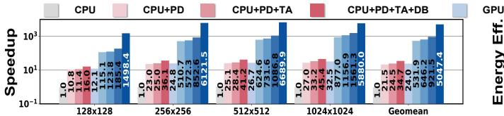
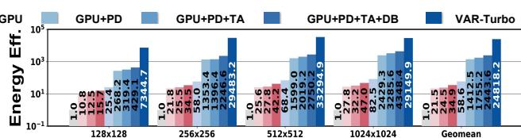
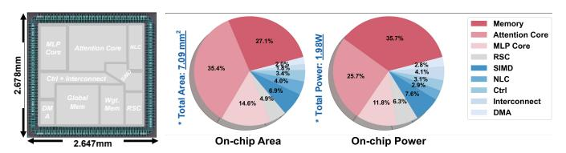
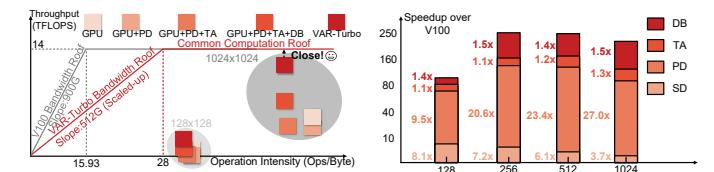
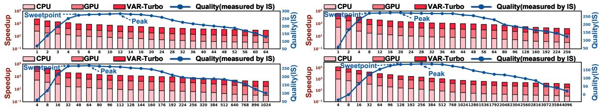
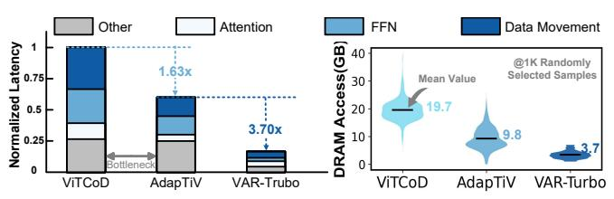
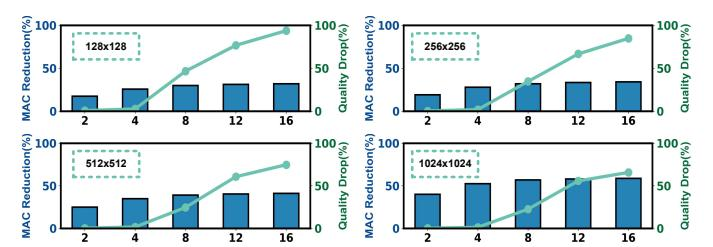
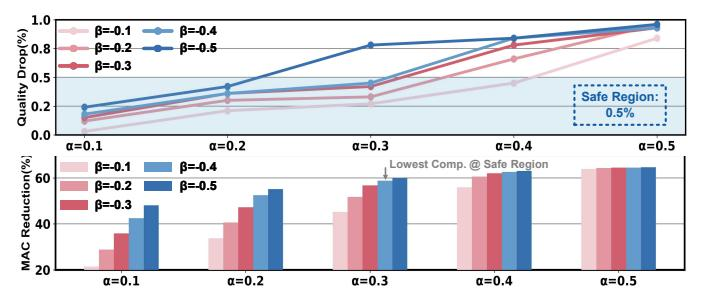

# V. EVALUATION

## *A. Evaluation Methodology*

*Algorithm Setup.* Models: For the stage 1) Tokenization, we source it from VQGAN [21]. For the stage 2) Generation, we employ a generative Transformer following DeiT [72] (the generalization study on model architectures or datasets can be seen in Sec. V-G). Training Settings: The generative Transformer is trained over 500 epochs with a batch size of 256 on ImageNet, leveraging four V100 GPUs. The loss function we use is cross-entropy loss and the optimizer employed is AdamW with a learning rate of 1e-4, a weight decay of 1e-5 and the momentum is (0.9,0.96). The training cost is 816 GPU hours. For hyperparameter optimization, we employ a hybrid strategy: PD-aware training is used for Draft-Free Parallel Decoding (PD) [54], while an efficient grid search is applied to Token Aggregation (TA) and Dynamic Bypass (DB) (see Sec. V-F for details). This approach is motivated by the fact that PD involves multiple hyperparameters, such as sampling temperature, masking ratio, and guidance scale, whose exhaustive search is computationally prohibitive. Therefore, these parameters are adaptively determined during training [54]. In contrast, the hyperparameter spaces for TA and DB are relatively small and enumerable, particularly for TA, making grid search a sufficient and cost-effective choice. Metrics: We use the metric of IS [3] and FID [33] to measure the generation quality.

*Hardware Setup.* We perform the RTL design for the VAR-Turbo accelerator and synthesize it using Synopsys Design Compiler with TSMC 28nm+HPC 1P8M CMOS technology at the corner of TT 25C. Subsequently, we use DCG and ICC2 to complete the chip's placement and routing, generating the chip's layout and netlist, from which we can obtain the chip's area data. At last, after the DRC and LVS check, we utilize VCS and PrimeTime for post-layout simulation to obtain the on-chip power consumption. Regarding the off-chip DRAM specification, considering the limited number of IO pads, we opt for one 2×64bit HBM2 channel @ 2GHz, which provides 32GB/s bandwidth.

*Baselines and Evaluation Metrics.* Baselines: To benchmark VAR-Turbo and other SOTA accelerators, we opt for a total of four baselines, including two general platforms: Nvidia V100 and Intel Xeon Platinum 8168 CPU @ 2.70GHz, and two ASIC accelerators: ViTCoD [85] and AdapTiV [84]. Metrics: We evaluate all platforms in terms of latency speedups and energy efficiency. For general platforms, torch.cuda.event API on GPU and time.time API on CPU are used to measure the latencies. Besides, when benchmarking with general platforms, we scale up the VAR-Turbo's hardware resource to match the peak throughput and bandwidth of V100, following [61]. Specifically, we set the peak throughput to 14 TFLOPS and employ 16 HBM2 channels (i.e., 512GB/s DRAM bandwidth) to model the scale-up VAR-Turbo (see the roofline model in Fig. 16). In terms of power consumption, we adopt pynvml [60] and s-tui [1] to acquire the data for GPU and CPU, respectively. For ASIC accelerators, we develop three dedicated cycle-accurate simulators for VAR-Turbo, ViTCoD, and AdapTiV to evaluate latencies, following the method in [75]. To ensure the correctness, we conduct RTL designs for ViTCoD and AdapTiV and prepare ten test cases with latencies ranging from 1 ms to 10 ms at 1 ms intervals. We then compare the latency results tested on the same test cases from our simulators to those obtained from RTL simulations. The matching rates of latency between simulator and RTL are 0.96 for ViTCoD, 0.94 for AdapTiV, and 0.90 for VAR-Turbo, respectively (i.e., the matching rates are all above 90%). For the on-chip power data, we directly obtain it from the reports of ViTCoD and AdapTiV for a fair comparison. For VAR-Turbo, as previously mentioned, we acquire the power data from the post-layout simulation. For off-chip DRAM energy consumption, we simulate the number of row activation, read/write with Ramulator [41] to calculate the overall energy. It is notable that we adopt three DDR4 to get the two ASIC baselines' claimed 76.8GB/s DRAM bandwidth.

## *B. Algorithm Evaluation*

Tab. I summarizes the evaluation results for VAR-Turbo against other generative models. Given that the vast majority of other generative models are only designed for 256 × 256 and/or 512×512 image resolutions, we restrict our analysis to these two cases in this section to ensure a fair comparison. In Tab. I, borrowing the idea of *Logic Effort* in VLSI design [70], we introduce a new metric called *Generation Effort (Gen. Effort)*, which is defined as "TFLOPs/IS", to quantify the computational effort per IS. The term VAR-Turbo-Peak denotes the highest achievable generation quality for VAR-Turbo. However, this peak point is associated with higher latency. To strike a balance between actual latency and generation quality, we introduce an alternative default option for the accelerator side of VAR-Turbo, i.e., VAR-Turbo-Balance (further justifications are provided in Sec. V-F). Overall, VAR-Turbo demonstrates superior generation quality and less Gen. Effort compared to other generative models. Notably, when compared to MaskGIT, which is a pioneering work applying PD on VAR models, VAR-Turbo-Peak exhibits significantly

TABLE I: Comparison with Other Generative Models (TFLOPs: The Number of Computation).

| Model             |      | Type      | #Para | #Step@256 | TFLOPs@256 ↓ | FID@256 ↓ | IS@256 ↑ | Gen. Effort@256 ↓ | #Step@512 | TFLOPs@512↓ | FID@512 ↓ | IS@512 ↑ | Gen. Effort@512 ↓ |
|-------------------|------|-----------|-------|-----------|--------------|-----------|----------|-------------------|-----------|-------------|-----------|----------|-------------------|
| ADM [15]          | II   | Diffusion | 554M  | 16        | 21.4         | 5.28      | 214.8    | 0.10              | 16        | 37.1        | 8.8       | 157.2    | 0.236             |
| LDM [64]          | - II | Diffusion | 400M  | 16        | 3.7          | 3.68      | 202.7    | 0.018             | N/A       | N/A         | N/A       | N/A      | N/A               |
| U-ViT [2]         | Ш    | Diffusion | 500M  | 16        | 4.6          | 2.77      | 259.5    | 0.018             | 16        | 5.5         | 4.04      | 252.6    | 0.022             |
| DiT-XL [58]       | - II | Diffusion | 675M  | 16        | 4.1          | 3.13      | 256.1    | 0.016             | 16        | 18.0        | 3.84      | 211.7    | 0.085             |
| Mask-Diff [25]    |      | Diffusion | 676M  | 8         | 2.2          | 4.0       | N/A      | N/A               | N/A       | N/A         | N/A       | N/A      | N/A               |
| VQ-GAN [21]       | - II | VAR       | 227M  | 256       | 18.7         | 18.65     | 80.4     | 0.23              | 1024      | N/A         | 26.52     | 66.8     | N/A               |
| MaskGIT [9]       | - II | VAR       | 227M  | 8         | 0.6          | 6.18      | 182.1    | 0.044             | 12        | 3.3         | 7.32      | 156.0    | 0.021             |
| PAR-XL [78]       |      | VAR       | 775M  | 64        | 21.1         | 2.64      | 259.2    | 0.08              | N/A       | N/A         | N/A       | N/A      | N/A               |
| VAR-Turbo-Peak    | П    | VAR       | 457M  | 20        | 2.8          | 2.65      | 272.4    | 0.01              | 64        | 11.5        | 3.13      | 263.4    | 0.04              |
| VAR-Turbo-Balance | :    | VAR       | 457M  | 8         | 1.1          | 2.67      | 268.6    | 0.004             | 32        | 5.7         | 3.15      | 259.6    | 0.021             |

Fig. 14: The normalized speedup (left) and energy efficiency (right) of VAR-Turbo over Xeon 8168 CPU and V100 GPU.

Fig. 15: A layout image of VAR-Turbo and its area&power consumption breakdown results.

Fig. 16: The Roofline Model (left) and Speedup breakdown (right). SD: Specialized Datapath.

higher quality (90.3  $\uparrow$  @IS) and much lower Gen. Effort. The former advantage stems from our PD-aware training strategy. MaskGIT adopts a heuristic policy to fix the hyperparameters for PD, inevitably degrading fidelity. In contrast, we optimize PD's hyperparameters through a gradient-based approach, i.e., PD-Aware Training [55] [54], which brings much higher visual quality by determining PD's hyperparameters adaptively throughout training. The latter advantage is originated from our proposed TA and DB, which greatly reduce the compute budget. Crucially, our PD is enhanced by the Locality-aware-Scheduling (see Sec. IV-D and Fig. 13), which can maximize the achievable hardware speedup brought by PD. In stark contrast, MaskGIT's PD is completely hardware-unaware, thereby forgoing any opportunity to optimize hardware efficiency. Then against the SOTA VAR model, PAR, VAR-Turbo delivers comparable quality yet requires  $7.5\times$  fewer TFLOPs and  $8\times$ fewer Gen. Effort. This gain arises primarily because PAR decodes a fixed number of tokens per iteration, e.g., 4, whereas VAR-Turbo can decode up to 64 tokens per iteration. In addition, TA and DB substantially reduce the compute budget of VAR-Turbo, markedly enhancing its Gen. Effort. In terms of the comparison with the SOTA Diffusion model, U-ViT, VAR-Turbo-Peak shows higher generation quality (12.9  $\uparrow$  @IS) and requires  $1.6\times$  fewer TFLOPs while at the cost of similar #Para. At last, VAR-Turbo-Balance can deliver much lower TFLOPs and Gen. Effort  $(2.5\times\downarrow)$  than VAR-Turbo-Peak with only  $\sim 1\%$  quality drop. If VAR-Turbo is set to "VAR-Turbo-Peak", we can still obtain more than  $100\times$  speedup compared to a GPU (see Sec. V-F). Critically, VAR-Turbo's hardware is designed to accept tunable hyperparameters to prioritize latency or quality.

## C. Overall Hardware Characteristics

Fig. 15 shows VAR-Turbo's layout floorplan and its area/power breakdown. Running at 1GHz, it occupies  $7.09mm^2$  silicon area and consumes 1.98W. Attention Core and Memory together dominate the hardware overhead, taking 35.4% and 27.1% of the area, and 25.7% and 35.7% of the power, respectively. In contrast, PD and DB necessitated Radix Sort Core (RSC) uses only 4.9% of the area and 6.3% of the power, evidencing the negligible hardware overhead of PD and DB. Further, if we remove RSC from VAR-Turbo and employ CPU (Xeon 8168) to conduct TopK with the remaining operators handled by VAR-Turbo w/o RSC, the overall speedup over GPU will be degraded from 210x to 153x due to the serial execution nature of CPU and excessive offchip DRAM access, indicating the necessity and efficiency of dedicated on-chip RSC performing TopK. Finally, based on the current evaluation and the technology scaling data from TSMC (N28⇒N3, the power is reduced by 3.4x), embedding VAR-Turbo into the latest Apple A18 Pro SoC (9W @ TSMC N3E technology node) appears to require an estimated 6.5% energy overhead to enable efficient inference of VAR models.

#### D. Comparisons with General Platforms

Fig. 14 shows the speedup and energy efficiency comparison of VAR-Turbo with two general platform baselines across four image resolutions. VAR-Turbo attains 5047.4x, 234.7x, 206.0x, 145.4x, 210.3x, 9.5x, 7.8x and 5.5x speedup, 24818.2x, 1154.3x, 1013.0x, 711.1x, 423.5x, 17.6x, 14.1x and 10.1x energy efficiency on average over CPU, CPU+PD, CPU+PD+TA, CPU+PD+TA+DB, GPU, GPU+PD, GPU+PD+TA and GPU+PD+TA+DB, respectively. These results not only witness the superiority of VAR-Turbo over CPU

Fig. 17: Design space exploration on generation quality and performance @ PD. Top Left:  $128 \times 128$ , Top Right:  $256 \times 256$ , Bottom Left:  $512 \times 512$  and Bottom Right:  $1024 \times 1024$ .

TABLE II: Comparisons with Two ASIC Accelerators.

|                    | ViTCoD         | AdapTiV        | VAR-Turbo    |
|--------------------|----------------|----------------|--------------|
| Image Redun.       | <b>x</b>       | /              | /            |
| Model Redun.       | ✓              | ×              | ✓            |
| Accelerate         | Attention      | Attention+FFN  | Whole Model  |
| Token Opt.         | Pruning        | Merging        | TA+DB        |
| Decoding Type      | Serial         | Serial         | Parallel     |
| Quality Drop       | 2.9% @ ViT     | 1.3% @ ViT     | 1% @ VAR     |
| Technology         | 28nm           | 28nm           | 28nm+1P8M    |
| Circuit State      | Layout         | Synthesis      | Layout       |
| DRAM Spec.         | DDR4(76.8GB/s) | DDR4(76.8GB/s) | HBM2(32GB/s) |
| DRAM Power(W)      | 8.3            | 8.3            | 2.0          |
| Data Format        | N/A            | FX16           | BF16         |
| Frequency(MHz)     | 500            | 1000           | 1000         |
| $Area(mm^2)$       | 3              | 2.49           | 7.09         |
| Perf.(TOPS)        | 6.7            | 10.9           | 41.2         |
| Power Eff.(TOPS/W) | 3.4            | 2.6            | 20.3         |

Fig. 18: The latency breakdown of ViTCoD, AdapTiV and VAR-Turbo (left). The statistics of DRAM access (right).

and GPU, but also reflect the cross-platform (CPU,GPU,ASIC) effectiveness of PD, TA and DB.

Fig. 16 summarizes the performance analysis of VAR-Turbo. At first, we use the roofline model to better elucidate the effect of different optimization schemes. Obviously, VAR models are compute-bound tasks for both GPU and VAR-Turbo. Then, since PD introduces extra bandwidth-constraint operators like Top-k and Softmax, the throughput is reduced in the "+PD" case. However, PD scheme greatly decreases the amount of iterations; thus, the overall latency is still much smaller than the vanilla VAR models. TA & DB reduce a certain amount of operations with minor extra parameters, which makes "+TA" and "+DB" cases showcase higher throughput and slightly lower operation intensity. Additionally, in the low image resolution case, the length of visual tokens is smaller than the embedding size, e.g., 128 v.s. 1024 @  $128 \times 128$ , which means that the TA scheme is less effective in the low image resolution case (see the light gray elliptical area in Fig. 16 left). At last, VAR-Turbo obtains a much closer throughout gap towards the computation roof over GPU+PD+TA+DB due to its highly specialized datapath (3.7x-8.1x speedup by Specialized Datapath (SD), see Fig.16 right).

## E. Comparisons with ASIC Accelerators

Overall Comparisons. To further understand the significance of PD, TA and DB, and validate the necessity of VAR-Turbo, we compare it with two SOTA ViT accelerators, ViTCoD and AdapTiV. This is because there is no prior art targeting VAR models and ViT accelerators are the most relevant baselines that we can choose. Besides, to ensure a fair comparison, we restrict the evaluation of runtime overhead and accuracy loss of the two ASICs to the identical Vision Transformer backbone utilized in the VAR model benchmarking VAR-Turbo. The comparison results are summarized in Tab. II. Besides, in Tab. II, we scale up the hardware resources of ViTCoD and AdapTiV to match those of VAR-Turbo, thereby ensuring a fair comparison in terms of throughput and power efficiency. First, both ASIC baselines only leverage onesided redundancy. Specifically, ViTCoD adopts static pruning and AdapTiV opts for adaptive token merging. Both of the strategies consistently exhibit a larger drop in the generation quality than VAR-Turbo, with ViTCoD being particularly affected—its static pruning proves not well-suited to the image generation task. Then, VAR-Turbo shows 6.1x, 3.8x higher throughput, 6.0x, 7.8x higher power efficiency over ViTCoD and AdapTiV, respectively. Please note that in Tab. II, to ensure a fair comparison (i.e., under the constraint of similar quality drop), we use the configuration set of "VAR-Turbo-Peak" (see the second paragraph in Sec. V-F) to compare with other two ASIC baselines.

Breakdown Analysis. To elucidate the sources of VAR-Turbo's efficiency over other two ASIC baselines, we conduct a breakdown analysis which is summarized in Fig. 18. Overall, as shown in Fig. 18 left, VAR-Turbo shows substantially lower end-to-end latency than ViTCoD and AdapTiV. This superiority stems from two factors: 1) VAR-Turbo capitalizes on both image and model redundancy, whereas ViTCoD and AdapTiV exploit only one side of redundancy. Specifically, in terms of image redundancy, PD reduces the number of iterations by 80%, while prior ViT accelerators have to decode tokens serially. The reason is that 1) ViTCoD sacrifices 2.9% accuracy (Tab. II), exhausting any margin left for extra optimizations such as PD. 2) For AdapTiV, since the initial input for VAR models is an all-masked canvas in the inference phase, token merging in AdapTiV will merge numerous masked tokens into one. Thus, if we apply PD for AdapTiV, it will generate the same/similar pixel value for the previously merged masked tokens, greatly degrading the visual quality. Consequently,

neither baseline is compatible with PD. Then, regarding model redundancy, TA & DB reduce the computational load for both attentions and MLPs. In contrast, ViTCoD only optimizes attentions. 2) VAR-Turbo presents a more advanced and customized system-on-chip (SOC) design (e.g., layer fusion, "producer-consumer" SOC schedule, RSC and NLC, see Sec. IV-B), specifically engineered to provide seamless support for the whole VAR model. However, ViTCoD and AdapTiV primarily target optimizing attentions and/or FFNs. Consequently, VAR-Turbo achieves much less DRAM access than other two accelerators (see Fig. 18 right). Besides, for those bandwidthlimited operators (Legend "Other" in Fig. 18), e.g., TopK and non-linear functions, which are also witnessed to be critical in terms of the end-to-end latency [26], they receive almost no specialized optimization in ViTCoD and AdapTiV, thereby constraining their attainable performance considerably.

## F. Design Space Exploration

In this section, we search and select the optimal architectural settings for VAR-Turbo via design space exploration (DSE).

PD: Sampling Steps. First and foremost, counterintuitively, as shown in Fig. 17, under PD scheme, an increased number of iterations may lead to deteriorated generation quality! This finding corroborates the claim in [31] that the relationship between pixels is bidirectional. Excessive iterations tend to weaken this relationship, thereby negatively impacting the overall quality. When prioritizing the quality metric, the optimal number of iterations is 12, 20, 64 and 256 for the image resolutions ranging from  $128 \times 128$  to 1024 × 1024, respectively (Peaks in Fig. 17 or VAR-Turbo-Peak in Sec. V-B). Then, apparently, an increased number of iterations correlates with longer latency. When considering the factor of latency, the Sweetpoints are identified as 5, 8, 32, 128 for the image resolutions spanning from  $128 \times 128$  to  $1024 \times 1024$ , respectively; since an acceptable level of quality is achieved (the quality drop  $\sim 1\%$ ) with the minimal latency at these four Sweetpoints (VAR-Turbo-Balance in Sec. V-B,  $\sim 200$ x speedup compared to a GPU when combining with our proposed accelerator, see Fig. 14).

TA: Local Window. The results are summarized in Fig. 19. As shown in Fig. 19, when LW.size  $\geq 8$ , the generation quality drops drastically for all the image resolutions. Then, we find that when the image resolution goes higher, the tolerance of large LW.size is also growing larger. Therefore, for low-resolution images, such as those with resolutions of  $128 \times 128$  and  $256 \times 256$ , we predominantly set the LW.size to 2. In contrast, for high-resolution images, such as those with resolutions of  $512 \times 512$  and  $1024 \times 1024$ , we allocate 50% of the LW.size to 2 and the remaining 50% to 4. The generation quality drops for all four image resolutions are below 0.5%.

**DB:** Skip Rate. The schedule function is the key factor in DB design, which controls the token skip rate layer-wise. In Ref. [54] and Ref. [9], the authors find that concave functions (e.g., Cosine) generally get better quality when scheduling the

Fig. 19: Design Space Exploration on LW.size @ TA.

Fig. 20: Design Space Exploration on  $\alpha \& \beta$  @ DB.

skip rate or mask rate. Therefore, we set the default schedule function as:

$$S(l) = min(\alpha + \beta cos(\frac{\pi(l+16)}{32}), Thre.), l = 0 \Rightarrow 15. (2)$$

In Eq. 2, we empirically set the threshold (Thre.) to 0.55, which means that there are 55% tokens can be skipped at most. Then, we conduct a design space exploration to determine the coefficients, i.e.,  $\alpha\&\beta$ . As shown in Fig. 20, when  $\alpha=0.3$  and  $\beta=-0.4$ , VAR-Turbo achieves a minimal generation quality drop (< 0.5%) while simultaneously maximizing the MAC reduction rate. Thus, we set  $\alpha=0.3$  and  $\beta=-0.4$  for the schedule function S(l) in DB.

Ablation Study. Tab. III ablates each optimization's impact on visual quality and end-to-end (E2E) hardware speedup. Firstly, no single technique or their combination introduces perceptible quality loss, certifying lossless acceleration and their orthogonality. Then, in terms of the E2E hardware speedup, PD dominates the speedup by cutting over 80% iterations. DB and TA furnish sizable incremental speedups: DB bypasses both attention and FFN layers, while TA compresses attention itself. Besides, removing any single component drops speedup over 20%, underscoring their combination's necessity.

TABLE III: Ablation Study on PD/TA/DB @ 256×256.

| (PD TA DB)                               | FID↓  | ΔFID    | E2E Speedup ↑ | Δ Speedup |
|------------------------------------------|-------|---------|---------------|-----------|
| $(\mathbf{X} \ \mathbf{X} \ \mathbf{X})$ | 2.637 | -       | 1             | -         |
| ( <b>X X √</b> )                         | 2.645 | +8e-3   | 1.65x         | +0.65x    |
| ( <b>X</b> ✓ <b>X</b> )                  | 2.642 | +5e-3   | 1.44x         | +0.44x    |
| ( <b>/ X X</b> )                         | 2.662 | +2.5e-2 | 20.4x         | +19.4x    |
| ( <b>X</b> ✓ ✓)                          | 2.663 | +2.6e-2 | 1.98x         | +0.98x    |
| ( <b>✓ X ✓</b> )                         | 2.673 | +3.6e-2 | 30.9x         | +29.9x    |
| ( <b>✓ ✓ X</b> )                         | 2.670 | +3.3e-2 | 28.6x         | +27.6x    |
| ( <b>/ / /</b> )                         | 2.675 | +3.8e-2 | 35.5x         | +34.5x    |

