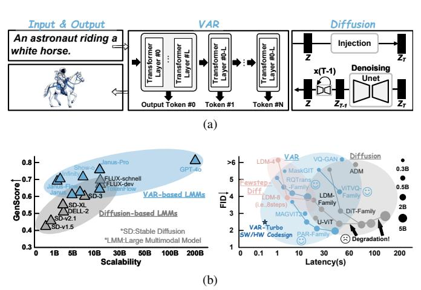
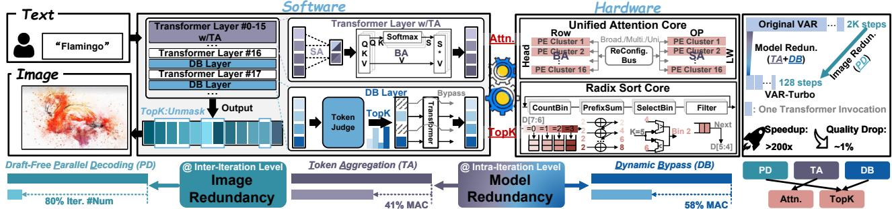
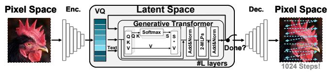
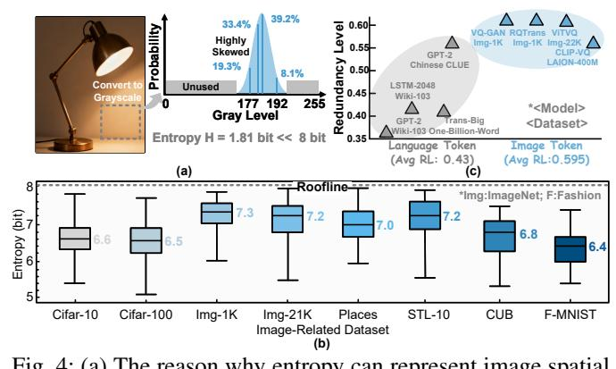

# VAR-Turbo: Unlocking the Potential of Visual Autoregressive Models through Dual Redundancy

Xujiang Xiang1, Fengbin Tu1,2,\*

1 The Hong Kong University of Science and Technology, Hong Kong, China 2 AI Chip Center for Emerging Smart Systems, Hong Kong, China xxiangaf@connect.ust.hk, \*Corresponding Author (fengbintu@ust.hk)

Abstract—Image synthesis task has recently drawn enormous attention from both the academia and the industry due to the recent advancements of generative models, which now can generate photorealistic images with conditional words from human. Among the generative models for image synthesis task, Visual AutoRegressive (VAR) model is a promising avenue due to its strong scalability. Nevertheless, its exorbitant computational cost poses a formidable obstacle to widespread adoption. To this end, we propose a dedicated software/hardware co-design framework dubbed VAR-Turbo for unlocking the potential of VAR models. Specifically, in the software level, we propose a Draft-Free Parallel Decoding scheme by exploiting the Image Redundancy, which can decrease the sample steps by > 80%, and a combination of Token Aggregation and Dynamic Bypass that capitalizes on the Model Redundancy introduced by the generative Transformer to reduce the computational load by > 60%. In the hardware level, we propose a dedicated accelerator featuring 1) A Unified Attention Core and 2) Radix Sort Core, which can support the aforementioned algorithm pipeline seamlessly and efficiently. Under the collaborative design and synergy of software and hardware, VAR-Turbo achieves averagely 5047.4x, 210.3x, 6.1x, 3.8x speedups and 24818.2x, 423.5x, 6.0x, 7.8x energy-efficiency improvements over Xeon 8168 CPU, Nvidia V100, ViTCoD and AdapTiV, while maintaining the generation quality.

## I. INTRODUCTION

Deep image synthesis, the process of generating images using deep learning, has advanced significantly in recent years [8], [73], [90], with Diffusion model [34], [42], [56], [59] and Visual Autoregressive (VAR) model [11], [65], [74] emerging as two dominant paradigms (see Fig. 1a). Diffusion models utilize a pair of Markov chains: a forward chain that gradually injects noise into data, and a reverse chain that denoises the data to produce images [58] [64]. In contrast, VAR models generate high-fidelity images via next-token prediction, successively predicting each pixel conditioned on previously generated pixels in a manner analogous to large language models (LLMs) [19] [28]. While both achieve high-fidelity synthesis through iterative refinement, VAR models exhibit two superior capabilities over Diffusion models: (1) Scale-out: Seamless multimodal integration. VAR models can be seamlessly integrated with LLMs to facilitate multi-modal applications [20], [29], [83] due to their shared autoregression mechanism and unified main architecture. Empirically, as indicated in Fig.1b left, VAR-based multi-modal models consistently achieve higher GenScore than Diffusion-based counterparts (e.g., OpenAI's GPT-40 [35] versus SD- and FLUX-Family [64] [5]). (2) Scale-up: Power-law scaling behavior. VAR models exhibit

Fig. 1: (a) Two main generative models for image synthesis. (b) VAR models show superior scale-out (left) and scale-up (right) characteristics than Diffusion models. Here, GenScore (The higher, the better) is a metric measured on Geneval [27]. FID [33] (The lower, the better) is a metric measured on ImageNet. GenScore is quoted from [80]; FID and Latency is measured locally on our V100 GPU. Data Precision: FP32.

power-law scaling laws similar to those observed in LLMs [32], indicating that their capacities improve with the scaled-up dataset size, model size and compute budget. As shown in Fig. 1b right, two prevalent Diffusion models, DiT and LDM, do not show higher generation quality beyond 2B. In contrast, three popular VAR models all demonstrate the desired scaling-up feature. This is due to the fact that from the mathematical perspective (VAR:  $Img = \prod_{t=1}^{T} p(x_t|x_1, x_2, ...x_{t-1})$ , where  $x_t$  is the current pixel to be predicted [52]), VAR models inherently have a strong "visual context learning" capability, which is increasingly critical as the model is scaled up, as highlighted in OpenAI's report [32].

Nevertheless, despite VAR models' remarkable efficiency in both model scaling-out and scaling-up, their prohibitive computational cost remains a critical barrier to widespread adoption. This cost manifests at two levels: (1) Inter-Iteration: VAR models decode one visual token per iteration, requiring 256-4K steps to generate a single image; (2) Intra-Iteration: Each iteration invokes a generative Transformer whose computational complexity grows quadratically with the input sequence length. Consequently, prior VAR models typically take 10-60 seconds to generate a single image (see

Fig. 2: An overview of VAR-Turbo, a software-hardware co-design framework dedicated to VAR models.

Fig. 3: An overview of the visual autoregressive model.

Fig. 1b right). At the inter-iteration level, speculative-decoding frameworks employ a draft model to decode multiple tokens per step [53] [24] [7]. Yet these methods yield only 2–4 tokens per step, far below the parallelism required for high-resolution images. At the intra-iteration level, a substantial body of work has sought to accelerate Transformers via a unified manner, e.g., unified sparse pattern, [14], [17], [46], [51], [61], [75], [77], [85]. However, these approaches fail to account for layerwise variations in learning capabilities. This oversight results in the neglect of significant potential for further acceleration, as layer-specific characteristics that could be leveraged for efficiency gains remain unaddressed. To sum up, no prior work can fully unleash VAR models' acceleration potential at both the inter- and intra-iteration levels.

This study identifies and exploits two substantial and orthogonal redundancies: Image Redundancy at the Inter-Iteration Level and Model Redundancy at the Intra-Iteration Level, aiming to optimize the overall latency of VAR models. First, images exhibit far richer spatial redundancy compared to low-redundancy languages [23] [88]. Second, the generative Transformer in VAR models demonstrates a heterogeneous distribution of redundancy levels: 1) In shallow layers, the model is less redundant and acquires diverse information. 2) In the deep layers, the model becomes highly redundant and shows inertia in learning new information. These two distinct regimes are designated as the "Learning Region" and the "Inert Region", respectively (see Sec. II-C).

To leverage the opportunities of dual redundancy while synergizing corresponding algorithm- and accelerator-level innovations, we propose VAR-Turbo, the first software–hardware co-designed framework that accelerates VAR models at both the inter- and intra-iteration levels. VAR-Turbo delivers over  $200\times$  speedup for VAR models while incurring negligible quality degradation (<1%; see Fig. 2 right). Specifically, our key contributions are as follows:

• To the best of our knowledge, this work constitutes the first systematic attempt to both theoretically and empiri-

cally characterize Image and Model Redundancy in VAR models, and to further reveal two distinct learning regimes that emerge as the Transformer layers are stacked. Guided by these findings, in the software level, we introduce three optimizations: 1) Draft-Free Parallel Decoding, 2) Token Aggregation and 3) Dynamic Bypass. First, at the inter-iteration level, Draft-Free Parallel Decoding exploits spatial image redundancy to enable unmasking TopK "confident" tokens per iteration (up to 64 tokens) without relying on an auxiliary Draft Model, reducing the number of sampling steps by > 80%. Second, at the intraiteration level, Token Aggregation and Dynamic Bypass leverage model redundancy to lower the computational burden of the Transformer. Specifically, in the Learning Region, Token Aggregation employs a hierarchical attention mechanism (Small Attentions followed by Big Attention) to cut attention MAC-ops by 41%. In the Inert Region, Dynamic Bypass leverages model's collapsed learning ability by skipping attention and MLP layers for TopK uninformative tokens (Fig. 2, middle), yielding an additional 58% MAC reduction.

- In the hardware level, as shown in Fig. 2 right, we pinpoint two primary acceleration bottlenecks: 1) the heterogeneity between Big & Small Attention present by Token Aggregation, and 2) the large-scale sorting operations required by Parallel Decoding and Dynamic Bypass (a quantitative characterization of these challenges is provided in Sec. IV-A). Targeting the two bottlenecks, we propose a dedicated accelerator with a Unified Attention Core and a Radix Sort Core to fully unleash the potential of VAR-Turbo's software optimizations.
- Extensive experiments and ablation studies consistently validate the advantages of our proposed VAR-Turbo framework, yielding averagely 5047.4x, 210.3x, 6.1x, 3.8x speedups and 24818.2x, 423.5x, 6.0x, 7.8x energy-efficiency improvements over Xeon Platinum 8168 CPU, Nvidia V100, ViTCoD and AdapTiV, while maintaining the generation quality.

## II. BACKGROUND AND MOTIVATION

Section I established that the prohibitive computational cost of Visual Autoregressive (VAR) models is a critical barrier to their adoption. We posited that this challenge can be addressed by exploiting two orthogonal redundancies inherent

Fig. 4: (a) The reason why entropy can represent image spatial redundancy. (b) The information entropy of 32k images/dataset from the training set. Data Precision is INT8. To facilitate entropy calculation, all images are transformed into tensors for batched parallel computing on GPU (batch size = 512). (c) The statistics data about the Redundancy Level for language token and image token (also 32k samples).

in the generation process. This section lays the necessary groundwork for our approach. We first provide a detailed background on the standard VAR model pipeline to precisely identify its core computational bottlenecks. Following this, we will theoretically and empirically characterize the **Image Redundancy** and **Model Redundancy** that our VAR-Turbo framework is designed to leverage.

#### A. Visual Autoregressive Model

VAR models generate images by sequentially predicting each pixel based on preceding pixels, mirroring the "nexttoken prediction" approach in LLMs. The typical VAR models usually adopt a two-stage approach: 1) **Tokenization**, and 2) Generation (see Fig. 3). Specifically, in the first stage, an encoder (Enc.) tries to compress images from the pixel space to the latent space. Then, Vector Quantization (VQ) in the first stage will maintain a learned codebook, which is used to discretize continuous latent tokens [21]. The discretization process is similar to the nearest neighbor search, which will return the index of the query token's closest code. Then, the discrete visual tokens will be concatenated with the text tokens which are used to condition the image generation process. Afterwards, in the stage 2, the generative Transformer generates one token per iteration in a raster-scan way. Upon iteration finished, the decoder (Dec.) in the first stage will turn the generated implicit visual tokens back to the explicit meaningful pixels. Hence, the inefficiency of VAR models stems from two bottlenecks: 1) One-token-per-iteration decoding, and 2) A compute-heavy Transformer at every iteration.

