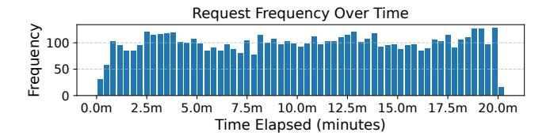
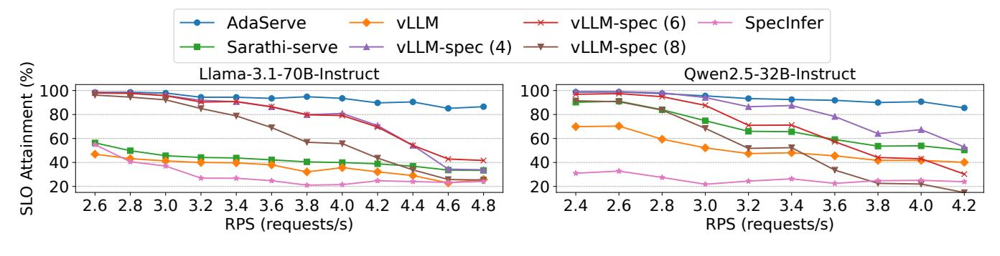
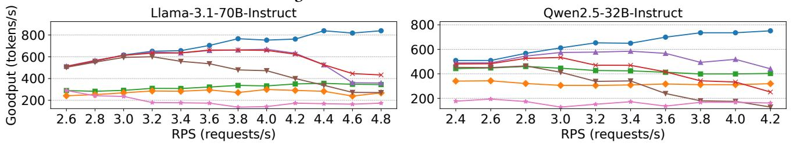
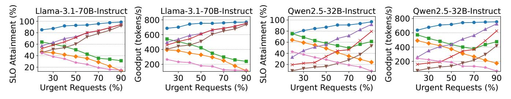
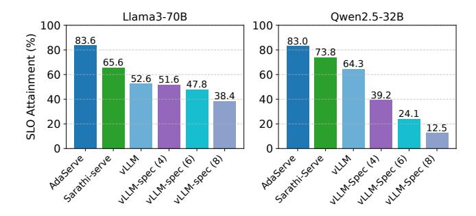
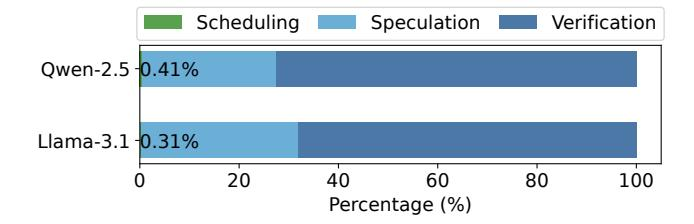

# 6 Evaluation

## 6.1 Experimental Setup

Implementation and device. We implement AdaServe on top of FlexFlow Serve [\[21\]](#page-14-16), a low-latency, high-throughput LLM serving framework. To further optimize performance, we integrate the batched prefill kernel from FlashInfer [\[57\]](#page-15-6), a high-performance kernel library for LLM serving. This kernel is adapted for both speculation steps and LLM verification. During the implementation of AdaServe, frameworks like vLLM [\[22\]](#page-14-7) and SGLang [\[59\]](#page-15-7) lacked tree attention, but with recent support added, the optimizations in AdaServe can be readily integrated into mainstream systems. All evaluations are performed on a compute node equipped with four NVIDIA A100 80GB GPUs, interconnected via NVLink. The node is powered by an AMD EPYC 7763 CPU with 64 cores (128 threads) and 256 GB of DRAM.

Models. Table [1](#page-8-1) summarizes the models, parallelism strategies, and GPU configurations used in our evaluation. This setup is applied consistently across AdaServe and all baseline systems. For speculative decoding experiments, the draft model is collocated with the base model on one of the GPUs. We use Llama3 [\[13\]](#page-13-14) and Qwen2.5 [\[56\]](#page-15-8) models, as their architectures are representative of modern LLMs. The draft model is the smallest off-the-shelf model from the same family as the base: LLaMA-3.2-1B-Instruct is used for LLaMA 3, and Qwen2.5-0.5B-Instruct for Qwen2.5. No task-specific customization is applied.

Baselines. We compare AdaServe against state-of-the-art LLM serving systems, including vLLM [\[22\]](#page-14-7), Sarathi-Serve [\[1\]](#page-13-8), vLLM augmented with speculative decoding and SpecInfer [\[33\]](#page-14-11). vLLM introduces PagedAttention [\[22\]](#page-14-7), a memory management technique that improves throughput by mitigating fragmentation. Sarathi-Serve [\[1\]](#page-13-8) leverages chunked prefill to jointly batch the prefill and decoding stages across multiple requests, enhancing hardware utilization and reducing per-token latency. We also evaluate speculative decoding baselines built on top of vLLM, which implement efficient sequence-based speculative decoding. We include variants with different speculation lengths, denoted as vLLM-Spec(), where represents the number of speculated tokens. All evaluations use the latest version of vLLM available at the time of submission (v0.8.4). While the above baselines are

| Category | Cat. 1                 | Cat. 2  | Cat. 3        |
|----------|------------------------|---------|---------------|
| App      | Coding copilot         | Chatbot | Summarization |
| SLO      | 1.2 × Baseline latency | 50ms    | 150ms         |

**Table 2.** Request categories and their SLOs.

**Figure 7.** Request frequency of the real-world trace.

built on general-purpose LLM serving systems (e.g., vLLM), we also compare AdaServe with SpecInfer [33], a state-of-the-art inference engine that natively integrates speculative decoding for low-latency LLM serving.

**Workloads.** We evaluate AdaServe using a mixture of requests from different applications, each with distinct SLO requirements, following prior work [60]. We consider requests from three categories, as summarized in Table 2. For each model, we measure a *baseline latency* when the system load is close to zero, which serves as a reference point for setting TPOT SLOs across different request categories following prior work [28, 60].

For this category, we simulate code completion tasks using prompts from the HumanEval dataset [7], which contains 164 programming problems. The SLO for this category is set to 1.2× the baseline latency, a stringent target that permits a 20% slowdown to support high-throughput serving. This SLO setting aligns with the SLO for latency-sensitive interactive applications in MLPerf v5.0 [45], which specifies 40ms per token for Llama 70B models [35, 36].

The second category includes chatbot requests. To maintain a responsive user experience, chatbots must stream tokens faster than users can consume them. While normal human reading speed is 200-300 words per minute, skimming can occur at 2-4× that rate, translating to a per-token latency requirement of slightly under 50ms [44]. Thus, we adopt 50ms per token as the SLO for this category. We use the Alpaca dataset [52] which contains 52k instruction-following examples to simulate chatbot interactions.

The third category includes tasks with relaxed latency requirements, such as LLM-based summarization, where higher TPOT SLOs are acceptable. We set the SLO to 150ms per token, consistent with prior work and benchmark settings [35, 36, 60]. For this category, we use summarization tasks from the CNN/DailyMail dataset [3], which contains news articles paired with human-written summaries.

We use the timestamps from a real-world trace from previous work, visualized in Figure 7, to generate traces in our evaluation [42]. We truncate and rescale the trace to obtain

traces with different averaged request per second (RPS). For each arriving request, we first sample its category according to a specified probability distribution and then sample a request from the dataset uniformly.

Metrics. We use SLO attainment and goodput as our primary metrics. SLO attainment is the percentage of requests in a workload that meet their SLO. Specifically, a request is considered to fulfill its SLO if its average per-token latency is no greater than the specified TPOT SLO threshold. Goodput is measured as the number of tokens generated per second for requests that successfully attain their SLO. Since AdaServe targets decoding speed SLOs and not prefill latency, we exclude TTFT from our metrics.

#### 6.2 End-to-End Comparison

Changing request arrival rate. We first evaluate the end-to-end performance of AdaServe under increasing request arrival rates by comparing AdaServe's SLO attainment and goodput against those of vLLM, Sarathi-Serve, and vLLM-Spec. The workload consists of 60% category 1 requests, 20% category 2 requests, and 20% category 3 requests. This mix represents a peak load scenario for latency-critical tasks (category 1), while workloads for categories 2 and 3 are lighter, allowing us to assess system performance under stringent task conditions.

As shown in Figure 8 and Figure 9, AdaServe consistently achieves higher SLO attainment and goodput across all models and request rates compared to the baselines, with the performance gap widening as the request rate (RPS) increases. AdaServe improves the SLO attainment by  $2.1\times$  and  $1.6\times$  over the best baseline on the two models, respectively. At the highest RPS, AdaServe reduces the number of unattained requests by  $4.3\times$  and  $3.2\times$ , respectively. In terms of goodput, AdaServe delivers  $1.9\times$  and  $1.7\times$  higher goodput than the best baseline under the two settings.

vLLM and Sarathi-Serve both struggle to meet stringent SLOs. This is primarily due to their reliance on continuous batching, which enforces a uniform TPOT SLO across all requests in a batch. As the request rate increases, the running batch size also increases, leading to higher per-token latency and lower SLO attainment. In contrast, SLO-customized speculative decoding enables AdaServe to dynamically allocate hardware resources based on individual request SLOs, allowing it to prioritize latency-critical requests. This selective prioritization leads to significantly improved SLO attainment and goodput, even with high request arrival rates.

vLLM-Spec outperforms other baselines; however, its performance degrades significantly as the request arrival rate increases. These results highlight the limitations of static speculation methods, which fail to account for diverse SLO requirements and dynamic workload variations. Specifically, vLLM-Spec adopts a fixed speculation strategy that cannot adapt to the applications' latency needs or the system's

Figure 8. SLO attainment w.r.t. RPS.

Figure 9. Goodput w.r.t. RPS.

Figure 10. SLO attainment and goodput w.r.t. urgent request proportion.

Figure 11. SLO attainment and goodput w.r.t. SLO scale.

current workload. When the workload is low, allocating only a small number of speculative tokens results in underutilization of hardware and limited performance gains. Conversely, under high-load conditions with large batch sizes, the static strategy generates too many speculated tokens, leading to high verification overhead and degraded efficiency. In contrast, AdaServe enables fine-grained distribution of hardware resources based on per-request SLOs and dynamically adjusts both the depth and width of the candidate token tree to adapt to workload changes. This adaptivity allows AdaServe to maximally utilize hardware resources, maintaining high efficiency even with large batch sizes.

SpecInfer shows consistently low performance across models and traces. This stems from its use of a static draft tree structure, which shares the same limitations as vLLM-Spec's static sequence-based speculation. In addition, SpecInfer adopts an unlimited token budget without accounting for hardware capacity: each draft token tree contains 23 tokens with no upper limit on the total number of tokens. Most of

these tokens are discarded. This wastes processing power for minimal gain, substantially reducing verification efficiency.

As shown in Figure 8 and Figure 9, AdaServe's SLO attainment also decreases as the request rate increases. This degradation is primarily due to larger batch sizes reducing the average token budget available per request, which limits the effectiveness of speculative decoding. Additionally, higher request arrival rates introduce higher prefilling overhead, making it increasingly challenging to meet SLOs.

Changing application distribution. In this evaluation, we fix the request arrival rate at 4.0 requests per second and vary the proportion of latency-stringent requests. This setup allows us to evaluate how AdaServe performs compared to baseline systems in terms of SLO attainment and goodput under different levels of workload stringency.

As shown in Figure 10, AdaServe consistently outperforms all baselines across varying proportions of latency-stringent requests. AdaServe maintains stable SLO attainment in all scenarios, while the performance of the baseline systems fluctuates significantly with workload distribution. AdaServe reduces the number of SLO violations by up to  $4.3\times$  and  $3.7\times$  compared to the best-performing baseline under the two model settings, respectively. It also achieves up to 30% and 64% higher goodput over the best baseline.

The SLO attainment and goodput of vLLM and Sarathi-Serve drop sharply as the fraction of urgent requests grows. This is because continuous batching systems can only satisfy stringent SLOs with small batch sizes. As the system accumulates more requests, batch sizes grow, increasing latency and causing SLO violations for time-sensitive requests. In contrast, vLLM-Spec and AdaServe exhibit the opposite trend. SD accelerates request processing, helping satisfy tighter SLOs even as the share of urgent requests increases. As a result, their SLO attainment remains steady or even improves under higher stringency. Although built on SD, SpecInfer exhibits the same trend as continuous batching systems due to high speculation overhead and the lack of optimized CUDA kernels and CUDAGraph, preventing it from meeting the SLOs of urgent requests.

Interestingly, both the SLO attainment and goodput of AdaServe and vLLM-Spec increase as the proportion of urgent requests rises. This is because a lower share of urgent requests corresponds to a higher share of category-3 requests (e.g., summarization) with longer contexts, which increases the prefilling overhead. vLLM-Spec, which lacks awareness of individual decoding speeds, cannot effectively mitigate this overhead. In contrast, AdaServe dynamically adapts based on each request's decoding progress and SLO, enabling smarter compute allocation and improved performance in both SLO attainment and throughput.

*Changing SLO-Scale.* In this evaluation, we fix the request rate at 4.0 RPS and set the proportion of urgent requests to 0.6. We then vary the SLO scale of the most urgent request

**Figure 12.** Mean accepted tokens per request per verification in speculative decoding.

**Figure 13.** Request arrival pattern of the synthetic trace.

relative to the baseline latency to assess each system's ability to meet increasingly strict latency requirements. As shown in Figure 11, all systems experience reduced SLO attainment and goodput as the SLO scale becomes more stringent. However, AdaServe consistently maintains the highest performance across all settings. It achieves up to  $4.61\times$  and  $3.05\times$  lower violation rates, and up to  $1.38\times$  higher goodput than the best baseline across the two evaluated models. Continuous batching-based systems fail to meet SLOs when the scale drops below 1.0, causing their SLO attainment to fall below 40%. While vLLM-Spec supports SLO scales below 1.0, it lacks the ability to prioritize urgent requests, leading to lower SLO attainment compared to AdaServe. SpecInfer struggles with stringent SLOs due to high speculation overhead and the absence of optimized CUDA kernels and CUDAGraph.

#### 6.3 Ablation and Sensitivity Study

Speculation Accuracy. We evaluate the speculation accuracy of AdaServe by measuring the average number of tokens accepted by the LLM per verification step per request. As shown in Figure 12, AdaServe achieves high acceptance rates at low RPS levels, which gradually decrease as RPS increases. This behavior aligns with our adaptive strategy for adjusting the depth and width of the candidate tree: when the workload is light, AdaServe speculates more aggressively to maximize speedup; under heavy load, it adopts a more conservative approach to reduce verification overhead. In contrast, vLLM-Spec employs a static speculation strategy, resulting in a constant average acceptance rate regardless of RPS. However, as shown in Figure 8 and Figure 9, this static approach underperforms, particularly at high RPS, demonstrating the effectiveness of AdaServe 's dynamic adaptation.

**Figure 14.** SLO attainment under the synthetic trace.

**Figure 15.** Latency breakdown of AdaServe.

**Figure 16.** SLO attainment variation as key system components are incrementally added into AdaServe.

Sensitivity to Workload Fluctuations. We evaluate system performance under workload fluctuations using a synthetic trace where different request categories peak at different times. The request arrival patterns are visualized in Figure 13. The SLO attainment is shown in Figure 14. The results highlight the strength of AdaServe in handling bursty traffic from individual applications, consistently achieving higher SLO attainment compared to baseline systems.

Latency Breakdown of SLO-customized speculative decoding. We evaluate the runtime overhead of SLO-customized speculative decoding by measuring the time spent in its three main components: speculation, selection, and verification. Speculation and verification are GPU-intensive, while selection runs on the CPU. Our primary goal is to assess the CPU overhead. As shown in Figure 15, the CPU overhead is minimal—only 0.41% and 0.31% on the two evaluated models—compared to the overall serving time. These results

demonstrate that SLO-customized speculative decoding imposes negligible overhead and is well-suited for integration into speculative decoding-based serving systems.

Breakdown of Performance Gain. We evaluate the contribution of each component in AdaServe. The baseline, Equal Scheduling, distributes the token budget evenly across all requests in the batch without accounting for heterogeneous SLOs. Within each request, the token tree is constructed greedily. As shown in Figure 16, Equal Scheduling yields low SLO attainment. Incorporating SLO awareness through SLO-customized token selection raises SLO attainment to around 80%. Since SLO-customized selection does not fully utilize the token budget, combining it with throughput-optimized token selection further improves attainment. Finally, enabling CUDAGraph reduces kernel launch overhead, better utilizing hardware resources and pushing SLO attainment above 90%. These results demonstrate the effectiveness of the individual components and optimizations in AdaServe.

*Overhead of Small Models.* The speculation phase takes  $\sim 5$ ms per step for Llama-3.2-1B and  $\sim 4$ ms per step for Qwen2.5-0.5B. These small models are lightweight—Llama-3.2-1B uses 2GB of VRAM vs. 140GB for Llama-3.1-70B, and Qwen2.5-0.5B uses 1GB vs. 64GB for Qwen2.5-32B.

#### 7 Related Work

**LLM serving systems.** A wide range of systems have been proposed to enhance the efficiency and scalability of LLM serving [1, 18, 22, 31, 32, 34, 38, 40, 42, 43, 48, 58-60]. Orca [58] introduces continuous batching, allowing new requests to join an ongoing batch without waiting for its completion-a technique now standard in modern serving systems. vLLM [22] identifies GPU memory fragmentation as a key throughput bottleneck and addresses it with PagedAttention, which organizes memory in pages to reduce fragmentation. Several systems optimize the scheduling of the prefill and decode stages [1, 42, 60]. Splitwise [42] and Dist-Serve [60] observe distinct hardware utilization patterns in these stages and propose executing them on separate nodes to better utilize resources. Sarathi-Serve [1], by contrast, notes that prefill is compute-intensive while decode often underutilizes compute resource, and improves efficiency by co-batching requests from both stages. Another optimization is prefix caching, motivated by prompt repetition in multiturn interactions [43, 59]. This technique caches KV states of frequently reused prefixes in GPU memory to reduce latency. These approaches are largely orthogonal and complementary to AdaServe, which focuses on multi-SLO LLM serving—an area that remains underexplored in existing systems.

*Speculative decoding (SD).* A variety of algorithms have been proposed to determine the topology of the token tree in SD. Early approaches [5, 25, 33] use a fixed tree structure

for each iteration. More recent methods [26, 39] enable adaptive tree construction. Sequoia [9] adjusts tree size based on hardware specifications and applies dynamic programming to determine a global tree structure. In contrast, Eagle-2 [24] constructs the tree based on input context: the draft model performs beam search to propose a candidate tree and selects the top-m tokens with the highest global acceptance rates. Unlike prior work, AdaServe addresses both tree construction and the fine-grained allocation of hardware resources across requests with diverse needs. It also dynamically adjusts the speculative configuration under varying workloads.

Recent efforts have explored SD in dynamic online serving settings. SmartSpec [30] adaptively tunes draft sequence lengths based on workload and acceptance rates. SpecServe [19] incorporates service-level objectives (SLOs) into the scheduling process. However, neither supports tree-based decoding or accounts for heterogeneous request demands. A concurrent work [8] addresses the multi-SLO challenge using dynamic programming to schedule SD. In contrast, SLO-customized speculative decoding in AdaServe employs a lower-complexity, tree-based approach that improves performance. To our knowledge, AdaServe is the first to address multi-SLO serving using batched, tree-based SD to intelligently allocate compute resources across diverse requests.

#### 8 Conclusion

To address the growing demand for serving LLM requests with diverse service-level objectives (SLOs), this paper presents AdaServe, the first LLM serving system explicitly designed for multi-SLO serving. We formalize the multi-SLO serving problem and identify key limitations in existing approaches based on continuous batching and conventional speculative decoding. To overcome these challenges, we propose a theoretically optimal algorithm for constructing token trees that balance SLO attainment and system throughput. Building on this foundation, we develop SLO-customized speculative decoding, a practical and efficient solution that incorporates four stages: speculation, SLO-customized selection, throughput-optimized selection, and verification. We implement SLO-customized speculative decoding within AdaServe and evaluate its performance across a range of multi-SLO workloads. Our results show that AdaServe significantly outperforms state-of-the-art LLM serving systems, achieving higher SLO satisfaction and better goodput across diverse application scenarios.

## Acknowledgment

We thank the anonymous reviewers and our shepherd, Cheng Tan, for their valuable feedback and constructive suggestions, which helped improve the paper. This research is supported by NSF awards CNS-2211882 and CNS-2239351, and research awards from Amazon, Cisco, Google, Meta, NVIDIA, Oracle,

Qualcomm, and Samsung. The views and conclusions contained in this document are those of the authors and should not be interpreted as representing the official policies, either expressed or implied, of any sponsoring institution, the U.S. government or any other entity.

#### References

-  Amey Agrawal, Nitin Kedia, Ashish Panwar, Jayashree Mohan, Nipun Kwatra, Bhargav S Gulavani, Alexey Tumanov, and Ramachandran Ramjee. Taming throughput-latency tradeoff in llm inference with sarathi-serve. arXiv preprint arXiv:2403.02310, 2024.
- [2] Anthropic. Claude 3.5. https://www.anthropic.com/news/claude-3-5sonnet. (Accessed on 10/11/2024).
- [3] Yushi Bai, Xin Lv, Jiajie Zhang, Hongchang Lyu, Jiankai Tang, Zhidian Huang, Zhengxiao Du, Xiao Liu, Aohan Zeng, Lei Hou, et al. Longbench: A bilingual, multitask benchmark for long context understanding. arXiv preprint arXiv:2308.14508, 2023.
- [4] Marc Brysbaert. How many words do we read per minute? a review and meta-analysis of reading rate. Journal of memory and language, 109:104047, 2019.
- [5] Tianle Cai, Yuhong Li, Zhengyang Geng, Hongwu Peng, Jason D Lee, Deming Chen, and Tri Dao. Medusa: Simple Ilm inference acceleration framework with multiple decoding heads. arXiv preprint arXiv:2401.10774, 2024.
- [6] Charlie Chen, Sebastian Borgeaud, Geoffrey Irving, Jean-Baptiste Lespiau, Laurent Sifre, and John Jumper. Accelerating large language model decoding with speculative sampling. arXiv preprint arXiv:2302.01318, 2023.
- [7] Mark Chen, Jerry Tworek, Heewoo Jun, Qiming Yuan, Henrique Ponde De Oliveira Pinto, Jared Kaplan, Harri Edwards, Yuri Burda, Nicholas Joseph, Greg Brockman, et al. Evaluating large language models trained on code. arXiv preprint arXiv:2107.03374, 2021.
- [8] Siyuan Chen, Zhipeng Jia, Samira Khan, Arvind Krishnamurthy, and Phillip B Gibbons. Slos-serve: Optimized serving of multi-slo llms. arXiv preprint arXiv:2504.08784, 2025.
-  Zhuoming Chen, Avner May, Ruslan Svirschevski, Yuhsun Huang, Max Ryabinin, Zhihao Jia, and Beidi Chen. Sequoia: Scalable, robust, and hardware-aware speculative decoding. arXiv preprint arXiv:2402.12374, 2024
- [10] David Cheney. How github copilot serves 400 million completion requests a day, 2025.
- [11] Wei-Lin Chiang, Zhuohan Li, Zi Lin, Ying Sheng, Zhanghao Wu, Hao Zhang, Lianmin Zheng, Siyuan Zhuang, Yonghao Zhuang, Joseph E. Gonzalez, Ion Stoica, and Eric P. Xing. Vicuna: An open-source chatbot impressing gpt-4 with 90%\* chatgpt quality, March 2023.
- [12] Xin Luna Dong, Seungwhan Moon, Yifan Ethan Xu, Kshitiz Malik, and Zhou Yu. Towards next-generation intelligent assistants leveraging llm techniques. In Proceedings of the 29th ACM SIGKDD Conference on Knowledge Discovery and Data Mining, pages 5792–5793, 2023.
- [13] Abhimanyu Dubey, Abhinav Jauhri, Abhinav Pandey, Abhishek Kadian, Ahmad Al-Dahle, Aiesha Letman, Akhil Mathur, Alan Schelten, Amy Yang, Angela Fan, et al. The llama 3 herd of models. arXiv preprint arXiv:2407.21783, 2024.
- [14] Yichao Fu, Peter Bailis, Ion Stoica, and Hao Zhang. Break the sequential dependency of llm inference using lookahead decoding. In Forty-first International Conference on Machine Learning.
- [15] Google DeepMind. Gemini pro. https://deepmind.google/technologies/gemini/pro/. (Accessed on 10/11/2024).
- [16] Alan Gray. Getting started with cuda graphs, September 2019.
- [17] Daya Guo, Dejian Yang, Haowei Zhang, Junxiao Song, Ruoyu Zhang, Runxin Xu, Qihao Zhu, Shirong Ma, Peiyi Wang, Xiao Bi, et al. Deepseek-r1: Incentivizing reasoning capability in llms via reinforcement learning. arXiv preprint arXiv:2501.12948, 2025.

- [18] Connor Holmes, Masahiro Tanaka, Michael Wyatt, Ammar Ahmad Awan, Jeff Rasley, Samyam Rajbhandari, Reza Yazdani Aminabadi, Heyang Qin, Arash Bakhtiari, Lev Kurilenko, et al. Deepspeed-fastgen: High-throughput text generation for llms via mii and deepspeed-inference. arXiv preprint arXiv:2401.08671, 2024.
- [19] Kaiyu Huang, Hao Wu, Zhubo Shi, Han Zou, Minchen Yu, and Qingjiang Shi. Specserve: Efficient and slo-aware large language model serving with adaptive speculative decoding. arXiv preprint arXiv:2503.05096, 2025.
- [20] Aaron Jaech, Adam Kalai, Adam Lerer, Adam Richardson, Ahmed El-Kishky, Aiden Low, Alec Helyar, Aleksander Madry, Alex Beutel, Alex Carney, et al. Openai o1 system card. arXiv preprint arXiv:2412.16720, 2024.
- [21] Zhihao Jia, Matei Zaharia, and Alex Aiken. Beyond data and model parallelism for deep neural networks. In Proceedings of the 2nd Conference on Systems and Machine Learning, SysML'19, 2019.
- [22] Woosuk Kwon, Zhuohan Li, Siyuan Zhuang, Ying Sheng, Lianmin Zheng, Cody Yu, Joseph E Gonzalez, Hao Zhang, and Ion Stoica. vllm: Easy, fast, and cheap llm serving with pagedattention. See https://vllm.ai/ (accessed 9 August 2023), 2023.
- [23] Yaniv Leviathan, Matan Kalman, and Yossi Matias. Fast inference from transformers via speculative decoding. arXiv preprint arXiv:2211.17192, 2022.
- [24] Yuhui Li, Fangyun Wei, Chao Zhang, and Hongyang Zhang. Eagle-2: Faster inference of language models with dynamic draft trees. arXiv preprint arXiv:2406.16858, 2024.
- [25] Yuhui Li, Fangyun Wei, Chao Zhang, and Hongyang Zhang. Eagle: Speculative sampling requires rethinking feature uncertainty, 2024.
- [26] Yuhui Li, Fangyun Wei, Chao Zhang, and Hongyang Zhang. Eagle-3: Scaling up inference acceleration of large language models via trainingtime test, 2025.
- [27] Yujia Li, David Choi, Junyoung Chung, Nate Kushman, Julian Schrittwieser, Rémi Leblond, Tom Eccles, James Keeling, Felix Gimeno, Agustin Dal Lago, et al. Competition-level code generation with alphacode. Science, 378(6624):1092–1097, 2022.
- [28] Zhuohan Li, Lianmin Zheng, Yinmin Zhong, Vincent Liu, Ying Sheng, Xin Jin, Yanping Huang, Zhifeng Chen, Hao Zhang, Joseph E Gonzalez, et al. {AlpaServe}: Statistical multiplexing with model parallelism for deep learning serving. In 17th USENIX Symposium on Operating Systems Design and Implementation (OSDI 23), pages 663–679, 2023.
- [29] Jiachen Liu, Zhiyu Wu, Jae-Won Chung, Fan Lai, Myungjin Lee, and Mosharaf Chowdhury. Andes: Defining and enhancing qualityof-experience in llm-based text streaming services. arXiv preprint arXiv:2404.16283. 2024.
- [30] Xiaoxuan Liu, Cade Daniel, Langxiang Hu, Woosuk Kwon, Zhuohan Li, Xiangxi Mo, Alvin Cheung, Zhijie Deng, Ion Stoica, and Hao Zhang. Optimizing speculative decoding for serving large language models using goodput, 2024.
- [31] Yixuan Mei, Yonghao Zhuang, Xupeng Miao, Juncheng Yang, Zhihao Jia, and Rashmi Vinayak. Helix: Serving large language models over heterogeneous gpus and network via max-flow. *arXiv preprint arXiv:2406.01566*, 2024.
- [32] Xupeng Miao, Gabriele Oliaro, Zhihao Zhang, Xinhao Cheng, Hongyi Jin, Tianqi Chen, and Zhihao Jia. Towards efficient generative large language model serving: A survey from algorithms to systems. arXiv preprint arXiv:2312.15234, 2023.
- [33] Xupeng Miao, Gabriele Oliaro, Zhihao Zhang, Xinhao Cheng, Zeyu Wang, Zhengxin Zhang, Rae Ying Yee Wong, Alan Zhu, Lijie Yang, Xiaoxiang Shi, et al. Specinfer: Accelerating large language model serving with tree-based speculative inference and verification. In Proceedings of the 29th ACM International Conference on Architectural Support for Programming Languages and Operating Systems, Volume 3, pages 932–949, 2024.

- [34] Xupeng Miao, Chunan Shi, Jiangfei Duan, Xiaoli Xi, Dahua Lin, Bin Cui, and Zhihao Jia. Spotserve: Serving generative large language models on preemptible instances. arXiv preprint arXiv:2311.15566, 2023
- [35] MLCommons. Mlperf inference: Datacenter, 2025.
- [36] MLCommons. Mlperf inference v5.0 advances language model capabilities for genai, 2025.
- [37] Avanika Narayan, Ines Chami, Laurel Orr, Simran Arora, and Christopher Ré. Can foundation models wrangle your data? arXiv preprint arXiv:2205.09911, 2022.
- [38] NVIDIA. Tensorrt-llm. https://nvidia.github.io/TensorRT-LLM/index. html. (Accessed on 10/11/2024).
- [39] Gabriele Oliaro, Zhihao Jia, Daniel Campos, and Aurick Qiao. Suffixdecoding: A model-free approach to speeding up large language model inference. 2024.
- [40] Gabriele Oliaro, Xupeng Miao, Xinhao Cheng, Vineeth Kada, Ruohan Gao, Yingyi Huang, Remi Delacourt, April Yang, Yingcheng Wang, Mengdi Wu, et al. Flexllm: A system for co-serving large language model inference and parameter-efficient finetuning. arXiv preprint arXiv:2402.18789, 2024.
- [41] OpenAI. Gpt-4o. https://openai.com/index/hello-gpt-4o/. (Accessed on 10/11/2024).
- [42] Pratyush Patel, Esha Choukse, Chaojie Zhang, Aashaka Shah, Íñigo Goiri, Saeed Maleki, and Ricardo Bianchini. Splitwise: Efficient generative llm inference using phase splitting. In 2024 ACM/IEEE 51st Annual International Symposium on Computer Architecture (ISCA), pages 118– 132. IEEE, 2024.
- [43] Ruoyu Qin, Zheming Li, Weiran He, Mingxing Zhang, Yongwei Wu, Weimin Zheng, and Xinran Xu. Mooncake: Kimi's kvcache-centric architecture for llm serving. arXiv preprint arXiv:2407.00079, 2024.
- [44] Keith Rayner, Elizabeth R Schotter, Michael EJ Masson, Mary C Potter, and Rebecca Treiman. So much to read, so little time: How do we read, and can speed reading help? Psychological Science in the Public Interest, 17(1):4–34, 2016.
- [45] Vijay Janapa Reddi, Christine Cheng, David Kanter, Peter Mattson, Guenther Schmuelling, Carole-Jean Wu, Brian Anderson, Maximilien Breughe, Mark Charlebois, William Chou, et al. Mlperf inference benchmark. In 2020 ACM/IEEE 47th Annual International Symposium on Computer Architecture (ISCA), pages 446–459. IEEE, 2020.
- [46] Baptiste Roziere, Jonas Gehring, Fabian Gloeckle, Sten Sootla, Itai Gat, Xiaoqing Ellen Tan, Yossi Adi, Jingyu Liu, Romain Sauvestre, Tal Remez, et al. Code llama: Open foundation models for code. arXiv preprint arXiv:2308.12950, 2023.
- [47] Ying Sheng, Shiyi Cao, Dacheng Li, Banghua Zhu, Zhuohan Li, Danyang Zhuo, Joseph E Gonzalez, and Ion Stoica. Fairness in serving large language models. In 18th USENIX Symposium on Operating Systems Design and Implementation (OSDI 24), pages 965–988, 2024.
- [48] Ying Sheng, Lianmin Zheng, Binhang Yuan, Zhuohan Li, Max Ryabinin, Daniel Y. Fu, Zhiqiang Xie, Beidi Chen, Clark Barrett, Joseph E. Gonzalez, Percy Liang, Christopher Ré, Ion Stoica, and Ce Zhang. Flexgen: High-throughput generative inference of large language models with a single gpu, 2023.
- [49] Jovan Stojkovic, Chaojie Zhang, Íñigo Goiri, Josep Torrellas, and Esha Choukse. Dynamollm: Designing llm inference clusters for performance and energy efficiency. arXiv preprint arXiv:2408.00741, 2024.
- [50] Ziteng Sun, Ananda Theertha Suresh, Jae Hun Ro, Ahmad Beirami, Himanshu Jain, and Felix Yu. Spectr: Fast speculative decoding via optimal transport. Advances in Neural Information Processing Systems, 36, 2024.
- [51] Maxim Tabachnyk and Stoyan Nikolov. Ml-enhanced code completion improves developer productivity, 2022.
- [52] Rohan Taori, Ishaan Gulrajani, Tianyi Zhang, Yann Dubois, Xuechen Li, Carlos Guestrin, Percy Liang, and Tatsunori B. Hashimoto. Stanford alpaca: An instruction-following llama model. https://github.com/

- [tatsu-lab/stanford\\_alpaca](https://github.com/tatsu-lab/stanford_alpaca), 2023.
- [53] Minh Duc Vu, Han Wang, Zhuang Li, Jieshan Chen, Shengdong Zhao, Zhenchang Xing, and Chunyang Chen. Gptvoicetasker: Llm-powered virtual assistant for smartphone. arXiv preprint arXiv:2401.14268, 2024.
- [54] Bingyang Wu, Yinmin Zhong, Zili Zhang, Shengyu Liu, Fangyue Liu, Yuanhang Sun, Gang Huang, Xuanzhe Liu, and Xin Jin. Fast distributed inference serving for large language models. arXiv preprint arXiv:2305.05920, 2023.
- [55] Heming Xia, Tao Ge, Si-Qing Chen, Furu Wei, and Zhifang Sui. Speculative decoding: Lossless speedup of autoregressive translation.
- [56] An Yang, Baosong Yang, Beichen Zhang, Binyuan Hui, Bo Zheng, Bowen Yu, Chengyuan Li, Dayiheng Liu, Fei Huang, Haoran Wei, et al. Qwen2. 5 technical report. arXiv preprint arXiv:2412.15115, 2024.
- [57] Zihao Ye, Lequn Chen, Ruihang Lai, Yilong Zhao, Size Zheng, Junru Shao, Bohan Hou, Hongyi Jin, Yifei Zuo, Liangsheng Yin, Tianqi Chen, and Luis Ceze. Accelerating self-attentions for llm serving with flashinfer, February 2024.
- [58] Gyeong-In Yu, Joo Seong Jeong, Geon-Woo Kim, Soojeong Kim, and Byung-Gon Chun. Orca: A distributed serving system for Transformer-Based generative models. In 16th USENIX Symposium on Operating Systems Design and Implementation (OSDI 22), pages 521–538, Carlsbad, CA, July 2022. USENIX Association.
- [59] Lianmin Zheng, Liangsheng Yin, Zhiqiang Xie, Jeff Huang, Chuyue Sun, Cody Hao Yu, Shiyi Cao, Christos Kozyrakis, Ion Stoica, Joseph E Gonzalez, et al. Efficiently programming large language models using sglang. arXiv preprint arXiv:2312.07104, 2023.
- [60] Yinmin Zhong, Shengyu Liu, Junda Chen, Jianbo Hu, Yibo Zhu, Xuanzhe Liu, Xin Jin, and Hao Zhang. Distserve: Disaggregating prefill and decoding for goodput-optimized large language model serving. arXiv preprint arXiv:2401.09670, 2024.
- [61] Yongchao Zhou, Kaifeng Lyu, Ankit Singh Rawat, Aditya Krishna Menon, Afshin Rostamizadeh, Sanjiv Kumar, Jean-François Kagy, and Rishabh Agarwal. Distillspec: Improving speculative decoding via knowledge distillation. arXiv preprint arXiv:2310.08461, 2023.

## A Expected Number of Accepted Tokens

Let  $n_{acc}$  denote the number of accepted tokens in a verification process. Define  $p_i$  as the probability of token i being accepted. The average acceptance rate across the n tokens in the verification batch is given by  $p = \frac{\sum_{i=1}^{n} p_i}{n}$ . We can compute the expected number of accepted tokens as follows:

$$E[n_{acc}] = E[\sum_{i=1}^{n} \mathbf{1}(\text{token i is accepted})]$$
 (10)

$$= \sum_{i=1}^{n} E[\mathbf{1}(\text{token i is accepted})]$$
 (11)

$$=\sum_{i=1}^{n} p_i \tag{12}$$

$$= np \tag{13}$$

The acceptance probability  $p_i$  decreases exponentially with the depth of token i in the speculation tree. Moreover, for tokens sharing the same parent node in the token tree, their acceptance probabilities sum to 1. Consequently, given a fixed number of requests in the batch, increasing the number of tokens n in the verification process leads to a lower average acceptance rate p.

## **B** Proof for Connectivity

*Proof.* In this proof, we demonstrate that the output nodes of an iterative greedy algorithm selecting nodes with the highest values on a token tree form a valid tree.

Language models assign a probability less than 1 to each token given an input token sequence. Therefore, for any node v in the token tree (except for the root node), we have:

where parent(v) denotes the parent of node v in the token tree.

The iterative greedy algorithm ensures that when a node v is selected, all nodes v' with f(v') > f(v) have already been selected, including parent(v). Consequently, when a node is selected, its parent is guaranteed to have been selected beforehand.

We prove that the selected nodes are connected using induction:

- 1. *Base Case*: The root node is selected first because it has the highest value (f(root) = 1 > f(v)) for all other nodes v).
- 2. *Inductive Step*: Assume that at step n-1, the selected nodes are connected. For a node v at step n, the algorithm ensures that parent(v) is selected before v, f(parent(v)) > f(v). Thus, v is connected to the selected nodes.

By induction, all selected nodes collectively form a valid, connected tree.

