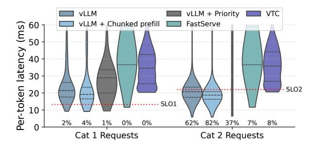
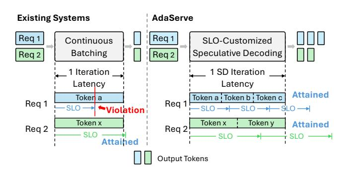
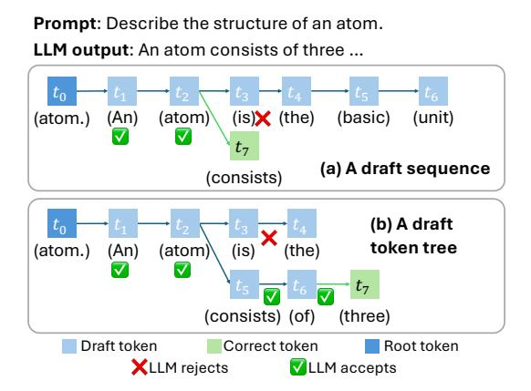
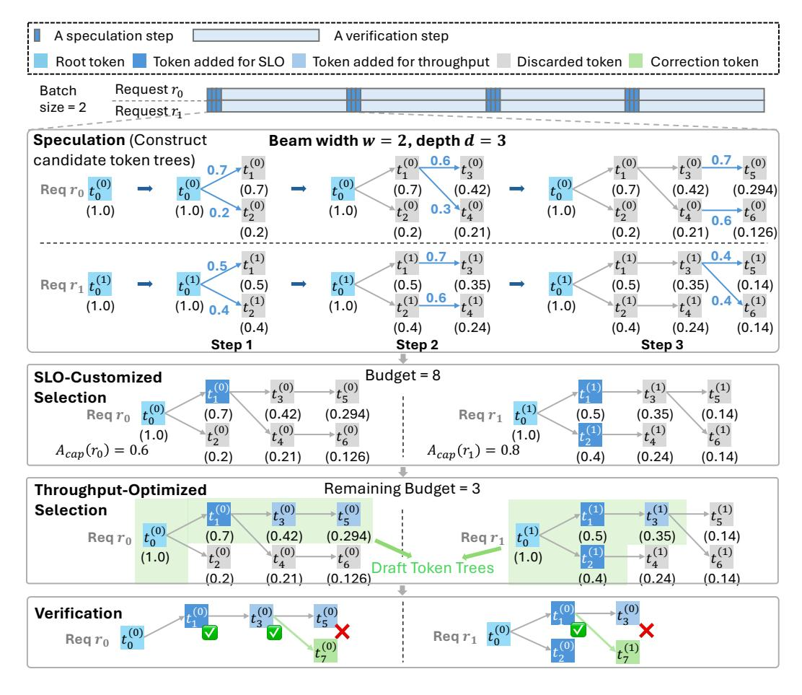

# AdaServe: Accelerating Multi-SLO LLM Serving with SLO-Customized Speculative Decoding

Zikun Li\* Carnegie Mellon University USA

Gabriele Oliaro Carnegie Mellon University USA

Shuhuai Lin Carnegie Mellon University USA

Zhuoming Chen Carnegie Mellon University USA Zhuofu Chen\*† Princeton University USA

Zeyu Wang Carnegie Mellon University USA

April Yang Carnegie Mellon University USA

Yi-Hsiang Lai Amazon Web Services USA Remi Delacourt EPFL Switzerland

Qinghan Chen Carnegie Mellon University USA

Zhihao Zhang Carnegie Mellon University USA

Xinhao Cheng Carnegie Mellon University USA

Xupeng Miao Purdue University USA Zhihao Jia Carnegie Mellon University Amazon Web Services USA

#### **Abstract**

Modern large language model (LLM) applications exhibit diverse service-level objectives (SLOs), from low-latency requirements in interactive coding assistants to more relaxed constraints in data wrangling tasks. Existing LLM serving systems, which rely on uniform batching and scheduling strategies, often fail to meet these heterogeneous SLOs concurrently. We present AdaServe, the first LLM serving system designed to support efficient multi-SLO serving through SLO-customized speculative decoding. AdaServe formulates multi-SLO serving as a constrained optimization problem and introduces a hardware-aware algorithm that constructs a speculation tree tailored to each request's latency target. It features a speculate-select-verify pipeline that enables fine-grained control over decoding speed while maximizing system throughput. AdaServe further adapts to workload variation by dynamically adjusting speculation parameters. Evaluations across diverse workloads show that AdaServe reduces SLO violations by up to 4.3× and improves goodput

 $<sup>^\</sup>dagger \text{Work}$  done during internship at Carnegie Mellon University.


This work is licensed under a Creative Commons Attribution-NonCommercial-NoDerivatives 4.0 International License.

 $EUROSYS~{\it '26}, Edinburgh, Scotland~Uk$ 

© 2026 Copyright held by the owner/author(s). ACM ISBN 979-8-4007-2212-7/26/04 https://doi.org/10.1145/3767295.3769315 by up to 1.9× compared to the best-performing baselines,

highlighting its effectiveness in multi-SLO serving.

CCS Concepts: • Computing methodologies  $\rightarrow$  Artificial intelligence; Parallel computing methodologies; • Information systems  $\rightarrow$  Computing platforms.

**Keywords:** Large Language Model Serving, Speculative Decoding, Generative AI

## **ACM Reference Format:**

Zikun Li, Zhuofu Chen, Remi Delacourt, Gabriele Oliaro, Zeyu Wang, Qinghan Chen, Shuhuai Lin, April Yang, Zhihao Zhang, Zhuoming Chen, Yi-Hsiang Lai, Xinhao Cheng, Xupeng Miao, and Zhihao Jia. 2026. AdaServe: Accelerating Multi-SLO LLM Serving with SLO-Customized Speculative Decoding. In 21st European Conference on Computer Systems (EUROSYS '26), April 27–30, 2026, Edinburgh, Scotland Uk. ACM, New York, NY, USA, 20 pages. https://doi.org/10.1145/3767295.3769315

#### 1 Introduction

Large language models (LLMs) such as ChatGPT, Gemini and Claude have revolutionized various applications including conversational chatbots [2, 11, 15, 41], code generation tools [7, 27, 46], and virtual assistants [12, 53]. Despite these advances, deploying LLMs in real-world settings remains challenging, particularly in ensuring timely and reliable responses under varying operational conditions. Modern industrial LLMs are trained to support an increasingly diverse range of applications. These applications exhibit varying service-level objectives (SLOs), driven by user expectations

1

<sup>\*</sup>Contributed equally.

and operational contexts. For example, LLM-powered chatbots must deliver text responses at rates slightly exceeding human reading speed, approximately 10 tokens per second [4, 29, 60]. In contrast, coding copilots require much faster responses—producing tens of tokens within 400ms—to ensure seamless interactions [10, 51]. Furthermore, emerging applications in complex reasoning [17, 20] and data wrangling [37] can tolerate higher latencies, as they prioritize depth and result quality over immediacy.

The diverse SLOs of various LLM applications present substantial challenges for LLM serving infrastructures. Existing systems typically employ a *uniform* serving strategy, treating incoming requests homogeneously without considering their specific SLOs. State-of-the-art systems like vLLM [22] and TensorRT-LLM [38] leverage *continuous batching* to improve throughput and GPU utilization by batching tokens from different requests [58]. This method schedules execution at the iteration granularity, resulting in uniform per-token latency across batched requests. As shown in Figure 2, existing systems using continuous batching for multi-SLO LLM serving may violate the stringent SLOs.

Enhancing serving systems to deliver smoother and faster user experiences in online inference has become a central focus of recent research, with many works proposing techniques to improve the SLO attainment of continuous batching. For example, Sarathi-Serve [1] introduces chunked-prefill, partitioning long prefill requests into smaller segments to reduce Time-to-First-Token (TTFT). FastServe [54] employs preemptive scheduling to mitigate latency from long sequences. VTC [47] ensures fair scheduling by tracking processed tokens for each service and prioritizing under-served requests. Despite advances in capacity, adaptivity, and fairness, existing approaches lack explicit mechanisms to accommodate concurrent, heterogeneous SLOs and, as shown in Figure 1, consistently fail to prioritize stricter requests.

Optimizing continuous batching alone cannot resolve its structural limitation in multi-SLO serving, as iteration-level scheduling enforces uniform per-token latency. A deeper challenge arises from the inherent tradeoff between latency and throughput: satisfying tight SLOs requires restricting batch sizes, which reduces throughput, increases congestion, and ultimately degrades overall SLO attainment across request categories. For example, vLLM+Priority attempts to address urgent requests by constraining batch sizes and preempting non-urgent requests during decoding, but as shown in Figure 1, this approach further worsens SLO attainment.

High-volume multi-SLO serving requires decoupling serving throughput from per-request latency—a constraint inherent to continuous batching that must be overcome. Achieving this decoupling calls for a new paradigm. *Speculative decoding* (SD) [6, 23, 33], recently proposed in the literature, fully exploits under-utilized hardware resources to speculatively decode future tokens, thereby enabling adaptive control of

<span id="page-1-1"></span>

**Figure 1.** Existing systems cannot efficiently support multi-SLO LLM serving.

<span id="page-1-0"></span>

**Figure 2.** Comparing AdaServe and existing systems with continuous batching.

per-request latency without sacrificing throughput and offering a suitable path toward multi-SLO serving. Specifically, SD predicts multiple output tokens at once during the speculation phase, trading potential inaccuracies for substantial gains in efficiency. This process is followed by a single verification step using the LLM to simultaneously verify the correctness of the output tokens to ensure lossless generation. Unlike continuous batching and its derivatives, which conform to the conventional auto-regressive decoding model with its per-token iterative processing, speculative decoding alternates between speculation and verification phases, potentially producing multiple tokens in one step. This distinct decoding mechanism breaks the intrinsic per-token latency limitations of traditional methods, providing opportunities to dynamically allocate computational resources among batched requests, thereby more effectively meeting the diverse SLO requirements of multiple requests within the same batch.

However, integrating speculative decoding in multi-SLO LLM serving systems presents three key challenges.

Quantifying hardware processing power. Processing power of modern GPUs significantly influences the maximum number of tokens from all requests that can be verified in parallel, therefore impacting the overall throughput of the serving system. This capacity varies with hardware specifications; however, existing SD methods lack designs optimized for high-throughput serving and often overlook this aspect.

Fine-grained control of decoding speed. Existing SD methods generally focus on maximizing decoding speed. However, within the context of multi-SLO serving, the primary objectives are SLO attainment. Instead of maximizing decoding speed for individual requests, it is critical to modulate the decoding rate to use minimal hardware resources while maximally sustaining the SLOs of individual requests, therefore maximizing overall system performance.

Adapting to fluctuating workloads. Existing SD methods typically adopt a static speculation strategy [33], assuming a fixed workload and uniform performance objectives. However, in multi-SLO serving scenarios, the workload of different applications—as well as the distribution of requests with varying SLO requirements—can change significantly over time [49]. These dynamics alter the optimal tradeoff between speculation aggressiveness and speedup in SD.

To address these challenges, we propose AdaServe, the first system designed to support efficient and adaptive multi-SLO LLM serving. AdaServe is hardware-aware, utilizing profiling-based roofline models to quantify the available hardware processing power on different GPU platforms. To fully utilize the hardware capability, we introduce an algorithm that constructs theoretically *optimal* draft token trees for all requests. This algorithm ensures that each request is served at the appropriate decoding speed to meet its individual SLO while maximizing overall system throughput.

Building on this foundation, we propose *SLO-customized* speculative decoding, a practical variant of the optimal algorithm tailored to real-world deployment constraints. SLO-customized speculative decoding uses the speculator to estimate the probability of each token being verified by the LLM and constructs a near-optimal token tree for each request based on these estimates. It adopts a speculate-select-verify pipeline: the speculator first generates a candidate token tree for each request; AdaServe then selects the subset of tokens to verify with the LLM. This decoupling of speculation and selection significantly reduces the overhead of draft model decoding. Finally, AdaServe dynamically tunes the speculation parameters based on the system load, allowing it to smoothly adapt to changes in request distribution and workload intensity over time.

We have conducted extensive evaluations to compare AdaServe with existing LLM serving systems across workloads from diverse services and applications. The results show that AdaServe consistently outperforms all baselines. Specifically, AdaServe achieves up to 4.3× reduction in SLO violation rate and 1.9× higher goodput over the best baseline. Moreover, as the proportion of requests with strict SLOs increases, AdaServe maintains high SLO attainment, achieving up to 1.5× higher SLO satisfaction and 64% higher goodput relative to the best competing system. Finally, when serving requests with strict Time-Per-Output-Token (TPOT) SLO requirements, AdaServe achieves up to 1.38× higher goodput

<span id="page-2-0"></span>

**Figure 3.** Speculative decoding accelerates LLM inference.

<span id="page-2-1"></span>

Figure 4. Draft sequence and draft token tree.

than the best baseline, demonstrating a significant improvement in the latency-throughput tradeoff.

## 2 Background

LLM serving. Most modern LLMs are based on the Transformer architecture and generate tokens in an auto-regressive fashion. In each inference forward pass—referred to as a decoding iteration—the model consumes the entire input sequence and produces a single new token. This newly generated token is then appended to the input sequence for the next iteration. During each decoding iteration, only one token is produced, yet the entire model must be loaded from device memory. This results in memory-bound execution that under-utilizes GPU's compute resources and motivates batching to promote GPU utilization. Current LLM serving systems—such as vLLM [22], TensorRT-LLM [38] and Sarathi-Serve [1]—adopt continuous batching, which allows sequences to enter and leave the batch at each iteration, further increasing GPU utilization.

However, these systems struggle to support multi-SLO serving with both high SLO attainment and throughput due to two key limitations. First, continuous batching treats all requests uniformly, making it difficult to customize service for individual SLOs. Second, strict latency requirements favor small batch sizes, limiting parallelism and GPU utilization. Conversely, increasing batch size improves throughput but sacrifices latency, reducing the ability to meet tight SLOs.

**Speculative decoding.** Speculative decoding (SD) is a technique for accelerating LLM inference by enabling multiple tokens to be generated in a single decoding iteration [6, 23, 33, 55]. It uses a smaller and faster *draft model* to predict multiple candidate tokens for each request. These candidates are then verified in parallel using the full LLM in a single verification iteration [5, 14, 25, 33].

As illustrated in Figure 3, SD consists of two phases: *speculation*, where the drafter proposes token candidates, and *verification*, where the LLM checks their correctness. SD reduces per-token latency by shifting some computation to the smaller model and exploiting the underutilized compute resources of the memory-bound LLM. Verification is performed in parallel and typically incurs minimal additional latency compared to a standard decoding iteration [9].

In SD, the draft is not restricted to a linear token sequence; it can also take the form of a *draft token tree*, as illustrated in Figure 4. Tree-based speculation generalizes sequence-based drafting by offering multiple candidates per position, thereby improving speculation success rates [5, 9, 33]. The root of the draft token tree is the last generated token (or prompt token if no tokens have been generated). Each node in the tree represents a token, and paths from the root correspond to possible continuation sequences [5, 9, 24, 33]. The LLM verifies all tokens in the tree in parallel, and the length of the accepted path determines the decoding speedup achieved in that iteration.

#### <span id="page-3-2"></span>3 Problem Formulation

We now formulate the multi-SLO LLM serving problem. In each decoding iteration, given a batch of requests and the token budget—the total number of tokens to verify in this decoding iteration<sup>1</sup>—the goal of multi-SLO serving is twofold: (1) to meet the various TPOT SLO requirements of different requests in the batch and (2) to maximize the number of tokens accepted by the LLM during verification.

Formally, given a batch of n requests, denoted as  $\{r_1, \ldots, r_n\}$ , and the total token budget B, the goal is to construct n token trees  $\{T_1, \ldots, T_n\}$  for these requests to maximize the expected number of accepted tokens for one decoding iteration, which is expressed as:  $E[\sum_{i=1}^n acc(T_i)] = \sum_{i=1}^n E[acc(T_i)]$ , where acc(T) is a random variable denoting the number of accepted tokens in T by the LLM verification. This optimization is subject to the following constraints:

1. Budget constraint: The total number of nodes across all token trees must not exceed the hardware budget:

$$\sum_{i=1}^{n} |T_i| \le B \tag{1}$$

where  $|T_i|$  denotes the number of tokens in the *i*-th token tree.

2. TPOT constraint: For each request  $r_i$ , the expected number of accepted tokens must satisfy the TPOT requirement:

$$\frac{l_i + t^{spec}}{o_i + acc(T_i)} \le t_i^{TPOT}, \quad \forall i = 1, \dots, n$$
 (2)

where  $l_i$  denotes the current latency of request  $r_i$  starting from the first decoding step,  $o_i$  denotes the current number of tokens decoded in request  $r_i$ ,  $t^{spec}$  denotes the latency of a decoding iteration and,  $t_i^{TPOT}$  denotes the TPOT SLO of request  $r_i$ .

Intuitively, the budget constraint ensures that the computational intensity of LLM verification stays within the available budget, and the TPOT constraint ensures that the SLO requirements of the requests are satisfied after the current decoding iteration. For each request  $r_i$ , we can rewrite the TPOT constraint as:  $acc(T_i) \geq (l_i + t^{spec})/t_i^{TPOT} - o_i$ . To further simplify this constraint, we define  $A(r_i) = (l_i + t^{spec})/t_i^{TPOT} - o_i$ , which denotes the minimum number of tokens that must be accepted for the i-th request in the current decoding iteration to attain its TPOT SLO. With this definition, the TPOT constraint can be simplified as:  $acc(T_i) \geq A(r_i)$ ,  $\forall i = 1, \ldots, n$ . Since the values of the random variable  $acc(T_i)$  is not known during speculation, we relax the TPOT constraint by replacing  $acc(T_i)$  with its expectation. The relaxed constraint is expressed as:

$$E[acc(T_i)] \ge A(r_i), \forall i = 1, \dots, n$$
(3)

This relaxation not only simplifies the constraint but also enables a more compact expression through the following decomposition of  $E[acc(T_i)]$ .

<span id="page-3-1"></span>**Theorem 3.1** (Decomposition of the expected number of accepted tokens).

$$E[acc(T)] = \sum_{v \in T} f(v) \tag{4}$$

where f(v) is the path probability of node  $v \in T$ , defined as the probability in which the LLM accepts the path, which represents a sequence of tokens, from the root node to node v conditioned on the current token sequence of the request.

As proven in prior work [9, 24], Theorem 3.1 allows us to rewrite the relaxed TPOT constraint as:

<span id="page-3-3"></span>
$$\sum_{v \in T_i} f(v) \ge A(r_i), \forall i = 1, \dots, n$$
 (5)

Based on Theorem 3.1, we can reformulate the objective of the problem as

$$\sum_{i=1}^{n} E[acc(T_i)] = \sum_{v \in \bigcup_{i=1}^{n} T_i} f(v)$$
 (6)

<span id="page-3-0"></span><sup>&</sup>lt;sup>1</sup>The total budget is determined based on hardware profiling. AdaServe chooses an optimal budget that balances decoding throughput and latency.

<span id="page-4-1"></span>

**Figure 5.** SLO-customized speculative decoding. In this example, there are two requests in the batch. The budget is 8. In the speculation step, both requests construct a candidate token tree with 3 steps of speculator decoding and beam search where the beam width w=2. During the SLO-customized selection,  $A_{cap}(r_0)=0.6$ , and adding token  $t_1^{(0)}$ , whose approximated path probability is 0.7, to  $T_0$  is enough to attain  $r_0$ 's TPOT SLO. In the same manner, tokens  $t_1^{(1)}$  and  $t_2^{(1)}$  are added to  $T_1$   $(0.5+0.4>0.8=A_{cap}(r_1))$ . This is followed by the throughput-optimized selection with remaining budget 3, where tokens  $t_3^{(0)}$ ,  $t_5^{(0)}$  and  $t_3^{(1)}$  are added to their corresponding draft token trees because they have the largest approximated path probabilities among the remaining tokens. Now, AdaServe finishes the construction of the draft token trees for both requests. The rest of the tokens in the candidate token trees are discarded. Finally, the draft token trees are submitted to the LLM for verification.

## 4 SLO-Customized Serving

Building on the problem formulation in Section 3, this section presents our approach to multi-SLO serving. Section 4.1 introduces an algorithm that computes a globally *optimal* solution. To make this algorithm practical for real-world LLM serving, we address key integration challenges in Section 4.2, along with AdaServe 's strategies for overcoming them. These strategies are realized in a fine-grained speculative decoding pipeline, detailed in Section 4.3.

## <span id="page-4-0"></span>4.1 Optimal Token Tree Construction

We introduce an algorithm that discovers a globally optimal solution to the multi-SLO serving problem, as outlined in Section 3. The algorithm relies on the assumption that the path probability f(v) for any node v in the  $T_{inf}(r)$  of request r is known during the construction of the token trees. Here,  $T_{inf}(r)$  represents the |V|-ary infinite-depth token tree for request r, where |V| is the vocabulary size. Each node within  $T_{inf}(r)$  corresponds to a token, and the path from the root to any node v forms a sequence of tokens. This tree structure captures all possible output token sequences along with their probabilities (i.e. f(v)), which are contingent upon the current token sequence of r.

In practice, the assumption of known path probabilities does not always hold; we address this in Section 4.2. Under this assumption, however, we introduce an iterative greedy algorithm to construct optimal token trees in two steps. In <span id="page-5-1"></span>**Algorithm 1** An algorithm that outputs the optimal solution to the SLO-aware scheduling problem.

```
1: Inputs: requests \{r_1, \ldots, r_n\}, a budget B and f(v) for all v in
     T_{inf}(r_i), \forall i = 1, \ldots, n.
 2: Output: The optimal draft token tree for each request.
                                                    ▶ The set of added nodes.
 3: S<sub>added</sub> ← ∅
 4: for i = 1, ... n do
         Initialize the root of T_i.
 5:
         n_{acc}[i] \leftarrow 1.0
 6:
                        ▶ Step 1: Add nodes toward SLO requirements.
 7: for i = 1, ... n do
         while n_{acc}[i] < A(r_i) do
 8:
              if B \le 0 then
 9:
                   Return INVALID
10:
11:
              v \leftarrow \text{GetTop}(T_{inf}(r_i) - S_{added})
12:
13:
              n_{acc}[i] \leftarrow n_{acc}[i] + f(v)
              S_{added}.\mathsf{Add}(v)
14:
              B \leftarrow B - 1
15:
                                           ▶ Step 2: Add the rest of tokens.
16: while B \ge 0 do
         v \leftarrow \mathsf{GetTop}(\bigcup_{i=1}^n T_{inf}(r_i) - S_{added})
17:
         i \leftarrow \mathsf{GetRegIdx}(v)
18:
         T_i.Add(v)
19:
         S_{added}. Add(v)
20:
         B \leftarrow B - 1.
21:
22: Return \{T_1, ..., T_n\}.
```

the first step, the algorithm grows each request's draft token tree (i.e.,  $T_i$ ) by selecting and inserting the node with the highest f(v) from  $T_{inf}(r)$ . This procedure is repeated until the TPOT constraints (Equation (5)) are satisfied for all requests. If the algorithm determines that the TPOT SLOs cannot be simultaneously met within the given budget, it returns INVALID. In the second step, the algorithm allocates any remaining budget to insert additional high-f(v) nodes from the union of all  $T_{inf}(r_i)$ , where each  $T_{inf}(r_i)$  represents the |V|-ary infinite-depth token tree for request  $r_i$ .

Appendix B shows that a node chosen greedily by this algorithm is always connected to its parent, ensuring that the constructed token trees are valid. The pseudocode for this algorithm is presented in Algorithm 1. A formal proof of the algorithm's optimality is given in Appendix C.

#### <span id="page-5-0"></span>4.2 Challenges

Applying the optimal token tree construction algorithm in practice presents two key challenges. Next, we describe them and the techniques used in AdaServe to address them.

**Challenge 1: unknown path probabilities** f(v). Algorithm 1 assumes that the path probability f(v) for any node  $v \in T_{total}$  is known during token tree construction. However, in practice, these probabilities are not available a priori. They depend on the LLM's verification of all speculated tokens within the token tree and the subsequent computation of

acceptance rates—steps that can only be performed after the token tree has been constructed.

**Solution.** Our key insight is to leverage the logits of the drafter to approximate path probabilities. Specifically, for all  $v \in T_{inf}(r_i)$ , we approximate:

$$\prod_{u \in Path(v)} M_q(u|X, Path(u.parent)) \approx f(v)$$
 (7)

where  $M_q$  denotes the draft model used for speculation, which takes a token sequence as input and outputs a probability distribution over the vocabulary. The function Path(v) denotes the sequence of nodes from the root of the token tree to node v. This observation is supported by prior work [24].

Intuitively, draft models used for speculation are generally trained using the same datasets and with similar objectives as the target LLMs, yielding comparable language modeling capabilities. Moreover, recent studies [25, 61] show that draft models distilled from large models perform well in speculative decoding. Distillation aligns the logits of the draft model with those of the large model, making them well-suited for approximating conditional acceptance probabilities. Consequently, the logits of the draft model are accurate surrogates for estimating f(v) during token tree construction.

Notably, AdaServe is architecture-agnostic to the drafter: any model that produces token-level logits aligned with the verifier's distribution can be used, including smaller models from the same family as the target LLM, knowledge-distilled drafters (e.g., EAGLE [25]), and multi-token prediction (MTP) heads (e.g., DeepSeek-R1 [17]). This flexibility allows AdaServe to leverage a wide range of draft models without being tied to a specific architecture.

Challenge 2: high speculation overhead. In speculative decoding, the draft model generates output tokens in an auto-regressive manner, introducing significant speculation overhead. In Algorithm 1, both construction steps rely on the GetTop operation, which selects the node with the highest path probability from one or multiple token trees. For a single token tree, a straightforward implementation of GetTop maintains a global candidate set containing all nodes whose parents have already been processed by the draft model but which themselves have not yet been decoded. Each candidate node is associated with an approximated path probability.

The candidate set is initialized with the root node of the token tree, assigned a path probability of 1. Algorithm 1 then repeatedly selects the node with the highest path probability from the candidate set and adds it to the token tree. Once a node is decoded by the draft model, its child nodes, along with their approximated path probabilities, are inserted into the candidate set. The second step of Algorithm 1 follows a similar strategy.

However, this approach results in (B - n) draft model decoding steps, where B is the total token budget and n is the number of requests in a batch. Since each new node

addition requires a draft model decoding, and  $B \gg n$  in practical settings, the cumulative speculation overhead becomes prohibitively large.

**Solution.** The inefficiency in Algorithm 1 arises from the interleaving of top-node selection and draft model decoding, where each decoding step processes only one token. To address this issue, we decouple token tree construction into two distinct phases: a *speculation phase* and a *selection phase*.

In the speculation phase, we use parallel decoding to construct a candidate token tree sufficiently large to cover all potential top nodes. In the subsequent selection phase, we identify the highest-probability nodes from the candidate tree to construct the final token trees for LLM verification.

Separating speculation and selection eliminates the inefficiency of interleaved decoding and selection, allowing the draft model to operate more efficiently. The soundness of this method is supported by the following theorem.

<span id="page-6-1"></span>**Theorem 4.1** (Bounding the optimal draft token tree). Let the total token budget be B and let  $T_{opt}$  denote the optimal draft token tree produced by Algorithm 1. Let  $D_{opt} = D(T_{opt})$  be the maximum depth of any node in  $T_{opt}$ .  $T_{opt}$  is guaranteed to be a subtree of a candidate tree  $T_{cand}$  constructed via a  $D_{opt}$ -step beam search with beam width B.

Theorem 4.1 implies that in the speculation phase, a candidate tree containing  $T_{opt}$  can be constructed with only  $D_{opt}$  draft-model decoding steps via beam search. Generalizing this result, the optimal token trees for all requests can be covered using at most  $D_{opt} = \max(D(T_{opt}(r_i)))$ , where i = 1, ..., n denotes the required decoding steps.

Furthermore, if  $\operatorname{argmax}_{i=1}^n(D(T_{opt}(r_i)) = j$ , we can derive:  $D_{opt} = D(T_{opt}(r_j)) \leq |T_{opt}(r_j) - 1| \leq \sum_{i=1}^n |T_{opt}(r_i) - 1| = \sum_{i=1}^n |T_{opt}(r_i)| - n = B - n$ . Equality holds only in rare cases where all but one optimal token tree consist solely of root nodes, while the remaining tree forms a long sequence. In practice, such extreme imbalance is unlikely to occur, and empirically, we observe that  $D_{opt} \ll B - n$ .

Importantly, it is not necessary to include all tokens from  $T_{opt}$ , particularly when doing so would incur high decoding costs. By tuning the beam search depth d and beam width w, AdaServe allows a flexible trade-off between speculation accuracy and decoding overhead. This separation of speculation and selection phases significantly improves the efficiency of speculator decoding by leveraging parallelism. Based on these insights, we propose SLO-customized speculative decoding as the core technique of AdaServe.

#### <span id="page-6-0"></span>4.3 SLO-Customized Speculative Decoding

Each decoding iteration in SLO-customized speculative decoding consists of four steps: speculation, SLO-customized selection, throughput-optimized selection, and verification. This section introduces the design and purpose of each stage. The pseudocode for these steps is presented in Algorithm 2.

Step 1: speculation. In the speculation step, a beam search algorithm is used to construct candidate token trees for each request, as illustrated in Figure 5. Initially, each request's candidate token tree consists solely of a root node, which represents the last generated token or the prompt if no text has yet been generated. The n root tokens for all requests are processed in parallel. In the first decoding step, the draft model processes all root nodes and produces |V| potential child nodes for each node. For each request, the w child nodes with the highest approximated path probabilities  $M_q(v|X, Path(v.parent))$  are selected and added to its candidate token tree.

Starting from the second decoding step, the draft model processes all tokens selected in the previous step— $n \times w$  tokens in total—in parallel. For each request, the draft model generates  $w \times |V|$  potential tokens, and the w with the highest approximated path probabilities are chosen to expand the candidate token tree further. After completing d speculation steps, each request  $r_i$  has an associated candidate token tree  $T_{cand}(r_i)$  with a depth of d, where all layers except the first contain exactly w nodes.

An example is shown in Figure 5, where the draft model performs three decoding steps to construct candidate token trees with a depth of 3 and a beam width of 2. The parameters d and w are dynamically determined based on the system load (see Section 5). Note that sequence-based speculation is a special case of this framework, corresponding to a fixed beam width of w = 1, and is thus naturally supported.

The speculation phase is followed by two selection phases: the SLO-customized token selection and the throughputoptimized token selection.

Step 2: SLO-customized token selection. In this phase, each request selects tokens from its candidate token tree to construct a draft token tree that satisfies its TPOT requirement. According to the TPOT constraint (Equation (5)), the total approximated path probabilities of all nodes in a request's draft token tree must exceed A(r), the minimum number of tokens that must be accepted to attain the SLO.

However, this requirement may not always be feasible. The number of verifiable tokens per request is upper bounded by d+1. If A(r)>d+1, the SLO cannot be fully satisfied within the current iteration. In this case, AdaServe caps the target threshold using  $A_{cap}(r) = \min(A(r), d+1)$ , indicating the maximum attainable progress toward the SLO for require r. For each request r, AdaServe iteratively selects nodes from  $T_{cand}(r_i)$  with the highest approximated path probabilities and adds them to the draft token tree  $T_i$  until the cumulative approximated path probabilities of all tokens in  $T_i$  reach or exceed  $A_{cap}(r_i)$ .

As shown in the SLO-customized selection step of Figure 5, request  $r_0$  requires  $A_{cap}(r_0) = 0.6$ , so only node  $t_1^{(0)}$  is added to  $T_0$ . For request  $r_1$ ,  $t_1^{(1)}$  alone is insufficient, so  $t_2^{(1)}$  is also added to satisfy  $A_{cap}(r_1) = 0.8$ .

When the budget is insufficient to meet all SLOs, AdaServe prioritizes slower requests—those with larger  $A(r_i)$ —by processing them in descending order of their SLO requirement. However, challenges arise when satisfying  $A_{cap}(r_i)$  for request  $r_i$  requires many low-probability nodes, yielding diminishing returns and may deplete the budget disproportionately. In extreme cases, all nodes in  $T_{cand}(r_i)$  may be added to  $T_i$  without meeting the threshold, monopolizing the budget and degrading system-wide performance.

To address this issue, AdaServe enforces a per-request token limit  $n_{max}$  during the SLO-customized selection phase. This constraint prevents excessive allocation to low-probability nodes and ensures more balanced and efficient use of recourses across all requests.

Step 3: throughput-optimized selection. While the first two phases focus on satisfying the SLOs of individual requests, this phase aims to maximize overall system throughput. AdaServe selects the remaining tokens by globally ranking all candidate nodes across requests based on their approximated path probabilities and greedily adding the top-scoring nodes to the draft token trees. This process continues until the overall token budget is exhausted.

As illustrated in the throughput-optimized token selection step of Figure 5, suppose the remaining budget is 3. AdaServe selects the top three nodes— $t_3^{(0)}$ ,  $t_3^{(1)}$ , and  $t_5^{(0)}$ —as they have the highest approximated path probabilities among all remaining candidate nodes, and sequentially adds them to the corresponding draft token trees.

Step 4: verification. In the final step, AdaServe submits the draft token trees for all requests to the LLM, which verifies the correctness of all speculated tokens in parallel. AdaServe adopts a tree-based verification strategy, as introduced in prior work [9, 23, 33, 50], which efficiently verifies multiple speculative paths by leveraging shared prefixes and minimizing redundant computation. This parallel verification step determines which tokens are accepted and enables the system to advance the decoding process accordingly.

## <span id="page-7-1"></span>5 System Design and Optimizations

## 5.1 Overview of AdaServe

Figure 6 presents an overview of AdaServe, which consists of two main components: the *request manager* and the *execution engine*. The request manager maintains a pool of active requests and includes an SLO-customized scheduler that implements SLO-customized speculative decoding. The execution engine is responsible for executing both the draft and target models on GPUs. At the beginning of each speculation iteration, the SLO-customized scheduler retrieves all active requests from the request pool and initiates the speculation phase of SLO-customized speculative decoding by instructing the execution engine to run the draft model for *d* decoding steps. Once the speculation phase completes, the

<span id="page-7-0"></span>**Algorithm 2** SLO-customized speculative decoding: an adaption of Algorithm 1 that addresses real-system challenges.

1: **Inputs:** a small model  $M_q$ , requests  $\{r_1, \ldots, r_n\}$ , a budget B, depth d, beam width w and  $n_{max}$ , the upper limit of tokens added to a request's draft token tree during SLO-customized selection.

```
2: Output: The token tree for each request.
                                                                       ▶ Initialization.
 3: S_{added} \leftarrow \emptyset
                                                        ▶ The set of added nodes.
 4: for i = 1, ... n do
          Initialize the root of T(r_i).
          n_{acc}[i] \leftarrow 1.0
          B \leftarrow B - 1.
                                                         ▶ The speculation phase.
 8: \{T_{cand}(r_1), \dots, T_{cand}(r_n)\} \leftarrow \operatorname{Spec}(M_q, \{r_1, \dots, r_n\}, d, w)
                                                    ▶ SLO-customized selection.
 9: \{r'_1, \ldots, r'_n\} = \text{Sort}(\{r_1, \ldots, r_n\}, \text{key} = A(r))
10: n'_{acc} = Sort(n_{acc}, key = A(r))
11: for i = 1, ... n do
          while n'_{acc}[i] < A_{cap}(r'_i) \wedge |T(r'_i)| < n_{max} \wedge B \ge 0 do
               v \leftarrow \text{GetTop}(T_{cand}(r_i') - S_{added})
13:
               T(r_i').\mathsf{Add}(v)
14:
               n'_{acc}[i] \leftarrow n'_{acc}[i] + M_q(v|X(r'_i), Path(v.parent))
15:
               S_{added}.Add(v)
16:
               B \leftarrow B - 1.
                                           ▶ Throughput-optimized selection.
18: while B \ge 0 do
          v \leftarrow \mathsf{GetTop}(\bigcup_{i=1}^{n} T_{cand}(r_i) - S_{added})
19:
20:
          r \leftarrow \mathsf{GetReq}(v)
21:
          r.T.\mathsf{Add}(v)
22.
          S_{added}.Add(v)
          B \leftarrow B - 1.
24: Return \{T(r_1), \ldots, T(r_n)\}.
```

selection phases are executed to construct draft token trees for all requests. These draft token trees are then submitted to the large language model for verification. After verification, the logits of the nodes in each tree are returned to the SLO-customized scheduler. The scheduler uses these logits to identify the verified tokens for each request, which are then stored back into the request pool for the next iteration or final output assembly.

#### 5.2 System Optimizations

**Adaptive control.** The depth (d) and beam width (w) of the speculation tree directly affect the decoding overhead of the draft model. Larger values of d and w can significantly increase speculation cost, especially under high system load. In practice, the number of active requests n varies over time, and using fixed values for d and w fails to adapt to this dynamic workload.

When many requests are active, the average token budget per request decreases, limiting the viable depth and width of each token tree. In such cases, large *d* and *w* values generate excessive speculative tokens that are likely to be discarded,

<span id="page-8-0"></span>

Figure 6. Overview of AdaServe.

leading to wasted computation. Conversely, when the system load is low, each request can be allocated more tokens. Using small fixed values in these cases limits the potential performance gains from deeper and wider trees.

To address this issue, AdaServe dynamically adjusts and based on the current number of active requests using the following policy at the beginning of each iteration:

$$d = \operatorname{clip}(D_{max}, D_{min}, \lfloor \frac{B_1}{n + c_1} \rfloor - 1)$$
 (8)

$$w = \operatorname{clip}(W_{max}, 1, \lfloor \frac{B_2}{n} \rfloor + c_2)$$
(9)

Here, , , and are predefined bounds for tree depth and width. <sup>1</sup> and <sup>2</sup> denote the total number of tokens allocated per decoding step for the verifier and the speculator, respectively.<sup>1</sup> and <sup>2</sup> are tunable constants, selected via grid search. The clip function constrains its third argument within the specified upper and lower bounds.

Speculation depth has the most significant impact on overhead. The formula for is designed to ensure that the number of speculative tokens remains within the average verification budget per request, minimizing the likelihood of excessive speculative computation being wasted.

GPU optimizations. Enabling efficient multi-SLO serving on GPUs introduces additional challenges. One such challenge involves leveraging CUDA graphs [\[16\]](#page-13-13), which reduce kernel launch overhead by capturing a sequence of GPU kernel executions and their dependencies into a computation graph. This graph can then be replayed efficiently in subsequent iterations. However, reusing a CUDA graph requires that kernel shapes and input dimensions remain identical to those used during the initial capture. AdaServe utilizes CUDA graphs to accelerate draft model decoding. In the speculation phase, decoding steps from the second to the -th step perform the same operations: each of the requests generates tokens, resulting in consistent computation patterns. Furthermore, across iterations with the same number of active requests , the decoding shapes and workloads remain unchanged. This structural regularity allows AdaServe

<span id="page-8-1"></span>

| Model                 | Parallelism | GPUs            |
|-----------------------|-------------|-----------------|
| Llama3.1-70B-Instruct | 4-way TP    | 4<br>× A100 80G |
| Qwen2.5-32B-Instruct  | 2-way TP    | 2<br>× A100 80G |

Table 1. Evaluation setups for different models. "TP" stands for tensor parallelism.

to reuse pre-captured CUDA graphs across multiple steps and iterations, significantly reducing GPU launch overhead.

