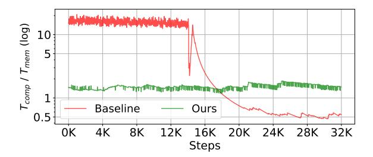
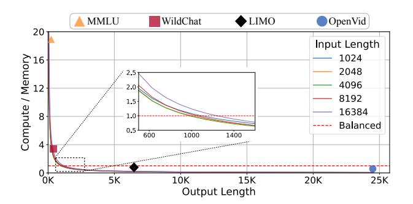

# BlendServe: Optimizing Offline Inference with Resource-Aware Batching

Yilong Zhao\* University of California, Berkeley Berkeley, CA, USA yilongzhao@berkeley.edu

Lianmin Zheng University of California, Berkeley Berkeley, CA, USA lianminzheng@gmail.com

Yang Zhou
University of California, Davis
Sacramento, CA, USA
yangzhou.rpc@gmail.com

Shuo Yang\* University of California, Berkeley Berkeley, CA, USA andy yang@berkeley.edu

> Baris Kasikci University of Washington Seattle, WA, USA baris@cs.washington.edu

> > Jiarong Xing Rice University Houston, TX, USA jxing@rice.edu

Kan Zhu University of Washington Seattle, WA, USA kanzhu@cs.washington.edu

Yifan Qiao University of California, Berkeley Berkeley, CA, USA yifanqiao@berkeley.edu

Ion Stoica
University of California, Berkeley
Berkeley, CA, USA\nistoica@berkeley.edu

#### **Abstract**

Offline batch inference is gaining popularity as a cost-effective solution for latency-insensitive tasks, such as model evaluation and data curation. As the latency objective is highly relaxed, maximizing throughput becomes the primary goal in offline inference. Previous studies focused solely on optimizing throughput within a batch. However, the diverse resource demands (compute-intensive vs. memory-intensive) across a wide range of applications make these approaches less effective, as imbalanced resource demands between batches restrict optimization opportunities.

Our insight for achieving optimal throughput is to reorder requests into batches that mix compute- and memoryintensive workloads to maximize resource overlap. However, such a request schedule can conflict with the schedule that maximizes prefix sharing, a widely-used performance optimization, causing suboptimal inference throughput. In this paper, we first build a performance model to analyze request resource demands. Based on it, we design BlendServe, which harmonizes both resource overlapping and prefix sharing to maximize throughput. BlendServe organizes all requests using a resource-aware prefix tree and proposes a dual scanning algorithm to obtain the request schedule. Our evaluation on various models and workloads shows that BlendServe can achieve up to 90% of the optimal throughput.

\*Both authors contributed equally to this work.

This work is licensed under a Creative Commons Attribution 4.0 International License.

ASPLOS '26, Pittsburgh, PA, USA.
© 2026 Copyright held by the owner/author(s).
ACM ISBN 979-8-4007-2359-9/2026/03
https://doi.org/10.1145/3779212.3790133

*CCS Concepts:* • Computing methodologies → Parallel computing methodologies; *Machine learning*.

Keywords: Large Language Models; Offline Inference

#### **ACM Reference Format:**

Yilong Zhao, Shuo Yang, Kan Zhu, Lianmin Zheng, Baris Kasikci, Yifan Qiao, Yang Zhou, Jiarong Xing, and Ion Stoica. 2026. BlendServe: Optimizing Offline Inference with Resource-Aware Batching. In *Proceedings of the 31st ACM International Conference on Architectural Support for Programming Languages and Operating Systems, Volume 2 (ASPLOS '26), March 22–26, 2026, Pittsburgh, PA, USA.* ACM, New York, NY, USA, 19 pages. https://doi.org/10.1145/3779212.3790133

## 1 Introduction

Offline batch inference is becoming increasingly popular as a cost-effective solution for Large Language Model (LLM) inference. It processes requests in batches and returns responses within an extended time window, e.g., 24-hour response window offered by OpenAI's batch APIs [38]. The relaxed latency objective significantly reduces service costs—for example, OpenAI's Batch API offers inference at half the cost of its online counterpart. This cost advantage has made offline batch inference an attractive choice for a wide range of latency-insensitive applications, including model evaluation [19], data curation [3], document summarization [9], and predictive analytics [30]. Almost all major inference providers offer offline batch inference services today [4, 5, 7, 15].

As the latency objective is highly relaxed, offline batch inference providers prioritize optimizing generation throughput, i.e., tokens per second, which requires maintaining high concurrent utilization of both compute and memory resources. In transformer-based LLM inference, there are two phases: prefill, which mainly processes input tokens, and decode, which generates output tokens. Both phases use the

**Figure 1.** Two ways of batching compute- and memory-intensive requests in offline inference. (a) Naively batching requests in order leads to limited compute-memory overlapping. (b) Resource-aware batching (ours) blends compute- and memory-intensive requests and achieves significant overlapping.

same model weights and operations, but the prefill phase processes tokens in parallel, making it more compute-intensive, while the decode phase generates tokens sequentially, making it more memory-intensive. Prior studies have exploited this distinction to improve inference throughput in the context of *online inference*. Sarathi-Serve [1] proposes *chunked prefill*, which splits large prefill phases into smaller chunks and schedules them alongside decode phases across iterations, improving arithmetic intensity per iteration for higher throughput. Orion [50] improves utilization with *operatorlevel scheduling*, which collocates compute- and memory-intensive operators. NanoFlow [76] further advances this by partitioning a large request batch into nano batches for finergrained overlapping, achieving state-of-the-art throughput.

However, these online inference optimizations are far from achieving optimal throughput for offline scenarios. This is because they only focus on optimizing execution within a request batch but overlook the opportunities across batches, which becomes increasingly important as request diversity grows rapidly. Specifically, advancements in model capabilities have expanded their applications across a wide range of domains, such as chatbots [37], math [65], and coding [35]. Besides, the rise of multi-modal models [55, 57, 61, 62] has further extended their reach to image and video understanding and generation. Such application diversity leads to numerous requests with diverse resource demands. For example, document summarization has long input sequences but short output tokens, which consumes more compute, whereas video generation produces significantly more output tokens, which need more memory bandwidth. If a batch is dominated by a single request type (e.g., all compute-intensive), opportunities for overlapping compute and memory-bandwidth usage will be limited, as shown in Figure 1(a).

**Insight.** Our key insight is to carefully construct batches in a resource-aware manner. Specifically, by combining (or blending) compute- and memory-intensive requests with a certain ratio to form a batch, we can maximize opportunities

for concurrent execution of compute- and memory-intensive operations, enhancing hardware utilization and effectively improving throughput. We illustrate this idea in Figure 1(b).

**Key challenge.** However, considering compute-memory overlapping in isolation might not provide optimal throughput, as it usually conflicts with another widely used technique to improve throughput—prefix sharing [23, 26, 73]. Prefix sharing group requests with shared prefixes, which allows the shared portion to be computed only once, avoiding redundant computation and KV-cache storage. Studies have shown that when optimally utilized—by processing requests in an optimal order-prefix sharing can increase throughput by 6.4× on certain workloads [73]. However, a request order that achieves high prefix sharing does not necessarily yield high compute-memory overlapping, and vice versa. For example, document summarization requests are computeintensive, but they usually only share the same prefix with other summarization requests, instead of memory-intensive video generation requests; a request order optimizing for prefix sharing would prevent compute-memory overlapping. Therefore, we must consider both factors together for maximizing throughput.

BlendServe. In this work, we design BlendServe, the first serving system that is specifically optimized for offline batch inference by leveraging both (a) blending compute-intensive and memory-intensive requests, on one hand, and (b) prefix sharing, on the other hand. We first conduct a deep performance analysis and develop a theoretical model to characterize requests with diverse resource demands. Based on the model, BlendServe constructs a resource-aware prefix tree, where each node encodes the compute density of all requests within its subtree. It then sorts the tree nodes based on their density values, placing compute-intensive nodes on the left and memory-intensive nodes on the right. The sorted tree preserves the structure of the prefix tree, so it inherits the benefit of prefix sharing. To determine the best request order for batching, BlendServe employs a dual scanner algorithm, which scans the tree leaves from left and right simultaneously, effectively batching compute-intensive requests with memory-intensive requests to maximize compute-memory overlapping. Finally, BlendServe extends the design to data parallelism and tensor parallelism to support large-scale deployment with larger models and clusters [44].

We prototyped BlendServe based on NanoFlow [76], which has integrated chunked prefill [1], and extended it with our resource-aware prefix tree and dual scanner algorithm for optimized batch formulation. We evaluated BlendServe on a range of models including Llama-3-8B, Llama-3-70B [34], and Qwen-2.5-7B [8], and datasets featuring different performance characteristics, including chatbots [70], benchmark [19], API service [56] and vision workloads [36]. We

compared BlendServe against commonly-used systems including vLLM [25], SGLang [73], and NanoFlow [76]. Compared to the industry-standard vLLM and SGLang, BlendServe achieves up to 1.44× throughput speedup. It also delivers an average 20.84% higher throughput than NanoFlow, the current state-of-the-art throughput-oriented inference system. More importantly, our analysis shows that BlendServe reaches an average 86.55% (up to 90%) of the achievable optimal throughput, demonstrating its effectiveness.

In summary, our main contributions include:

- We conducted a detailed analysis of offline serving workloads and built a performance model to analyze their compute and memory resource demands.
- We designed a resource-aware prefix tree for request management that encodes resource demands while preserving prefix structures.
- We proposed a request batching algorithm that optimizes throughput by maximizing compute-memory overlapping while preserving high prefix sharing.
- We built a prototype and evaluated it comprehensively, demonstrating that it achieves an average 86.55% (up to 90%) of the optimal throughput.

## 2 Background

## 2.1 Transformer-based large model inference

Transformer-based LLM. The core of transformer is its self-attention mechanism, which enables a model to capture the dependencies between all tokens in a sequence. This is achieved via query (Q), key (K), and value (V) transformations, where each token's embedding is projected into Q, K, and V tensors. The attention mechanism computes attention scores between tokens using the dot product of Q and K, normalizes scores with softmax, and then applies them to V to generate contextualized representations. The output then passes through a Feed-Forward Network (FFN), which applies non-linear transformations to refine token representations. Multi-head attention (MHA) [13] and grouped-query attention (GQA) [2] extend this by allowing multiple query heads to attend to the same sets of key and value heads, which greatly saves memory consumption.

**LLM inference.** LLM inference involves two main phases: *prefill* and *decode*. The prefill phase processes the initial input sequence (i.e., prompt) and generates the first output token. This phase is *compute-intensive* because all tokens are processed in parallel. After that, the decode phase generates output tokens in an *auto-regressive* manner, generating one token at a time [54]. For each token, it computes a new query (Q) and performs self-attention over the key (K) and value (V) tensors of all previously generated tokens. To avoid redundant computation, a KV-cache is employed to store the K and V tensors of past tokens in GPU memory. This significantly increases the usage of memory bandwidth, as each decoding

Figure 2. Request input/output length distribution from 6 well-known open-sourced traces, including chatbot WildChat and API services BurstGPT [56, 70], Azure-Trace [49], video generation datasets OpenVid [36], benchmark traces MMLU [19] and math traces LIMO [65]. Requests from different traces demonstrate distinct length distributions, which leads to different compute density. Compute density is the ratio of compute to memory bandwidth usage (formally defined in §4). A dataset is compute intensive when its compute density > 1, and memory intensive otherwise.

step requires loading all stored KV tensors from memory, making the decode phase *memory-intensive* [72].

## 2.2 Inference latency and throughput optimizations

Here, we introduce prior inference latency and throughput optimizations relevant to the design of BlendServe.

Prefill/Decode (P/D) disaggregation. Early-stage inference systems use naive continuous batching scheduling [68], which overlooks the resource usage differences between prefill and decode phases. DistServe [75] proposes P/D disaggregation, which executes and scales these two phases independently on separate clusters. This allows time-tofirst-token (TTFT) and time-per-output-token (TPOT) to be maintained independently without interference, making DistServe latency-optimized for online inference. However, P/D disaggregation can reduce hardware utilization, making it suboptimal for throughput-oriented offline inference [14, 27, 43]. In particular, compute-intensive prefill phases saturate the compute resources of the prefill cluster while leaving memory bandwidth resources underutilized, and vice versa for the decode phase. We compare BlendServe with DistServe in §6.3.

**Phase-level colocation.** To solve this problem, Sarathi-Serve [1] proposed chunked prefill scheduling that colocates prefill and decode phases on the same clusters, and splits a large prefill into small chunks while adding only one chunk into the on-the-fly batch (i.e., requests currently being processed). Conceptually, chunked prefill achieves phase-level overlapping which uses both compute and memory

resources, thereby improving arithmetic intensity per iteration and enhancing hardware utilization. However, chunked prefill was initially designed for online inference, where strict latency constraints prevent flexibly reordering requests to form a batch. Therefore, when a set of requests consists mostly of memory-intensive requests, Sarathi-Serve will quickly run out of prefill phases, leaving GPU compute resources underutilized in the remaining decode processing.

Operator-level overlapping. Building upon P/D colocation (i.e., chunked prefill), a recent work, NanoFlow [76], explores operator-level resource overlapping. It splits a batch into micro-batches and overlaps compute-intensive GEMM operators with memory-intensive attention operators between micro-batches. Another prior work, Orion [50], also explores operator-level GPU multiplexing by transparently scheduling distinct operators to maximize hardware utilization. This type of fine-grained overlapping is particularly beneficial when the batch contains a proper mix of prefill and decode tokens that can balance the execution time of GEMM and attention operators. However, both NanoFlow and Orion overlook the impact of request ordering on batch composition, limiting their ability to optimize throughput in offline inference. For instance, if a workload begins with computeintensive requests followed by memory-intensive ones, these frameworks process the batches sequentially rather than interleaving them, leading to suboptimal resource utilization.

**Prefix sharing.** Prefix sharing (caching) [25, 26, 73] is a commonly adopted optimization that caches computed prompts from previously processed requests and reuses them for future requests. When a new request arrives, the system checks the cached prompts, and if a cache hit occurs, the shared prefix is reused, eliminating redundant computation and boosting throughput [66]. Prefix sharing provides considerable throughput gain for both compute- and memory-intensive workloads without hurting generation quality, e.g., studies show that certain workloads can save up to 80% computation [73], so it has been widely used in mainstream frameworks [25, 52]. To enable efficient look-up, prefixes are organized using a Trie Tree [73], where each node is a segment of a prefix, and a complete path from the root to the leaf corresponds to a unique prefix. The prefix cache is stored alongside the regular KV-cache in GPU memory. When GPU memory runs out, the prefix cache may be evicted. Therefore, the access pattern can affect cache hit rates, which is denoted as prefix sharing ratio in this work.

#### 3 Motivation

#### 3.1 Evolving workloads diversity

The capabilities of LLMs are evolving rapidly. First, multimodality advancements have enabled modern models (e.g., LWM[28], Unified-IO[31], EMU[55], MIO[57], and VILA-U [62]) to process diverse input and output modalities, including text, images, videos, and their combinations. These

**Figure 3.** The ratio of time spent on compute-bound and memory-bound operations, when serving Llama-3-8B on an A100 GPU. The workloads are synthesized by sequentially combining compute-intensive (BurstGPT) and memory-intensive (OpenVid) traces. The baseline causes underutilization of one resource at each execution step, while ours achieves stable and balanced resource usage.

models typically share a common architecture: a transformer-based LLM augmented with modality-specific adapters. These adapters convert inputs from various modalities into a format that the base model can process and translate its outputs back into the desired modality. In addition, the emergence of reasoning models enables models to "think" before generating answers [39, 45, 51, 58, 64], which greatly improves their performance on hard tasks such as math and coding.

As a result, LLM-based applications are expanding rapidly, exhibiting increasing workload diversity, i.e., diverse input and output token lengths. To visualize this diversity, we present the request length distributions in different use cases in Figure 21. It shows that text-only chat requests typically have hundreds of tokens but a video generation request can easily generate tens of thousands tokens. While the simple questions in the MMLU benchmark produce only a few tokens, hard questions from the LIMO benchmark can produce thousands of tokens.

#### 3.2 Workload diversity limits existing overlapping

Diverse resource demands across requests. These diverse requests consume GPU resources (i.e., compute and memory bandwidth) differently. Since prefill is compute-intensive, requests with long inputs but short outputs will consume more GPU compute than memory bandwidth. Conversely, requests with long output length use more GPU memory bandwidth due to their long memory-intensive decode phase. Therefore, different request length distributions lead to drastically diverse resource demands across datasets. As formally defined in §4, we use compute density to represent the ratio of compute to memory bandwidth usage, with higher values indicating more compute-intensive. As shown in Figure 2, OpenVid [36] and LIMO [65] are highly memory-intensive while the remaining datasets are more compute-intensive.

&lt;sup>1Some traces are collected from online inference, but similar distributions can be observed in offline inference. For example, text-based chat and benchmarks are commonly used for model evaluation using offline processing; video generation can be leveraged to produce game summaries offline.

Intra-batch optimizations alone are insufficient. This request diversity presents significant challenges in maximizing inference throughput. Prior studies, such as chunked prefill [1], Orion [50], and NanoFlow [76], optimize throughput by overlapping compute and memory bandwidth usage within a batch of requests. For example, chunked prefill colocates the prefill phase with the decode phase within the same batch to overlap compute and memory usage. However, without considering the resource demands across batches, their effectiveness diminishes when a batch is dominated by either compute-intensive or memory-intensive requests, as the system can be easily bottlenecked by one type of resource while leaving the other underutilized.

To illustrate this, we compare NanoFlow (state-of-the-art throughput-oriented system) against our system by measuring the total time spent on compute- and memory-bound operators when serving a workload with compute-intensive requests in front followed by memory-intensive requests. As shown in Figure 3, NanoFlow serves requests sequentially, underutilizing memory bandwidth when processing compute-intensive requests and compute resources during processing memory-intensive requests. In contrast, our system strategically reorders requests with complementary resource demands, resulting in balanced resource utilization and increased overall throughput.

#### 3.3 Resource-aware batching via request reordering

The above problem has motivated us to consider the diverse resource demands when batching requests. Our key idea is to exploit the *relaxed latency constraints* of offline inference to reorder requests and create batches that can maximize the benefit of compute-memory overlapping, improving GPU utilization and increasing throughput.

Challenge: conflicts between resource overlapping and prefix sharing. However, resource overlapping can conflict with prefix sharing, a widely used technique that significantly improves throughput by saving redundant computation [26, 73]. As introduced in §2.2, inference systems structure the prefix cache with a Trie Tree [73]. As proven in previous studies [47, 73], the request order that maximizes prefix sharing is to traverse the tree using Depth-First Search (DFS), ensuring that all shared prefixes are computed only once. However, this order can conflict with the reordering needed to maximize resource overlap, leading to imbalanced resource demands within a batch, which in turn causes hardware underutilization and limited throughput. For example, when serving Llama-3-8B with one A100 GPU, DFS ordering can only achieve 71.7% of the optimal throughput, which maximizes both resource overlapping and prefix sharing (§ 6.3), leaving a huge performance gap.

Our goal: harmonizing both for throughput optimization. As a result, we must consider resource overlap and prefix sharing simultaneously to achieve the best of both. We formulate this problem as follows:

$$T = f((1 - s) \cdot T_{\text{comp}}, T_{\text{mem}})$$

where T is the total execution time of all requests, and  $T_{comp}$  and  $T_{mem}$  denote the total execution time of compute-bound and memory-bound operations across all requests, respectively. Detailed calculations of them will be provided in §4; here, we focus on conveying the high-level formulation.  $s \in [0,1]$  here represents prefix sharing ratio, which means s of the  $T_{comp}$  are saved, so the compute time will be reduced to  $(1-s) \cdot T_{comp}$ . However, prefix cache hits do not reduce memory bandwidth usage, as the KV-cache still needs to be retrieved from memory. f is a function that depends on the scheduling policy and the request order. For example, for a policy that sequentially executes compute-bound and memory-bound operators (e.g., first-come-first-serve in [25, 73]), f will be  $sum(\cdot, \cdot)$  since compute and memory resources are utilized sequentially.

To minimize the end-to-end execution time T to achieve optimal  $T_o$ , a perfect request scheduling is necessary to leave only the bottlenecked resource on the critical path while overlapping the other resources, namely  $f = max(\cdot, \cdot)$ . At the same time, all shared prefixes should be cached by prefix sharing without incurring any redundant computation, achieving an optimal prefix ratio  $s_o$  which is determined by the workload prompts. In the rest of this paper, we will describe how BlendServe approaches  $T_o$  through its design.

$$T_o = \max((1 - s_o) \cdot T_{\text{comp}}, T_{\text{mem}})$$

## 4 Performance Analysis

In this section, we formally define *compute density*, a metric that quantifies the ratio of compute and memory resource usages. This metric enables BlendServe to analyze diverse resource demands across requests and guides its scheduling to balance compute and memory usage for effective overlapping. Besides, compute density provides a practical method to approximate  $T_o$ .

## 4.1 Request-level compute density

We first define compute density at the request level and extend it to the batch level in §4.2. We define the compute density  $\rho(r)$  of a request r as the total compute time of compute-intensive operators divided by the total time of memory-intensive operators, following the similar intuition of arithmetic intensity [59]:

$$\rho(r) = \frac{\text{Comp}(r)}{\text{Mem}(r)}$$

where a larger compute density  $\rho(r)$  indicates a request that requires more compute resources rather than memory bandwidth (i.e., compute-intensive). Note that the following formulations assume an unquantized data type, FP16, as well as GPU tensor core computation capability. One can

easily adapt the data type and GPU capability by varying the constants in the formulas.

Next, to calculate  $\rho(r)$ , we build a resource usage model for a request with input length p and output length d. Input length of a request is known as the prompt length, and we will discuss how to estimate the output length in §5.1. Given a model of  $P_{model}$  parameters, H hidden dimension of model width,  $H_{kv}$  feature dimension for each KV head, and L decoder layers, and a hardware configuration of compute peak FP16 GFlops and bandwidth GB/s memory bandwidth, the total time for compute-bound operators of a single request r can be approximated by total computation amount of GEMM operators and the self-attention in prefill phase divided by the hardware compute capability:

$$\operatorname{Comp}(r) \approx \frac{2 \cdot (p+d) \cdot P_{model} + 4 \cdot p^2 \cdot H \cdot L}{\operatorname{compute}}$$

where (p+d) is the number of tokens processed by GEMM operators during the lifetime of r. Since parameters of GEMM (QKV generation + FFN) occupy most of the model parameters, the computation amount can be effectively approximated by the model\_size,  $P_{model}$  [76]. Since the attention consists of 2 GEMMs including  $P = Q \times K$  and  $P \times V$  where each GEMM leads to  $2 \cdot p \cdot p \cdot H$  Flops, the total computation amount is then multipled with L layers, i.e.,  $4 \cdot p^2 \cdot H \cdot L$ . The  $p^2$  comes from the quadratic computation of self-attention in the prefill phase. As  $p \cdot H \cdot L$  is typically much smaller than  $P_{model}$  on common workloads with p of a few hundred tokens (Figure 2), we omit  $4 \cdot p^2 \cdot H \cdot L$  in the following deduction.

The total time for memory-bound operators can be approximated by counting the total memory loading of d times decoding attention during the auto-regressive generation:

$$\begin{split} \text{Mem}(r) &\approx \frac{\sum_{i=1}^{d} (p+i) \cdot H_{kv} \cdot L \cdot 2 \cdot 2}{\text{bandwidth}} \\ &= \frac{(p \cdot d + \frac{1}{2} \cdot d^2) \cdot H_{kv} \cdot L \cdot 4}{\text{bandwidth}} \end{split}$$

where  $\sum_{i=1}^{d} (p+i)$  calculates the total number of loaded tokens by self-attention during the d steps of the auto-regressive generation process, and 4 comes from key and value vectors stored in FP16 for each token.

#### 4.2 Translating request-level metrics to batch-level

Ideally, a scheduling policy should reorder requests to form batches with perfectly balanced  $T_{\rm comp}$  and  $T_{\rm mem}$ . However, achieving this balance is difficult using only a request-level compute density metric, as requests in the same batch may reside in different inference steps that affect  $T_{\rm comp}$  and  $T_{\rm mem}$  differently. For example, adding a memory-intensive request does not immediately lower a batch's overall compute density, because the request will undergo a compute-intensive prefill phase first, only becoming memory-intensive later during its decode phase. Therefore, measuring only the compute

density of individual requests is insufficient. Instead, Blend-Serve must consider each request's compute intensity across its entire generation lifetime, requiring a *holistic batch-level metric*.

Fortunately, integrated with continuous batching [68], a batch typically consists of many requests in different steps, and request-level compute density essentially captures the average compute intensity over time, making it a good approximation for the compute density of a batch. Specifically, when the requests within the batch are evenly distributed at different steps, batch-level compute density will converge to request-level compute density for requests with input length of p and output length of p. We demonstrate this following the same notations in § 4.1.

Denoting the total memory capacity of KV-cache as KV-Mem, we can calculate batch-level compute density with the total compute time and memory loading time. Since a batch typically consists of a large number of tokens,  $\operatorname{Comp}(B)$  is dominated by GEMM computation, and  $\operatorname{Mem}(B)$  is dominated by loading of KV-cache, compared to the small operators including layer normalization, activation, and position embedding. Therefore, we have:

$$\operatorname{Comp}(B) \approx \frac{\frac{\mathrm{KV-Mem}}{(p + \frac{d}{2}) \cdot H_{kv} \cdot L \cdot 4} \cdot \frac{p + d}{d} \cdot P_{model} \cdot 2}{\mathsf{compute}}$$

where the average length of KV-cache per request is  $p+\frac{d}{2}$ , and the number of decoding requests  $B_{decode}$  is KV-Mem divided by  $(p+\frac{d}{2})$  tokens. As each token takes  $H_{kv} \cdot L \cdot 4$  bytes,  $B_{decode}$  can be calculated as  $\frac{\text{KV-Mem}}{(p+\frac{d}{2}) \cdot H_{kv} \cdot L \cdot 4}$ . As chunked-prefill scheduling maintains a stable batch size, the number of average newly admitted requests should be equal to the average completed requests, which indicates that the ratio of prefill tokens with decode tokens is  $\frac{p}{d}$ . Therefore, the prefill tokens can be calculated as  $B_{decode} \cdot \frac{p}{d}$ , leading to a total number of tokens as  $B_{decode} \cdot \frac{p+d}{d}$ . As discussed in § 4.1, each token contributes to a total amount compute of  $2 \cdot P_{model}$ , which concludes the Comp(B) by substitution.

The total loading time of KV-cache within a batch *B* is:

$$Mem(B) \approx \frac{KV-Mem}{bandwidth}$$

We show the equivalence of batch-level compute density  $\rho(B)$  and request-level compute density  $\rho(r)$  with the following derivation:

$$\begin{split} \boldsymbol{\rho}(\boldsymbol{B}) &= \frac{\text{Comp}(\boldsymbol{B})}{\text{Mem}(\boldsymbol{B})} \approx \frac{\frac{\text{KV-Mem}}{(p+\frac{d}{2}) \cdot H_{kv} \cdot L \cdot 4} \cdot \frac{p+d}{d} \cdot P_{model} \cdot 2}{\text{compute}} \bigg/ \frac{\text{KV-Mem}}{\text{bandwidth}} \\ &= \frac{(p+d) \cdot P_{model} \cdot 2}{\text{compute}} \bigg/ \frac{(p+\frac{1}{2} \cdot d) \cdot d \cdot H_{kv} \cdot L \cdot 4}{\text{bandwidth}} \approx \boldsymbol{\rho}(\boldsymbol{r}) \\ \text{Such derivation of batch-level compute density can also} \end{split}$$

Such derivation of batch-level compute density can also be cross-validated with previous literature [76]. Therefore, BlendServe adopts request-level compute density as the key

**Figure 4.** Compute density of requests with different input/output lengths (Llama-3-8B on an A100 80GB GPU) varies drastically and leads to diverse resource demands.

| Time (ms) | Batch size=512 | Batch size=768 | Batch size=1024 |
|-----------|----------------|----------------|-----------------|
| GEMM      | 1.038 / 1.087  | 1.494 / 1.537  | 1.916 / 2.005   |
| Attention | 1.239 / 1.317  | 1.859 / 1.913  | 2.478 / 2.515   |

**Table 1.** Operator performance differences for varying batch sizes with a sequence size of 1024 (estimated time / real execution time).

metric to make scheduling decisions and is still able to accurately control batch-level compute density for efficient resource overlapping.

### 4.3 Case study: offline inference with Llama-3-70B

To visualize the drastic differences in compute density across datasets and validate the accuracy of our performance model, we conducted a case study using Llama-3-8B on an A100 80GB GPU and requests with varying input length p and output length q. As shown in Figure 4, compute density diminishes quickly for requests with longer output length, indicating their memory-intensive nature, as exemplified by OpenVid [36]. In contrast, requests from WildChat [70] and MMLU [19] typically have short output lengths and remain compute-intensive.

To further validate our performance model proposed in §4.1, we compare its estimated times against measured execution times in Table 1. The estimated times closely match actual execution times for both GEMM and attention kernels, with a maximum relative error of 6%.

## 5 BlendServe Design

Overview. Figure 5 shows the end-to-end workflow of Blend-Serve. Given a set of requests upfront with known prompts, BlendServe first constructs a prefix tree to capture the shared prefix among requests (①, § 5.1). Next, BlendServe calculates compute density for each node, which involves estimating request output length by sampling over the prefix tree (②, § 5.1). With compute density, requests are characterized as compute- or memory-intensive and sorted based on their resource usage, resulting in a sorted tree where most compute-intensive requests are on the left and most memory-intensive requests are on the right (③, § 5.2). Therefore, BlendServe can efficiently find a request order by sweeping the tree

from left and right simultaneously. This order can balance compute-memory demand for resource overlapping and has high prefix sharing (④, § 5.3). Finally, the ordered requests are batched and fed into a backend engine for inference. To support large-scale deployment with more GPUs, BlendServe integrates both data and tensor parallelism (§ 5.5).

#### 5.1 Key data structure: resource-aware prefix tree

Determining the optimal scheduling order requires a proper abstraction that can capture both shared prefixes and resource demands of all requests. Inspired by the Trie Tree data structure in *RadixAttention* [73], BlendServe organizes all requests within a *resource-aware prefix tree*, where each leaf node represents an actual request and each internal node is a segment of the prefix shared by all its descendants. Therefore, a path from the root node to the leaf node represents the longest shared prefix of this request. By traversing this prefix tree in a DFS order, each internal node (i.e., shared prompt segment) is visited with the shortest reuse distance, which gives a request sequence that maximizes the prefix sharing ratio [73]. However, such naive DFS ordering neglects diverse resource demands across requests and misses the opportunity for resource overlapping.

To harmonize prefix sharing and resource overlap, we enhance the prefix tree with resource demand information for each node, making it a resource-aware prefix tree. Specifically, we compute the *compute density for each node* by considering its prefix sharing status, as defined below:

$$\rho(R) = \frac{(1-s) \cdot T_{\text{comp}}}{T_{\text{mem}}}$$

where *R* represents the set of requests in the node, and *s* denotes its prefix sharing ratio. For an internal node of the tree, the compute density is calculated over all requests within the sub-tree rooted at it. With this enhancement, the resource-aware prefix tree provides a *unified abstraction* that enables BlendServe to efficiently search for the optimal request order that harmonizes both prefix sharing and resource overlap.

**Output length sampling.** Request output length is necessary for calculating compute density as modeled in § 4.1, which is *unknown* beforehand because LLMs generate tokens in an auto-regressive manner. As a result, an estimation mechanism before actual inference is needed. Our observation here is that a request's *output length distribution* is closely related to its *prompt semantics* and *task type* [6, 18, 49, 74]. For example, benchmark requests (e.g., MMLU [19], LongBench [9]) have an output length of only a few tokens [19], while chatbot (e.g., ShareGPT [40], WildChat [70]) generates an average of hundreds of tokens [12].

Such an observation unveils a unique opportunity in offline batch inference, where a batch of requests submitted by a user typically shares the same task type or shared prefixes. In the prefix tree, requests sharing similar prompts are naturally grouped under specific sub-trees. Therefore,

Figure 5. Overview of BlendServe's design. Leaf nodes in the prefix tree are actual requests while others represent the shared prefix in prompts. The color of nodes represents the resource demand of all requests within the sub-tree, which is more compute-intensive in red and memory-intensive in blue. Given a set of requests, a one-time warm-up ahead of GPU running is performed, which consists of prefix tree construction, output length sampling, and transformation including tree sorting and node splitting (➀,➁, and ➂). Then the dual scanner forms the runtime batch from most compute- and memory-intensive nodes, which is consumed by the backend engine (➃). This warm-up is a short process and finishes quickly within the first 1% of time during the end-to-end inference generation.

Figure 6. An example of BlendServe's memory partition with 80GB memory. The left node has a compute density of 3.73, while the right node is memory-intensive with a compute density of 0.096. The dual scanner will reserve 20GB for model weights and temporary buffers, then partition the rest 60GB to reach the root density of 1.27. Given the compute densities, the memory is partitioned into 19.3 and 40.7GB , where 3.73 × 19.3 + 0.096 × 40.7 = 1.27 × 60.

these requests tend to have a similar distribution of output length. To estimate output length, BlendServe selects a subset of requests with a sampling probability to undergo the full inference process and obtain their output length in the warmup phase. Each sub-tree uses the average output length of its sampled requests as an estimation for the left unsampled requests within the same sub-tree. If a sub-tree 1 is not sampled at all, it will use the average sampled output length of its sibling sub-tree 2 since 1 and 2 share the longest common prefix and tend to have a similar distribution of output length. This sampling process does not incur any extra overhead as sampled requests can be directly returned to the user without running inference again.

## 5.2 Resource-aware prefix tree sorting

Next, BlendServe performs a layer-wise sorting of nodes based on their compute density, which only reorders nodes sharing the same ancestor and depth (detailed algorithm in § [A.1\)](#page-13-0). Therefore, this sorting maintains the hierarchical structure of the prefix tree. After sorting, the tree exhibits a global pattern with compute-intensive nodes on the left and memory-intensive nodes on the right. However, local outliers that deviate from this trend may still exist. For instance, in the first tree of Figure [5,](#page-7-0) request #2, which has low compute density, should be separated from requests #1 and #3 and repositioned to the right.

To address this issue, BlendServe introduces a conditional node splitting technique to relocate outliers to desired positions (detailed algorithm in § [A.1\)](#page-13-0). The node that is split from the original node will be inserted at the root when there is no shared prefix at the desired position, potentially incurring prefix recomputation costs during inference. Additionally, the compute density of the original node, the split node, and the new parent need to be updated accordingly. Take Figure [5](#page-7-0) 3 as an example, request #2 is moved from the leftmost to the rightmost position, requiring its prefix to be recomputed. This technique applies a heuristic threshold : if the recomputation overhead for relocation falls below , the node is repositioned to preserve the descending order of compute density. This approach enables a controlled trade-off, sacrificing a small degree of prefix sharing to better order requests with their resource demands for BlendServe's request scheduling. In practice, we found BlendServe's performance is insensitive to for real-world workloads (discussed shortly in § [5.4\)](#page-8-1) and BlendServe works generally well when we set it to preserve 99% of prefix sharing ratio.

## 5.3 Request order search: heuristic dual scanning

Finally, BlendServe derives a request order for batching, with the aim of achieving both high prefix sharing ratio and resource overlap across inference iterations.

Searching for an optimal request order is NP-hard. For each scheduling step, the search problem can be reduced to a knapsack problem [\[10\]](#page-16-14) where requests with different KV cache sizes (cost) and compute density values (value) are selected to fill the GPU memory for the targeted density score. Furthermore, since requests undergo multi-step decoding in auto-regressive inference, scheduling in different steps is dependent, further complicating the problem. Given the large number of requests and scheduling steps, finding the optimal solution in a reasonable time is infeasible.

To solve this problem in a reasonable time, BlendServe employs a heuristic-based algorithm that scans the leaf nodes of the prefix tree concurrently from left to right and right to left, progressively adding requests to the on-the-fly batch during this process. By controlling the ratio of the number of requests admitted from these two ends, an arbitrary and stable compute density can be achieved, thus improving the resource balance. To determine how many requests should be selected from the current compute-intensive node and memory-intensive node , BlendServe first calculates the desired memory capacity for each side and then adds requests to saturate the assigned memory. BlendServe logically partitions the GPU memory into two parts and , where the partition sizes and are dynamically calculated by the following theoretical constraints:

$$\begin{cases} M_L + M_R = M & \text{(Memory)} \\ M_L \cdot \rho(R_L) + M_R \cdot \rho(R_R) = M \cdot \rho(rt) & \text{(Compute)} \end{cases}$$

These two equations represent the memory and compute demands, respectively. Here, is a constant denoting GPU memory size. () is the compute density of the tree root node, which remains as a constant for the current request set. Similarly, () and () are the compute densities of the compute- and memory-intensive nodes, which are also constants when the scanner reaches a specific node. Given these constants, the first equation limits the total memory allocation to the available GPU memory, while the second equation constrains the total compute to match the target density (). Together, these two constraints achieve () by combining requests with densities () and (). Thus, and can be derived from these two equations. We illustrate one practical example in Figure [6.](#page-7-3)

Given an assigned memory size, BlendServe can calculate the desired on-the-fly batch size and construct the batch by selecting requests from () and () accordingly, ensuring that they can be placed into and respectively. This memory partition ensures that the compute density of the blended compute- and memory-intensive requests approximates (), allowing the memory access time to be fully overlapped with the compute time (when () > 1). Moreover, this strategy also ensures high prefix sharing ratio, as the dual scanning method essentially traverses the prefix tree in DFS order from both sides. We include the detailed algorithm of dual scanning in § [A.1](#page-13-0) (Algorithm [3\)](#page-13-1).

## 5.4 Robustness analysis

Handling inaccurate output length estimation. Notably, predicting output length may not always be accurate due to the dynamic nature of decoding, except for image- or videogeneration, where output length is inherently predefined by the preset quality and frame parameters [\[28,](#page-17-15) [32\]](#page-17-21). Fortunately, BlendServe does not require precise output length predictions due to the following reasons. First, a rough estimation sufficient to distinguish request types (e.g., benchmark v.s. conversational tasks) is adequate for BlendServe. This is because BlendServe processes hundreds of requests in a single batch to overlap compute and memory, minor estimation deviations within the same request type have negligible impact on overall batch performance. To verify this, we only sampled 1% of the total requests for output length sampling and found that BlendServe can achieve comparable end-to-end performance to a sampling probability of 100%. In addition, BlendServe can online adaptively adjust the batch to mitigate the impact of miss-estimations. If a request finishes much earlier due to an overestimated output length, BlendServe will insert additional requests. Conversely, if output length is severely underestimated, BlendServe could relocate the request from into .

Stopping conditions and convergence. The algorithm iteratively performs "layer-wise sort → conditional node split → (re)sort" until one of the following holds: (C1) the leaf sequence ordered by compute density becomes nonincreasing, or (C2) for every leaf, the split cost exceeds the threshold . Therefore, termination is guaranteed: after each split, the produced leaf is reinserted as a direct child of the root. In the worst case, every original leaf is split once and moved under the root; a single layer-wise sort at the root then yields a globally monotone order, satisfying (C1). Since the number of original leaves is finite, each leaf can be split at most once, so the total number of splits is ≤ leaf and the number of (re)sorts is ≤ leaf + 1. Empirically, due to the threshold , only about 0.1% to 1% of leaves require splitting. By tuning we obtain a controllable performance bound.

Performance robustness of tree sorting. Since the optimal ordering for prefix sharing and resource overlapping can sometimes conflict, our tree sorting and node-splitting algorithm may perform differently depending on workload characteristics. However, real-world workloads typically expose low variance in request compute density within each dataset, thus delivering near-optimal performance.

## 5.5 Distributed deployment

BlendServe supports data parallelism and tensor parallelism for efficient scaling across different number of GPUs.

Data parallelism. Data parallelism (DP) extends computational capacity by distributing identical model replicas across hardware clusters, each performing computations on distinct subsets of data with identical control flows. To implement

DP effectively, BlendServe first constructs the centralized resource-aware prefix tree with the entire request pool, and then decomposes it into parallelized subtrees assigned to different DP ranks. Such decomposition ensures balanced workloads and resource usage across partitions. BlendServe reuses the dual-scanner design to form request partitions as subtrees. Once a subtree reaches the target workload, BlendServe finalizes it and starts a new one. This approach incurs only marginal prefix sharing overhead due to tree partitioning—one path from the tree root to the leaf cannot be shared across DP replicas, but the impact is negligible.

Tensor Parallelism. Tensor parallelism (TP) partitions model parameters across multiple GPUs, addressing scenarios where a single GPU cannot accommodate the entire large model [\[44\]](#page-17-8). Prior research has shown that the network communication overhead incurred by TP can be effectively overlapped through specialized pipeline strategies [\[11,](#page-16-15) [76\]](#page-18-1). BlendServe is compatible with these designs, so it can seamlessly integrate TP with minimal performance degradation.

