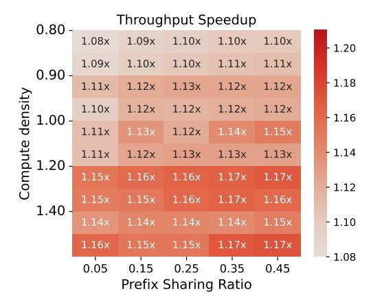
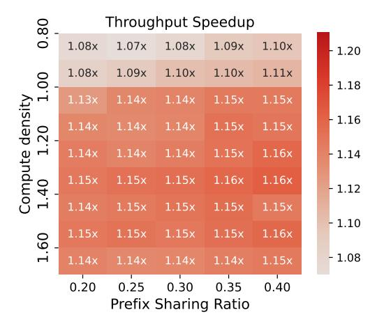

# <span id="page-13-1"></span>Algorithm 3 Dual Scan

```
1: function DUAL_SCAN(\rho(rt), \rho(L), \rho(R), M)
         Input: compute density of root \rho(rt), left child \rho(L), and right
    child \rho(R); total available GPU memory M
         Output: chunked prefill budgets for the left child \mathcal{C}_L, and right
    child C_R (in terms of tokens)
     # Step 1: partition memory M according to the compute density
         M_L \leftarrow M \cdot \frac{\rho(rt) - \rho(R)}{r}
                        \rho(L) - \rho(R)
         M_R \leftarrow M \cdot \frac{\rho(L) - \rho(rt)}{r}
                        \rho(L) - \rho(R)
     # Step 2: calculate the chunked prefill budget according to the
                estimated input length p_L and output length d_L
                               M_L
         N_L \leftarrow \frac{m_L}{(p_L + d_L/2) \cdot H_{kv} \cdot L \cdot 4} # number of decode requests
         C_L \leftarrow N_L \cdot \frac{p_L}{d_L} # scale into prefill token budget
     # Step 3: calculate the chunked prefill budget of the right child
                              M_R
                  \overline{(p_R + d_R/2) \cdot H_{kv} \cdot L \cdot 4}
         C_R \leftarrow N_R \cdot \frac{p_R}{d_R}
         return (C_L, C_R) # determines number of requests that are admitted
10:
```

if doing so does not hurt the prefix sharing ratio. This merging reduces fragmentation which would cause fluctuation during the dual scanner process.

Runtime prefix tree. The runtime prefix tree in BlendServe is implemented based on SGLang [73]. It manages runtime information related to prefix sharing, including a dynamic Trie Tree and a mapping between the physical memory and key-value tokens. We also employ intra-batch prefix sharing, enabling exactly-once computation of shared prefixes for a single batch, which is particularly beneficial for offline processing using a DFS order.

**Batch scheduler.** The batch scheduler within the dual scanner is implemented following NanoFlow [76]. It strictly enforces batch sizes in multiples of 128 to ensure higher hardware utilization. We also incorporate chunked prefill and continuous batching following state-of-the-art serving systems [1, 68].

**Backend engine.** Our backend engine is built in C++ following NanoFlow's operator-level overlapping approach, which

enables simultaneous execution of compute-intensive operators like GEMM and memory-intensive operators like self-attention [76]. Based on the operator-level overlapping, BlendServe overlaps operators from requests with distinct resource usages.

## <span id="page-14-1"></span>A.3 Methodolody of workload synthesize

To synthesize workloads that reflect real use cases, we collect a variety of open-source inference traces that have distinct characterization, including compute density, prefix sharing ratio, and modalities. We illustrate their length distribution in Figure 2. For each set of traces, we add a unique system prompt ahead of prompts as it is not collected. For traces without detailed prompt content, we randomize their prompts' token ids corresponding to their prompt length. For video generation requests, we use OpenVid [36] and treat the videos in training datasets as their auto-regressive generation output. For each video, we collect its output length by counting the number of frames and multiplying it by 256, which represents the number of tokens per frame observed in normal videos [28, 63]. Additionally, we normalize the average output length of OpenVid to 16K as the original 45K is too large for evaluation of Llama-3.1-8B on a single A100 GPU. We also normalize the average output length of WildChat [70] to 256 for a more compute-intensive workload while maintaining the length variance. We calculate the resource characterization in Table 4.

<span id="page-14-0"></span>

|                 | ShareGPT | WildChat | Azure-Trace | OpenVid | BurstGPT | MMLU  |
|-----------------|----------|----------|-------------|---------|----------|-------|
| Prefix sharing  | 0.02     | 0.19     | 0.01        | 0.00    | 0.02     | 0.86  |
| Compute density | 3.12     | 2.13     | 33.2        | 0.05    | 17.78    | 54.91 |

**Table 4.** Prefix sharing ratio and compute density of collected traces. OpenVid is memory-intensive due to its large output length, while MMLU has a high prefix sharing ratio of 86.46%. Others are compute-intensive with less prefix sharing ratio.

To cover the real cases in offline batch inference, we conduct a grid search of synthetic workloads with different compute density and prefix sharing ratio. To reach the desired compute density t, we combine one compute-intensive trace among ShareGPT, Azure-Trace, WildChat, and BurstGPT, and a memory-intensive video generation trace OpenVid. Based on t and compute density of selected traces, we calculate the required request number of each trace, with a total number of 40,000 requests. Then we mix requests from MMLU to reach the desired number of prefix sharing ratio to get the synthetic workload. Such a synthetic workload has a diverse request length and various resource characterization, which is similar to real-world cases.

## <span id="page-14-2"></span>A.4 Extensive evaluation of synthetic workloads

In addition to the main evaluations conducted on BurstGPT, MMLU, and OpenVid in § 6, we also evaluate BlendServe on Azure-Trace (Figure 13), ShareGPT (Figure 14), and WildChat

<span id="page-14-3"></span>

**Figure 13.** Simulated throughput improvement of BlendServe compared to NanoFlow-DFS on workloads synthesized from Azure-Trace, MMLU, and OpenVid. BlendServe achieves up to 31% throughput gain compared to baselines.

<span id="page-14-4"></span>

**Figure 14.** *Simulated throughput* improvement of BlendServe compared to NanoFlow-DFS on workloads synthesized from ShareGPT, MMLU, and OpenVid. BlendServe consistently surpasses baselines by up to 17% throughput.

(Figure 15) to demonstrate the generality of proposed methods over diverse workloads, following the same experiment setup (§ 6.2).

Results show that BlendServe consistently surpasses baselines by 1.08× to 1.31× in different workloads. We find that BlendServe works better on BurstGPT and Azure-Trace due to their smaller variance of output length. When the output length variance is large in ShareGPT and WildChat, the sampling strategy works less effectively, leading to sub-optimal performance. We leave the better strategy for workloads with large variance output length that cannot be effectively captured by the prefix tree for future work.

<span id="page-15-1"></span>

**Figure 15.** *Simulated throughput* improvement of BlendServe compared to NanoFlow-DFS on workloads synthesized from WildChat, MMLU, and OpenVid.

#### <span id="page-15-0"></span>A.5 Scheduling overhead of BlendServe

As described in § 5, BlendServe has two scheduling overhead: 1) preprocessing all token ids of requests prompt to construct the prefix tree, followed by a series of tree transformations; and 2) runtime scheduling request batches based on the double scanner algorithm and the prefix tree to manage KV-cache memory. We now demonstrate that these two parts have minimal overhead compared to the GPU time.

**Preprocessing overhead.** There is no additional overhead for tokenization, since it is also necessary for model inference, and the storage for generated token ids is at the same magnitude as the input strings. Assuming N requests with T tokens in the prompts, for the trie tree construction with D max depth, the time complexity  $O(N \times D)$ . Since requests' prompts diverge quickly, D is typically small. In our evaluations, this process typically takes several minutes, which is negligible compared to hours of GPU inference.

Runtime scheduling overhead. Since the runtime batch size is typically at the magnitude of thousands, the runtime prefix tree is much smaller compared to the offline prefix tree built during preprocessing. Based on our measurement in evaluations, the operations on the runtime prefix tree take 0.08 ms on average, with a P99 latency of 0.23 ms, which is generally less than 10% compared to the GPU time. Such small runtime scheduling overhead can be effectively overlapped with asynchronous CPU scheduling, incurring zero overhead in end-to-end performance [76].

## **B** Artifact

#### B.1 Abstract

This artifact provides an implementation of the proposed system using pre-built Docker images that encapsulate the codebase and runtime environment. All experiments are orchestrated through a single entry-point script for ease of use and automation. Experimental results are collected and visualized using a Jupyter notebook.

## **B.2** Artifact check-list (meta-information)

- Algorithm: Offline inference schedule
- Program: Python, C++
- Compilation: nvcc, g++
- Model: Meta-Llama-3-8B
- Data set: Huggingface datasets
- Hardware: A100-SXM4-80GB
- Metrics: Tokens per second, prefix hit rate
- How much disk space required (approximately)?: 50GB
- How much time is needed to prepare workflow (approximately)?: 10mins
- How much time is needed to complete experiments (approximately)?: 50 A100 hours
- Publicly available?: Yes
- Code licenses?: Apache-2.0 license
- Data licenses?: Apache-2.0 license

#### **B.3** Description

**B.3.1** How to access. A Docker image, including all software dependencies (compiled), model weights, code references, and scripts, is provided via a public Google Drive link. We also provide an image (without CUDA dependency) for reproducing subsets of experiments without the GPU backend via this Google Drive link.

**B.3.2** Hardware dependencies. All evaluations are conducted with NVIDIA A100-SXM4-80GB GPUs.

**B.3.3 Software dependencies.** The desired environmental setup follows the official Docker container, i.e., 23.11-devel-cuda\_multi. The software libraries, including vLLM and NanoFlow, are also provided along with the image.

**B.3.4 Data sets.** The evaluated workloads are synthesized by combining several open-sourced traces with distinct characteristics, including OpenVid-1M, BurstGPT, and MMLU.

**B.3.5** Models. Both Qwen-2.5-7B and LLama-3-8B are evaluated on A100 with TP=1, while Qwen-2.5-72B and Llama-3-70B are evaluated with TP=8. We mainly provide automated scripts for reproducing 8B models due to resource constraints, while others can be done in a similar way.

#### **B.4** Installation

We provide a pre-built Docker image that encapsulates all required dependencies. Users should first download the image archive and load it into the local Docker environment, then launch a container with the provided configuration.

```
docker load -i blendserve.tar
docker run -it --gpus all \
    --name blendserve \
    -v /dev/shm:/dev/shm \
    blendserve:latest
```

After launching the container, the working directory is set to /root/blendserve, which contains the full source code and scripts needed to reproduce our results.

Some datasets and model weights are hosted on Hugging Face and require user authentication. Please log in using the Hugging Face CLI with a valid access token:

hf auth login --token \\$YOUR\\_TOKEN

Detailed guidelines are provided in ./README.md. The main entry point for running experiments is the script located at ./scripts/run.sh.

## **B.5** Evaluation and Expected Results

All experiments are orchestrated through a single entry-point located at ./scripts/run.sh, which sequentially launches the full set of experiments used in our evaluation. For convenience and flexibility, each experiment can also be executed independently by invoking the corresponding commands in the script. For each experiment, the raw outputs and aggregated results are stored in the corresponding experiment directory. Quantitative results are summarized in combine.csv, while visualizations and plots are generated using the provided Jupyter notebook plot.ipynb.

#### References

- <span id="page-16-6"></span>[1] Amey Agrawal, Nitin Kedia, Ashish Panwar, Jayashree Mohan, Nipun Kwatra, Bhargav S. Gulavani, Alexey Tumanov, and Ramachandran Ramjee. 2024. Taming Throughput-Latency Tradeoff in LLM Inference with Sarathi-Serve. arXiv:2403.02310 [cs.LG] https://arxiv.org/abs/ 2403.02310
- <span id="page-16-9"></span>[2] Joshua Ainslie, James Lee-Thorp, Michiel de Jong, Yury Zemlyanskiy, Federico Lebrón, and Sumit Sanghai. 2023. GQA: Training Generalized Multi-Query Transformer Models from Multi-Head Checkpoints. arXiv:2305.13245 [cs.CL] https://arxiv.org/abs/2305.13245
- <span id="page-16-0"></span>[3] Loubna Ben Allal, Anton Lozhkov, and Daniel van Strien. 2024. Cosmopedia: how to create large-scale synthetic data for pre-training Large Language Models — huggingface.co. https://huggingface.co/blog/cosmopedia. [Accessed 25-10-2024].
- <span id="page-16-2"></span>[4] Anthropic. 2024. Introducing the Message Batches API — anthropic.com. https://www.anthropic.com/news/message-batches-api. [Accessed 20-10-2024].
- <span id="page-16-3"></span>[5] Anyscale. 2024. LLM offline batch inference with Ray Data and vLLM
   | Anyscale Docs — docs.anyscale.com. https://docs.anyscale.com/examples/batch-llm/. [Accessed 26-10-2024].
- <span id="page-16-11"></span>[6] Iñaki Arango, Ayush Noori, Yepeng Huang, Rana Shahout, and Minlan Yu. 2025. Prefix and Output Length-Aware Scheduling for Efficient Online LLM Inference. In Sparsity in LLMs (SLLM): Deep Dive into Mixture of Experts, Quantization, Hardware, and Inference. https://openreview.net/forum?id=DOZiCWyK0N
- <span id="page-16-4"></span>[7] AWS. 2024. Supported Regions and models for batch inference - Amazon Bedrock — docs.aws.amazon.com. https://docs.aws.amazon.com/bedrock/latest/userguide/batch-inference-supported.html. [Accessed 26-10-2024].
- <span id="page-16-7"></span>[8] Jinze Bai, Shuai Bai, Yunfei Chu, Zeyu Cui, Kai Dang, Xiaodong Deng, Yang Fan, Wenbin Ge, Yu Han, Fei Huang, Binyuan Hui, Luo Ji, Mei Li, Junyang Lin, Runji Lin, Dayiheng Liu, Gao Liu, Chengqiang Lu, Keming Lu, Jianxin Ma, Rui Men, Xingzhang Ren, Xuancheng Ren, Chuanqi Tan, Sinan Tan, Jianhong Tu, Peng Wang, Shijie Wang, Wei Wang, Shengguang Wu, Benfeng Xu, Jin Xu, An Yang, Hao Yang, Jian Yang, Shusheng Yang, Yang Yao, Bowen Yu, Hongyi Yuan, Zheng

- Yuan, Jianwei Zhang, Xingxuan Zhang, Yichang Zhang, Zhenru Zhang, Chang Zhou, Jingren Zhou, Xiaohuan Zhou, and Tianhang Zhu. 2023. Qwen Technical Report. arXiv:2309.16609 [cs.CL] https://arxiv.org/abs/2309.16609
- <span id="page-16-1"></span>[9] Yushi Bai, Xin Lv, Jiajie Zhang, Hongchang Lyu, Jiankai Tang, Zhidian Huang, Zhengxiao Du, Xiao Liu, Aohan Zeng, Lei Hou, Yuxiao Dong, Jie Tang, and Juanzi Li. 2024. LongBench: A Bilingual, Multitask Benchmark for Long Context Understanding. arXiv:2308.14508 [cs.CL] https://arxiv.org/abs/2308.14508
- <span id="page-16-14"></span>[10] Valentina Cacchiani, Manuel Iori, Alberto Locatelli, and Silvano Martello. 2022. Knapsack problems — An overview of recent advances. Part I: Single knapsack problems. *Computers & Operations Research* 143 (2022), 105692. https://doi.org/10.1016/j.cor.2021.105692
- <span id="page-16-15"></span>[11] Chang Chen, Xiuhong Li, Qianchao Zhu, Jiangfei Duan, Peng Sun, Xingcheng Zhang, and Chao Yang. 2024. Centauri: Enabling Efficient Scheduling for Communication-Computation Overlap in Large Model Training via Communication Partitioning. In Proceedings of the 29th ACM International Conference on Architectural Support for Programming Languages and Operating Systems, Volume 3 (La Jolla, CA, USA) (ASPLOS '24). Association for Computing Machinery, New York, NY, USA, 178–191. https://doi.org/10.1145/3620666.3651379
- <span id="page-16-13"></span>[12] Lequn Chen, Zihao Ye, Yongji Wu, Danyang Zhuo, Luis Ceze, and Arvind Krishnamurthy. 2023. Punica: Multi-Tenant LoRA Serving. arXiv:2310.18547 [cs.DC] https://arxiv.org/abs/2310.18547
- <span id="page-16-8"></span>[13] Jean-Baptiste Cordonnier, Andreas Loukas, and Martin Jaggi. 2021. Multi-Head Attention: Collaborate Instead of Concatenate. arXiv:2006.16362 [cs.LG] https://arxiv.org/abs/2006.16362
- <span id="page-16-10"></span>[14] Weihao Cui, Yukang Chen, Han Zhao, Ziyi Xu, Quan Chen, Xusheng Chen, Zhou Yangjie, Shixuan Sun, and Minyi Guo. 2025. Optimizing SLO-oriented LLM Serving with PD-Multiplexing. https://doi.org/10. 48550/arXiv.2504.14489
- <span id="page-16-5"></span>[15] Databricks. 2024. Introducing Simple, Fast, and Scalable Batch LLM Inference on Mosaic AI Model Serving — databricks.com. https://www.databricks.com/blog/introducing-simple-fast-and-scalable-batch-llm-inference-mosaic-ai-model-serving. [Accessed 26-10-2024].
- <span id="page-16-16"></span>[16] DeepSeek-AI, :, Xiao Bi, Deli Chen, Guanting Chen, Shanhuang Chen, Damai Dai, Chengqi Deng, Honghui Ding, Kai Dong, Qiushi Du, Zhe Fu, Huazuo Gao, Kaige Gao, Wenjun Gao, Ruiqi Ge, Kang Guan, Daya Guo, Jianzhong Guo, Guangbo Hao, Zhewen Hao, Ying He, Wenjie Hu, Panpan Huang, Erhang Li, Guowei Li, Jiashi Li, Yao Li, Y. K. Li, Wenfeng Liang, Fangyun Lin, A. X. Liu, Bo Liu, Wen Liu, Xiaodong Liu, Xin Liu, Yiyuan Liu, Haoyu Lu, Shanghao Lu, Fuli Luo, Shirong Ma, Xiaotao Nie, Tian Pei, Yishi Piao, Junjie Qiu, Hui Qu, Tongzheng Ren, Zehui Ren, Chong Ruan, Zhangli Sha, Zhihong Shao, Junxiao Song, Xuecheng Su, Jingxiang Sun, Yaofeng Sun, Minghui Tang, Bingxuan Wang, Peiyi Wang, Shiyu Wang, Yaohui Wang, Yongji Wang, Tong Wu, Y. Wu, Xin Xie, Zhenda Xie, Ziwei Xie, Yiliang Xiong, Hanwei Xu, R. X. Xu, Yanhong Xu, Dejian Yang, Yuxiang You, Shuiping Yu, Xingkai Yu, B. Zhang, Haowei Zhang, Lecong Zhang, Liyue Zhang, Mingchuan Zhang, Minghua Zhang, Wentao Zhang, Yichao Zhang, Chenggang Zhao, Yao Zhao, Shangyan Zhou, Shunfeng Zhou, Qihao Zhu, and Yuheng Zou. 2024. DeepSeek LLM: Scaling Open-Source Language Models with Longtermism. arXiv:2401.02954 [cs.CL] https: //arxiv.org/abs/2401.02954
- <span id="page-16-17"></span>[17] Jiangfei Duan, Runyu Lu, Haojie Duanmu, Xiuhong Li, Xingcheng Zhang, Dahua Lin, Ion Stoica, and Hao Zhang. 2024. MuxServe: Flexible Spatial-Temporal Multiplexing for Multiple LLM Serving. arXiv:2404.02015 [cs.DC] https://arxiv.org/abs/2404.02015
- <span id="page-16-12"></span>[18] Yichao Fu, Siqi Zhu, Runlong Su, Aurick Qiao, Ion Stoica, and Hao Zhang. 2024. Efficient LLM Scheduling by Learning to Rank. arXiv:2408.15792 [cs.LG] https://arxiv.org/abs/2408.15792

- <span id="page-17-1"></span>[19] Dan Hendrycks, Collin Burns, Steven Basart, Andy Zou, Mantas Mazeika, Dawn Song, and Jacob Steinhardt. 2021. Measuring Massive Multitask Language Understanding. arXiv:2009.03300 [cs.CY] https://arxiv.org/abs/2009.03300
- <span id="page-17-31"></span>[20] Connor Holmes, Masahiro Tanaka, Michael Wyatt, Ammar Ahmad Awan, Jeff Rasley, Samyam Rajbhandari, Reza Yazdani Aminabadi, Heyang Qin, Arash Bakhtiari, Lev Kurilenko, and Yuxiong He. 2024. DeepSpeed-FastGen: High-throughput Text Generation for LLMs via MII and DeepSpeed-Inference. arXiv:2401.08671 [cs.PF] https://arxiv. org/abs/2401.08671
- <span id="page-17-24"></span>[21] Sam Ade Jacobs, Masahiro Tanaka, Chengming Zhang, Minjia Zhang, Shuaiwen Leon Song, Samyam Rajbhandari, and Yuxiong He. 2023. DeepSpeed Ulysses: System Optimizations for Enabling Training of Extreme Long Sequence Transformer Models. arXiv:2309.14509 [cs.LG] https://arxiv.org/abs/2309.14509
- <span id="page-17-29"></span>[22] Xuanlin Jiang, Yang Zhou, Shiyi Cao, Ion Stoica, and Minlan Yu. 2024. NEO: Saving GPU Memory Crisis with CPU Offloading for Online LLM Inference. arXiv:2411.01142 [cs.DC] https://arxiv.org/abs/2411.01142
- <span id="page-17-6"></span>[23] Jordan Juravsky, Bradley Brown, Ryan Ehrlich, Daniel Y. Fu, Christopher Ré, and Azalia Mirhoseini. 2024. Hydragen: High-Throughput LLM Inference with Shared Prefixes. arXiv:2402.05099 [cs.LG] https://arxiv.org/abs/2402.05099
- <span id="page-17-28"></span>[24] Keisuke Kamahori, Yile Gu, Kan Zhu, and Baris Kasikci. 2024. Fiddler: CPU-GPU Orchestration for Fast Inference of Mixture-of-Experts Models. arXiv:2402.07033 [cs.LG] https://arxiv.org/abs/2402.07033
- <span id="page-17-11"></span>[25] Woosuk Kwon, Zhuohan Li, Siyuan Zhuang, Ying Sheng, Lianmin Zheng, Cody Hao Yu, Joseph E. Gonzalez, Hao Zhang, and Ion Stoica. 2023. Efficient Memory Management for Large Language Model Serving with PagedAttention. arXiv:2309.06180 [cs.LG] https: //arxiv.org/abs/2309.06180
- <span id="page-17-7"></span>[26] Chaofan Lin, Zhenhua Han, Chengruidong Zhang, Yuqing Yang, Fan Yang, Chen Chen, and Lili Qiu. 2024. Parrot: Efficient Serving of LLMbased Applications with Semantic Variable. arXiv:2405.19888 [cs.LG] https://arxiv.org/abs/2405.19888
- <span id="page-17-13"></span>[27] Zejia Lin, Hongxin Xu, Guanyi Chen, Xianwei Zhang, and Yutong Lu. 2025. Bullet: Boosting GPU Utilization for LLM Serving via Dynamic Spatial-Temporal Orchestration. arXiv:2504.19516 [cs.DC] https://arxiv.org/abs/2504.19516
- <span id="page-17-15"></span>[28] Hao Liu, Wilson Yan, Matei Zaharia, and Pieter Abbeel. 2024. World Model on Million-Length Video And Language With Blockwise RingAttention. arXiv:2402.08268 [cs.LG] https://arxiv.org/abs/2402.08268
- <span id="page-17-25"></span>[29] Hao Liu, Matei Zaharia, and Pieter Abbeel. 2023. Ring Attention with Blockwise Transformers for Near-Infinite Context. arXiv:2310.01889 [cs.CL] https://arxiv.org/abs/2310.01889
- <span id="page-17-2"></span>[30] Shu Liu, Asim Biswal, Audrey Cheng, Xiangxi Mo, Shiyi Cao, Joseph E. Gonzalez, Ion Stoica, and Matei Zaharia. 2024. Optimizing LLM Queries in Relational Workloads. arXiv:2403.05821 [cs.LG] https://arxiv.org/ abs/2403.05821
- <span id="page-17-16"></span>[31] Jiasen Lu, Christopher Clark, Sangho Lee, Zichen Zhang, Savya Khosla, Ryan Marten, Derek Hoiem, and Aniruddha Kembhavi. 2023. Unified-IO 2: Scaling Autoregressive Multimodal Models with Vision, Language, Audio, and Action. arXiv:2312.17172 [cs.CV] https://arxiv.org/abs/2312.17172
- <span id="page-17-21"></span>[32] Jiasen Lu, Christopher Clark, Rowan Zellers, Roozbeh Mottaghi, and Aniruddha Kembhavi. 2022. Unified-IO: A Unified Model for Vision, Language, and Multi-Modal Tasks. arXiv:2206.08916 [cs.CV] https://arxiv.org/abs/2206.08916
- <span id="page-17-30"></span>[33] Lingxiao Ma, Zhiqiang Xie, Zhi Yang, Jilong Xue, Youshan Miao, Wei Cui, Wenxiang Hu, Fan Yang, Lintao Zhang, and Lidong Zhou. 2020. Rammer: Enabling Holistic Deep Learning Compiler Optimizations with rTasks. In 14th USENIX Symposium on Operating Systems Design and Implementation (OSDI 20). USENIX Association, 881–897. https://www.usenix.org/conference/osdi20/presentation/ma

- <span id="page-17-9"></span>[34] Meta-Team. 2024. The Llama 3 Herd of Models. arXiv:2407.21783 [cs.AI] https://arxiv.org/abs/2407.21783
- <span id="page-17-5"></span>[35] Microsoft. 2023. GitHub Copilot · Your AI pair programmer — github.com. https://github.com/features/copilot. [Accessed 28-10-2024].
- <span id="page-17-10"></span>[36] Kepan Nan, Rui Xie, Penghao Zhou, Tiehan Fan, Zhenheng Yang, Zhijie Chen, Xiang Li, Jian Yang, and Ying Tai. 2024. OpenVid-1M: A Large-Scale High-Quality Dataset for Text-to-video Generation. arXiv:2407.02371 [cs.CV] https://arxiv.org/abs/2407.02371
- <span id="page-17-4"></span>[37] OpenAI. 2022. Introducing ChatGPT. https://openai.com/index/ chatgpt/. [Accessed 20-10-2024].
- <span id="page-17-0"></span>[38] OpenAI. 2024. Introducing Batch API. https://platform.openai.com/ docs/guides/batch. [Accessed 20-10-2024].
- <span id="page-17-17"></span>[39] Yiwei Qin, Xuefeng Li, Haoyang Zou, Yixiu Liu, Shijie Xia, Zhen Huang, Yixin Ye, Weizhe Yuan, Hector Liu, Yuanzhi Li, and Pengfei Liu. 2024. O1 Replication Journey: A Strategic Progress Report – Part 1. arXiv:2410.18982 [cs.AI] https://arxiv.org/abs/2410.18982
- <span id="page-17-20"></span>[40] ShareGPT. 2023. ShareGPT. https://huggingface.co/datasets/ anon8231489123/ShareGPT\_Vicuna\_unfiltered.
- <span id="page-17-26"></span>[41] Ying Sheng, Shiyi Cao, Dacheng Li, Banghua Zhu, Zhuohan Li, Danyang Zhuo, Joseph E. Gonzalez, and Ion Stoica. 2024. Fairness in Serving Large Language Models. arXiv:2401.00588 [cs.AI] https://arxiv.org/abs/2401.00588
- <span id="page-17-22"></span>[42] Ying Sheng, Lianmin Zheng, Binhang Yuan, Zhuohan Li, Max Ryabinin, Daniel Y. Fu, Zhiqiang Xie, Beidi Chen, Clark Barrett, Joseph E. Gonzalez, Percy Liang, Christopher Ré, Ion Stoica, and Ce Zhang. 2023. FlexGen: High-Throughput Generative Inference of Large Language Models with a Single GPU. arXiv:2303.06865 [cs.LG] https://arxiv.org/abs/2303.06865
- <span id="page-17-14"></span>[43] Xiaoxiang Shi, Colin Cai, Junjia Du, and Zhihao Jia. 2025. Nexus:Proactive Intra-GPU Disaggregation of Prefill and Decode in LLM Serving. arXiv:2507.06608 [cs.DC] https://arxiv.org/abs/2507. 06608
- <span id="page-17-8"></span>[44] Mohammad Shoeybi, Mostofa Patwary, Raul Puri, Patrick LeGresley, Jared Casper, and Bryan Catanzaro. 2020. Megatron-LM: Training Multi-Billion Parameter Language Models Using Model Parallelism. arXiv:1909.08053 [cs.CL] https://arxiv.org/abs/1909.08053
- <span id="page-17-18"></span>[45] Charlie Snell, Jaehoon Lee, Kelvin Xu, and Aviral Kumar. 2024. Scaling LLM Test-Time Compute Optimally can be More Effective than Scaling Model Parameters. arXiv:2408.03314 [cs.LG] https://arxiv.org/abs/ 2408.03314
- <span id="page-17-27"></span>[46] Yixin Song, Zeyu Mi, Haotong Xie, and Haibo Chen. 2023. PowerInfer: Fast Large Language Model Serving with a Consumer-grade GPU. arXiv:2312.12456 [cs.LG] https://arxiv.org/abs/2312.12456
- <span id="page-17-19"></span>[47] Vikranth Srivatsa, Zijian He, Reyna Abhyankar, Dongming Li, and Yiying Zhang. 2024. Preble: Efficient Distributed Prompt Scheduling for LLM Serving. arXiv:2407.00023 [cs.DC] https://arxiv.org/abs/2407. 00023
- <span id="page-17-23"></span>[48] Vikranth Srivatsa, Dongming Li, Yiying Zhang, and Reyna Abhyankar. 2024. MLSys @ WukLab - Can Scheduling Overhead Dominate LLM Inference Performance? A Study of CPU Scheduling Overhead on Two Popular LLM Inference Systems — mlsys.wuklab.io. https://mlsys. wuklab.io/posts/scheduling\_overhead/. [Accessed 25-10-2024].
- <span id="page-17-12"></span>[49] Jovan Stojkovic, Chaojie Zhang, Íñigo Goiri, Josep Torrellas, and Esha Choukse. 2024. DynamoLLM: Designing LLM Inference Clusters for Performance and Energy Efficiency. arXiv:2408.00741 [cs.AI] https://arxiv.org/abs/2408.00741
- <span id="page-17-3"></span>[50] Foteini Strati, Xianzhe Ma, and Ana Klimovic. 2024. Orion: Interference-aware, Fine-grained GPU Sharing for ML Applications. In Proceedings of the Nineteenth European Conference on Computer Systems (Athens, Greece) (EuroSys '24). Association for Computing Machinery, New York, NY, USA, 1075–1092. https://doi.org/10.1145/ 3627703.3629578

- <span id="page-18-16"></span><span id="page-18-0"></span>[51] Jiaming Tang, Yilong Zhao, Kan Zhu, Guangxuan Xiao, Baris Kasikci, and Song Han. 2024. Quest: Query-Aware Sparsity for Efficient Long-Context LLM Inference. arXiv:2406.10774 [cs.CL] https://arxiv.org/ abs/2406.10774
- <span id="page-18-15"></span>[52] DeepSeek Team. 2024. Context Caching with SSD Offloading. https://api-docs.deepseek.com/guides/kv\_cache. [Accessed 19-08-2025].
- <span id="page-18-21"></span>[53] Hugo Touvron, Louis Martin, Kevin Stone, Peter Albert, Amjad Almahairi, Yasmine Babaei, Nikolay Bashlykov, Soumya Batra, Prajjwal Bhargava, Shruti Bhosale, Dan Bikel, Lukas Blecher, Cristian Canton Ferrer, Moya Chen, Guillem Cucurull, David Esiobu, Jude Fernandes, Jeremy Fu, Wenyin Fu, Brian Fuller, Cynthia Gao, Vedanuj Goswami, Naman Goyal, Anthony Hartshorn, Saghar Hosseini, Rui Hou, Hakan Inan, Marcin Kardas, Viktor Kerkez, Madian Khabsa, Isabel Kloumann, Artem Korenev, Punit Singh Koura, Marie-Anne Lachaux, Thibaut Lavril, Jenya Lee, Diana Liskovich, Yinghai Lu, Yuning Mao, Xavier Martinet, Todor Mihaylov, Pushkar Mishra, Igor Molybog, Yixin Nie, Andrew Poulton, Jeremy Reizenstein, Rashi Rungta, Kalyan Saladi, Alan Schelten, Ruan Silva, Eric Michael Smith, Ranjan Subramanian, Xiaoqing Ellen Tan, Binh Tang, Ross Taylor, Adina Williams, Jian Xiang Kuan, Puxin Xu, Zheng Yan, Iliyan Zarov, Yuchen Zhang, Angela Fan, Melanie Kambadur, Sharan Narang, Aurelien Rodriguez, Robert Stojnic, Sergey Edunov, and Thomas Scialom. 2023. Llama 2: Open Foundation and Fine-Tuned Chat Models. arXiv:2307.09288 [cs.CL] https://arxiv.org/abs/2307.09288
- <span id="page-18-10"></span>[54] Ashish Vaswani, Noam Shazeer, Niki Parmar, Jakob Uszkoreit, Llion Jones, Aidan N. Gomez, Lukasz Kaiser, and Illia Polosukhin. 2023. Attention Is All You Need. arXiv:1706.03762 [cs.CL] https://arxiv.org/abs/1706.03762
- <span id="page-18-3"></span>[55] Xinlong Wang, Xiaosong Zhang, Zhengxiong Luo, Quan Sun, Yufeng Cui, Jinsheng Wang, Fan Zhang, Yueze Wang, Zhen Li, Qiying Yu, Yingli Zhao, Yulong Ao, Xuebin Min, Tao Li, Boya Wu, Bo Zhao, Bowen Zhang, Liangdong Wang, Guang Liu, Zheqi He, Xi Yang, Jingjing Liu, Yonghua Lin, Tiejun Huang, and Zhongyuan Wang. 2024. Emu3: Next-Token Prediction is All You Need. arXiv:2409.18869 [cs.CV] https://arxiv.org/abs/2409.18869
- <span id="page-18-9"></span>[56] Yuxin Wang, Yuhan Chen, Zeyu Li, Xueze Kang, Zhenheng Tang, Xin He, Rui Guo, Xin Wang, Qiang Wang, Amelie Chi Zhou, and Xiaowen Chu. 2024. BurstGPT: A Real-world Workload Dataset to Optimize LLM Serving Systems. arXiv:2401.17644
- <span id="page-18-4"></span>[57] Zekun Wang, King Zhu, Chunpu Xu, Wangchunshu Zhou, Jiaheng Liu, Yibo Zhang, Jiashuo Wang, Ning Shi, Siyu Li, Yizhi Li, Haoran Que, Zhaoxiang Zhang, Yuanxing Zhang, Ge Zhang, Ke Xu, Jie Fu, and Wenhao Huang. 2024. MIO: A Foundation Model on Multimodal Tokens. arXiv:2409.17692 [cs.CL] https://arxiv.org/abs/2409.17692
- <span id="page-18-17"></span>[58] Jason Wei, Xuezhi Wang, Dale Schuurmans, Maarten Bosma, Brian Ichter, Fei Xia, Ed Chi, Quoc Le, and Denny Zhou. 2023. Chainof-Thought Prompting Elicits Reasoning in Large Language Models. arXiv:2201.11903 [cs.CL] https://arxiv.org/abs/2201.11903
- <span id="page-18-19"></span>[59] Samuel Williams, Andrew Waterman, and David Patterson. 2009. Roofline: an insightful visual performance model for multicore architectures. Commun. ACM 52, 4 (April 2009), 65–76. https://doi.org/10.1145/1498765.1498785
- <span id="page-18-24"></span>[60] Bingyang Wu, Yinmin Zhong, Zili Zhang, Shengyu Liu, Fangyue Liu, Yuanhang Sun, Gang Huang, Xuanzhe Liu, and Xin Jin. 2024. Fast Distributed Inference Serving for Large Language Models. arXiv:2305.05920 [cs.LG] https://arxiv.org/abs/2305.05920
- <span id="page-18-5"></span>[61] Chengyue Wu, Xiaokang Chen, Zhiyu Wu, Yiyang Ma, Xingchao Liu, Zizheng Pan, Wen Liu, Zhenda Xie, Xingkai Yu, Chong Ruan, and Ping Luo. 2024. Janus: Decoupling Visual Encoding for Unified Multimodal Understanding and Generation. arXiv:2410.13848 [cs.CV] https://arxiv.org/abs/2410.13848
- <span id="page-18-6"></span>[62] Yecheng Wu, Zhuoyang Zhang, Junyu Chen, Haotian Tang, Dacheng Li, Yunhao Fang, Ligeng Zhu, Enze Xie, Hongxu Yin, Li Yi, Song Han, and Yao Lu. 2024. VILA-U: a Unified Foundation Model Integrating

- Visual Understanding and Generation. arXiv:2409.04429 [cs.CV] https://arxiv.org/abs/2409.04429
- <span id="page-18-26"></span>[63] Fuzhao Xue, Yukang Chen, Dacheng Li, Qinghao Hu, Ligeng Zhu, Xiuyu Li, Yunhao Fang, Haotian Tang, Shang Yang, Zhijian Liu, Ethan He, Hongxu Yin, Pavlo Molchanov, Jan Kautz, Linxi Fan, Yuke Zhu, Yao Lu, and Song Han. 2024. LongVILA: Scaling Long-Context Visual Language Models for Long Videos. arXiv:2408.10188 [cs.CV] https://arxiv.org/abs/2408.10188
- <span id="page-18-18"></span>[64] Shunyu Yao, Dian Yu, Jeffrey Zhao, Izhak Shafran, Thomas L. Griffiths, Yuan Cao, and Karthik Narasimhan. 2023. Tree of Thoughts: Deliberate Problem Solving with Large Language Models. arXiv:2305.10601 [cs.CL] https://arxiv.org/abs/2305.10601
- <span id="page-18-2"></span>[65] Yixin Ye, Zhen Huang, Yang Xiao, Ethan Chern, Shijie Xia, and Pengfei Liu. 2025. LIMO: Less is More for Reasoning. arXiv:2502.03387 [cs.CL] https://arxiv.org/abs/2502.03387
- <span id="page-18-14"></span>[66] Zihao Ye, Ruihang Lai, Bo-Ru Lu, Chien-Yu Lin, Size Zheng, Lequn Chen, Tianqi Chen, and Luis Ceze. 2024. Cascade Inference: Memory Bandwidth Efficient Shared Prefix Batch Decoding. https://flashinfer. ai/2024/02/02/cascade-inference.html
- <span id="page-18-25"></span>[67] Chengye Yu, Tianyu Wang, Zili Shao, Linjie Zhu, Xu Zhou, and Song Jiang. 2024. TwinPilots: A New Computing Paradigm for GPU-CPU Parallel LLM Inference. In Proceedings of the 17th ACM International Systems and Storage Conference. 91–103.
- <span id="page-18-12"></span>[68] Gyeong-In Yu, Joo Seong Jeong, Geon-Woo Kim, Soojeong Kim, and Byung-Gon Chun. 2022. Orca: A Distributed Serving System for Transformer-Based Generative Models. In 16th USENIX Symposium on Operating Systems Design and Implementation (OSDI 22). USENIX Association, Carlsbad, CA, 521–538. https://www.usenix.org/conference/ osdi22/presentation/yu
- <span id="page-18-23"></span>[69] Ted Zadouri, Hubert Strauss, and Tri Dao. 2025. Hardware-Efficient Attention for Fast Decoding. arXiv:2505.21487 [cs.LG] https://arxiv. org/abs/2505.21487
- <span id="page-18-8"></span>[70] Wenting Zhao, Xiang Ren, Jack Hessel, Claire Cardie, Yejin Choi, and Yuntian Deng. 2024. WildChat: 1M ChatGPT Interaction Logs in the Wild. arXiv:2405.01470 [cs.CL] https://arxiv.org/abs/2405.01470
- <span id="page-18-22"></span>[71] Xuanlei Zhao, Bin Jia, Haotian Zhou, Ziming Liu, Shenggan Cheng, and Yang You. 2024. HeteGen: Heterogeneous Parallel Inference for Large Language Models on Resource-Constrained Devices. arXiv:2403.01164 [cs.PF] https://arxiv.org/abs/2403.01164
- <span id="page-18-11"></span>[72] Yilong Zhao, Chien-Yu Lin, Kan Zhu, Zihao Ye, Lequn Chen, Size Zheng, Luis Ceze, Arvind Krishnamurthy, Tianqi Chen, and Baris Kasikci. 2024. Atom: Low-bit Quantization for Efficient and Accurate LLM Serving. arXiv:2310.19102 [cs.LG] https://arxiv.org/abs/2310. 19102
- <span id="page-18-7"></span>[73] Lianmin Zheng, Liangsheng Yin, Zhiqiang Xie, Chuyue Sun, Jeff Huang, Cody Hao Yu, Shiyi Cao, Christos Kozyrakis, Ion Stoica, Joseph E. Gonzalez, Clark Barrett, and Ying Sheng. 2024. SGLang: Efficient Execution of Structured Language Model Programs. arXiv:2312.07104 [cs.AI] https://arxiv.org/abs/2312.07104
- <span id="page-18-20"></span>[74] Zhen Zheng, Xin Ji, Taosong Fang, Fanghao Zhou, Chuanjie Liu, and Gang Peng. 2025. BatchLLM: Optimizing Large Batched LLM Inference with Global Prefix Sharing and Throughput-oriented Token Batching. arXiv:2412.03594 [cs.CL] https://arxiv.org/abs/2412.03594
- <span id="page-18-13"></span>[75] Yinmin Zhong, Shengyu Liu, Junda Chen, Jianbo Hu, Yibo Zhu, Xu-anzhe Liu, Xin Jin, and Hao Zhang. 2024. DistServe: Disaggregating Prefill and Decoding for Goodput-optimized Large Language Model Serving. arXiv:2401.09670 [cs.DC] https://arxiv.org/abs/2401.09670
- <span id="page-18-1"></span>[76] Kan Zhu, Yufei Gao, Yilong Zhao, Liangyu Zhao, Gefei Zuo, Yile Gu, Dedong Xie, Zihao Ye, Keisuke Kamahori, Chien-Yu Lin, et al. 2025. NanoFlow: Towards Optimal Large Language Model Serving Throughput. In 19th USENIX Symposium on Operating Systems Design and Implementation (OSDI 25), 749–765.