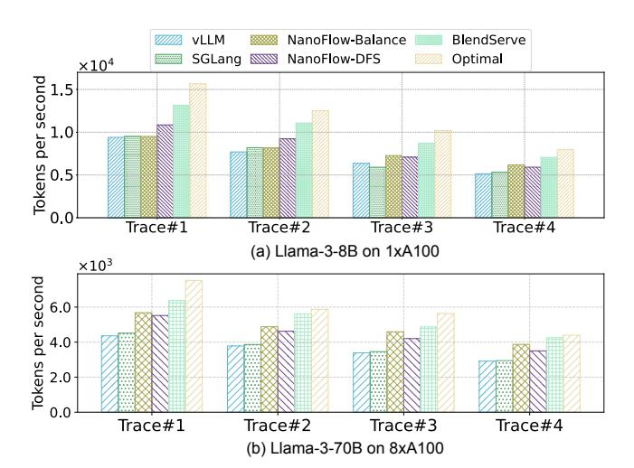
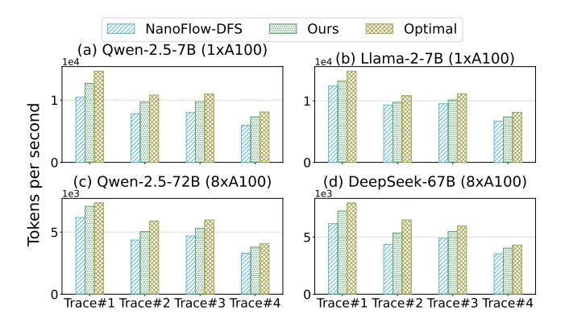

# <span id="page-9-4"></span>6 Implementation and Evaluation

## 6.1 Implementation

We developed the resource-aware prefix tree based on SGLang [\[73\]](#page-18-7) and enhanced it with node sorting and splitting driven by compute density. Our scheduler is implemented based on NanoFlow [\[76\]](#page-18-1), which incorporates chunked prefill and continuous batching to improve system performance [\[1,](#page-16-6) [68\]](#page-18-12). Our backend engine is built in C++ following NanoFlow's operator-level overlapping. It enables the simultaneous execution of compute-intensive operators like GEMM and memory-intensive operators like self-attention. We include more implementation details in § [A.2.](#page-13-2)

## <span id="page-9-3"></span>6.2 Experiment setup

Workload synthesizing. To the best of our knowledge, there is no open-sourced trace available for offline batch inference. Therefore, we synthesize our workloads by combining existing well-known single-modal traces, including two chatbot traces WildChat [\[70\]](#page-18-8), ShareGPT [\[40\]](#page-17-20), and two API services traces Azure-Trace [\[49\]](#page-17-12), BurstGPT [\[56\]](#page-18-9), one video generation trace OpenVid [\[36\]](#page-17-10) [2](#page-9-0) , and one benchmark MMLU [\[19\]](#page-17-1). Figure [2](#page-2-0) illustrates the length distribution and compute density of each trace. These single-modal traces have different representative characteristics: BurstGPT and Azure-Trace requests are highly compute-intensive, OpenVid requests are memory-intensive, while WildChat, ShareGPT have a mild compute density. Besides, MMLU requests have high prefix sharing. We synthesize a variety of multi-modal workloads with different prefix sharing ratio and compute density by combining different ratios of traces, based on which we demonstrate the effectiveness and generality of

<span id="page-9-1"></span>

|                   | Prefix Sharing<br>High | Low Prefix Sharing |
|-------------------|------------------------|--------------------|
| Compute-intensive | Trace#1 (1.4, 35%)     | Trace#3 (1.4, 5%)  |
| Memory-intensive  | Trace#2 (0.9, 35%)     | Trace#4 (0.9, 5%)  |

Table 2. Four representative synthesized workloads. Trace#X (A,B%) has a compute density of A, with a prefix sharing ratio of B%. For example, Trace#1 is compute-intensive with high prefix sharing, which has a compute density of 1.4 larger than 1 and a prefix sharing ratio of 35%. Note that 35% is a high prefix sharing ratio as most workloads have less than 20% as shown in Table [4.](#page-14-0) Without losing genericity, Figure [11](#page-11-0) shows more trace combinations and reports BlendServe's performance on them.

<span id="page-9-2"></span>

Figure 7. End-to-end throughput evaluation. BlendServe consistently outperforms baselines. For Llama-3-8B, BlendServe achieves an average speedup of 20.84% compared to the best baseline, NanoFlow-DFS. For Llama-3-70B, BlendServe provides an average improvement of 18.6% over NanoFlow-DFS. Notably, BlendServe achieves 86.55% of optimal throughput on average.

proposed BlendServe. Detailed methodology of synthetic workloads is described in Appendix § [A.3.](#page-14-1)

Table [2](#page-9-1) shows the four most representative workloads we mainly use in evaluation, which have different resource demands and prefix sharing ratios. Each synthesized workload is made from BurstGPT, MMLU, and OpenVid and contains at least 400, 000 requests, which require 5 A100 GPU hours and are large enough to reach a stable performance. Evaluation results on more ratios are presented in § [6.5.](#page-11-1) We also present results with other combinations of traces in § [A.4.](#page-14-2)

Models and hardware configurations. We evaluate Blend-Serve mainly with two widely-used open-sourced models, Llama-3.1-8B and Llama-3.1-70B [\[34\]](#page-17-9), on 1 and 8 A100 80GB SXM GPUs, respectively. To demonstrate the generality and robustness of BlendServe, we also evaluate models of different sizes with various numbers of GPUs, including Qwen-2.5-7B [\[8\]](#page-16-7) and Llama-2-7B [\[53\]](#page-18-21) on 1×A100, as well as Qwen-2.5-72B and DeepSeek-67B [\[16\]](#page-16-16) on 8×A100. Due to the GPU resource limit, we conduct these experiments with a cycleaccurate simulator as discussed in § [6.5.](#page-11-1) For the distributed

<span id="page-9-0"></span><sup>2</sup>We calculate the output length of a video generation request using the frames and quality of the videos in OpenVid.

setting, we enable tensor parallelism with the degree of 8 GPUs for all baselines.

Baseline frameworks. We use two widely used frameworks, vLLM [25] and SGLang [73], and a throughput-oriented framework, NanoFlow [76]<sup>3</sup>. We also include a latency SLOoptimized framework, DistServe [75], to compare P/D disaggregation in offline inference settings as detailed in § 6.3. We do not evaluate frameworks that are designed for resourceconstrained settings, e.g., FlexGen [42] and HeteGen [71]. For vLLM and SGLang, we enable prefix caching for both and reorder each workload trace into a DFS order, which can achieve a high prefix sharing ratio. For NanoFlow, we add prefix caching support for fair comparison. For each workload trace, we evaluate the performance of NanoFlow using both DFS (NanoFlow-DFS) and random ordering (NanoFlow-Balance). The improvement of BlendServe over NanoFlow-DFS demonstrates the advantage of achieving resource balance, while the improvement over NanoFlow-Balance would highlight the benefit of a higher prefix sharing ratio as random ordering can achieve a relatively balanced resource. Note that all baselines integrate continuous batching which performs scheduling at request-level granularity, with the only difference being the ordering of requests. As BlendServe focuses on improving GPU utilization, we do not measure CPU time to provide a fair comparison, including tokenizations, sampling, and scheduling [48], for all baselines. We discuss the CPU overhead in § A.5.

**Practical optimal throughput.** To assess how closely Blend-Serve's throughput approaches the optimal, we calculate optimal throughput with  $T_o$  defined in § 3.3. Due to the well-known performance interference issue in GPU hardware during spatial sharing [50, 76], simply deriving  $T_o$  with  $\max(T_{comp}, T_{mem})$  is impractical and unachievable. Therefore, to estimate a *practical upperbound*, we employ a profiling-based approach similar to prior works [14, 76]. Specifically, instead of directly using  $\max(T_{comp}, T_{mem})$  as the execution time, we profile the real execution time when overlapping GEMM with  $T_{comp}$  and attention with  $T_{mem}$ , which is then used to calculate the practical upperbound of  $T_o$ .

## <span id="page-10-0"></span>6.3 End-to-end throughput

Compared to existing frameworks. We measure the end-to-end throughput of BlendServe and all baselines, including vLLM-DFS, SGLang-DFS, NanoFlow-Balance, and NanoFlow-DFS. We define end-to-end throughput as all processed to-kens (including both input and output tokens) divided by the total processing time. For Llama-3-8B as shown in Figure 7 (a), with a small prefix sharing ratio (i.e., Trace#3 and #4), NanoFlow-Balance works better than NanoFlow-DFS since resource overlapping contributes to more throughput gain. However, with a large prefix sharing ratio, NanoFlow-DFS

<span id="page-10-2"></span>

**Figure 8.** End-to-end throughput (per GPU) evaluation when serving Llama-3-8B on 1×A100 GPU. BlendServe consistently outperforms baselines, including vLLM and P/D disaggregation. DistServe is less efficient when given more prefill clusters (e.g., 2P1D v.s. 1P2D) as selected workloads have more decode tokens.

achieves the highest throughput among all three baseline engines thanks to the high prefix sharing ratio and its operator-level resource overlapping. Since BlendServe is designed to leverage the best of both, it consistently outperforms the best baseline, NanoFlow-DFS, in all settings from 19.34% to 22.65%. Compared with vLLM-DFS, BlendServe achieves up to 1.44× throughput speedup. For Llama-3-70B in Figure 7 (b), BlendServe provides an average of 18.6% throughput improvement compared to NanoFlow-DFS, achieving 90.8% of practical optimal throughput. Note that NanoFlow provides higher throughput gain over vLLM compared to Llama-3-8B, due to the benefit of overlapping expensive communication operators with computation.

Compared to practical optimal throughput. As shown in Figure 7, BlendServe achieves an average 86.55% and 90.8% of the optimal one on Llama-3-8B/70B, respectively. As there is a gap between the heuristic-based dual-scanner and the optimal scheduling, it is non-practical to achieve the optimal throughput which requires perfect resource overlapping on each step. Nevertheless, BlendServe still closes this gap to as low as 13%, demonstrating its effectiveness in achieving both high prefix sharing ratio and high resource balance.

Compared to P/D disaggregation. We compare Blend-Serve with one popular design of P/D disaggregation, Dist-Serve [75], and cover several configurations including 1P1D, 1P2D, 2P1D, and 1P3D. Our implementation is based on SGLang where xPyD means x A100 GPUs are used as prefill clusters and y GPUs are used as decode clusters. We collect the average per-GPU throughput when serving Llama-3-8B on A100 GPUs to provide a fair comparison, following the same workload and setup in § 6.2. As shown in Figure 8, DistServe falls short on matching the throughput of vLLM under all configurations, which colocates prefill and decode. Despite being superior in latency-oriented settings where TTFT and TPOT could benefit from the disaggregated scaling and execution of prefill and decode, DistServe causes resource under-utilization due to the distinct resource usages of prefill and decode. Specifically, the memory bandwidth resources on prefill clusters are under-utilized by the

<span id="page-10-1"></span> $<sup>^3</sup>$ We use vLLM v0.6.3.post2.dev102 (commit: e26d37a1) and SGLang v0.3.4.post1 (commit: 3f5ac88) as comparison baselines.

<span id="page-11-2"></span>

**Figure 9.** Prefix sharing ratio of four representative traces in the end-to-end evaluation. Note that the optimal value is measured via a DFS order of the prefix tree. BlendServe consistently maintains the benefit of prefix sharing, achieving 97% of maximal values.

<span id="page-11-3"></span>

**Figure 10.** Compute and memory usages when serving Trace#2. BlendServe well balances compute and memory time across steps and achieves consistently high resource utilization, whereas NanoFlow-DFS suffers from fluctuating compute and memory time and under-utilizes at least one type of resource at each step.

compute-intensive prefill phases, and vice versa for compute resources in decode clusters.

## 6.4 Performance analysis

We now ablate the key factors contributing to BlendServe's performance improvement by showing prefix sharing ratio and hardware resource usage over time, corresponding to the two key design points introduced in § 3.3.

**Prefix sharing ratio.** To illustrate that BlendServe can achieve nearly optimal prefix sharing ratio, we collect the achieved prefix sharing ratio along with the maximal values. We manually exclude prefix sharing related to the recomputation of retracted requests. As shown in Figure 9, BlendServe achieves over 97% of the optimal prefix sharing ratio. In contrast, as the NanoFlow-Balance uses random ordering to interleave distinct requests without shared prefix locality, it fails below 30% of prefix sharing ratio. As a result, BlendServe provides an average of 1.36× throughput improvement compared to NanoFlow-Balance with Trace#1 and #2.

<span id="page-11-0"></span>

**Figure 11.** *Simulated throughput* improvement of BlendServe compared to NanoFlow-DFS on workloads synthesized from BurstGPT, MMLU, and OpenVid. We use different numbers of requests from these traces to compose workloads with different compute density and prefix sharing ratio. BlendServe consistently surpasses baselines, with an average of 1.23× throughput improvement.

Hardware resource usage. To demonstrate how effectively BlendServe balances resource usage, we visualize the compute and memory usage of BlendServe, NanoFlow-DFS, and NanoFlow-Balance in Figure 10. We select Trace#2, which has intensive memory usage and significant resource imbalance. For each step, we collect the execution time of compute-and memory-bound operators. BlendServe maintains stable compute and memory usage, whereas NanoFlow-DFS exhibits significant fluctuations, resulting in resource underutilization. For example, NanoFlow-DFS first under-utilizes memory bandwidth before 90*K* steps, then conducts excessive memory access. At the same time, NanoFlow-Balance achieves stable memory usage close to BlendServe. However, due to the massive recomputation and steep request length distribution, it still exhibits fluctuations in computation.

#### <span id="page-11-1"></span>6.5 Sensitivity study

To demonstrate the generality of BlendServe in real-world scenarios, we evaluate on more diverse synthetic workloads, with a large range of compute density and prefix sharing ratio. In addition to the four most representative workloads shown in Table 2, we conduct a grid search of compute density from 0.80 to 1.40 and prefix sharing ratio from 0.05 to 0.45 with step sizes 0.05 and 0.10, respectively. In total, we synthesize 65 workloads to compare BlendServe and the best-performed baseline NanoFlow-DFS. Due to limited GPU resources, we use the frontend scheduler of BlendServe to generate actual batch schedules that are the same as running on real GPUs, which are then fed into a *simulated GPU backend* to get the estimated inference time. For the backend simulation, we use polynomial fit to estimate the GPU

<span id="page-12-0"></span>

| Tput | Trace#1       | Trace#2       | Trace#3       | Trace#4       |  |
|------|---------------|---------------|---------------|---------------|--|
| DP=1 | 11080         | 8408          | 8403          | 6325          |  |
| DP=2 | 20561 (1.85x) | 16261 (1.93x) | 15623 (1.85x) | 12246 (1.93x) |  |
| DP=4 | 41928 (3.78x) | 32537 (3.86x) | 32026 (3.81x) | 24541 (3.88x) |  |

**Table 3.** *Throughput scalability* of BlendServe when serving Llama-3-8B with different DP sizes. BlendServe perfectly partitions requests among DP workers and scales near linearly.

<span id="page-12-1"></span>

**Figure 12.** *Simulated throughput* of BlendServe on different models with different number of GPUs. BlendServe consistently surpasses the best baseline, NanoFlow-DFS, with up to 24.4% improvement over 4 selected traces and models.

runtime when given a certain amount of compute and memory usage. Our calibration shows only a 0.91% difference between the real and simulation speedup over the four representative workloads on average. Therefore, our simulation results practically reflect real performance.

As shown in Figure 11, BlendServe consistently outperforms the baseline in all workloads by 14% to 34%, with an average speedup of 22.53%. Since both BlendServe and NanoFlow-DFS achieve near-optimal prefix sharing ratio, the inference throughput remains stable when prefix sharing ratio varies. However, the benefits BlendServe gains from resource overlapping tend to shrink with smaller compute densitys, potentially due to more severe GPU interference on memory-intensive workloads. Additionally, the relative speedup achieves its maximum of 1.34× when compute density is around 1.30, potentially because resource overlapping and GPU interference strike a balance under this ratio.

#### 6.6 Distributed deployment and other LLMs

In this section, we evaluate BlendServe's effectiveness and scalability in a distributed setting with data parallelism (DP). In addition, we evaluate BlendServe on four other models, including Qwen-2.5-7B, Llama-2-7B, Qwen-2.5-72B, and DeepSeek-67B, to show its general applicability.

**Data parallelism.** We evaluate the strong scalability of BlendServe with various numbers of DP nodes by serving Llama-3-8B on A100 GPUs, following the design in § 5.5 and

the same workload setup in Table 2. As shown in Table 3, throughput increases linearly with the number of DP nodes. **Other LLMs.** We also evaluate BlendServe when serving Qwen-2.5-7B and Llama-2-7B on 1× A100 GPU, as well as Qwen-2.5-72B and DeepSeek-67B on 8× A100 GPUs as shown in Figure 12. We redo the trace synthesis with the same recipe in § 6.2, as different models indicate different compute density. Note that due to the GPU resource limit, we use the *profile-guided simulation* as detailed in § 6.5 for this evaluation. Similarly, BlendServe improves throughput by an

average of 15.2% compared to NanoFlow-DFS and achieves

89.9% of practical optimal throughput on average.

#### 7 Discussion

**Distributed parallelisms.** BlendServe's design is generic to various parallelisms in distributed inference. We have discussed data parallelism (DP) and tensor parallelism (TP) in § 5.5, and demonstrate its effectiveness in the evaluation. In addition, BlendServe is compatible with various other parallelisms, including pipeline parallelism (PP), sequence parallelism (SP), and context parallelism (CP). For PP, as different pipeline stages will process identical batches sequentially while keeping each stage the same, BlendServe's scheduling can be directly adopted without modification. For SP [21] and CP [29], as attention and non-attention computation are sharded across SP/CP ranks, both the compute capability and memory bandwidth are scaled accordingly. Therefore, BlendServe is extended to SP/CP by including the scaled resources in the compute density calculation.

**Attention variants.** BlendServe is generic to attention variants, including MHA, MQA, GQA [2], and recently released MLA [16] and GLA [69], by considering the arithmetic intensity of the attention operator during compute density calculation. Specifically, BlendServe considers different variants by adapting the memory cost model Mem(r) (§ 4.1) towards the real execution time. We have included Llama-2-7B with MHA, Qwen-2.5-7B with GQA (of group size 7), and Llama-3-8B with GQA (of group size 4) in our evaluation.

End-to-end latency. Given the same set of requests, Blend-Serve has the lowest worst turnaround latency across requests because it has the highest throughput compared to existing frameworks. Furthermore, BlendServe can ensure the latency requirement of offline batch inference by only blending requests within a specified time window. For example, BlendServe processes the previous X-hour request pool while queuing the next X-hour requests, moving to the subsequent X-hour window after completing the current one.

#### 8 Related Work

**LLM serving optimizations.** Efficient LLM serving has been extensively studied for both online and offline scenarios. For online inference, Orca [68], vLLM [25], SGLang [73],

FastServe [60], and VTC [41] propose continuous batching, paged attention, prefix sharing, prefill-decode disaggregation, Multi-Level Feedback Queue scheduling, and Virtual Token Counter scheduling, respectively, to improve performance and/or fairness. For offline inference, FlexGen [42], PowerInfer [46], TwinPilots [67], HeteGen [71], Fiddler [24], and NEO [22] target resource-constrained settings where GPU memory is insufficient. These methods extensively leverage CPUs to offload model weights, activations, KV-cache, and computation. However, due to limited GPU/CPU interconnect bandwidth, offloading introduces significant GPU underutilization, leading to low throughput. Unlike these approaches, BlendServe focuses on throughput-oriented offline inference with resource-aware batching.

Resource overlapping techniques. Resource overlapping is a trendy approach to improve GPU utilization. Rammer [33] introduces operator-level overlapping for deep neural network compilers. NanoFlow [76] extends operator-level overlapping to LLM serving. Sarathi-Serve [1] and FastGen [20] apply phase-level overlapping to LLM serving. MuxServe [17] colocates models based on their popularity and resource characteristics, targeting resource-limited scenarios. Compared to them, BlendServe is the first to exploit request-level resource overlapping with request reordering.

#### 9 Conclusion

We present BlendServe, an offline batch inference system that maximizes both compute-memory overlapping and prefix sharing for near-optimal throughput. BlendServe exploits the relaxed latency objective in offline batch inference and reorders compute- and memory-intensive requests through a resource-aware prefix tree and a dual scanner searching algorithm. BlendServe achieves up to 1.44× higher throughput over vLLM and SGLang and 90% of the optimal throughput.

## A Appendix

## <span id="page-13-0"></span>A.1 Pseudoscope for node sort, split, and dual scan

#### **Algorithm 1** Layer-wise Sorting

```
1: function LAYER_SORT(ptr)
2: if ptr is not leaf node then
3: sort ptr.childList based on compute density
4: for cptr \in ptr.childList do
5: LAYER_SORT(cptr)
```

## <span id="page-13-2"></span>A.2 Implementation details

We introduce additional noteworthy details of our implementation in BlendServe here.

**Offline prefix tree.** We preprocess all requests and construct a prefix tree following a Trie Tree to capture their shared prefixes before serving. After compute density calculation and node sorting, we merge sub-trees into single nodes

## **Algorithm 2** Node Splitting

```
1: Initialize leaf list \leftarrow \{\}
 2: function NODE SPLIT(ptr, t)
        ptr.len_{prefix} \leftarrow length of prefix to ptr
 3:
        if ptr.len_{prefix} \cdot len(ptr.childList) > t then
 4:
 5:
            ptr.len_{prefix} \leftarrow ptr.len_{prefix} - ptr.len
 6:
            UPDATE_SUBTREE_DENSITY(ptr)
 7:
            append ptr to leaf_list
 8:
            for cptr \in ptr.childList do
 9:
10:
                NODE_SPLIT(cptr, \frac{t}{\text{len}(ptr.childList)})
11:
        if ptr is root node then
12:
            sort leaf_list based on compute density
```

