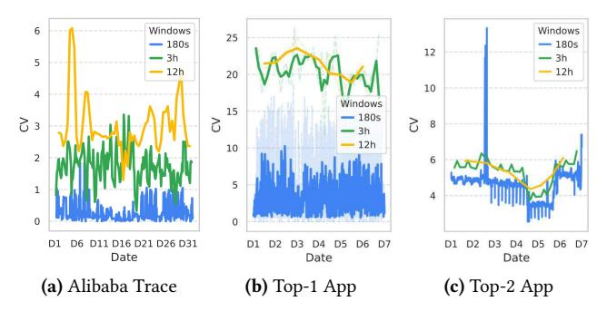

# 1 Introduction

The exponential growth in Large Language Model (LLM) parameters [\[6,](#page-14-0) [10,](#page-14-1) [12,](#page-14-2) [46,](#page-15-0) [47\]](#page-15-1) has created significant challenges for serving these models in production environments. With models scaling to hundreds of billions of parameters, deploying efficient inference systems requires distributed computing approaches as single-device execution becomes infeasible due to memory constraints [\[5,](#page-14-3) [30,](#page-15-2) [60\]](#page-16-1). Current serving systems primarily rely on two distributed paradigms: tensor parallelism, which distributes matrix operations across devices with high-bandwidth interconnects, and pipeline parallelism, which segments models into sequential stages with lower communication requirements [\[21,](#page-14-4) [26\]](#page-14-5). However, these approaches face substantial challenges when deployed in real-world serverless environments [\[27,](#page-14-6) [53\]](#page-15-3), particularly in balancing computational efficiency with resource adaptability under dynamic request patterns [\[57\]](#page-16-2) and fragmented cluster resources [\[51\]](#page-15-4).

Production analysis of Alibaba clusters [1](#page-0-0) revealstwo fundamental challenges that current LLM serving systems cannot address. i) workload volatility: request patterns exhibit extreme variability with coefficient of variation (CV) fluctuating up to 7× across timeframes (Fig. [1\)](#page-1-0), causing static pipelines to misalign with shifting workload characteristics [\[13,](#page-14-7) [57\]](#page-16-2) and resulting in 17% average GPU utilization. ii) resource fragmentation: serverless environments scatter GPUs across heterogeneous workloads [\[25,](#page-14-8) [51\]](#page-15-4), preventing

1Request distribution traces and GPU data are openly available at [https:](https://github.com/alibaba/clusterdata/tree/master/cluster-trace-v2026-GenAI) [//github.com/alibaba/clusterdata/tree/master/cluster-trace-v2026-GenAI](https://github.com/alibaba/clusterdata/tree/master/cluster-trace-v2026-GenAI).

the high-bandwidth interconnects essential for tensor parallelism [\[5,](#page-14-3) [60\]](#page-16-1). Our measurements show only 0.02% probability of co-locating 4 GPUs on the same server ([§3\)](#page-2-0), forcing suboptimal execution patterns. This architectural mismatch between model requirements and fragmented resource availability fundamentally undermines serving efficiency in elastic environments [\[27,](#page-14-6) [53\]](#page-15-3).

Existing systems [\[1,](#page-13-0) [14,](#page-14-9) [20,](#page-14-10) [22,](#page-14-11) [24,](#page-14-12) [26,](#page-14-5) [57\]](#page-16-2) employ sophisticated pipeline optimization techniques but fundamentally rely on static configurations that cannot adapt to dynamic environments. While these systems achieve impressive performance under stable conditions, they struggle with the dual challenges of workload volatility and resource fragmentation. For instance, AlpaServe [\[26\]](#page-14-5) optimizes pipeline architectures based on historical request patterns, focusing on long-term performance rather than adapting to short-term variability. Such static approaches inevitably create bottlenecks when faced with rapid workload fluctuations or when fragmented GPU resources prevent optimal tensor-parallel execution ([§3\)](#page-2-0). This mismatch between fixed pipeline designs and the dynamic reality of serverless environments results in significant inefficiencies during deployment.

To address these fundamental limitations, we introduce FlexPipe, a dynamically adaptive LLM serving system that performs inflight pipeline refactoring without service interruption. FlexPipe challenges the conventional wisdom that fixed pipeline configurations are necessary for consistent performance. Instead, it exploits a critical insight: pipeline granularity requirements fundamentally shift with workload characteristics. Fine-grained pipelines excel under bursty workloads by distributing buffering capacity across stages, while coarse-grained pipelines minimize communication overhead during stable periods. FlexPipe continuously transitions between these configurations based on real-time coefficient of variation metrics, achieving superior resource efficiency across the full spectrum of serverless request patterns.

However, implementing this approach presents three significant technical challenges: (1) determining optimal partition boundaries that balance computation and communication overhead while preserving computational graph constraints for future reconfiguration, (2) maintaining cache consistency during dynamic pipeline topology transitions without service interruption, and (3) navigating GPU resource fragmentation in highly dynamic serverless environments while minimizing cold-start initialization latency.

To address these challenges, FlexPipe introduces three core innovations: (1) Fine-grained model partitioning that decomposes LLMs through a constrained optimization algorithm, balancing computation and communication overhead while preserving computational graph constraints for efficient future reconfiguration; (2) Inflight pipeline refactoring that dynamically transitions between pipeline granularities without service interruption, using real-time monitoring

Figure 1. Request distribution CV (coefficient of variation) variations across different periods. Significant mismatches exist in CV calculated with different window sizes (180s, 3h, 12h), 7× variation exists. (a) Request distribution CV of Alibaba Trace, (b) Request distribution CV of Top-1 App, and (c) Top-2 App from Azure [\[58\]](#page-16-3).

and CV metrics to seamlessly reconfigure pipeline topologies while maintaining cache consistency; and (3) Topology-aware resource allocation that employs hierarchical resource coordination and memory-aware scheduling strategies to navigate GPU fragmentation, minimizing contention during parallel scaling operations while transforming cold starts into efficient warm starts through parameter locality preservation.

We evaluated our approach on a production-grade Kubernetes cluster with 42 servers and 82 GPUs using realistic workloads. Results demonstrate significant performance advantages: 38.3% lower latency under stable workloads and 66.1% improvement under variable conditions. For large models like OPT-66B, FlexPipe achieves 24.38% lower prefill latency compared to alternatives. Most importantly, our system maintains consistent performance as workload variability increases—recovering from pipeline stalls in just 9ms under high-CV conditions (82% faster than competitors) while achieving up to 8.5× better resource efficiency. In a production deployment, our dynamic resource allocation strategy reduced always-on GPU reservation from 75% to just 30% of peak capacity without compromising service quality, while decreasing resource allocation wait time by 85%. These results confirm that FlexPipe effectively addresses the fundamental challenges of resource fragmentation and request variability in serverless environments.

Contributions. Our key contributions include:

- A novel approach for dynamically reconfiguring pipeline architectures in response to changing request distributions without service interruption.
- A method for fine-grained model partitioning that enables efficient pipeline refactoring while preserving computational efficiency.
- A system for enhancing LLM inference elasticity through dynamic resource allocation and pipeline topology adaptation.
- Empirical evidence demonstrating FlexPipe's effectiveness through extensive evaluation on production-grade infrastructure with real-world workloads.

## 2 Background

#### 2.1 Distributed LLM Inference Paradigms

The exponential growth in LLM parameters has created fundamental conflicts between memory capacity and computational demands. With models scaling to hundreds of billions of parameters, single-device approaches face severe memory constraints, while inference scenarios encounter compute limitations under concurrent requests [32, 37, 50, 58]. Distributed parallel computing has emerged as the essential solution for large-scale model deployment [18, 47].

Tensor Parallelism: Tensor parallelism distributes tensor operations across multiple devices by partitioning matrix operations row-wise or column-wise [5, 60]. This approach effectively parallelizes multi-head attention mechanisms in Transformers and achieves optimal computational efficiency when GPUs are tightly coupled with high-bandwidth interconnects. However, tensor parallelism fundamentally depends on low-latency, high-bandwidth network communication (NVLink, InfiniBand) for frequent synchronization operations [30]. This network dependency becomes a critical bottleneck in fragmented environments where GPUs are distributed across different physical nodes with limited inter-node bandwidth. In such scenarios, the frequent allreduce operations required for tensor synchronization can dominate execution time, making tensor parallelism impractical for distributed deployments with commodity network infrastructure.

Pipeline Parallelism: Pipeline parallelism implements an inter-layer decoupling strategy, dividing models into sequential stages based on layer dependencies [5, 8, 15, 21, 34]. This approach employs asynchronous scheduling to achieve spatiotemporal overlap between computation and communication [26, 30]. The fundamental advantage of pipeline parallelism lies in its communication pattern: while tensor parallelism requires  $O(n^2)$  all-reduce communications per layer with *n* devices, pipeline parallelism reduces interstage communication to point-to-point transfers with O(1)complexity per stage. This dramatic reduction in communication overhead-from dense synchronization matrices to sparse sequential dependencies—enables pipeline parallelism to maintain performance even when network bandwidth is constrained or latency is high. The asynchronous nature of pipeline execution also enables natural load balancing across heterogeneous hardware configurations, as slower devices can process smaller pipeline stages without blocking faster ones. However, this communication efficiency comes with the inherent challenge of pipeline bubble overhead, where stages remain idle during pipeline fill and drain phases. Sophisticated micro-batching strategies and overlapping techniques are essential to amortize these bubbles and maintain high computational efficiency [21, 24].

#### 2.2 Serverless Challenges for LLM Serving

Serverless computing architectures promise enhanced hardware utilization through dynamic resource provisioning [35, 36, 56, 59]. However, the fundamental design philosophy of serverless platforms creates a fundamental tension with distributed LLM inference requirements.

Modern serverless schedulers [17, 59] implement antiaffinity policies that deliberately scatter service replicas across diverse physical nodes to prvent cascading failures. This spatial distribution conflicts directly with distributed LLM inference, which requires tightly coupled GPU clusters with high-bandwidth interconnects (e.g., NVLink, InfiniBand) for efficient tensor parallelism. The result is a paradoxical scenario: individual GPUs are abundant, but cohesive GPU clusters are scarce, fundamentally undermining communication-intensive parallelism strategies.

The serverless resource allocation model operates through dual-tier provisioning: *always-on resources* (60-75% of peak capacity) guarantee baseline service levels, while *elastic resources* handle demand spikes. This conservative approach, designed to prevent service outages, creates chronic underutilization during normal operations while still introducing multi-second scaling delays that violate sub-second response requirements for interactive LLM applications.

Beyond serverless, similar fragmentation challenges emerge in multi-tenant clusters enforcing strict isolation, edge computing deployments with heterogeneous hardware, and dedicated clusters supporting diverse workloads. The common thread across these environments is the fundamental tension between resource isolation policies designed for predictable performance and the collaborative access patterns required for efficient distributed inference.

This analysis reveals that resource fragmentation represents a fundamental systems challenge requiring adaptive pipeline architectures that maintain efficiency across diverse and changing resource landscapes, rather than static optimization approaches that assume stable resource topologies.

#### 3 Motivation

Optimizing parallel computing strategies is essential for efficient LLM inference, particularly in serverless environments with fragmented resources and fluctuating request patterns. Our systematic analysis reveals critical correlations between inference performance, pipeline architecture, and request distributions that fundamentally impact serving efficiency.

#### 3.1 Resource Fragmentation in Cloud

To understand resource characteristics in cloud environments, we conducted a two-week analysis of GPU resources from a major cloud provider. Our findings revealed a striking 216% average GPU subscription rate (Fig. 2a), indicating that two services typically share each GPU. Memory utilization

Table 1. GPU cluster statistics showing resource utilization patterns.

| Metric                     | Cluster C1 | Cluster C2 |  |  |  |
|----------------------------|------------|------------|--|--|--|
| Number of nodes            | 430        | 927        |  |  |  |
| Number of GPUs             | 468        | 1,175      |  |  |  |
| SM Utilization (%)         |            |            |  |  |  |
| Mean                       | 16.91      | 23.74      |  |  |  |
| Median (P50)               | 9.16       | 10.85      |  |  |  |
| P95                        | 80.53      | 85.37      |  |  |  |
| 10-30% utilization         | 31.26%     | 20.98%     |  |  |  |
| GPU Memory Utilization (%) |            |            |  |  |  |
| Mean                       | 43.48      | 50.92      |  |  |  |
| Median (P50)               | 28.78      | 53.69      |  |  |  |
| P95                        | 99.09      | 99.34      |  |  |  |
| 10-30% utilization         | 38.44%     | 17.78%     |  |  |  |

Note: C1 represents the inference-only cluster, while C2 is a hybrid traininginference cluster. Both employ dynamic resource scaling strategies.

presented significant variability (Table [1\)](#page-3-1), with P50 servers showing modest 20.3% GPU memory utilization while P99 servers approached saturation at 99.3%.

Resource availability analysis demonstrates severe constraints: securing a single GPU with >85% free memory occurs with only 8.7% probability, while co-locating 4 GPUs on the same server drops to 0.02%. This fragmentation stems from heterogeneous model deployments creating unpredictable memory patterns, performance isolation mechanisms fragmenting resources, and aggressive oversubscription maximizing utilization at the cost of availability.

The practical impact of this fragmentation is substantial. In production clusters, 78% of tensor parallelism requests were forced to degrade to pipeline parallelism due to unavailability of adjacent GPUs with high-bandwidth interconnects. This degradation fundamentally challenges distributed inference paradigms, as tensor operations designed for tightlycoupled execution must be reorganized into pipeline stages with higher communication overhead and suboptimal memory access patterns. Communication-intensive approaches like tensor parallelism require high-bandwidth interconnections between GPUs, yet the scattered distribution of available GPUs (Fig. [2b\)](#page-3-0) creates persistent misalignment between physical topology and logical requirements. The ephemeral nature of serverless GPU allocation further exacerbates this challenge, as optimal GPU configurations may remain available only briefly before reallocation—creating an inherent incompatibility between tensor-parallel computational models and the reality of fragmented cloud GPU environments.

This GPU fragmentation introduces significant operational challenges. Due to the immediate reallocation of released GPUs to competing workloads, production clusters typically adopts conservative scaling strategies—maintaining approximately 75% of historical peak GPU capacity as always-on resources, with the remaining 25% allocated through dynamic

Figure 2. Resource fragmentation in Alibaba. (a) GPU subscription rate averaging 216%, indicating significant resource overcommitment, and (b) Heatmap revealing spatially scattered GPU availability patterns that impede formation of high-bandwidth interconnected GPU groups needed for tensor parallelism.

Table 2. Performance metrics for different pipeline granularities.

| Stages | Load(s) | Compute(ms) | Comm.(ms) | Max Batch |
|--------|---------|-------------|-----------|-----------|
| 4      | 47.14   | 69.94       | 6.3       | 128       |
| 8      | 13.05   | 36.63       | 14.7      | 256       |
| 16     | 9.19    | 18.67       | 31.5      | 512       |
| 32     | 5.43    | 9.67        | 65.1      | 1024      |

Note: OPT-66B (120GB) performance with sequence length 4096 on A100 GPUs. Compute indicates per-stage inference time, Comm. represents inter-stage communication overhead, and Max Batch shows maximum supported batch size per configuration.

scaling. This approach produces a problematic trade-off: during normal operations, GPU utilization remains unnecessarily low (approximately 17% in our measurement study), yet during traffic spikes, the delayed provisioning of additional GPUs frequently causes SLO violations as scaling operations cannot keep pace with request bursts. The fundamental disconnect between idealized theoretical GPU allocation models and the reality of fragmented, ephemeral GPU availability creates a persistent efficiency gap in large-scale LLM serving.

Insight 1: Resource fragmentation in cloud environments significantly impedes communication-intensive parallelism strategies that rely on high-bandwidth interconnects, necessitating alternative approaches for distributed LLM inference.

## 3.2 Pipeline Granularity and Data Parallelism

Pipeline parallelism provides an effective solution for utilizing fragmented GPU resources in LLM inference. The granularity of pipeline stages—defined by operators or parameters per stage—fundamentally affects memory footprint, communication patterns, and computational characteristics. As shown in Table [2,](#page-3-2) finer-grained partitioning significantly reduces per-stage memory requirements, decreasing parameter loading time and per-stage inference latency, but introduces a critical trade-off: more stages cause proportionally increased inter-stage communication overhead.

In elastic serverless environments, fine-grained pipeline architectures offer significant advantages. Our experiments show 32-stage pipelines reduce parameter loading latency to just 5.43s—an 8.7× improvement over 4-stage configurations—enabling rapid establishment of data-parallel replicas during demand spikes. This reduction incurs a 65.1ms communication penalty per inference iteration, creating a trade-off between initialization speed and runtime efficiency.

Fine-grained partitioning creates a fundamental trade-off in memory efficiency: 32-stage pipelines achieve 8× larger batch sizes (1024 vs 128) than 4-stage configurations for OPT-66B, dramatically improving GPU tensor core utilization. This increased batch capacity amortizes communication overhead across more requests, creating a counterintuitive effect where higher communication costs are offset by improved computational efficiency.

This granularity trade-off reveals a fundamental architectural insight that directly motivates dynamic adaptation in serverless environments. The dichotomy between finegrained and coarse-grained pipeline configurations exposes an inherent temporal optimization problem: bursty serverless workloads demand fine-grained pipelines to achieve rapid horizontal scaling (8.7× faster initialization) and exploit large batch processing capacity (8× larger batches) during traffic spikes, while stable operational periods derive greater efficiency from coarser partitions that minimize per-request communication overhead through reduced inter-stage coordination. This creates a dynamic optimization landscape where the optimal pipeline configuration is fundamentally time-dependent and workload-sensitive. The strategic imperative becomes clear: systems must dynamically transition between these configurations—temporarily adopting finegrained architectures during demand surges to maximize elasticity and batch throughput, then reverting to coarsergrained configurations during stable periods to minimize communication penalties and optimize per-request latency.

Given the inherently bursty nature of serverless workloads, dynamic pipeline granularity adjustment becomes essential. During traffic spikes, fine-grained pipelines provide rapid scaling and increased batch processing capacity. As traffic stabilizes, transitioning to coarser-grained configurations minimizes per-request latency through reduced communication overhead, creating an optimal balance between elasticity and efficiency.

Insight 2: Fine-grained pipelines offer superior elasticity and batch processing capability during bursty workloads but incur communication overhead penalties. The optimal approach dynamically transitions between granularities—using finegrained configurations temporarily during traffic spikes and reverting to coarser pipelines when workloads stabilize.

#### 3.3 Pipeline Overhead in Request Distributions

Advanced pipeline systems [\[1,](#page-13-0) [5,](#page-14-3) [20,](#page-14-10) [26\]](#page-14-5) primarily optimize pipeline architectures offline using historical workload data for long-term performance. However, LLM inference in serverless environments demands short-term optimization: cloud

Figure 3. Impact of request distribution variability on pipeline performance. (a) Goodput decreases by 37% as CV increases from 0.1 to 8 due to resource contention; (b) Average queue length grows nearly 4× with increasing CV, indicating pipeline congestion; (c) Stall cycle ratio increases exponentially (22×) at high CV values, showing how static pipelines become inefficient under variable workloads.

providers need to quickly reclaim idle GPU resources, while multi-model services and multi-agent systems require locally optimized performance through concentrated resources. This fundamental mismatch between long-term optimization strategies and short-term load characteristics leads to significant performance degradation, manifested as pipeline bubbles and queuing delays.

As shown in Fig. [1,](#page-1-0) request distribution CV exhibits substantial fluctuation, with variation of up to 7× across different time windows. To quantify how this volatility impacts performance, we evaluated a static 4-stage OPT-66B pipeline under varying request distributions with a baseline QPS of 20. Fig. [3](#page-4-0) reveals the severe performance degradation caused by increasing workload variability across multiple dimensions. As CV increases from 0.1 to 8, goodput decreases by 37% (Fig. [3a\)](#page-4-0), while average queue length grows nearly 4× (Fig. [3b\)](#page-4-0)—clear indicators of pipeline congestion and request backpressure. Most critically, the pipeline stall cycle ratio increases exponentially, reaching 22× at high CV values (Fig. [3c\)](#page-4-0), demonstrating how static pipeline configurations become fundamentally inefficient under variable workloads.

Our experiments demonstrate that with the same 4-stage pipeline architecture, a 4× difference in CV leads to a nearly 10× increase in pipeline stall overhead (comparing CV=1 and CV=4). This exponential relationship reveals the critical importance of adapting pipeline structures to match request volatility patterns, as static configurations optimized for one CV value perform poorly when the request distribution changes.

To explore the relationship between pipeline architecture and load characteristics, we evaluated three pipeline models (4, 8, and 16 stages) under constant total request volume but varying CV values. As shown in Fig. [4,](#page-5-0) 4-stage and 8-stage architectures maintain excellent response time stability (approximately 0.5 seconds) under low CV conditions, while the 16-stage architecture's processing time increases to 1.2 seconds (2.7× longer). However, in high-burst scenarios (CV=4), the 16-stage architecture achieves average latency of only

**Figure 4.** Latency distribution across different request patterns. (a) Box plot comparing pipeline granularities across varying CV values, showing fine-grained pipelines perform better with high-variability workloads; (b) Detailed latency distribution for CV=4 with 4-stage pipeline, revealing significant variance from pipeline stalls.

*one-third* that of the 4-stage architecture, comparable to the latter's performance at CV=1.

This behavior can be explained through a stochastic process model that reveals the dynamic coupling between pipeline depth (S) and load burstiness (CV). While the theoretical delay of an S-stage pipeline is  $T_{pipe} = S \cdot \tau + (S-1) \cdot \delta$  (where  $\tau$  is single-stage service time and  $\delta$  is communication overhead), burst requests cause uneven workloads across stages. We established an extended G/G/S queuing model:

$$T_{total} = \underbrace{\frac{\rho^{S}}{S!(1-\rho)} \cdot \frac{CV_{a}^{2} + CV_{s}^{2}}{2}}_{\text{Queue Latency}} + \underbrace{\sum_{i=1}^{S} \left(\frac{\lambda_{i}}{\mu_{i} - \lambda_{i}}\right)}_{\text{Stage Congestion Delay}} \tag{1}$$

where  $\rho=\lambda/\mu$  represents system utilization,  $\lambda$  is arrival rate,  $\mu$  is service rate,  $CV_a$  and  $CV_s$  denote coefficients of variation for arrival intervals and service times respectively,  $\lambda_i$  is the arrival rate at stage i, and  $\mu_i$  is the service rate at stage i. As  $CV_a$  increases, increasing pipeline stages S produces two opposing effects: 1) fine-grained task segmentation reduces per-stage service time, alleviating congestion; 2) it increases cumulative pipeline register delays. Our experimental data indicates that when  $CV_a > 3$ , effect 1 dominates, and setting  $S \propto \sqrt{CV_a}$  achieves optimal latency. This explains why the 16-stage pipeline achieves a 3× performance improvement over the 4-stage pipeline at CV=4—the deeper pipeline *effectively absorbs peak loads through distributed buffering*.

**Insight 3:** Request distribution variability causes pipeline stage imbalances, resulting in different optimal architectures for various workloads. In highly bursty environments, deeper pipeline architectures can effectively absorb peak loads through distributed buffering, significantly outperforming static configurations.

## 4 System Overview

Based on our analysis of resource fragmentation, pipeline granularity trade-offs, and dynamic request patterns in serverless environments, we present FLEXPIPE, a dynamically adaptive LLM serving system designed to overcome these challenges. As illustrated in Fig. 5, FLEXPIPE comprises three synergistic components:

Figure 5. FLEXPIPE system architecture showing the three core components: ① Fine-Grained Pipeline Model Partitioning that decomposes LLMs at operator level for optimal adaptability, ② Inflight Pipeline Refactoring that dynamically adjusts pipeline granularity based on request patterns, and ③ Adaptive Pipeline Scaling that enables efficient resource allocation during traffic fluctuations.

Fine-Grained Pipeline Model Partitioning. This component performs operator-level decomposition of LLMs to create balanced pipeline stages optimized for both computation and reconfiguration potential. By analyzing computation graphs and establishing natural partition boundaries, it creates pipeline architectures ranging from coarse stages with minimal communication overhead to fine-grained stages that enable rapid scaling during bursty workloads.

Inflight Pipeline Refactoring. At FLEXPIPE's core, this component monitors request distributions and dynamically restructures pipeline topology without interruption. Using coefficient of variation (CV) metrics and queue monitoring, it selects optimal configurations that minimize stalls while maximizing resource utilization. The system seamlessly transitions between fine-grained pipelines (for high-CV traffic) and coarse-grained architectures (for stable workloads) through consistent parameter migration.

Adaptive Pipeline Scaling. This component orchestrates GPU allocation during traffic fluctuations through topology-aware scheduling. It implements a Hierarchical Resource Graph to coordinate parallel scaling while avoiding resource contention, and employs affinity-based scheduling to leverage parameter locality across scaling events, transforming cold starts into efficient warm starts through intelligent cache management.

Key Implementation Challenges. Implementing FLEXPIPE presents three critical technical challenges: (1) determining optimal operator-level partition boundaries that balance computation-communication trade-offs while preserving refactoring potential, requiring specialized constrained optimization algorithms; (2) maintaining state consistency during topology changes without service interruption through

efficient KV cache synchronization and coordinated parameter migration; and (3) navigating resource fragmentation while minimizing initialization delays using topology-aware allocation strategies that preserve parameter locality across scaling operations. These challenges represent the fundamental tension between dynamic adaptation and efficient resource utilization in serverless environments.

## 5 Fine-Grained Model Partitioning

To enable adaptation to varying request patterns, FLEXPIPE decomposes models into fine-grained pipeline stages that can be reconfigured at runtime. The core challenge lies in balancing communication overhead and computational efficiency while facilitating dynamic refactoring. This requires solving three critical issues: determining the optimal granularity that satisfies bandwidth constraints while enabling communication-computation overlap, maintaining performance stability across varying micro-batch sizes, and supporting seamless runtime pipeline transitions with minimal synchronization overhead.

FLEXPIPE initiates pipeline optimization through computation graph analysis and operator-level profiling. For a given model M with L layers, we first construct its computation graph G=(V,E) where vertices  $v_i\in V$  represent operators and edges  $e_{ij}\in E$  denote data dependencies. The Profiling module measures three critical metrics for each operator: computation time  $t_c(v_i)$ , parameter size  $s_p(v_i)$ , and activation size  $s_a(v_i)$ . To achieve optimal partitioning, we employ a dynamic programming algorithm that simultaneously considers communication-computation overlap and future refactoring needs.

The partitioning process solves a constrained optimization problem:

$$\min_{\{S_k\}} \sum_{k=1}^{K} \left| t_c(S_k) + \frac{s_p(S_k)}{B} - C \right| + \lambda \cdot R(S_k)$$
s.t. 
$$\bigcup_{k=1}^{K} S_k = V, \quad S_i \cap S_j = \emptyset \, \forall i \neq j$$

$$\max_{C} s_p(S_k) \leq M_{\text{GPU}}$$
(2)

where K denotes the number of stages,  $S_k$  represents the k-th stage containing a subset of operators, V is the complete set of operators in the computation graph,  $t_c(S_k)$  is the computation time of stage k,  $s_p(S_k)$  is the parameter size of stage k, B represents the inter-stage bandwidth, C is the target computation-communication overlap cycle,  $M_{\text{GPU}}$  is the GPU memory capacity, and  $\lambda$  is a regularization weight. The regularization term  $R(S_k)$  encodes the refactoring potential of each partition, favoring cuts that preserve hierarchical structure boundaries (e.g., attention blocks in Transformers) to facilitate future merging. This formulation ensures

balanced stage execution times while creating natural breakpoints for potential pipeline reconfiguration.

For micro-batch adaptation, we introduce batch-aware transmission scaling:

$$s_a(S_k, b) = s_a^{base}(S_k) \cdot \left(1 + \alpha \log \frac{b}{b_{base}}\right) \tag{3}$$

where b is the micro-batch size,  $b_{\rm base}$  is the profiling batch size, and  $\alpha$  is the compression factor learned from historical data through linear regression. This allows the system to predict communication patterns for arbitrary batch sizes during online serving. Crucially, the partitioning algorithm preserves the parameter grouping structure to enable future replica alignment - parameters within the same logical group (e.g., attention heads or MLP blocks) are colocated in contiguous memory regions, allowing merged stages to reuse existing memory layouts.

