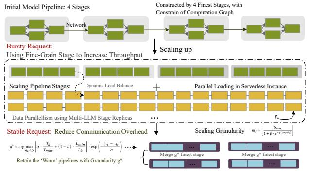

# 7 Adaptive Pipeline Scaling

Serving LLMs in serverless, dynamic request patterns require responsive resource allocation strategies to maintain service quality during both peak and idle periods. To address service demands during traffic bursts, we propose a dynamic-aware pipeline scaling mechanism. This mechanism leverages dynamic batching [13] to monitor request queue status, combined with stage-level elastic scaling to balance performance and overhead. As shown in Fig. 7, the system performs distributed stage scaling during traffic peaks and automatically reclaims resources when requests subside.

Elastic Scaling Granularity Decision. Selecting the scaling granularity requires balancing three key parameters: ① fine-grained scaling (stage-level) reduces cold-start time but increases communication overhead, while coarse-grained scaling (pipeline-level) does the opposite; ② the coefficient of variation (CV) of traffic reflects request volatility, with high CV scenarios requiring rapid response; ③ queue length (Q) characterizes the urgency of system load. We establish a scaling granularity decision function:

$$m_j = \left\lfloor \frac{G_{\text{max}}}{1 + \beta \cdot e^{-\gamma(cv_j \cdot \hat{q}_j)}} \right\rfloor$$
 (11)

where  $m_j$  is the selected scaling granularity for workload j,  $G_{\max}$  is the maximum scaling granularity (corresponding to the finest granularity),  $cv_j$  is the coefficient of variation for workload j,  $\hat{q}_j = \min(q_j/Q_{\max}, 1)$  is the normalized queue length with  $q_j$  being the current queue length and  $Q_{\max}$  being the maximum queue capacity, and  $\beta$ ,  $\gamma$  are calibration parameters controlling the sigmoid transition. As the product  $cv_j \cdot \hat{q}_j$  increases, the exponential term decays more rapidly, pushing  $m_j$  closer to  $G_{\max}$  to select a finer granularity. This function smoothly adjusts the scaling granularity through its Sigmoid characteristics, avoiding decision oscillation. While

**Figure 7.** The process of model scaling using fine-grained pipeline stages. FLEXPIPE conference satisfies the minimum granularity pipeline stage for loading and executing inference. Then, after traffic changes, it modifies to a coarser granularity pipeline stage with fewer additional overheads.

integrating SLO constraints to ensure service quality:

$$\frac{(T_j - S_j) \cdot \sum_{k=1}^{m_j} \mu_{jk}}{Q_j} \ge r_j \tag{12}$$

where  $T_j$  is the SLO deadline for workload j,  $S_j$  is the initialization time for scaling operations,  $\mu_{jk}$  represents the expected throughput of the k-th expanded stage,  $m_j$  is the number of scaling stages,  $Q_j$  is the current queue length for workload j, and  $r_j$  is the number of requests to be processed within the deadline. This constraint ensures that the selected granularity  $m_j$  can process  $r_j$  requests within the time limit  $T_j$ .

To address resource contention during multi-model scaling that arises from multiple concurrent requests for GPU memory, PCIe bandwidth, and network resources during rapid parallel deployment, we design a three-level coordination control strategy:

**Topology-Aware Resource Coordination.** During rapid scaling operations, resource contention emerges as multiple models simultaneously compete for GPU memory, network bandwidth, and storage I/O. To address this challenge, we implement a *Hierarchical Resource Graph* (HRG) that orchestrates resources across three critical levels: server (GPU memory, PCIe bandwidth), rack (network bandwidth), and cluster (storage I/O).

The HRG maintains annotated paths with scaling event markers to identify contention patterns and track resource dependencies. This enables the system to **proactively predict** bottlenecks and intelligently distribute workloads. Rather than treating scaling operations as independent events, HRG directs new instances toward available resources while avoiding paths with recent scaling activities, effectively transforming a *resource contention problem* into a *resource coordination opportunity*.

This topology-aware approach ensures concurrent scaling operations distribute optimally across the physical infrastructure. By respecting the hierarchical nature of datacenter resources, the system makes informed placement decisions that significantly reduce initialization latency during traffic bursts while maintaining performance isolation between competing workloads.

Memory-Aware Elastic Scaling. In serverless environments, scaled-down model instances have their resources immediately reallocated to competing workloads. This causes cache invalidation, forcing subsequent scale-up operations to incur significant cold-start penalties as parameters reload from slower storage. To address this challenge, FLEXPIPE implements a two-pronged memory-aware approach preserving locality across scaling operations. First, the system maintains parameter copies in host memory even after GPU eviction, creating a middle-tier cache that survives instance termination and prevents costly reloads from persistent storage. Second, FLEXPIPE implements an affinity-based scheduling policy prioritizing servers with historical model placement:

$$s^* = \arg\max_{s \in \mathcal{H}_i} \left( w_t \cdot e^{-\lambda(t_{now} - t_s)} + w_g \cdot |g_s \cap G_{avail}| \right) \quad (13)$$

where  $s^*$  is the selected server,  $\mathcal{H}_i$  tracks servers that previously hosted model  $i, w_t$  and  $w_g$  are temporal and GPU affinity weights respectively,  $t_{now}$  is the current time,  $t_s$  is the last time server s hosted model  $i, \lambda$  is the temporal decay rate,  $g_s$  is the set of GPUs on server s,  $G_{avail}$  represents available GPUs, and  $|g_s \cap G_{avail}|$  denotes the number of available GPUs on server s. The temporal decay factor  $e^{-\lambda(t_{now}-t_s)}$  prioritizes recently used hosts whose caches are likely still warm. This approach significantly reduces initialization time by leveraging cached parameters in host memory, effectively transforming cold starts into warm starts.

## 8 Implementation

We have implemented FLEXPIPE with approximately 7K lines of code, including a 3.2K LoC tool for dynamic operator-level model partitioning and merging. After pipeline refactoring, KV cache data must migrate between GPU devices. Using NCCL would introduce significant connection establishment overhead of several seconds and potential bandwidth contention. To address this challenge, we implemented a hierarchical data transfer mechanism that prioritizes RDMA for high-bandwidth, low-latency transfers between GPU devices. For machines without RDMA support, we fall back to the sendfile system call, which enables efficient kernel-space data transfers without redundant copying between user and kernel buffers. This hybrid approach eliminates connection initialization overhead while achieving near-line-rate data transmission speeds.

#### 9 Evaluation

We evaluated FLEXPIPE on a Kubernetes (v1.23.7) cluster with 42 servers and 82 GPUs, each server having at least

256GB memory and connected via 100Gbps network. For realistic workload patterns, we utilized Microsoft Azure Functions traces [\[58\]](#page-16-3) supplemented with the Splitwise corpus for prompt generation, enabling rigorous assessment under production-grade request distributions.

Baseline. We compare FlexPipe against two categories of systems. First, serverless-based systems: ServerlessLLM [\[17\]](#page-14-16), which uses DeepSpeed's parallelism for distributed inference, and Tetris [\[25\]](#page-14-8), which provides memory-efficient hosting without specialized pipeline parallelism. Second, offline-optimized systems: AlpaServe [\[26\]](#page-14-5), which configures pipelines based on historical request patterns, and MuxServe [\[14\]](#page-14-9), which employs statistical multiplexing for multi-tenant serving. We also include recent advances in throughputlatency optimization [\[1\]](#page-13-0) and interference mitigation [\[20\]](#page-14-10) to provide comprehensive comparison coverage. These systems lack the dynamic adaptation capabilities of FlexPipe, allowing us to evaluate both serverless efficiency and adaptability against established approaches.

Metric and Model. We evaluate performance using goodput (throughput under quality constraints) and end-to-end latency across varying workload distributions. Experiments use representative models spanning different scales: WHISPER-9B [\[33\]](#page-15-11), LLAMA2-7B [\[47\]](#page-15-1), BERT-21B [\[12\]](#page-14-2), and OPT-66B [\[10\]](#page-14-1). We measure initialization latency to validate our pipeline scaling approach, quantify pipeline stall cycles to assess inflight refactoring effectiveness, and analyze GPU memory efficiency to evaluate resource utilization. These metrics provide comprehensive insight into system performance under diverse conditions.

## 9.1 End-to-End Performance

Latency Breakdown. We analyzed end-to-end latency across systems under varying request distributions (Fig. [8\)](#page-10-0) while maintaining consistent goodput. Under stable workloads (CV=1), FlexPipe achieves 38.3% lower overall latency than AlpaServe and ServerlessLLM while delivering identical goodput (12,000 requests), primarily by reducing queue time by 54.8%. As request variability increases (CV=2), FlexPipe's advantage grows to 46.9% lower latency than MuxServe through a strategic trade-off: accepting higher communication time (105ms vs. 45ms) to achieve 72.6% reduction in queue wait time, all while maintaining maximum goodput. The most significant improvements appear under highly variable workloads (CV=4), where FlexPipe delivers 66.1% lower total latency than AlpaServe and 80.6% lower than MuxServe, while preserving 98.3% of maximum throughput (compared to MuxServe's 33.3% reduction and ServerlessLLM's 40.4% decline). These gains stem from FlexPipe's pipeline reconfiguration that increases communication overhead (225ms vs. 45ms) to dramatically reduce queue times—transforming exponentially growing wait times into manageable communication overhead. This demonstrates a key insight: under bursty

Figure 8. End-to-End Latency Breakdown across varying request distributions. FlexPipe maintains lower overall latency despite higher communication overhead by significantly reducing queue wait times: (a) CV=1 (stable workload), (b) CV=2 (moderate variability), and (c) CV=4 (highly variable workload).

Figure 9. Latency under highly variable workload (CV=8, first 300s). (a) Request distribution CV variability measured in 15s windows, (b) Response latency comparison across systems.

workloads, communication-intensive fine-grained pipelines significantly outperform static architectures trapped in queue buildup cycles.

All experiments used a baseline of 20 QPS across the complete 2-hour lifecycle, with different CV values creating varying peak loads. While static approaches typically provision GPU resources to match peak volumes, FlexPipe maintains only 30% of peak capacity as always-ready resources, with remaining capacity allocated through dynamic scaling. This resource allocation strategy enables FlexPipe to maintain stable performance and consistent goodput across all workload variability levels while static systems suffer progressively degrading performance as request patterns become more erratic.

Burst Absorption. Fig. [9](#page-10-1) demonstrates system performance under extreme workload variability (CV=8). Fig. [9\(](#page-10-1)a) reveals substantial fluctuations in 15-second measurement windows, with CV ranging from 0.59 to 3.47—highlighting the challenging dynamics of bursty serverless environments. As shown in Fig. [9\(](#page-10-1)b), while MuxServe experiences sustained high latencies (frequently exceeding 10 seconds) and AlpaServe exhibits periodic performance spikes, FlexPipe

Figure 10. Performance stability analysis across varying request distributions (CV=1, 2, 4), showing FlexPipe maintains consistently lower latency percentiles even as workload variability increases in serverless.

maintains significantly lower and more consistent response times throughout the evaluation period, even during intense traffic surges at 75s and 165s intervals.

This comparison specifically includes non-serverless GPU multiplexing systems because they represent the SOTA in handling variable workloads through GPU sharing [\[1,](#page-13-0) [20\]](#page-14-10), yet fundamentally differ from FlexPipe in their adaptation approach. Unlike serverless-oriented systems that focus on rapid resource provisioning, these multiplexing systems optimize for maximum GPU utilization through sophisticated sharing strategies—providing the most challenging performance baseline for FlexPipe's dynamic adaptation mechanism. The results demonstrate that even compared to systems specifically designed for workload variability, FlexPipe's dynamic pipeline refactoring capability more effectively absorbs request bursts by transitioning between pipeline granularities based on real-time traffic patterns. By using finergrained pipelines during traffic spikes and coarser configurations during stable periods, FlexPipe avoids the queuing delays that plague static architectures, resulting in more predictable performance even under highly variable workloads.

#### 9.2 Performance Stability

To evaluate system stability under dynamic serverless workloads, we analyzed latency percentiles across varying request distributions (Fig. [10\)](#page-11-0). We focus specifically on Serverless-LLM and Tetris as representative serverless LLM deployment approaches facing unique resource elasticity and fragmentation challenges.

Under stable traffic patterns (CV=1), FlexPipe maintains a tight latency distribution with significantly lower P99 latency compared to ServerlessLLM and Tetris. This advantage becomes increasingly pronounced as request variability intensifies. At moderate variability (CV=2), FlexPipe's P99 latency remains well-controlled while serverless competitors show substantial degradation. The stability gap widens further under highly variable workloads (CV=4), where FlexPipe consistently maintains much lower P99 latency compared to both ServerlessLLM and Tetris, demonstrating superior performance stability even in challenging conditions.

FlexPipe's dynamic pipeline refactoring prevents the exponential latency degradation observed in static serverless

Figure 11. Pipeline stall recovery time across systems and request distribution variability (CV). FlexPipe achieves substantially faster recovery under high-variability workloads (9ms at CV=4), demonstrating the effectiveness of dynamic pipeline refactoring in addressing structural stall causes.

architectures. The latency percentile analysis shows Flex-Pipe maintains consistently lower latency across all percentiles—particularly at P90-P99 where traditional systems exhibit dramatic increases. This advantage becomes more pronounced as CV increases from 1 to 4, with FlexPipe maintaining well-controlled P99 latency while competitors experience 2-3× degradation. Such predictability is crucial in serverless environments where resource fragmentation introduces natural variability. By dynamically adjusting pipeline granularity based on workload characteristics, FlexPipe effectively transforms queueing delays into manageable communication overhead, delivering significantly more stable performance under challenging conditions.

