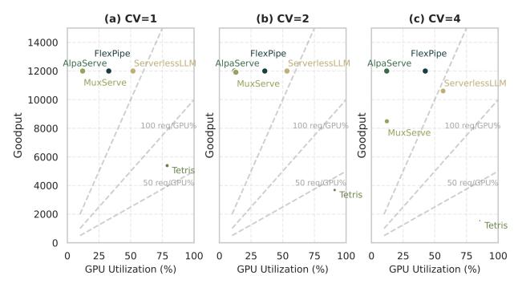

# 9.3 Pipeline Stall Recovery

To quantify each system's resilience to pipeline stalls, we established an objective measurement methodology. We define a stall as occurring when response latency exceeds 1.5× the baseline latency (P25 latency under normal operation), and recovery as the point when latency returns to within 1.2× of this baseline. The elapsed time between these events constitutes the recovery duration.

Fig. [11](#page-11-1) illustrates recovery performance across systems under varying request distributions. Under stable workloads (CV=1), FlexPipe's median recovery time (88ms) is comparable to AlpaServe (83ms), while significantly outperforming MuxServe (131ms), ServerlessLLM (115ms), and Tetris (179ms). As variability increases to moderate levels (CV=2), FlexPipe maintains consistent recovery performance (79ms) while other systems show mixed behavior.

The most significant advantage emerges under highly variable workloads, where FlexPipe achieves remarkably rapid recovery (9ms)—44% faster than AlpaServe (16ms) and 82% faster than both MuxServe (48ms) and ServerlessLLM (50ms). This exceptional performance stems from FlexPipe's ability to dynamically reconfigure pipeline topology in response to detected imbalances, rather than merely adjusting batch sizes or waiting for queue drain as static systems must do.

When a stall is detected, FlexPipe's pipeline monitoring system identifies congested stages through distributed queue-length analysis, then initiates targeted refactoring to redistribute computational bottlenecks. By maintaining KV cache consistency during transitions (as described in [§6\)](#page-6-0),

Figure 12. Resource efficiency analysis across varying request distributions: (a) CV=1 (stable workload), (b) CV=2 (moderate variability), (c) CV=4 (high variability).

FlexPipe achieves architectural adaptation during live inference without service interruption—transforming potential performance-degrading stalls into brief transitional states and enhancing system resilience under variable workloads.

