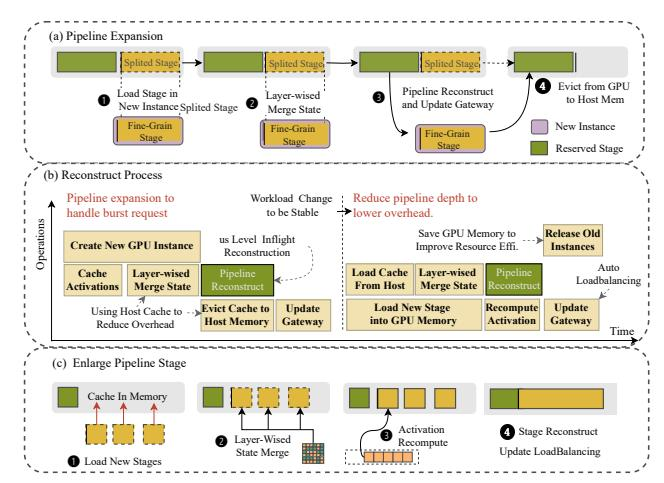

# <span id="page-6-0"></span>6 Inflight Pipeline Refactoring

The dynamic nature of cloud environments and the resource fragmentation challenges identified earlier necessitate a flexible approach to pipeline management. To address this, we design an inflight pipeline refactoring mechanism (Fig. 6) that can dynamically adjust pipeline granularity during model serving without service interruption. The core challenge lies in dynamically adjusting pipeline granularity under timevarying request distributions while maintaining hardware efficiency and consistency.

We formulate this as a multi-objective optimization problem with temporal constraints. Let  $\mathcal{G} = \{g_1,...,g_K\}$  denote the set of candidate pipeline granularities, where each granularity  $g_k = (\eta_k, b_k)$  corresponds to stage count  $\eta_k$  and batch size  $b_k$ . The temporal correlation of request patterns is captured by coefficient of variation (CV)  $v_t = \frac{\sigma_t}{\mu_t}$ , where  $\sigma_t$  and  $\mu_t$  represent the standard deviation and mean of request arrival intervals at time t, respectively.

#### 6.1 Granularity Adaptation

The optimal granularity  $g^*$  is determined through joint optimization of throughput and latency, balancing the trade-off between processing speed and response time:

$$g^* = \arg\max_{g_k \in \mathcal{G}} \left[ \alpha \cdot \frac{T_k}{T_{max}} + (1 - \alpha) \cdot \frac{L_{min}}{L_k} \right] \cdot \exp\left( -\frac{|\nu_t - \nu_k|}{\sigma} \right)$$
(4)

where  $g_k = (\eta_k, b_k)$  represents granularity configuration k with stage count  $\eta_k$  and batch size  $b_k$ ,  $\mathcal{G}$  is the set of candidate granularities,  $T_k$  and  $L_k$  denote throughput and latency for granularity  $g_k$ ,  $T_{max}$  and  $L_{min}$  are normalization constants,  $v_t$  is the current CV value at time t,  $v_k$  represents the optimal CV threshold for granularity  $g_k$ ,  $\alpha \in [0,1]$  is the throughput-latency trade-off weight, and  $\sigma$  controls adaptation sensitivity. Intuitively, this formula finds the sweet

spot between maximizing throughput (first term) and minimizing latency (second term), while the exponential term ensures the selected granularity aligns with the current request pattern. When request patterns are stable (low CV), the system favors coarser granularity to reduce communication overhead; when requests become bursty (high CV), it shifts toward finer granularity to enable rapid scaling.

For multi-granular data parallelism, we introduce a hierarchical scheduling framework that determines the optimal number of parallel instances for each granularity level:

<span id="page-7-4"></span>
$$\mathcal{M}(g_k) = \left\lfloor \frac{\mu_{total}}{\mu_k} \right\rfloor, \quad \mu_k = \frac{T_k}{\beta_1 + \beta_2 \cdot \eta_k}$$
 (5)

where  $\mathcal{M}(g_k)$  indicates the number of parallel instances for granularity  $g_k$ ,  $\mu_{total}$  is the total system processing capacity,  $\mu_k$  is the effective processing capacity per instance of granularity  $g_k$ ,  $T_k$  is the throughput of granularity  $g_k$ ,  $\beta_1$  and  $\beta_2$  are coordination overhead coefficients that model performance degradation from pipeline coordination, and  $\eta_k$  is the number of stages in granularity  $g_k$ . This approach dynamically distributes computational resources across different granularity levels based on their efficiency—finer granularities enable quicker scaling but incur higher coordination overhead, while coarser granularities optimize steady-state performance but adapt more slowly to load changes.

#### 6.2 Hardware Efficiency Optimization

In fragmented cloud environments, efficient GPU allocation becomes critical when multiple models with varying pipeline granularities compete for limited resources. The fundamental challenge lies in balancing resource sharing efficiency against performance isolation requirements. Our key insight is that heterogeneous models can achieve superior resource utilization when their computational patterns complement each other—reducing GPU idle periods while maintaining service quality.

To address this challenge, we formulate GPU resource allocation as a constrained optimization problem that maximizes system efficiency while respecting hardware and performance constraints:

$$\max_{\{x_{ij}\}} \sum_{i=1}^{N} \sum_{j=1}^{M} \left[ \frac{T_{ij}}{m_j} - \gamma(CV_i) \cdot \mathbb{I}(\sum_{i'} x_{i'j} > 1) \right]$$
 (6)

s.t. 
$$\sum_{i=1}^{N} x_{ij} \cdot m_j \le M_j, \quad \forall j \in [1, J]$$
 (7)

$$\left| \frac{T_{ij}}{T_{i'j'}} - 1 \right| \le \epsilon, \quad \forall i, i' \in \mathcal{G}_k$$
 (8)

**Problem Formulation:** The objective function maximizes throughput efficiency  $\frac{T_{ij}}{m_j}$  while penalizing multiplexing overhead through  $\gamma(CV_i)$ . Here,  $x_{ij} \in \{0,1\}$  indicates whether pipeline stage i is assigned to GPU j,  $T_{ij}$  represents the throughput of stage i on GPU j, and  $m_i$  denotes memory

<span id="page-7-0"></span>

**Figure 6.** Inflight pipeline refactoring mechanism. (a) Stage refinement process where fine-grained partitioning occurs by evicting parameters and redistributing them onto additional GPUs; (b) Temporal sequence diagram showing synchronization protocol during refactoring; (c) Stage consolidation process where parameters from multiple stages are merged, utilizing host memory caching to minimize loading overhead from persistent storage.

consumption. The memory constraint (Eq. 7) ensures that total memory allocation across all stages assigned to GPU j does not exceed its capacity  $M_j$ . The load balancing constraint (Eq. 8) maintains balanced computation times across stages within the same granularity group  $\mathcal{G}_k$ , preventing pipeline stalls caused by stage imbalances.

FLEXPIPE also *strictly prohibits* multiple pipeline stages from the same model from being allocated to the same GPU. This is critical for preserving performance isolation and preventing resource contention between stages of the same model, as they typically exhibit similar computation patterns and would compete for the same GPU resources rather than complementing each other. By ensuring that different pipeline stages of the same model—regardless of their granularity—are always deployed on separate GPUs, FLEXPIPE *maximizes parallelism while minimizing interference*, creating an optimal balance between resource utilization and computational efficiency.

**Multiplexing Penalty Function:** The penalty function  $\gamma(CV_i)$  models the performance degradation from resource multiplexing based on workload variability:

<span id="page-7-3"></span>
$$\gamma(CV_i) = \gamma_0 \cdot (1 + \alpha \cdot CV_i^2) \tag{9}$$

<span id="page-7-2"></span><span id="page-7-1"></span>where  $\gamma_0$  represents the base multiplexing penalty and  $\alpha$  controls sensitivity to workload variability. The quadratic relationship  $CV_i^2$  reflects our empirical observation that bursty workloads (high CV) create significantly more performance interference when multiplexed due to concurrent resource demand spikes. For stable workloads (low CV), the penalty approaches the minimal  $\gamma_0$ , enabling efficient resource sharing. The indicator function  $\mathbb{I}(\sum_{i'} x_{i'j} > 1)$  applies this penalty only when multiple models share the same GPU, ensuring that single-model deployments incur no multiplexing overhead.

## Algorithm 1: Inflight Pipeline Refactoring

```
1: Initialize granularity set G = \{g_1, ..., g_K\}
 2: while True do
        Monitor request intensity \lambda_t and compute
        characteristic velocity v_t = \frac{\partial \lambda_t}{\partial t}
        Update queue length \hat{q}_i
 4:
        for each granularity q_k \in \mathcal{G} do
 5:
           Compute optimization score:
 6:
           S_k = \left[\alpha \cdot \frac{T_k}{T_{max}} + (1 - \alpha) \cdot \frac{L_{min}}{L_k}\right] \cdot \exp\left(-\frac{|\nu_t - \nu_k|}{\sigma}\right) Evaluate hardware efficiency using Eq. 9
 7.
 8:
        Select optimal granularity g^* = \arg \max_{q_k \in G} S_k
10.
11:
        if g^* \neq g_{current} then
           Determine required data parallelism using Eq. 5
12:
           Perform parameter migration with consistency:
13:
               C(t) = \bigcup_{i \in GPUs} KV_i(t) \otimes M_{valid}
14:
           Update routing metadata and activate new
15:
           pipeline configuration
        end if
16:
        Wait until next optimization interval
```

This formulation addresses the fundamental tension between resource efficiency and performance isolation in fragmented environments. By dynamically adjusting the multiplexing penalty based on workload characteristics, the system makes informed decisions about resource consolidation versus isolation—prioritizing consolidation for stable workloads while maintaining isolation for bursty patterns that would otherwise create performance interference.

## 6.3 Consistency Maintenance

18: end while

During pipeline refactoring, maintaining KV cache consistency across distributed GPU instances represents a fundamental challenge that directly impacts inference quality. The key insight is that cache coherence can be preserved through selective synchronization rather than global state replication. We implement a consistency protocol that tracks cache validity at the token level:

$$C(t) = \bigcup_{i \in GPUs} KV_i(t) \otimes M_{\text{valid}}$$
 (10)

where C(t) represents the consistent KV cache state across all GPUs at time t,  $KV_i(t)$  represents the KV cache state on GPU instance i at time t,  $M_{\text{valid}}$  is a validity mask identifying tokens that need synchronization (with 1 indicating valid tokens and 0 indicating invalid ones), and  $\otimes$  denotes elementwise multiplication. During pipeline refactoring, the system performs asynchronous KV cache transfers (Fig. 6(b)) while the inference continues on the original pipeline configuration, minimizing service interruption.

The refactoring algorithm operates through continuous workload monitoring and predictive adaptation. FlexPipe tracks request intensity gradients to anticipate traffic shifts before they manifest as performance degradation, enabling proactive rather than reactive optimization. When workload characteristics deviate from the current pipeline's optimal operating range, the system evaluates alternative configurations using cached performance profiles. This predictive approach transforms pipeline adaptation from a costly reactive process into an efficient proactive mechanism. The refinement process (Fig. 6(a)) partitions computational stages when burst capacity is needed, while consolidation (Fig. 6(c)) merges stages during stable periods to minimize communication overhead. Decision latency remains under 5ms across configurations spanning 2-32 pipeline stages, ensuring that adaptation benefits consistently exceed transition costs even under rapidly changing workloads.

