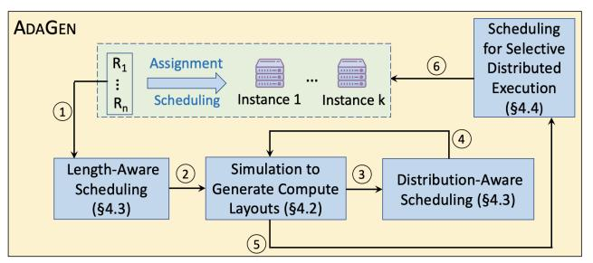

# 4 System Design of AdaGen

## 4.1 Overview

Motivated by Observation [1](#page-3-2) and leveraging the insights, we propose AdaGen, a workload-adaptive cluster scheduler that maximizes SLO attainment by optimizing compute layouts across instances based on the diversity pattern of the workload. Fig. [9](#page-6-1) shows the overall system flow. Unlike existing schedulers that assign requests independently, AdaGen jointly schedules a set of requests—denoted by S for scheduling time unit —to effectively exploit cross-request diversity.

Figure 9. System overview of AdaGen.

To schedule S , AdaGen proposes a multi-step scheduling method that iteratively refines the scheduling at each step by analyzing the resultant compute layouts of the previous step. To address the challenge of generating the layouts without performing real execution, AdaGen proposes a simulator to efficiently approximate the compute layouts ([§4.2\)](#page-6-0). The simulator and the scheduling steps require a predicted decode length of each request. For this, as prior works [\[5,](#page-14-7) [20\]](#page-14-11), we used a DistillBERT model. Specifically, before starting the multi-step scheduling procedure to schedule the request set , AdaGen calls the DistillBERT model online to predict the decode length of each request in . The DistillBERT model outputs the lower and upper bounds for the decode length. We took the average of the bounds as the predicted decode length, producing around 76.4% accuracy for the datasets used in our experiments (Table [1\)](#page-10-2) after fine-tuning the DistillBERT on the datasets. Due to the small size of DistillBERT, the overhead for decode length prediction is minimal and effectively hidden ([§6.5\)](#page-12-1).

To address the challenge to efficiently incorporate the prefill and decode lengths and distributions, AdaGen proposes

a request categorization-based scheduling as the first scheduling step that accounts for the impact of the lengths on latency ([§4.3\)](#page-7-0). Then, to incorporate the distributions, Ada-Gen proposes a request distribution-aware reassignment as the second scheduling step ([§4.3\)](#page-7-0). Finally, to address the challenges in realizing the selective distributed execution, the third scheduling step efficiently analyzes the compute layouts to first decide the source-destination instance pairs ([§4.4.1\)](#page-7-2) and then the optimal set of requests to be distributedly executed across each pair ([§4.4.2\)](#page-8-0). The output of the third scheduling step is taken as the final scheduling decision. Based on empirical evaluation, we set the size of S equal to the average number of requests arriving in 1s time window ([§A.2\)](#page-16-1). Though the efficient design of Ada-Gen makes the scheduling time small, it is non-negligible for SLO-strict scenarios and hence, AdaGen overlaps the scheduling for S with the execution for S−1 to hide the scheduling time ([§6.5\)](#page-12-1). To compensate for the possible error in decode length prediction, AdaGen periodically performs on-demand rescheduling ([§4.5\)](#page-9-0).

## 4.2 Simulation to Approximate Compute Layouts

Given the intermediate scheduling decision of a step, for each instance in parallel, AdaGen simulates the instancelevel scheduling to decide which tokens will be chosen to create each iteration of the compute layout. For example, for the chunked-prefill-based decode-prioritizing instance-level scheduling [\[1\]](#page-14-0), an iteration is created by first filling up the slots with the decode tokens. If there are not enough decode tokens, the remaining slots are filled up by prefill tokens. The batch size, i.e., the maximum number of slots/tokens in an iteration is a pre-determined value (i.e., 2048). If there are remaining slots but not enough memory to process a decode token in any iteration, the generation process of the lowest-priority request is preempted. Generally, the request with the latest arrival time is given the lowest priority [\[17\]](#page-14-6). Now, during real execution, the available memory can be easily found from the GPU runtime state. However, simulation does not have access to this information and thus it is challenging to accurately estimate the available memory. Below, we discuss how AdaGen addresses this challenge.

The memory is occupied by LLM parameters, KV cache, and other usage (i.e., intermediate outputs, internal GPU kernel calls) [\[17\]](#page-14-6). Among these, only the KV cache dynamically changes with the number of active tokens (i.e., the tokens whose KV values needs to be cached since their corresponding requests are still in generation phase) [\[17\]](#page-14-6). Since the KV value size for each active token is uniform across all tokens [\[17\]](#page-14-6), knowing the number of active tokens in sufficient to calculate the KV cache size. Based on this, AdaGen estimates the number of active tokens by analyzing the previous compute layout. Specifically, AdaGen keeps a running count (denoted by, initialized to 0) of the number of active tokens across all scheduling time units. Now, when AdaGen

starts simulating at time unit t, ideally, it would require the  $C_A$  that is updated based on the real execution result of the final scheduling decision taken at time unit t-1. Unfortunately, this execution is not completed yet because of the overlapping between scheduling and execution.

To address this issue, ADAGEN analyzes the compute layout created from the final scheduling decision taken at time unit t-1 to know which requests will complete their generation (i.e., reaching the predicted decode length) and hence, their token counts are deleted from  $C_A$ . Also, the token count of a preempted request is deleted from  $C_A$ . Similarly, the number of newly processed tokens increases the  $C_A$  count. When distributed execution happens for a request, AdaGen deletes the number of reassigned tokens from the running active token count of the source instance and adds it to that of the destination instance. Once AdaGeN estimates the  $C_A$ , it can estimate the KV cache size by multiplying  $C_A$  with the constant KV cache size for each active token. Since the LLM parameters and other memory usage (estimated from a profiler for a specific model and hardware-configuration pair) are static, AdaGen can then easily estimate the available memory. Since such estimation of  $C_A$  may have some error due to the potential error in decode length prediction, ADA-GEN checks the actual  $C_A$  value after the execution finishes for the scheduling decision taken at time unit t-1. If the estimated value differs from the actual value differs by more than 5%, AdaGen recalculates the subsequent steps based on the actual value.

## 4.3 Length- and Distribution-Aware Scheduling

Motivated by §3.2, AdaGen first schedules by taking into account the lengths of both prefill and decode phases and then refines the scheduling by incorporating their distributions if necessary. In decode-prioritizing instance scheduling, if the long prefill phases are co-located in an instance with the long decode phases, the prefill tokens need to wait longer to get slots in the iterations, thus affecting TTFT. To address this, AdaGen co-locates the requests having long prefill phases with the requests having short decode phases in half of the total instances maintaining balanced load distribution across the instances. Similarly, AdaGen co-locates the requests having short prefill phases with the requests having long decode phases in the other half of the instances. If both the prefill and decode phases are long (or short) for a request, they will be processed in different instances. As mentioned in §2.2, we followed the multi-stage migration policy [3] for the KV cache migration across instances in such cases to achieve minimal communication downtime. ADAGEN maximally tries to assign the different phases of such requests to the instances inter-connected with high-bandwidth connection (e.g., NVLink). Based on our empirical evaluation, the prefill phases with length greater than the P75 prefill length in  $S_t$  are taken as the long prefill phases; otherwise, they

have short prefill phases. Similar is the case to determine the short and long decode phases.

However, the above length-aware scheduling may produce non-optimal compute layouts for certain request distributions. For example, for workload\_1 in Fig. 1, let us consider if a prefill/decode phase has length greater than 1, the phase is long, otherwise short. For this example, the length-aware scheduling would create the same schedule as the better scheduler shown in Fig. 1b, except that request R3 would be assigned to instance\_2. Consequently, instance\_2 would be assigned with too many tokens, thus increasing the number of iterations of its compute layout, thereby increasing TTFT. This happens because of the prefill and decode distributions in workload\_1, where most of the requests have long prefill phases (i.e., R3-R6). This makes the instance\_2 overloaded. To address such load-imbalance in the compute layouts resulting from imbalanced request distribution, ADA-GEN reassigns requests (with both of its prefill and decode phases) from an overloaded instance to an underloaded in-

Specifically, AdaGen creates the sets of overloaded and underloaded instances by choosing those with the number of iterations in their compute layouts greater or smaller than the average number of iterations across the layouts, respectively. AdaGen pairs the instances from both sets by iteratively picking the two with the highest and lowest number of iterations. Across each pair, AdaGen prioritizes reassigning requests with longer sequence lengths (prefill+decode), as they more rapidly mitigate load imbalance, thus reducing scheduling time. Such a prioritization policy is inspired by the existing works on multi-resource bin packing scheduling [21, 22] that similarly prioritize resource allocation of the tasks requiring higher amount of resource. For the previous example, such reassignment would reassign R3 to instance\_1 from instance\_2, thus producing the better scheduler in Fig. 1b, outperforming Llumnix.

## 4.4 Scheduling for Selective Distributed Execution

Motivated by Observation 2, scheduling for selective distributed execution involves the following two steps as outlined in §4.1:

#### 4.4.1 Identifying Source and Destination Instances.

To identify the source-destination instance pairs, AdaGen scores each instance based on its compute layout. The score is calculated based on the factors determining whether an instance needs to be a source to reassign some of its tokens to a destination to improve its SLO attainment. The factors also determine whether an instance can work as a destination to execute an additional set of tokens without hurting its SLO attainment significantly. We chose the following factors based on empirical evaluation: total prefill tokens count, total decode tokens count, and average number of prefill tokens in the last iteration of a request. The last factor affects the

TTFT in distributed execution because, as shown for the prefills of request R4 in Fig. 4, TTFT of a request in the destination may not increase after reassignment if the last iteration can accommodate enough prefill tokens. Potential source instances have high values for these factors, and the inverse is true for the potential destinations. Based on this, the score of each instance is calculated as the summation of the values of the above factors. To normalize across different scales, before summation, each factor value is divided by its maximum value across all instances. Finally, ADAGEN iteratively pairs the highest-scoring instance with the lowest-scoring instance to create the source-destination pairs.

