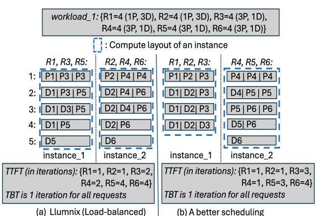

# 1 Introduction

Large Language Models (LLMs) have revolutionized applications across diverse domains such as healthcare and software development. LLM inference has emerged as the dominant workload that underpins the LLM-powered applications. The accelerating growth in model sizes and popularity of the LLM applications demands expensive GPUs, thus skyrocketing the datacenter operating cost [\[1–](#page-14-0)[3\]](#page-14-1). Minimizing cost necessitates reducing request inference latency, thus enabling a higher number of requests to be completed within their Service-Level-Objectives (SLOs) using the same GPU resource.

An LLM inference system typically comprises multiple LLM instances deployed across a GPU cluster. The system includes a cluster scheduler [\[3–](#page-14-1)[7\]](#page-14-2) that assigns or dispatches each request to a model serving instance, which consists of one or multiple (e.g., in model parallelism) GPUs. Then, inside each instance, an instance scheduler [\[1,](#page-14-0) [2,](#page-14-3) [8](#page-14-4)[–16\]](#page-14-5) schedules the prefill (i.e., prompt) and decode (i.e., response) tokens (i.e., basic unit of the text) of the requests assigned to the instance to be executed by an inference engine (e.g., vLLM [\[17\]](#page-14-6)). State-of-the-art cluster schedulers [\[3,](#page-14-1) [5–](#page-14-7)[7\]](#page-14-2) aim to ensure load-balancing across the instances to ensure optimized resource utilization by equally distributing the workload (i.e., request set) among the instances. In LLM serving, this requires achieving memory usage balance since the text generation phase is memory-intensive.

∗Part of this work was done during an internship at HPE Labs.

Though load-balancing can achieve minimal inference latency for a traditional deep learning (DL) workload consisting of requests with uniform characteristics (e.g., in image recognition), our experimental analysis on real traces finds that only load-balancing is not enough to achieve minimal latency (or maximal SLO attainment) for an LLM workload ([§2.2\)](#page-2-0), where the requests can have diverse characteristics. For example, even for the same application such as chatbot, the prompt and response lengths vary across requests (e.g., translating a sentence vs. summarizing a paper). Additionally, as each iteration in LLM execution processes a batch of tokens in parallel for maximal throughput, the prefill and decode tokens are organized differently–an iteration can accommodate multiple prefill tokens, but only one decode token of the request.

This intrinsic diversity impacts the formation of the compute layout within each instance. The compute layout of an instance refers to the organization of the tokens across its iterations, i.e., which set of tokens is included in the batch processed during each iteration of that instance. While loadbalancing ensures optimized resource utilization, it is the compute layout that determines the time-to-first-[decode] token (TTFT) and time-between-[decode]-tokens (TBT) latencies of each request. Since load-balancing does not guarantee the optimal set of compute layouts across the instances, it is not enough to guarantee the optimal latency ([§2.2\)](#page-2-0).

Let us illustrate this with a simple example. Fig. [1](#page-1-0) shows the compute layouts of two instances for workload\_1 under two cluster schedulers. The workload consists of 6 requests (R1-R6) and they are ordered according to their arrival times, with the earliest-arriving request placed first. Fig. [1a](#page-1-0) shows the scheduling of Llumnix [\[3\]](#page-14-1), a state-of-the-art cluster scheduler for LLM serving. Llumnix goes through each request and assigns it to one of the two instances that has been assigned with fewer tokens so far to ensure balanced token distribution (and hence balanced memory) across instances ([§2.1\)](#page-2-1). As the instance scheduler, we employ the chunked-prefill-based decode-prioritizing scheduler (Sarathi-Serve [\[1\]](#page-14-0)) to create the batch of tokens in each iteration.

Finally, Llumnix assigns R1, R3, and R5 to instance\_1 and the rest to instance\_2, achieving an average TTFT of 2.33 iterations. Fig. [1b](#page-1-0) shows another scheduling that assigns R1, R2, and R3 to instance\_1 and the rest to instance\_2, while using the same instance scheduler. Though both schedulers achieve load-balance (12 tokens in each instance), the second scheduler leads to a better set of compute layouts than Llumnix, reducing the average TTFT from 2.33 to 2.17 iterations, while keeping TBT the same. Thus, without optimizing the compute layouts, it is not possible to guarantee the optimal latency for LLM workloads with diverse requests by only relying on load-balancing. However, optimizing compute layouts is challenging, as it requires a comprehensive understanding of the complex interplay between layout organization, latency characteristics, and workload diversity patterns.

Figure 1. Compute layouts of 2 instances for workload\_1 (consisting of 6 requests: R1-R6) under two cluster schedulers. Batch size (maximum number of tokens in a batch) is 3. For request R1, 4 (1P, 3D) represents that it has total 4 tokens (1 prefill, 3 decode). Each of its prefill and decode tokens is represented by P1 and D1, respectively. Similar is the representation for other requests. TTFT and TFT are measured in number of iterations assuming uniform computation time for each iteration [\[1\]](#page-14-0) and ignoring the request arrival times since they are the same for both schedulers.

To address this challenge, in this paper, we propose Ada-Gen, a workload-adaptive cluster scheduler designed to minimize latency and thus maximize SLO attainment by leveraging the diversity pattern present in the requests in order to optimize the compute layouts across multiple instances. We design AdaGen from first principles, based on systematic analysis experiments using real traces ([§3\)](#page-3-0). Our analysis reveals several novel insights to optimize the compute layouts. First, we need to perform selective distributed execution, i.e., executing a selected set of requests in a distributed manner across multiple instances even when each instance has enough memory to process all of its assigned requests. Second, we need to incorporate both the lengths and distributions of both prefill and decode phases with the scheduler. Note that the proposed selective distributed execution across instances is orthogonal to disaggregating instance schedulers [\[2,](#page-14-3) [13](#page-14-8)[–16\]](#page-14-5) that process the prefill and decode tokens of all requests assigned to an instance in separate GPUs/subinstances within the instance ([§6.4\)](#page-12-0).

AdaGen leverages such insights to design a multi-step scheduling framework that iteratively refines scheduling decisions. After each step, AdaGen analyzes the resulting compute layouts to assess potential inefficiencies. If improvements are possible, it proceeds to the next step. Since executing each intermediate decision in a real cluster is prohibitively expensive, AdaGen introduces a novel simulationbased method that efficiently approximates the compute layouts under realistic execution conditions, including the dynamically growing KV cache size ([§4.2\)](#page-6-0).

To address the challenge of incorporating both prefill and decode lengths and their distributions in a time-efficient and latency-optimizing manner, AdaGen begins with a request categorization-based scheduler. It partitions requests based on length profiles and assigns them to instances to minimize latency ([§4.3\)](#page-7-0). If the simulated layout indicates imbalance due to skewed distributions, the second step reassigns requests to improve load balance across instances ([§4.3\)](#page-7-0).

In the final step, AdaGen integrates selective distributed execution. This step addresses the combinatorial complexity of selecting instance pairs and the associated request sets for distributed execution. First, a scoring-based method ranks instances based on compute layout features to form sourcedestination pairs. Then, instead of exhaustively evaluating all requests, AdaGen clusters similar requests and evaluates one representative per cluster using a heuristic that exploits the different characteristics of prefill and decode phases in compute layout organization ([§4.4\)](#page-7-1).

We implemented AdaGen atop vLLM [\[17\]](#page-14-6) ([§5\)](#page-10-0) and evaluated it on different models and real traces ([§6\)](#page-10-1). Our evaluation shows that AdaGen achieves up to 3.6× higher SLO attainment and 2× better cost-efficiency compared to the existing systems.

Overall, we make the following contributions:

- 1. We perform extensive analysis experiments to investigate the performance of the state-of-the-art cluster schedulers and to gain insights on potential approaches to improve the inference latency.
- 2. We propose AdaGen, workload-adaptive cluster scheduler that leverages the insights to optimize the compute layouts across the instances in order to maximize SLO attainment.
- 3. We evaluate AdaGen against the state-of-the-art systems and establish its superiority.

