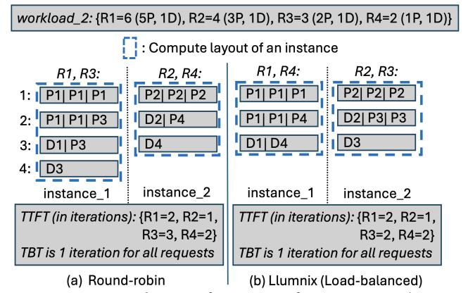
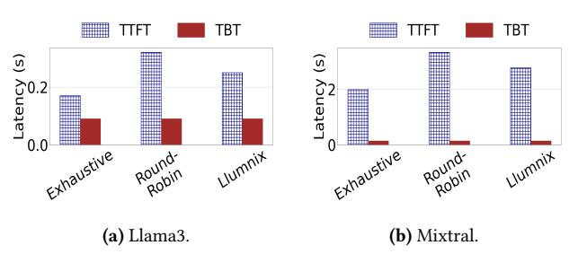

# 2.1 Preliminaries

LLM Execution. Transformer-based LLMs leverage the selfattention mechanism to model token dependencies and generate coherent responses. LLM inference consists of two phases: prefill, where the model processes the input tokens of a request in parallel and populates the key-value (KV) cache, and decode, which generates the output tokens of the request autoregressively (i.e., only one output token of the request is generated in each iteration), requiring access to all prior KV cache entries. Modern systems [\[1,](#page-14-0) [2,](#page-14-3) [8](#page-14-4)[–16\]](#page-14-5) batch tokens per iteration to improve GPU utilization, forming the compute layout of the instance. The layout specifies token positions by iteration and slot (e.g., in Fig. [1a](#page-1-0), the positions of R3's first and last prefill tokens are <iteration 1, slot 2> and <iteration 2, slot 2>, respectively).

Latency Metrics. LLM serving performance is evaluated using time-to-first-token (TTFT)—the latency until the last prefill token is processed generating the first decode token, and time-between-tokens (TBT)—the delay between successive decode tokens. These metrics can be directly inferred

from the compute layouts and indicate system responsiveness and response fluidity, respectively.

Existing LLM Cluster Scheduler. We use Llumnix [\[3\]](#page-14-1) as a representative scheduler, which focuses on load balancing by assigning each incoming request to the instance with the fewest tokens, aiming to equalize KV cache usage. However, since decode lengths are unknown at scheduling time, this can lead to memory fragmentation across instances during decoding. To address this, when Llumnix detects any possibility of memory overflow in any instance, it triggers runtime rescheduling to rebalance memory usage across instances.

Throughout the paper, we adopt the chunked-prefillbased decode-prioritizing instance scheduling as proposed in Sarathi-Serve [\[1\]](#page-14-0). However, as demonstrated experimentally ([§6.4\)](#page-12-0), our proposed methods are general and can be extended to any instance scheduler.

Figure 2. Compute layouts of 2 instances for workload\_2 (consisting of 4 requests R1-R4) under different schedulers. Batch size=3. The notations and calculations for TTFT and TBT are the same as those in Fig. [1.](#page-1-0)

## 2.2 Shortcomings of Existing Cluster Schedulers

In this section, we investigate the performance of existing cluster schedulers using real traces. Let us first use some simple examples. Fig. [2](#page-2-2) shows the compute layouts of 2 instances for workload\_2 under round-robin and Llumnix schedulers. The workload consists 4 requests (R1-R4) and the requests are ordered in ascending order of their arrival times. Roundrobin scheduling dispatches every other request to an instance. Llumnix assigns each request to an instance which has been assigned with the fewest tokens so far, leading to R1 and R4 being assigned to instance\_1 and the rest to instance\_2. For round-robin scheduling, the TTFT of the 4 requests are 2, 1, 3, and 2 iterations, respectively. For Lluminx, the TTFT of R3 gets reduced to 2 iterations, while the TTFT of the other requests remain the same, thus reducing the average TTFT. For both schedulers, the TBT is 1 iteration for each request. There is no other scheduling that will lead to lower latency than Llumnix for this workload.

However, this statement does not hold true for all workloads as we showed for workload\_1 in Fig. [1,](#page-1-0) which

has a different diversity pattern than workload\_2. Unlike workload\_2, the requests in workload\_1 have the same total length, but differ in prefill and decode lengths. For workload\_1, round-robin would produce the same scheduling as Llumnix as shown in Fig. [1a](#page-1-0). As shown in Fig. [1b](#page-1-0), we can design a better scheduler for this workload that reduces average TTFT from 2.33 to 2.17 iterations, while keeping the TBT the same. Existing schedulers co-located the requests with longer prefill lengths (e.g., R5) with requests having longer decode lengths (e.g., R1). This leads to longer time to complete the prefill phases of the former since the instance-level batching is decode-prioritizing. The above two examples demonstrate that due to the difference in the diversity patterns of different workloads, the existing schedulers may not always lead to the optimal compute layouts across the instances.

Motivated by this, we conducted an experiment using Llama3-8B and Mixtral-8X7B models to exhaustively search for the optimal cluster scheduling. Each model was using 2 instances. For Llama3-8B, each instance was 1 Nvidia H100 GPU. The two instances were connected by NVLink. For Mixtral-8X7B, we used 2-way tensor parallelism for each instance. Hence, each instance consisted of 2 H100 GPUs connected via NVlink. The two instances were themselves connected via PCIe. We used the BurstGPT [\[18\]](#page-14-9) and Openchat [\[19\]](#page-14-10) datasets to get the inference requests for the Llama3 and Mixtral models, respectively. Since the datasets do not have request arrival times, we followed prior works [\[1,](#page-14-0) [2\]](#page-14-3) to generate the arrival times using Poisson distribution with request rate=10 reqs/s.

Figure 3. P90 TTFT and P90 TBT of existing cluster schedulers and of the optimal scheduling found from an exhaustive search.

Existing schedulers such as Llumnix execute all tokens of a request in the same instance until there is a possibility of memory overflow when the instance does not have available memory to store the KV caches of all of its assigned requests. In this situation, the remaining tokens of some requests may be processed in another instance with enough memory. In our exhaustive search, we allowed the prefill and decode tokens of a request to be executed in different instances even when one instance has enough memory to store the KV caches of all of its assigned tokens. Thus, in the exhaustive search, a request could be executed in either of the two instances as a whole, or its prefill phase could be

executed in one instance, and the decode phase in another instance. If the different phases were processed in different instances, KV cache of the prefill phase of the request needed to be migrated from the instance processing it to the instance where its decode phase was processed. For this, we adopted the multi-stage KV cache migration policy described in Llumnix [\[3\]](#page-14-1) that overlaps token processing computation with the migration to achieve the minimal communication downtime.

Due to exponential complexity, we limited the exhaustive search to 20 randomly selected requests per dataset. For each possible scheduling policy, we measured latency on real instances and selected the policy with the lowest P90 TTFT. If multiple policies achieved the same P90 TTFT, the one with the lowest P90 TBT was chosen. The search required 9 days per dataset. Fig. [3](#page-3-1) shows that the best policy achieves 1.5×–1.9× lower P90 TTFT compared to existing schedulers, while maintaining similar TBT latency. Since all schedulers use the same decode-prioritizing instance scheduler, TBT remains unchanged. Further analysis reveals that for Llama, setting the P90 TTFT of the optimal policy as the TTFT SLO results in only 25% and 45% SLO attainment for round-robin and Llumnix, respectively—indicating a 2×–3.6× improvement in TTFT SLO attainment. Similar trends hold for Mixtral. These results demonstrate that the existing schedulers provide sub-optimal latency performance. This happens because the existing schedulers do not focus on optimizing the compute layouts across the instances, which is crucial to guarantee minimal latency for LLM workloads consisting of diverse requests ([§1\)](#page-0-0).

Observation 1. Contrary to common practice, only loadbalancing cannot guarantee minimal latency for LLM workloads. The optimal cluster scheduler needs to be workloadadaptive that leverages the diversity pattern of the workload to optimize the compute layouts of the instances.

