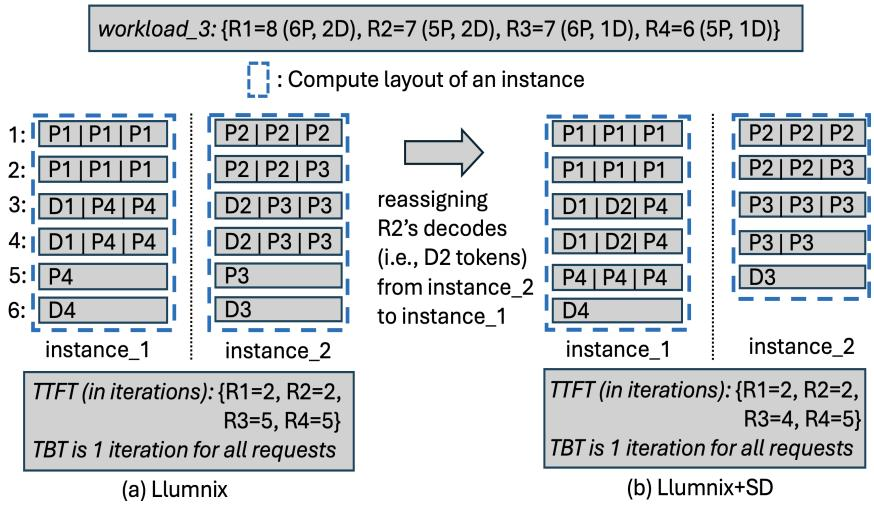
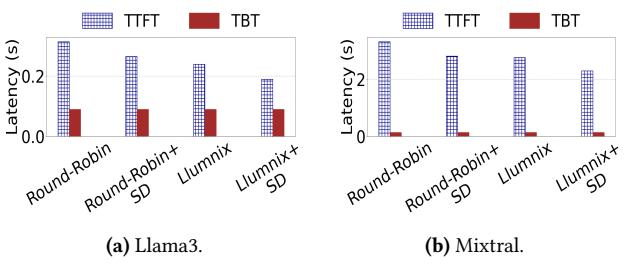
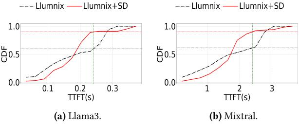
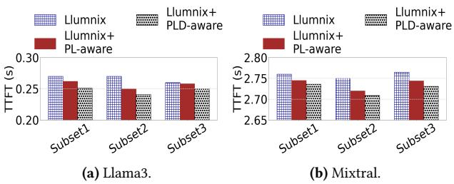
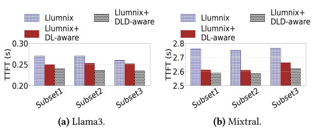

# 3 Insights and Challenges

Since exhaustive search requires exponential time complexity and thus becomes infeasible in real serving, we later pursued to design a time-efficient heuristic scheduler that can closely match the optimal performance of the exhaustive search. Towards the design, we performed extensive experiments using real traces and derived several insights as mentioned in [§1](#page-0-0) that leverage the diversity present in the workload to improve the compute layouts across the instances. Below, we describe the details of each insight.

## 3.1 Selective Distributed Execution across Instances

Depending on the diversity pattern of the workload, there is often opportunity to reorganize the compute layouts across the instances in a manner that reduces latency. This is achieved by distributively executing a selected set of requests even when each of the requests can be executed in a

Figure 4. Compute layouts of 2 instances for workload\_3 (consisting of 4 requests R1-R4) under Llumnix and Llumnix+SD (selective distributed execution). Batch size=3. The notations and calculations for TTFT and TBT are the same as those in Fig. [1.](#page-1-0)

single instance without any memory overflow. We explain this below using a simple example shown in Fig. [4.](#page-4-0)

For the 4 requests (R1-R4) in workload\_3, Fig. [4a](#page-4-0) shows the compute layouts of 2 instances when the requests are dispatched according to Llumnix. Let us assume that each instance has enough memory to store the KV caches of all of its assigned requests, hence, there is no possibility of memory overflow. Thus, Llumnix will not trigger any migration for this example. The TTFT of the 4 requests are: 2, 2, 5, and 5 iterations, respectively. Fig. [4b](#page-4-0) shows the compute layouts of the 2 instances when Llumnix is augmented with selective distributed execution. Here, R2 is distributedly executed, i.e., the processing of its decodes has been reassigned from instance\_2 to instance\_1. After the reassignment, the TTFT of R3 gets reduced by 1 iteration. The TTFT remains the same for other requests.

This happens because, due to the reassignment, the prefills of R3 in instance\_2 get slots earlier than before, thus decreasing its TTFT. On the other hand, in instance\_1, as the decodes of R2 occupy earlier slots due to the decodeprioritizing batching, the prefills of R4 get slots later than before. However, they still get completed at iteration 5, though the position of the last prefill token of R4 moves towards right within the same iteration. Overall, the reassignment reduces the average TTFT from 3.5 to 3.25 iterations, while keeping TBT the same for all requests. Reassigning the decodes of any other request (e.g., R3) does not change the TTFT of any request. Overall, this example shows the effectiveness of selective distributed execution in reducing latency.

Now, the opportunity of reducing latency by conducting such reassignment depends on the compute layouts of the instances, which in turn depends on the diversity pattern of the workload, and hence the opportunity may not be applicable to all diversity patterns. To investigate the opportunity in real traces, we next experimented using real traces to explore

whether incorporating the selective distributed execution with the existing schedulers can improve performance.

We followed the same setup as described in [§2.2.](#page-2-0) For each dataset, we randomly took 200 requests. For each of roundrobin and Llumnix, after the scheduler assigned the requests to the 2 instances, we randomly took one instance as the source instance and the other as the destination instance. Then, we went through each request assigned to the source instance and checked whether reassigning either the prefill or the decode phase of the request to the destination instance reduced the P90 TTFT and P90 TBT. We performed real execution to do the checking. For such distributed execution, KV cache of the prefill phase of the request needs to be migrated from the instance executing it to the instance where its decode phase is executed. For the KV cache migration, as mentioned in [§2.2,](#page-2-0) we adopted the multi-stage KV cache migration policy proposed in Llumnix [\[3\]](#page-14-1).

Figure 5. P90 TTFT and P90 TBT by incorporating selective distributed (SD) execution with existing schedulers.

Fig. [5](#page-4-1) shows the result. The result shows that incorporating selective distributed execution with the existing schedulers can decrease their P90 TTFT by around 1.4×, while keeping the P90 TBT latency the same. Since Llumnix leads to better result than round-robin, we next investigated the TTFT distributions for Llumnix and its augmented version conducting selective distributed execution (Llumnix+SD).

**Figure 6.** TTFT distribution for incorporating <u>s</u>elective <u>d</u>istributed (SD) execution (aiming to reduce P90 TTFT) with Llumnix.

Fig. 6 shows the result. From the figure, for Llama, if we take the P90 TTFT value of Llumnix+SD as the TTFT SLO, only around 56% of the requests have their TTFTs within the SLO in Llumnix. Hence, Llumnix+SD achieves 1.6× higher TTFT SLO attainment than Llumnix. Similar is the case for Mixtral.

Thus, selective distributed execution can improve performance of existing schedulers for the diversity pattern present in real traces. This happens because by reassigning the prefill or decode phase of a request from a source instance to a destination instance, the source instance can process its remaining tokens faster. Depending on the diversity pattern, though such reassignment can increase the TTFT of some requests in the destination instance, the net gain can be positive by optimizing the compute layouts of the instances through the choice of the optimal set of requests for the distributed execution as exemplified in Fig. 4.

**Observation 2.** Towards optimizing the compute layouts, a selected set of requests needs to be executed in a distributed manner across multiple instances, even when there is no possibility of memory overflow in any instance.

**Figure 7.** P90 TTFT of different subsets by incorporating both prefill <u>length</u> (PL) and <u>distribution</u> (PLD) with Llumnix.

## 3.2 Length- and Distribution-Awareness

LLM serving instances can experience high TTFT if their assigned requests have skewed prefill or decode lengths. For example, an instance dominated by long prefill requests takes longer to complete all prefill phases, increasing TTFT for all requests. Similarly, if an instance is dominated by long decode requests and uses decode-prioritized scheduling, decode tokens may preempt prefill tokens, again degrading TTFT. Hence, an effective cluster scheduler must account for

**Figure 8.** P90 TTFT of different subsets by incorporating both decode length (DL) and distribution (DLD) with Llumnix.

both prefill and decode lengths during scheduling to optimize compute layouts. As illustrated in Fig. 1b, maximally avoiding co-location of requests with long prefill (e.g., R5) and long decode (e.g., R1) phases improved average TTFT.

Motivated by this, we did a simple augmentation to Llumnix to make it Prefill Length-aware (PL) in the experimental setup described in §2.2. From each dataset, to experiment with different diversity patterns, we created three random subsets of 500 requests and dispatched them using Llumnix to two instances. We identified the instance ( $I_h$ ) with higher P90 TTFT and swapped the longest-prefill request (with both of its phases) from  $I_h$  with the shortest-prefill request from the lower-TTFT instance ( $I_l$ ), repeating until no further improvement. This reduced P90 TTFT by 0.8%-2.6% (Llumnix+PL-aware in Fig. 7).

However, shifting long-prefill requests to  $I_l$  can degrade its performance if it skews the prefill length distribution. To address this, we introduced a simple distribution-aware refinement, restricting swaps that increase  $I_l$ 's average prefill length by more than 5%. From Fig. 7, incorporating both Prefill Length- and Distribution-awareness (PLD) in this manner leads to further 2%-6% improvement over just length-awareness.

We applied a similar simple augmentation for  $\underline{D}$ ecode  $\underline{L}$ ength- and  $\underline{D}$ istribution-awareness (DLD). Using the same methodology, we swapped the longest-decode requests from  $I_h$  with the shortest-decode requests from  $I_l$ , while bounding the increase in average decode length. As shown in Fig. 8, this DLD-aware Llumnix variant yields 4%-9% reductions in P90 TTFT compared to the standard Llumnix. Overall, the results demonstrate that even simple augmentations considering prefill and decode characteristics improves performance.

**Key Takeaway:** Towards optimizing the compute layouts, both the lengths and distributions of both prefill and decode phases need to be incorporated with the scheduling.

## 3.3 Challenges

To realize the full potential of each insight above, we need to address the following challenges:

- (i) To schedule selective distributed execution in a timeefficient manner, two key challenges arise:
  - identifying source-destination instance pairs without exhaustively evaluating all combinations, and

- determining which requests to distribute across each pair to optimize compute layouts without timeconsuming enumeration of every request.
- (ii) How can both the lengths and distributions of both prefill and decode phases be time-efficiently incorporated into scheduling to maximize latency reduction?
- (iii) Realizing these insights requires analyzing compute layouts, but generating them via actual execution is infeasible during scheduling. How can compute layouts be efficiently approximated without real execution?

