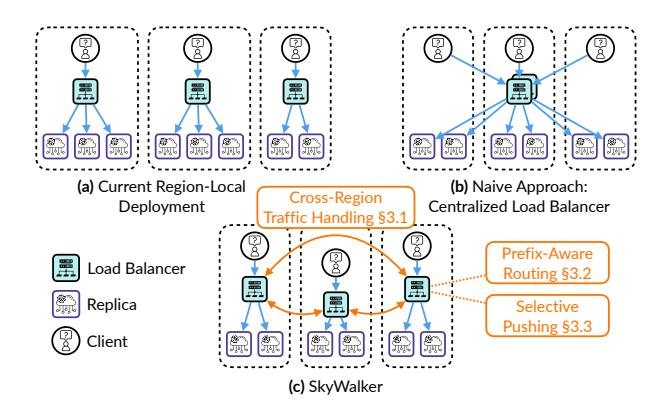
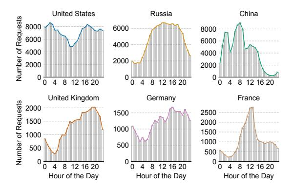

# 1 Introduction

Large Language Models (LLMs) have seen rapid growth in usage in recent years. With increasingly advanced capabilities, they have been adopted across a wide range of domains, including virtual assistants [8, 28], code generation [16, 24, 49, 54, 57, 58], and information search [15, 46]. These applications now serve billions of users worldwide [47].

Figure 1. (a) Current region-local deployment is cost inefficient due to provisioning each region for its peak load. (b) A naive centralized load balancer can reduce costs, but it introduces high cross-region latency, performance bottlenecks, and single point of failure. (c) SkyWalker reduce multiregion serving costs by enabling cross-region traffic handling without sacrificing performance.

Serving LLMs at this scale requires operators to manage GPU scarcity while optimizing cost, latency, and throughput. To meet these demands, LLM providers often deploy infrastructure across multiple geographical regions. The most common practice today is to deploy GPU instances with long-term commitments in each region, like reserved instances [26] or on-premise clusters [11, 50, 51], as shown in Figure 1(a). The long-term commitments reduce GPU costs compared to purchasing on-demand instances with autoscaling (§2.1) and ensure GPU availability at any time, while the region-local deployment improves service quality by placing compute resources closer to end users.

However, this approach introduces significant provisioning and cost management challenges. These reserved instances or on-premise clusters are inflexible—providers cannot increase or decrease capacity within a region as demand shifts. As a result, providers must allocate enough instances in each region to meet peak demand, which can result in high and often wasted costs. This inefficiency arises from shifting regional traffic patterns that follow distinct daily diurnal cycles: each region experiences peak inference load at certain times of day, with lower demand during off-peak hours (Figure [2\)](#page-2-1). The challenge is further exacerbated in multi-region deployments, where providers must provision for peak load in every region independently. This leads to resource fragmentation and underutilization during off-peak hours.

Ideally, providers would perfectly meet capacity with demand while paying the lower costs of reserved instances or on-premise clusters. However, achieving this ideal is difficult when regional provisioning is viewed in isolation. Providers must either provision for peak demand for all regions or pay for the flexibility of on-demand instances and take the risk of GPU unavailability.

In this paper, we suggest relaxing the regional rigidity of current approaches. Instead of attempting to match regional capacity to regional demand, providers make reservations for peak *global* demand and partition those reservations across the regions closest to their users. Following this approach, when a region is overloaded, it can offload requests to other regions with excess capacity. By reserving for global peak demand and enabling cross-region traffic handling, a system can improve GPU utilization and reduce overall serving costs. Unfortunately, this cannot be achieved by simply deploying centralized load balancers in a single zone (Figure [1\(](#page-0-0)b), [\[1,](#page-12-0) [53\]](#page-14-8)), as this introduces high latency due to cross-region communication and creates both a performance bottleneck and a single point of failure.

It is important to note that cross-region traffic handling, as proposed in this work, has not been a common practice for traditional workloads such as webpage rendering or search engine queries. In these cases, the processing time per request is typically very short [\[41\]](#page-14-9), often just several tens of milliseconds, and usually smaller than the cross-region network latency that is up to 200 milliseconds [\[35\]](#page-13-7). As a result, requests are handled entirely within the region closest to the client. In contrast, LLM requests often require seconds, if not tens of seconds to complete [\[66\]](#page-14-10). In this setting, crossregion latency represents only a small fraction of the total processing time. However, responsiveness remains important, and LLM providers still focus on optimizing Time-to-First-Token (TTFT) latency and aim to serve requests locally *when capacity allows*.

To enable cross-region traffic handling without sacrificing performance, we design SkyWalker, a cross-region load balancer for LLM inference. As shown in Figure [1\(](#page-0-0)c), SkyWalker deploys at least one load balancer in each region as the first point of contact for requests, ensuring lowlatency and avoiding centralized bottlenecks. These regional load balancers collaboratively coordinate traffic across regions to handle load imbalances. Achieving this requires us

to take into consideration two key challenges in multi-region load balancing: Key-Value Cache (KV Cache) awareness and LLM inference load unpredictability. We discuss both briefly below before expanding in the rest of the paper.

*KV Cache awareness.* Modern LLM inference relies heavily on a KV Cache to reuse computation when requests share a common prefix. Previous work has demonstrated that routing such requests to the same GPU is critical for maximizing KV Cache utilization and achieving high throughput [\[23,](#page-13-8) [33,](#page-13-9) [53,](#page-14-8) [71\]](#page-15-0). However, these approaches have primarily assumed single load balancer deployments within a single zone. SkyWalker overcomes the challenge of coordinating prefix-aware routing across multiple regions. It offers two routing algorithms to preserve KV Cache locality in a geo-distributed setting: a simple multi-region extension of consistent hashing based on user ID and session ID, and a more general multi-region prefix trie.

*LLM inference load unpredictability.* We observe that the processing time and resource usage for LLM inference of a particular request is highly variable and unpredictable [\[66,](#page-14-10) [72\]](#page-15-1). A single request can complete within seconds that requiring very little resources, or takes tens of seconds to complete while requiring several gigabytes of GPU memory. To make matters worse, due to the auto-regressive nature of LLM decoding, it is hard to predict which end of this spectrum a particular request will fall on [\[9\]](#page-13-10). As we show in section [§2.3,](#page-3-0) this property of LLMs makes traditional load balancing policies such as least load first or round robin highly ineffective. To address this, SkyWalker implements selective pushing based on pending requests, an algorithm we describe in section [§3.3,](#page-6-0) which improves performance by balancing load based on each replica's availability of admitting more requests in its continuous batch [\[65\]](#page-14-11).

This paper proceeds as follows. In section [§2,](#page-2-2) we describe the background of LLM serving, motivate the need for crossregion routing to lower cost, and identify new challenges in effectively doing so. In [§3,](#page-4-0) we introduce the key design choices of SkyWalker, including cross-region traffic handling, multi-region prefix-aware routing, and selective pushing to mitigate load imbalance. We evaluate SkyWalker on three realworld workloads, and we observe that SkyWalker achieves 1.12-2.06× higher throughput and 1.74-6.30× lower latency compared to existing load balancers. By using crossregion routing, we show that SkyWalker is able to reduce 25% of total cost compared to region-local deployment. In summary, this paper makes four contributions:

- Identifying the need for cross-region traffic handling to aggregate diurnal patterns across multiple geographical regions and reduce global serving cost.
- Proposing two mechanisms to provide effective cross-region routing: prefix-aware routing to improve cache locality and

**Figure 2.** Regional traffic demands shift over time in multiregion LLM serving. Data is from the WildChat [68] trace.

performance, and selective pushing based on pending requests at each replica to reduce load imbalance.

- A comprehensive evaluation for SkyWalker, compared to existing production and research systems across a variety of workloads.
- An open-source system SkyWalker to stimulate further research on cross-region load balancing for LLMs.

