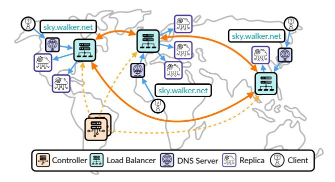

# 4.1 Load Balancer

*Load balancer distribution.* SkyWalker launches load balancers in user-specified regions, with the number of instances configurable by the user. In cloud deployments, the regions are automatically inferred from the cloud region. SkyWalker creates an AWS Route53 [\[6\]](#page-13-17) DNS record for each load balancer, all associated with the same domain name for a unified endpoint. Under the hood, DNS resolution maps the domain name to the nearest load balancer based on the client's source IP, thereby routing client requests to the nearest one.

*Request life cycle.* A request first contacts the DNS server to resolve the IP address of the nearest load balancer. It is then sent to the load balancer and placed in a first-come, first-served (FCFS) request queue. When the request reaches the head of the queue, *available* replicas in the local region are prioritized. If no local replica is available, the request is forwarded to an *available* remote region with the highest

Figure 7. System architecture of SkyWalker. Clients across different geographical regions issue requests to a unified domain name (sky.walker.net in this example). The domain will be resolved to the nearest available load balancer based on the client's IP. Each load balancer maintains connections to local replicas and other remote load balancers and performs request routing based on its load and shared prefix ([§3.2\)](#page-4-3). Load balancers coordinate with each other to handle load redistribution. A centralized controller manages system updates, monitors health via periodic probes, and orchestrates failure recovery across all load balancers and replicas. Note that the placement of load balancers and replicas in the figure is illustrative; their geographic positions are abstracted for clarity and do not reflect exact deployment coordinates.

prefix hit ratio. If the request is routed to a remote region, its snapshot is updated using the input prompt of this request.

*Probe frequency.* We set the probing interval for selective pushing ([§3.3\)](#page-6-0) to 100ms. This choice is motivated by the observation that each continuous batching step typically requires only tens of milliseconds to complete [\[20\]](#page-13-18). A 100ms interval achieves a balance between responsiveness and stability: it is short enough to capture meaningful changes in system load, yet long enough to avoid excessive probing overhead.

*Customized routing policy.* SkyWalker supports customizable routing policies that ensure compliance with GDPR ([§7\)](#page-12-2). For instance, SkyWalker can restrict traffic offloading to occur only between GDPR-compliant regions, while regions outside the scope of GDPR may still offload traffic to GDPR-compliant regions when their replicas are underutilized.

