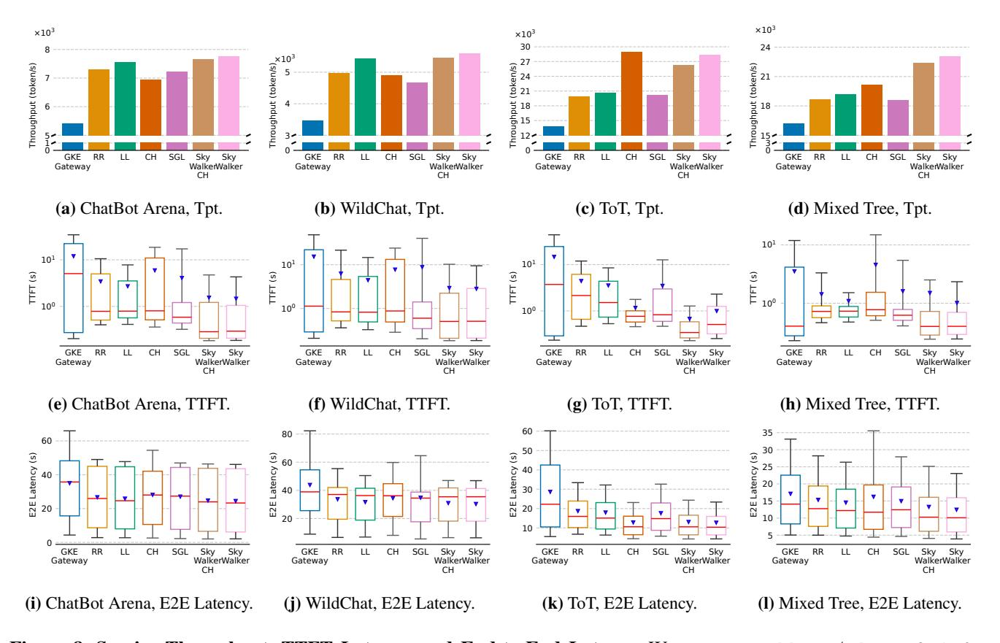
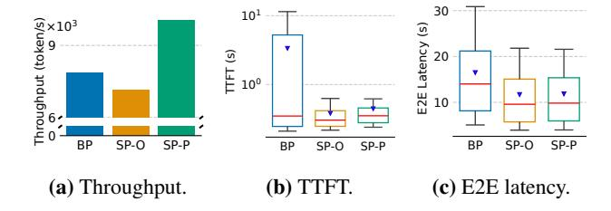
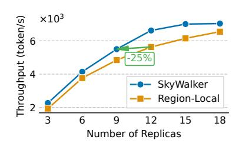

# 5 Evaluation

We evaluate SkyWalker comprehensively across a variety of workloads and configurations to answer three questions:

- Can SkyWalker maintain high throughput while preserving low latency in a geo-distributed setup? ([§5.1\)](#page-8-1)
- What performance gains does selective pushing with pending requests ([§3.3\)](#page-6-0) provide? ([§5.2\)](#page-10-0)
- What performance and cost benefits does SkyWalker provides for regionally imbalanced workloads compared to standard region-local deployments? ([§5.2\)](#page-10-0)

### 5.1 Macrobenchmarks

We conducted end-to-end experiments using up to 12 replicas in a multi-region setup, where both replicas and clients are distributed across three geographical regions. We compare SkyWalker with several production and research systems:

- GKE Gateway [\[25\]](#page-13-19): GKE Gateway is a network gateway service that connects multiple GKE [\[2\]](#page-12-3) clusters to provide a unified endpoint. Under the hood, each request is routed to and handled by one of the clusters.
- Round Robin (RR): A stateless load balancer that distributes incoming requests in a round-robin fashion.
- Least Load (LL): A load balancer that tracks the number of outstanding requests per replica and routes each new request to the replica with the least load.
- Consistent Hashing (CH): A ring hash [\[30,](#page-13-13) [55\]](#page-14-19) based consistent hashing algorithm, using the user's IP address and session ID as hash key.
- SGLang Router [\[1\]](#page-12-0) (SGL): A prefix-aware load balancer that routes requests based on a cache-aware routing algorithm tailored to LLM workloads.
- **SkyWalker**-CH: SkyWalker using a ring-hash based consistent hashing policy.
- **SkyWalker**: SkyWalker using the prefix tree policy.

We modify SkyServe [\[35\]](#page-13-7) to support our four global coordinator baselines: RR, LL, CH, and SGL. For those baselines, a single load balancer is deployed in the US. For both variants of SkyWalker and GKE Gateway, a load balancer is deployed in each region.

Figure 8. Service Throughput, TTFT Latency, and End-to-End Latency. We run meta-llama/Llama-3.1-8B-Instruct on one L4 GPU with up to 12 replicas and report service throughput along with the distributions of TTFT and end-to-end latency. The TTFT latency plot is log-scaled. For the box plot, the red line marks the median, the box marks  $25^{th}$  and  $75^{th}$  percentiles, the whiskers show  $10^{th}$  and  $90^{th}$  percentiles, and the inverted triangle marks the mean.

Experiment setup. We conduct our evaluation primarily on AWS [7], except for the GKE Gateway experiments which are performed on GCP [27]. To ensure a fair comparison, each system uses the same replica configuration. All replicas use one L4 GPU, hosting the meta-llama/Llama-3.1-8B-Instruct model via SGLang [71]. Replicas are distributed across three regions: the United States, Europe, and Asia. We vary replica's geographical allocation and client workload pattern to test a range of scenarios. For all experiments, we deploy clients in the US, Asia, and Europe to generate traffic, representing all end users in its respective region. Each client issues one program at a time. In practice, GPU utilization is kept high to maximize cost efficiency. In our evaluation, we maintain replicas at high utilization to reflect this real-world usage pattern. We use the following workloads:

*Multi-turn conversation.* We evaluate all systems on several multi-turn conversation datasets and vary the client configuration to reflect different deployment scenarios:

• ChatBot Arena [35]: A real-world multi-turn LLM conversation dataset collected using anonymized user IDs. For each region, we maintain the same number of clients, with

- 80 ongoing conversations per region. The real user ID in the dataset is used as its consistent hashing key.
- WildChat [68]: A large dataset of one million multi-turn conversations with demographic metadata such as state, country, and hashed IP address. We evaluate a configuration with different numbers of clients across regions: 40 in the US and 30 in both Europe and Asia. Each region issues requests only for conversations from its own geographical area, defined by the dataset's metadata. The hashed IP in the dataset is used as its consistent hashing key.

Tree of Thoughts. We also evaluate on the Tree of Thoughts [64] benchmark using the Grade School Math dataset [14] from OpenAI. In this setting, the replica configuration is balanced, with 12 replicas evenly distributed across all regions (four per region). Tree of Thoughts exhibits high prefix reuse, as each question is solved via a tree structure where multiple nodes share prefixes from root to their least common ancestors. Nodes in the same tree can be executed concurrently. The tree has a depth of four, corresponding to a multi-step math reasoning task. The question ID in the dataset is used as the consistent hashing key. We evaluate two workload types:

- Tree of Thoughts (ToT): Each tree uses a 2-branch structure (15 requests per tree). The US region runs 40 clients in parallel, while Europe and Asia run 20 clients concurrently.
- Mixed Tree: A more complex scenario where US runs 4-branch trees (85 requests per tree), with two clients sending such tree concurrently. The remaining regions continue to issue 2-branch trees, each with 20 clients in parallel. This setup reflects a mixed workload scenario where users generate heterogeneous traffic (e.g. setting different branch sizes for different accuracy requirements), more accurately representing real-world usage patterns.

We report end-to-end service throughput, TTFT latency and end-to-end latency to evaluate system performance and responsiveness (Figure 8).

**Service throughput.** We show the service throughput of multi-turn conversation datasets (ChatBot Arena and Wild-Chat) in Figrue 8a, 8b. Both variants of SkyWalker improve service throughput by 1.12-1.2× compared to single load balancer solutions. Prefix-aware baselines such as SGL and CH rely on blind pushing, which leads to overloading some replicas while leaving others underutilized. In these baselines, replicas experience high variance in outstanding request counts, ranging from 2.33-5.08× for SGL and 2.54-4.92× for CH. Non-prefix-aware baselines perform worse in terms of prefix hit rate. RR achieves only 10.78-16.57%, while LL performs better with 28.29-31.13%, though still below SkyWalker's higher hit rate of 36.96-46.55%. Among the single load balancer baselines, LL achieves the best throughput, as load balancing plays a more dominant role when prefix similarity is relatively low. Nevertheless, it still falls short of SkyWalker, reaching 97.38% of SkyWalker 's throughput. Compared to GKE Gateway, SkyWalker achieves a throughput improvement of 1.43-1.62×. This gain is primarily due to SkyWalker 's LLM-specific design. While GKE Gateway offers robust, general-purpose multi-cluster load balancing, it lacks prefix-aware routing for KV Cache optimization and the selective pushing mechanism that adapts to the dynamic nature of LLM workloads. The absence of these capabilities in a standard gateway solution results in lower cache hit rates (18.08-24.30%) and less efficient GPU utilization, thereby constraining overall service throughput.

In the Tree of Thoughts workload (Figrue 8c), when all trees are of uniform size, the CH baseline slightly outperforms SkyWalker with a marginal throughput gain of 2%. CH also outperforms LL by 1.4× in ToT, due to substantial prefix sharing. CH hashes requests from the same tree (i.e., the same question) to the same replica, enabling effective reuse of cached prefixes. However, this advantage disappears under heterogeneous workloads (e.g., 2-branch vs. 4-branch trees, Figrue 8d), and user-generated request bursts can saturate individual replicas. In such cases, the CH policy continues routing requests from the same user to the same replica, leading to

significant overload with a variance in number of outstanding requests of 3.36×. SGL also suffers under this workload, showing high variance of 2.22× as well. Non-cache-aware policies such as LL and RR experience low cache hit rates (58.66-59.32%) compare to SkyWalker's 89.56-90.01%, and consequently deliver suboptimal throughput.

Across all experiments, the prefix tree variant (SkyWalker) consistently outperforms the CH variant (SkyWalker-CH) by 1.34-8.21%. This is primarily because consistent hashing can occasionally assign users with bursty request patterns to the same replica (§3.2), leading to load imbalance—since CH always routes requests to the same replica if it is available. In contrast, the prefix tree variant is more adaptive: when the prefix hit ratio is low (e.g., < 50%), it explores other underutilized replicas and distributes requests more evenly these replicas. This occasionally results in a slightly higher TTFT due to the added prefill time (e.g., in Figure 8g), but it balances the load and delivers better overall throughput (Figure 8c).

Compare to GKE Gateway, SkyWalker offers key advantages through its KV Cache awareness and selective pushing mechanisms, which together contribute to 1.43-2.06× higher service throughput. In contrast, a general-purpose gateway like GKE Gateway may incur longer prefill and queuing delays due to a lack of LLM-specific optimizations.

and mean latency are primarily affected by cross-region latency and prefill latency. SkyWalker achieves the lowest P50 and mean latency, ranging from 15.87% to 57.63% of the baseline values, across all evaluated systems (Figure 8e-8h). This improvement is attributed to its geo-distributed load balancers, which reduce cross-region latency, and its high prefix hit rates, which reduce prefill time. The P90 latency, largely determined by queuing delays, can reach several seconds. Even under this constraint, SkyWalker maintains the lowest P90 TTFT (10.08-23.38% of baselines), owing to its selective pushing algorithm and reduced queuing delay.

For end-to-end latency (Figures 8i-8l), SkyWalker consistently delivers the best performance, achieving 1.05-2.14× improvements in P50 latency compared to baseline systems. This demonstrates that SkyWalker effectively leverages KV Cache locality while maintaining balanced load.

**Replica distribution.** We observe that SkyWalker is robust to various replica distributions, including deployments with different numbers of model replicas and varying replica ratios across regions. In our end-to-end experiments, we evaluated different configurations, such as an unbalanced distribution (3 replicas in the US, 3 in Asia, and 2 in Europe) and a balanced distribution (4 replicas per region). SkyWalker consistently achieves strong performance across all scenarios.

### 5.2 Microbenchmark

Selective pushing by checking pending requests. We evaluate the effectiveness of the selective pushing mechanism (§3.3)

**Figure 9. Service Throughput and Latency**, comparing Blind Pushing (BP) with two variants of Selective Pushing: fixed maximum outstanding requests per replica (SP-O) and pending request (SP-P). The TTFT latency plot is log-scaled.

Figure 10. Service Throughput, comparing SkyWalker and Region-Local deployments. We evaluate the performance using a regionally skewed workload, where the US region has 120 clients and both Asia and Europe have 40 clients. We vary the number of replicas to measure throughput gains from cross-region traffic offloading.

using one of our baseline systems, SGLang Router. We extend the original router to incorporate two variants of selective pushing: the standard one which is based on a fixed maximum outstanding requests per replica (SP-O), and ours variant which is based on checking pending requests (SP-P). We compare both against the original version that uses blind pushing (BP). To isolate the effect of selective pushing, the experiment is conducted entirely within a single region, where all components (clients, replicas, and load balancer) are colocated. In this setup, TTFT is primarily influenced by prefill time and queuing delay.

The experiment uses 4 replicas and 30 clients within a single region, running the Tree of Thoughts (ToT) workload with a branching factor of 2. Results are shown in Figure 9. SP-P improves service throughput by 1.27× (Figure 9a) and significantly reduces P90 TTFT by 18.47× compared to BP (Figure 9b). This demonstrates that SP-P effectively minimizes queuing delay and improves prefill time by achieving a higher KV Cache hit rate: 89.86% compared to BP's 68.89%. These gains translate into both lower latency (Figrue 9b, 9c) and higher throughput. Compared to SP-O, SP-P achieves similar TTFT but improves throughput by 1.4×, highlighting that the adaptive nature of SP-P leads to better replica utilization and overall performance under the same configuration.

Diurnal pattern. We also evaluate SkyWalker under regionally imbalanced workloads to assess its performance in handling traffic patterns with diurnal pattern. We compare it against a region-local deployment strategy where each region handles requests exclusively within its own local replicas, as is common among model providers (Figure 1(a)). Specifically, we simulate a regionally skewed workload scenario representative of typical US working hours, where the US region uses 120 clients, while both Asia and Europe have 40 clients. We vary the total number of replicas deployed in both SkyWalker and the region-local baseline, with replicas are evenly distributed across the three regions.

The throughput results for both systems are shown in Figure 10. With an equal number of replicas, SkyWalker consistently outperforms the region-local system by between 1.07× and 1.18×, demonstrating the effectiveness of crossregion traffic handling to offload traffic onto regions with less load. Moreover, we observe that SkyWalker achieves comparable throughput with only 9 replicas as the region-local deployment achieves with 12 replicas, translating into a cost reduction of 25% while maintaining the same level of throughput.

### 6 Related Work

Load balancing for CPU workloads. Efficiently managing CPU resources for latency-sensitive applications is a well-studied problem in CPU workloads. Prior work proposes load balancing policies that make task distribution decisions at microsecond-scale latencies. McClure et al. [36] classify these techniques into two categories: work stealing [10, 19, 22, 31, 34, 42, 44] and work shedding [40]. In work stealing, idle CPU cores actively pull jobs from overloaded cores. In contrast, work shedding involves overloaded cores pushing excess jobs to other cores. Empirical studies show that work stealing generally outperforms work shedding in terms of both latency and CPU utilization.

Production systems. Amazon Bedrock [5] is a fully managed LLM inference service that supports cross-region inference to handle traffic spikes. However, its offloading is limited to within the same continent, missing the opportunity to aggregate diurnal patterns. Additionally, Bedrock is a hosted solution operating at AWS scale, whereas SkyWalker is a self-hosted serving system designed for broader accessibility. GCP Gateway [25] provides a unified endpoint for global deployment by routing requests across multiple GKE [2] clusters. However, this solution is not tailored for LLM workloads. Neither Bedrock nor GCP Gateway incorporates prefix awareness, thereby failing to reuse KV Cache and reduce compute overhead. They also lack selective pushing based on pending requests, making them more susceptible to replica overload.

**Prefix-aware load balancing.** Prior work has explored leveraging KV Cache reuse to improve the efficiency of LLM request routing. Preble [53] achieves low latency and high

throughput by maximizing prefix cache hit rates, but it relies on a centralized global scheduler, limiting its applicability to a single-region setting. Similarly, SGLang Router [1] maintains a global prefix tree across all replicas, incorporating more fine-grained load balancing policies. DLPM [12] introduces a scheduling algorithm that improves upon Preble in both latency and throughput while also offering fairness guarantees to clients. While these centralized approaches deliver high performance, their reliance on a single scheduler makes them unsuitable for cross-region, production-grade deployments due to high inter-region communication latency and the inherent risk of a single point of failure.

Improving GPU utilization through job colocation. Many techniques has been proposed to improve GPU utilization by sharing resources either spatially or temporally [13, 18, 38, 43, 61, 62, 66, 69]. These include strategies such as colocating training and serving jobs or enabling multi-model serving on shared GPUs. However, due to the strict service-level objectives (SLOs) associated with serving tasks, job interference remains a concern that can degrade performance. Moreover, in many real-world settings, users may only run serving workloads, limiting the opportunities for job colocation.

### 7 Discussion and Future Work

GDPR and regulatory constraints. The General Data Protection Regulation (GDPR) is an EU law that governs the collection, processing, and transfer of personal data, granting individuals strong rights over their information. It prohibits transferring data outside EU regions without adequate protections. In this context, while global traffic aggregation is not feasible, aggregating traffic within EU regions or offloading non-EU traffic to EU regions can still yield substantial cost savings.

Security risk for prefix sharing. Recent work demonstrates that optimizations in LLM serving can expose timing and size-based side channels exploitable by adversaries to infer sensitive user information [52]. Similarly, KV cache sharing in multi-tenant serving environments enables cross-user leakage, where an attacker can reconstruct private prompts by exploiting cache reuse [59]. While prefix sharing may introduce potential side-channel vulnerabilities, the problem suggested by these findings is orthogonal to the design of SkyWalker and pertains to all systems employing KV cache sharing, including single region or single inference engine deployments. Ongoing research continues to explore such risks and develop effective solutions.

Support for heterogeneous accelerators. Load balancing is more challenging in heterogeneous environments. While SkyWalker currently focuses on homogeneous replicas, it can be extended to support heterogeneous accelerators, such as different GPU types or other hardware like TPUs [29] and AWS Inferentia [4]. Notably, the selective pushing by

checking pending requests mechanism in SkyWalker is inherently hardware-agnostic: it identifies overloaded replicas without relying on hardware-specific features, making it naturally compatible with heterogeneous settings. However, the prefix-aware routing and overall load balancing policies remain as an open question.

More advanced policies. Request characteristics, such as prompt length, can influence ideal routing strategies. For instance, shorter prompts incur lower prefill costs, making it more advantageous to route them to replicas with slightly lower load instead of prioritize prefix reuse. SkyWalker can be extended to incorporate request-characteristic aware routing strategies, dynamically adapting its decision-making process based on each request.

### 8 Conclusion

Shifting regional diurnal patterns make cost-efficient LLM deployment in multi-region setups challenging. To address this, we propose cross-region traffic handling and present SkyWalker, a locality-aware cross-region load balancer designed to overcome those limitations. By enabling crossregion coordination through geo-distributed load balancers, SkyWalker improves GPU utilization and reduces serving costs, all while maintaining low latency and high throughput. To achieve this, SkyWalker leverages prefix-aware routing to maximize cache locality and selective pushing to adaptively avoid overloaded replicas. Together, these techniques provide robust load balancing under the inherently bursty and unpredictable nature of LLM workloads. Through extensive evaluation across real-world and synthetic scenarios, we show that SkyWalker consistently outperforms existing production and research systems, achieving 1.12-2.06× higher throughput and 1.74-6.30× lower latency, and 25% cost savings compare to other systems.

