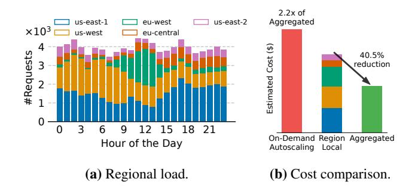

# 2 Background and Motivation

In this section, we first provide background on multi-region LLM serving. We then introduce the global cost reduction problem, which motivates cross-region load balancing. Finally, we discuss the key challenges in enabling cross-region load balancing without sacrificing performance.

### 2.1 Background: Multi-Region LLM Serving

LLM inference. LLM inference typically consists of two stages: prefill and decode. During the prefill stage, the model processes the initial input prompt and generates an internal KV Cache, which stores intermediate states necessary for subsequent token generation. Following prefill, the decode stage generates tokens auto-regressively, one token at a time, utilizing the KV Cache to accelerate inference. To improve GPU utilization and throughput, continuous batching [65] is commonly employed, which dynamically groups incoming requests to reduce idle time. Due to strict latency SLOs, practitioners typically run online LLM serving on dedicated clusters to prevent interference from other jobs (§6).

Scaling LLM serving to multiple regions. To scale effectively, major providers [39] leverage GPU resources across multiple geographical regions to serve their users, a practice we refer to as multi-region serving in this paper. Multi-region serving offers two key benefits: (1) improved latency by deploying LLM replicas closer to users; (2) reduces the risk of GPU shortages in any single region by diversifying GPU usage across multiple regions [35, 63].

**Figure 3.** (a) Aggregated load across five regions using a subset of the WildChat trace [68]. Before aggregation, per-region load variance ranges from 2.88× to 32.64×; after aggregation, the variance is reduced to 1.29×. (b) Cost reduction achieved by provisioning based on the aggregated *global* peak load, using reserved instances. We also present the cost for perfect on-demand autoscaling, assuming precise traffic prediction and no provisioning delay. In practical scenarios, the actual cost of on-demand autoscaling would be even higher.

**Provisioning GPUs via long-term commitments.** The substantial GPU demands of LLM serving, combined with ongoing GPU scarcity, have led providers to primarily deploy reserved or on-premise GPU instances. Such long-term GPU commitments not only ensure GPU availability at all times but also offer lower prices over extended periods compared to on-demand instances. For example, a three-year reserved instance for 8 H100 GPUs (p5.48xlarge) on AWS costs \$37.56/hour, while the equivalent on-demand instance costs \$98.32/hour. On-premise deployments can offer even greater cost savings: as shown in [3], they can reduce costs by up to 46.3% over time compared to reserved cloud instances when accounting for lifetime return on investment. As a result, this strategy has become the norm among today's LLM service providers. For example, OpenAI has deployed tens of thousands of GPUs in its data centers [39, 50]; similar deployments are also reported by ByteDance [51] and xAI [11].

Latency metric: Time-to-First-Token (TTFT). A critical performance metric for online serving is TTFT, defined as the latency from when a request initiates until the first output token is produced. When the client and model replica are in the same region, TTFT primarily consists of prefill latency and queuing delay. For example, when deploying on a L4 GPU, processing a 512-token prompt with meta-llama/Llama-3.1-8B-Instruct might incur around 300 ms of prefill latency before generating the first token. In a multiregion deployment, TTFT additionally includes cross-region network latency, which typically adds up to 200 ms.

### 2.2 New Problem: Global Cost Reduction

Multi-region LLM serving introduces new challenges for reducing serving costs. Our trace analysis reveals that multiregion LLM serving exhibits regional demand shifts over time, often following a diurnal pattern. Specifically, Figure [2](#page-2-1) illustrates the load patterns of six countries from the WildChat trace [\[68\]](#page-14-12). It shows clear diurnal trends—each region experiences peak inference traffic during specific hours, with lower load during the rest. These peak hours vary across regions due to time zone differences.

The fluctuating load leads to time-varying GPU demand in each region, posing significant challenges for resource provisioning and cost reduction. Ideally, providers would provision just enough GPU resources in each region to meet the required GPU demand and adjust allocations dynamically as load varies. Recent studies attempt to approach this ideal by auto-scaling resources using on-demand or spot instances [\[35,](#page-13-7) [37,](#page-13-11) [45,](#page-14-15) [67\]](#page-14-16). However, as discussed in Section [§2.1,](#page-2-0) to avoid GPU shortages during demand spikes and to secure lower instance pricing, current multi-region deployments typically rely on static provisioning via long-term commitments. This makes them unable to scale flexibly with load fluctuations. As a result, to maintain service quality, providers must provision each region for its peak load. While this approach ensures low latency and high throughput, it inevitably leads to low overall GPU utilization and higher operational costs.

To illustrate this, Figure [3a](#page-2-3) shows the aggregated number of requests received across five regions at different hours of the day, using a subset of the WildChat trace [\[68\]](#page-14-12). It highlights that while regional loads fluctuate significantly, the aggregated global load remains relatively stable. As shown in Figure [3b,](#page-2-3) provisioning based on the peak aggregated global load can reduce costs by 40.5% compared to provisioning each region for its own peak independently. With on-premise instances, the cost can be reduced even further compared to reserved instances [\[3\]](#page-12-1). The figure also includes the cost of using on-demand instances. Due to their high pricing, even with perfect auto-scaling, where we assuming no provisioning delay and instances are always available, this approach incurs 2.2× the cost compared to provisioning the aggregated global load using reserved instances.

*Insight.* The cost reduction shown in Figure [3b](#page-2-3) suggests that we should provision instances based on *global* demand and share these resources across regions. Users can be routed to access their geographically closest region, but when it becomes overloaded, traffic can be rerouted to remote regions to utilize otherwise unused capacity.

