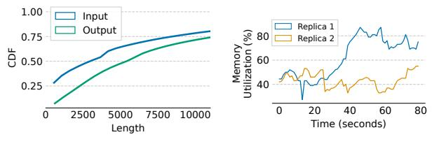

# 2.3 Cross-Region Load Balancing

Achieving global cost reduction requires cross-region load balancing, a direction that remains largely unexplored in the context of LLM serving. Today's LLM load balancers are designed for single-region deployments and cannot be directly extended to multi-region settings. As shown in Figure [1\(](#page-0-0)b), a straightforward approach is to deploy existing load balancers in a specific zone as global coordinators. However, this creates centralized bottlenecks and a single point of failure, while also incurring non-trivial latency overhead due to cross-region communication for most requests. In typical local deployments, the TTFT latency for LLMs is mainly bottlenecked by prefill time and is usually several hundred milliseconds [\[56\]](#page-14-17), while cross-region latency can reach up to 200 milliseconds [\[35\]](#page-13-7). This means that the straightforward approach may introduce additional latency nearly equivalent to the prefill time, significantly impacting responsiveness. This motivates us to design a geo-distributed load balancer for LLM serving that can effectively reduce global serving costs without compromising TTFT. This involves addressing two key challenges:

*KV Cache awareness.* LLM serving systems reuse KV Cache between requests that share the same prefix to reduce prefill time and saving compute resources. To maximize the KV Cache hit rate, prior work has explored making load balancers prefix aware [\[1,](#page-12-0) [12,](#page-13-12) [53\]](#page-14-8). These approaches typically maintain a prefix tree for each replica, either precise, as in Preble [\[53\]](#page-14-8), or approximate, as in SGLang Router [\[1\]](#page-12-0) and DLPM [\[12\]](#page-13-12). This line of work has shown strong potential, and we observed up to a 35% improvement in KV Cache hit rate in the best case.

However, extending them to multi-region deployments presents several challenges. Achieving KV Cache awareness requires maintaining a shared prefix tree, which is difficult to coordinate across regions. As previously discussed, simply maintaining a centralized global prefix tree will incur significant latency penalties due to frequent remote accesses. Alternatively, maintaining fully distributed prefix trees in each region requires cross-region coordination on every request, which would become prohibitively expensive due to the high coordination overhead.

*LLM inference load unpredictability.* The length of LLM outputs can vary widely, and in some cases be very long, as shown in real workloads (Figure [4a\)](#page-4-1) and prior studies [\[60\]](#page-14-18). This variability, combined with the auto-regressive nature of LLMs, makes it difficult for load balancers to predict output lengths in advance and accurately estimate the GPU resources required for each request. Moreover, each LLM request can demand substantial resources. It is not uncommon for a single request to consume several gigabytes of GPU memory, limiting each model replica to handling only tens of concurrent requests. Traditional load balancing polices, such as leastload-first or round-robin, blindly push requests to replicas without accounting for resource consumption, often resulting in long-running requests blocking all subsequent ones in the queue and causing severe load imbalance. These unique characteristics of the LLM workload make the *penalty of misrouting* much more severe than in traditional CPU-based workloads. This motivates the need for a new system design that is robust to the dynamic and resource-intensive nature of LLM workloads.

- (a) CDF for request length.
- (b) Load imbalance.

**Figure 4.** (a) The CDF of input length and output length in WildChat dataset. (b) We observe load imbalance across replicas when routing requests using the Round Robin algorithm. The y-axis shows the percentage of KV Cache memory utilization on each replica. The peak memory usage difference between replicas reaches 2.64×.

