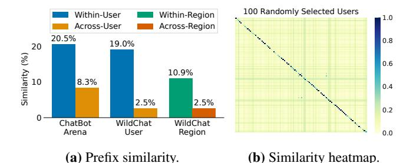
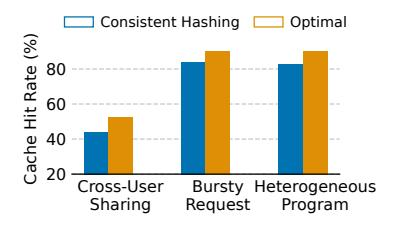

# <span id="page-4-0"></span>3 SkyWalker Design

Overview. In this work, we introduce SkyWalker, a new design that enables efficient cross-region load balancing for LLM inference. With SkyWalker, LLM service providers can reduce global costs by sharing a smaller pool of reserved or on-premise instances across regions without sacrificing performance. SkyWalker deploys load balancers in multiple regions as the first point of contact for local requests, and introduces a cross-region traffic handler that coordinates traffic between regional load balancers to mitigate cross-region load imbalance (§3.1). It preserves the benefits of prefix sharing by supporting prefix-aware routing in two ways ( $\S 3.2$ ): (1) a simple yet effective policy based on consistent hashing that requires minimal changes to existing load balancers; and (2) prefix-aware routing using partial prefix tree snapshots maintained at each load balancer. In addition, to address the challenge of LLM inference load unpredictability, SkyWalker introduces a novel selective pushing mechanism that balances load based on pending requests at each replica (§3.3). We detail each of these design choices in the following.

### <span id="page-4-2"></span>3.1 Cross-Region Traffic Handling

Since geographical regions could experience peak load at different times, we can exploit the traffic pattern by offloading workloads from high-demand regions to low-demand ones. This mitigates the load imbalance caused by regional demand shifts over time and reduces the total number of required GPU instances compared to region-local deployment.

There are multiple possible approaches to handling crossregion traffic. One approach is to deploy load balancers in a single zone that manage replicas across all regions. In this setup, requests from all regions are first sent to the central load balancer, which then routes them to replicas possibly in different regions. However, as discussed in §2.3, this results in long round-trip times for users whose requests traverse multiple regions: the request incurs two cross-region RTTs, i.e., one to reach the load balancer and another to reach the assigned replica, leading to high cross-region latency.

Another approach is to replicate the load balancer across multiple regions, allowing each to route traffic to all available replicas. In this deployment, clients send their requests to the nearest load balancer, which then decides which replica should handle the request, potentially in any region. However, this approach requires non-trivial synchronization *between load balancers* to make coordinated routing decisions. Without such coordination, multiple load balancers may independently select the same replica as hot spot, leading to degraded performance, particularly for affinity-aware load balancing strategies. Such coordination can incur non-trivial overhead for each load balancer, requiring  $O(N_{\rm LB} \times N_{\rm replica})$  connections or probes. Whenever a new replica is launched, it must ensure that all load balancers are aware of its creation and updated status, adding complexity and latency to the system.

Our approach: two-layer cross-region routing. Instead, we adopt a two-layer approach. The key idea is to coordinate cross-region traffic between load balancers, rather than directly between replicas. Specifically, each load balancer either routes requests to local replicas or forwards them to other load balancers in remote regions, which then make the final placement decisions within their region. This design combines the strengths of the two approaches discussed earlier. It avoids introducing significant routing latency by allowing clients to connect to their nearest load balancer, while still enabling cross-region load balancing through coordination among load balancers. Comparing load balancers routing to all replicas distributed across regions, this approach significantly reduces the probing overhead required to assess replica load. In addition, managing connections between a small number of load balancers scales much better than maintaining connections to every replica, as the number of replicas typically far exceeds the number of load balancers.

### <span id="page-4-3"></span>3.2 Multi-Region Prefix-Aware Routing

The need for cross-region traffic routing presents new challenges for prefix-aware routing (§2.3), especially with long cross-region latency. Achieving optimal prefix-aware routing requires a *global* view of prefix states across all replicas. However, each load balancer only observes a *subset* of requests, making it difficult to maintain a consistent global view without incurring significant coordination overhead on every request. Thus, we ask the question: How can we effectively load balance across *multiple regions* with prefix awareness? We answer this question by first understanding prefix sharing patterns in real workloads.

<span id="page-5-1"></span>

**Figure 5.** (a) Average prefix similarity within and across users and regions; (b) Heatmap of pairwise prefix similarity among 100 randomly sampled users, in WildChat [68] and ChatBot Arena [70] datasets. User information is retrieved directly from the metadata provided in each dataset (hashed IP in WildChat and judge in ChatBot Arena).

**Prefix similarity analysis.** We analyze prefix similarity <sup>1</sup> using a subset of the WildChat [68] and ChatBot Arena [70] datasets. The goal is to quantify how much prefix reuse occurs in real-world workloads, which directly impacts the effectiveness of KV Cache reuse in LLM serving systems. This metric measures the normalized length of the common prefix shared between two requests. We compute prefix similarity across all pairs of requests within the same user, and across different users. The results are shown in Figure 5a. We observe that the average prefix similarity within the same user is significantly higher than that across different users  $(2.47-7.60 \times \text{more})$ . This pattern is also evident in the heatmap (Figure 5b), which shows the similarity among 100 randomly selected users, further confirming that within-user requests are more likely to share context and thus benefit from prefix caching. However, there is still some degree of cross-user prefix similarity, and the relative ratio between within-user and cross-user prefix similarity is workload-dependent (2.47× for ChatBot Arena and 7.60× for WildChat). This observation motivates us to present the following two solutions: SkyWalker-CH and SkyWalker. SkyWalker-CH is simple and captures userlevel prefix similarity. SkyWalker captures both within-user and cross-user prefix similarity. We detailed the algorithm in Listing 1.

**SkyWalker-CH.** SkyWalker-CH uses consistent hashing [30] on user-provided keys (e.g., user ID, session ID) and routes a user request to a corresponding replica (Listing 1, lines 23-26). SkyWalker-CH is *implicitly* prefix-aware: requests from the same user tend to share similar prefixes (e.g., context, chat history) and consistent hashing will map them to the same replica. SkyWalker-CH adopts a ring hash [55] scheme, where each virtual node on the hash ring

<span id="page-5-2"></span>

**Figure 6. KV Cache hit rate**, comparing consistent hashing with optimal solution with a global view.

is assigned to a replica and each replica can have multiple virtual nodes, allowing balanced key distribution across replicas. We make two extensions to the traditional consistent hashing. First, due to SkyWalker's two-layer load balancing design, SkyWalker-CH performs consistent hashing at both layers: the load balancer routes requests to other balancers based on consistent hashing, and each balancer applies consistent hashing to assign the request to one of its managed replicas as well. Second, virtual nodes are skipped based on the availability of its associated replica (detailed in §3.3, and Listing 1, line 26). When that happens, the algorithm continues iterating over successive virtual nodes on the ring. SkyWalker-CH requires minimal state maintained at load balancers, and can be easily incorporated into the existing software stack.

Since SkyWalker-CH focuses only on within-user prefix similarity, there are cases where SkyWalker-CH falls short of being optimal. We discuss them in the following:

- Cross-User Prefix Sharing: Requests from different users
  can share common prefixes (Figure 5), but SkyWalkerCH can route these requests to two different replicas, miss-\ning the benefits of routing these requests to the same replica
  to maximize KV Cache hit rate.
- Bursty Request: Consistent hashing either hashes a given key to a single replica, or to a replica set. In the former, a request burst can overload the single replica. In the latter, consistent hashing misses the opportunities to leverage prefix-sharing for requests sent by the same user to different replicas in the replica set.
- Heterogeneous User Program: If requests from a single user's program contain multiple patterns and lack consistent prefix structures, using the user ID (or session/program ID) as the hash key fails to exploit prefix reuse. Worse, it may route dissimilar requests to the same replica, increasing the risk of overloading that replica.

We illustrate these scenarios in Figure 6, which shows the KV Cache hit rate under each setting, compared to an optimal solution with a global view. The lack of cross-user prefix sharing results in a 16.49% prefix hit rate drop. We also study behaviors under bursty request patterns, where the variance in a single user's concurrent requests can reach 4×. In this case, CH leads to 7.07% lower hit rate. A similar

<span id="page-5-0"></span><sup>&</sup>lt;sup>1</sup>We define the prefix similarity between two requests a and b as  $len(common\_prefix(a,b))/min(len(a),len(b))$ . We use the minimum length in the denominator so that, for example, if a is a prefix of b, the prefix similarity of a and b should be 1.

#### <span id="page-6-1"></span>Algorithm 1 SkyWalker load balancing logic

```
1: procedure Monitor Availability
         while true do
 2:
 3:
             for all r \in LocalReplicas do
                  n_{\text{pending}} \leftarrow \text{PROBEREPLICA}(r)
 4:
 5:
                  if n_{\text{pending}} > 0 then
                       REMOVE(LocalAvail, r)
 6:
                  else
 7:
                       ADD(LocalAvail, r)
 8:
 9:
              for all lb \in RemoteLBs do
                  (n_{\text{avail\_replica}}, size_{\text{q}}) \leftarrow \text{PROBELB}(lb)
10:
                           \triangleright \tau: small buffer for newly arriving requests
11.
12:
                  if n_{\text{avail replica}} = 0 \lor size_{\text{q}} > \tau then
                       REMOVE(RemoteAvail, lb)
13:
14:
15:
                       ADD(RemoteAvail, lb)
16:
              SLEEP(ProbeInterval)
    procedure SELECTCANDIDATE(Request, C)
17:
         if UsePrefixTree then
18:
19:
              Text \leftarrow GETTEXT(Request)
                        ReplicaTrie
                                                if C is replicas
20:
                        LBSnapSnotTrie otherwise
21:
              return MAXPREFIXMATCH(Trie, Text, C)
22:
         else
             HashRing \leftarrow \begin{cases} ReplicaRing & \textbf{if } C \text{ is replicas} \\ LBRing & \textbf{otherwise} \end{cases}
23:
             Key ← SESSIONID(Request)
24.
              HashValue \leftarrow HASH(Key)
25:
              return NEXT(HashRing, HashValue, C)
26:
27: procedure HANDLEREQUEST(Request)
                 LocalAvail
                                    if LocalAvail \neq \emptyset
28:
                 RemoteAvail otherwise
         t \leftarrow \text{SELECTCANDIDATE}(Request, C)
29:
         ROUTE(Request, t)
```

trend is observed when users submit heterogeneous programs, resulting in a 8.78% gap. These limitations motivate us to develop SkyWalker that is more general than SkyWalker-CH by maintaining more states at the load balancer.

**SkyWalker with regional snapshot.** SkyWalker is explicitly prefix-aware: in this design, each load balancer maintains prefix trees to keep an approximate view of prefix information on the load balancing targets. Between load balancers, the targets are remote load balancers, and between the load balancer and the replica, the targets are local replicas managed by that load balancer.

The prefix tree is a logical trie augmented with metadata to track active load balancing targets at each node. Each node stores a set of active targets associated with the prefix formed by the path from the root to that node. The tree is built incrementally from the requests the load balancer has served: when a new request is forwarded, a corresponding path is added to the trie, and the selected target is recorded at every node along that path. To bound memory usage, SkyWalker

enforces a configurable maximum tree size and evicts entries when the tree exceeds this limit, starting with the earliest inserted records. SkyWalker filter targets based on whether it is available to serve requests and pick the available target with the longest matching prefix (detailed in §3.3, and Listing 1, line 21). Specifically, for each trie traversal step, if there is no *available* matching load-balancing target in the current node, the traversal terminates early. This is because the set of targets stored in any child node is always a *subset* of its parent's, implying that no available replicas can be found further down the path.

Each load balancer maintains two prefix trees, one for local replicas it manages and one for a partial view (snapshot) of other load balancers in other regions. The latter keeps track of all historical requests that the local region has sent to remote regions. Regional snapshots do not strictly record all prefixes reside in replicas of remote regions, which depends on requests that are sent to the load balancer of that region, either directly or from other load balancers. Instead, it is an approximation of prefixes that are possible to be utilized by local region forwarding to that remote region, as we observe empirically that the local region is unlikely to share prefixes with requests that came from other regions: in Figure 5a, requests across regions only have 2.5% prefix affinity. With that, we observe SkyWalker more closely approaches the performance of an optimal solution.

#### <span id="page-6-0"></span>3.3 Selective Pushing to Mitigate Load Imbalance

While leveraging prefix-affinity improves performance, it also leads to load imbalance as requests are preferentially routed to specific replicas. To address this, prefix-aware routing must be combined with effective load balancing strategies—for example, switching to a load-balancing policy when the prefix sharing ratio falls below a certain threshold. However, traditional load balancing strategies, such as blind pushing and selective pushing based on the maximum number of outstanding requests, do not work effectively for LLM workloads due to their load unpredictability (§2.3). We begin by analyzing these two strategies and show how they lead to load imbalance when applied to LLM inference workloads. We then present our approach, selective pushing based on pending requests, as a solution to this problem.

Blind pushing. One traditional load balancing strategy is to route each request to a replica *immediately* upon arrival [1, 17, 53], which we refer to as *blind pushing*. Blind pushing performs well in CPU-based workloads or scenarios with uniform request processing times, where simple strategies like round-robin or least-load-first naturally result in a balanced load. However, the processing time of LLM varies from request to request, as it depends on the output length, which is difficult to predict due to the auto-regressive nature of decoding (§2.3). Naively assuming each request is homogeneous can lead to a significant load differences across

replicas. For example, we find two replicas under round robin can have memory usage difference up to 2.64×, as shown in Figure [4b.](#page-4-1) This issue is especially problematic when routing requests among multiple *overloaded* replicas. Replica overload can occur in practice, as replicas are kept at high utilization to achieve better cost efficiency. During sudden surges in demand, request queues may accumulate, and a replica with a seemingly short queue may still incur long processing times if the requests in the queue takes long time to process. Blindly pushing requests to such overloaded replicas can lead to cases where requests waiting in one replica's queue while other replicas have idle compute capacity, wasting compute resources.

*Selective pushing.* To address the unpredictability of LLM inference, we suggest selective pushing, a strategy where requests are temporarily queued at the load balancer and sent only to replicas that meet certain conditions. Specifically, the load balancer will only push requests to the replica that has capacity (decided by a threshold), and in the event that all replicas are full, queuing requests at the load balancer. This approach prevents overloading any single replica while maximizing overall utilization across all available replicas, ensuring that no request waits in one replica's queue while others have idle compute capacity. We explain two thresholds, outstanding requests and pending requests for selective pushing, and show that the latter is preferred in LLM serving.

*Selective pushing by limiting outstanding requests.* In this method, the load balancer selectively pushes to a replica only when the number of of outstanding requests for that replica is less than a *fixed* threshold [\[21,](#page-13-15) [32,](#page-13-16) [48\]](#page-14-20). Each replica will not exceed its desired level of load and the rest will be queued in the load balancer. That way, when the request finishes on a replica and releases free capacity, it will inform the load balancer so that new requests are permitted to be served at this replica. However, selective pushing based on a fixed number of outstanding requests is ineffective for LLM workloads, since the number of requests a replica can serve depends on the total memory footprint of all outstanding requests, which is proportional to the total number of input and output tokens. As the number of output tokens cannot be predicted in advance, the same inference engine can host a small number of large requests or a large number of small requests. We observed that for Llama 3.1 8B on a L4 GPU, the max number of outstanding requests can range from 20 to 50 for the same dataset. Therefore, statically setting the maximum threshold of outstanding requests delivers poor performance for LLM service ([§5.2\)](#page-11-1).

*Selective pushing by checking pending requests.* We propose selective pushing by checking *pending requests*. A *pending request* is a request that has not been scheduled to the continuous batch yet, which indicates that the current batch is full and cannot admit more requests, as constrained by GPU memory. We use *the existence of* pending requests in the

replica to decide whether a replica is full or not. A background heartbeat probe is periodically sent to replicas to obtain their pending queue size (Listing [1,](#page-6-1) line 3-8). If a replica has no pending request, it is ready to serve more requests.

*Selective pushing and cross-region routing.* Each load balancer tracks the number of replicas it manages with full continuous batches and periodically synchronizes this state with peer load balancers through heartbeat messages (Listing [1,](#page-6-1) line 9-15). If a load balancer has at least one non-full replica and its request queue size does not exceed a small buffer (line 12), it is considered available to accept additional requests. Whether a peer load balanacer is available to serve requests is used to guide cross-region routing. When at least one local replica is not full, requests are always routed locally to maximize responsiveness. If all local replicas are full, the system considers remote regions and forwards requests only to regions with available replicas and short load balancer queue (Listing [1,](#page-6-1) line 28). When multiple candidates are available, either among local replicas or remote load balancers, the system breaks ties using the consistent hashing key (for SkyWalker-CH) or the prefix hit rate (for SkyWalker) to select a candidate with more prefix sharing, as detailed in Listing [1,](#page-6-1) line 17-26.

