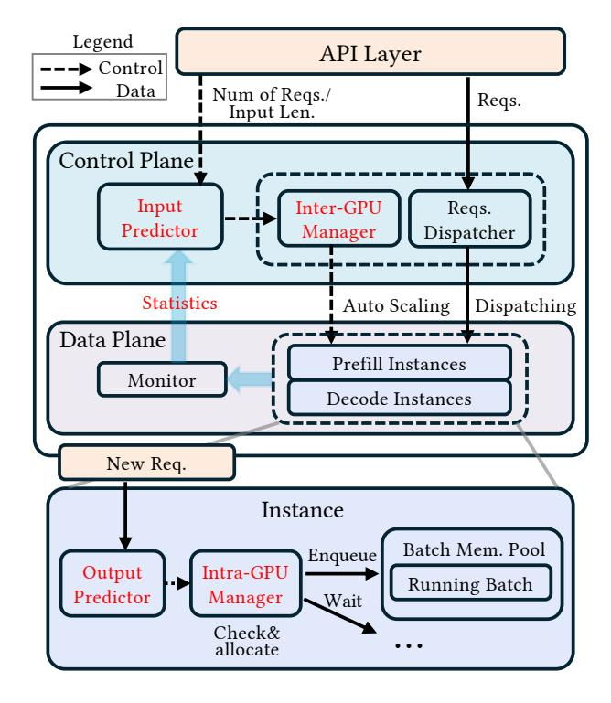

# 5 Implementation

To demonstrate the effectiveness of our proposed algorithms, we implement PiLLM by extending LightLLM [\[12\]](#page-12-17). We chose LightLLM as our foundation because its token-level KV cache management aligns well with our requirements for intra-GPU batch-level memory sharing and disaggregated prefill/decode paradigm. In this section, we describe how the key algorithms function in our real system implementation.

#### 5.1 System Architecture and Request Flow

PiLLM follows a hierarchical architecture designed to efficiently manage LLM inference workloads. As shown in [Fig](#page-6-0)[ure 3,](#page-6-0) our system consists of three main layers: (1) the API layer serving as the interface to client applications, (2) the global scheduling layer handling resource management and request dispatching, and (3) the execution instances where actual inference takes place.

Figure 3. PiLLM System Architecture

At the global scheduling layer, we implement two key components: a dispatcher that routes incoming requests based on their computational characteristics, and an instance count manager that governs GPU resource allocation. These components collaboratively implement our dynamic resource scheduling algorithm (Algorithm [1\)](#page-5-0). When traffic spikes occur, our spike reaction algorithm (Algorithm [2\)](#page-5-1) rapidly activates additional resources to maintain service quality.

The execution layer consists of multiple inference instances, each potentially spanning multiple GPUs. We deploy two types of specialized instances: prefill instances that handle input token processing, and decode instances for generating output tokens. Each instance incorporates a batching scheduler that applies our predictive length-aware policies to maximize throughput while meeting latency constraints. Additionally, instances provide a fast resume mechanism enabling rapid response to traffic spikes, via a multi-level parameter cache like ServerlessLLM [\[3\]](#page-12-19).

From the perspective of user requests, the processing follows a defined flow through this architecture:

- (1) User requests enter through the API layer;
- (2) The global dispatcher analyzes request characteristics and determines routing based on Algorithm [1;](#page-5-0)
- (3) Requests are assigned to either active prefill instances or queued for spike reaction;
- (4) Prefill instances process initial tokens and transfer computational state to decode instances after each layer;
- (5) Decode instances continue generation while prefill resources become available for new requests;
- (6) Completed responses return via the API layer to the user. This architecture allows PiLLM to effectively separate con-

trol plane (scheduling and resource management) from data plane (model execution), , where the control plane makes sure the instances meet SLO constraints, and the data plane tries to fully utilize the allocated resource. By specializing instances for distinct computational patterns, our system achieves both high resource utilization and responsive adaptation to changing workloads, enabling a balance between service quality and efficiency.

## 5.2 Statistical Data Collection for Workload Resource Prediction

PiLLM implements a multi-level statistical data collection framework to power its predictive scheduling mechanisms while minimizing system overhead.

For inter-GPU scheduling, we collect data at two strategic points in the request lifecycle. For prefill resource prediction, we leverage input length information already available at the API layer, where requests first enter the system. This approach incurs virtually zero overhead as we simply capture data that exists in the request processing pipeline. For decode resource prediction, we collect output length statistics directly from decode instances. To avoid communication overhead, we aggregate these statistics at configurable time

intervals rather than after every token generation. This periodic sampling provides sufficient data accuracy for our prediction models while minimizing system impact.

For intra-GPU scheduling, our prediction framework operates at the batch level, primarily using current output lengths of active requests—information already maintained by the batch scheduler as part of normal execution state tracking. We predict the required memory with the predicted left generation in batch granularity.

Our statistical models primarily track and utilize average values and standard deviations of a sliding window, which provide sufficient information to apply our prediction algorithms while being computationally lightweight during runtime.

### 5.3 Memory Budget Sharing for Batch-Aware Scheduling

Our system leverages token-level KV cache management inherited from LightLLM [12], which we extend to implement our batch-aware memory sharing approach. Rather than allocating fixed memory blocks to each request, our implementation structures the KV cache as a linked list of token slots, enabling flexible memory (KV cache) allocation and deallocation. When any request requires additional space for new tokens, the system can allocate from the shared pool with minimal overhead.

