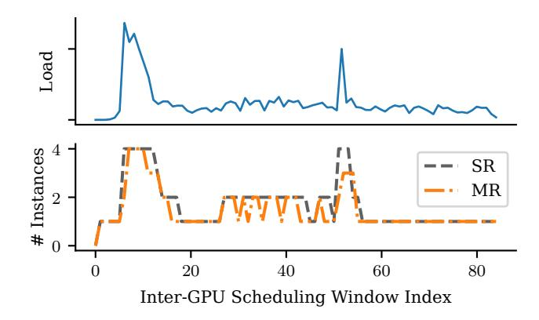
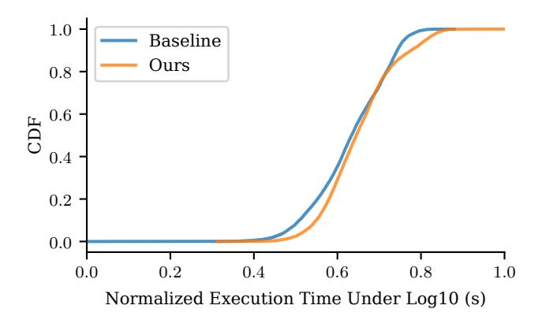
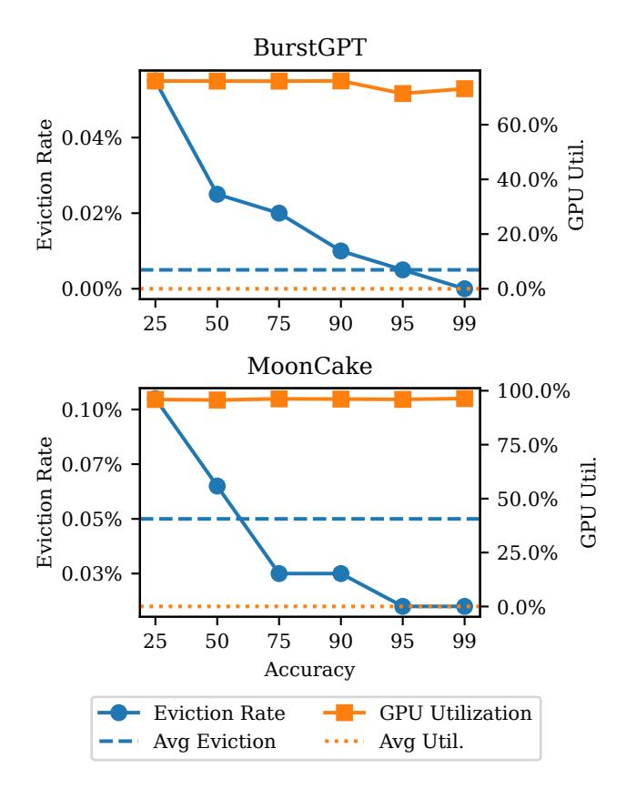
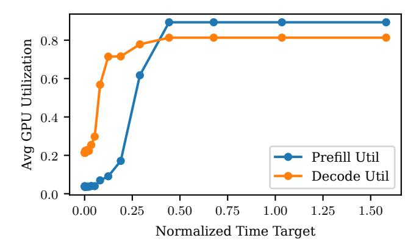
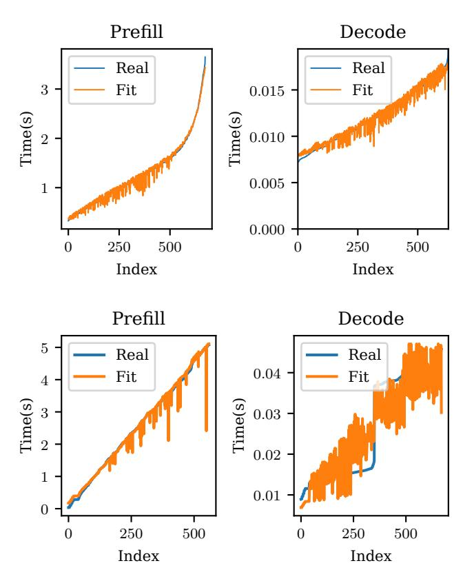

# 6 Experiments

#### 6.1 Experimental Setup

Our evaluation of PiLLM focuses on its ability to achieve resource efficiency while maintaining service quality across diverse workloads. Here, we describe the experimental hardware/software platform, datasets, metrics, and setup comparison baselines.

**Hardware.** We conduct our experiments on 8 NVIDIA H800 GPUs with NVLink all-to-all interconnect, 2 Intel Xeon 6448Y CPUs, and 1TB of DDR memory.

**Software.** Our software stack consists of PyTorch 2.1, CUDA 12.1, and custom extensions to the LightLLM framework. We implement both our system and baselines with the same underlying GPU kernel implementations to ensure fair comparisons of inter- and intra-GPU scheduling strategies.

**Datasets.** We use both public datasets and synthetic workloads derived from production patterns:

**BurstGPT** [16]: A public dataset of ChatGPT tracing, containing anonymized request lengths with timestamps.

**MoonCake** [14]: Released by Kimi AI, with heterogeneous length patterns and long-tail distributions.

**Production-derived workloads**: We created additional datasets containing only length information and timing metadata (with all content and personally identifiable information removed). *Conversation* contains multi-turn chat histories with varied context lengths. *Document* traces long-context workloads with extensive input texts. *Assistant* contains task-oriented interactions with moderate input/output lengths

These datasets collectively cover diverse request patterns, with average input lengths ranging from 32 to over 120,000 tokens and output lengths from 30 to 25,000 tokens, which is shown in Table 1. All exhibit pronounced long-tail distributions, with the 99th percentile typically 3-10 times larger than the 90th percentile—creating significant resource allocation challenges that PiLLM specifically addresses.

**Metrics.** We focus on two categories of metrics directly relevant to LLM inference providers and users: resource efficiency and service quality metrics.

For resource efficiency, PiLLM is evaluated using two primary types of measurements. For the inter-GPU scheduler, the GPU Saving Factor quantifies the ratio of GPUs required by baseline systems compared to those required by PiLLM under equivalent workloads and quality targets. This metric directly reflects the cost reduction potential for deployment. For the intra-GPU scheduling, memory Utilization captures the percentage of intra-GPU memory actively used for KV cache during operation, indicating how efficiently each allocated GPU is being used.

For service quality, our primary metric is the SLO Satisfaction Rate, which represents the percentage of requests meeting their target latency requirements. This metric most directly reflects the user experience while providing a clear measure of system reliability. To establish meaningful SLOs, we take an individualized approach tailored to each specific request rather than using fixed deadlines across all requests.

Table 1. Key Characteristics of Experimental Datasets

| Dataset      | Input Length |      |        |       |         |       |
|--------------|--------------|------|--------|-------|---------|-------|
| Percentile   | 90%          |      | 99%    |       | Overall |       |
|              | Mean         | Std  | Mean   | Std   | Mean    | Std   |
| BurstGPT     | 1792         | 367  | 3395   | 719   | 11099   | 781   |
| Mooncake     | 16858        | 3198 | 64266  | 7757  | 125546  | 11121 |
| Assistant    | 738          | 137  | 1604   | 259   | 2398    | 304   |
| Conversation | 485          | 77   | 3093   | 394   | 16670   | 710   |
| Document     | 39549        | 4973 | 120841 | 18940 | 123831  | 22437 |

| Dataset      |      | Output Length |      |     |         |     |
|--------------|------|---------------|------|-----|---------|-----|
| Percentile   | 90%  |               | 99%  |     | Overall |     |
|              | Mean | Std           | Mean | Std | Mean    | Std |
| BurstGPT     | 271  | 69            | 1494 | 183 | 3206    | 272 |
| Mooncake     | 509  | 163           | 910  | 212 | 2000    | 244 |
| Assistant    | 339  | 88            | 593  | 116 | 1024    | 129 |
| Conversation | 1227 | 377           | 1796 | 426 | 25589   | 521 |
| Document     | 419  | 70            | 599  | 89  | 736     | 97  |

Specifically, we first execute each request in our test datasets on the baseline system with maximum resource allocation to measure its reference performance. A single fixed SLO deadline would be inappropriate: if calibrated for long requests, it would be too permissive for shorter interactions, masking potential performance degradation in common use cases; if calibrated for short requests, it would create impossible targets for inherently longer operations. We then set that request's SLO target for PiLLM as 20% higher than its baseline execution time. This approach is necessary due to the extreme variation in request characteristics across our workloads, from simple assistant interactions requiring only a few hundred tokens to complex document processing tasks with over 100,000 tokens. Notably, the actual resource savings substantially exceed 20%, as shown in Table 3.

In our ablation studies, we additionally examine P99 latency (the 99th percentile response time) of TTFT(Timeto-first-token) and TPOT(Time-per-output-token) to better understand tail performance characteristics, which are particularly important for production systems where consistent service quality must be maintained even at the extremes of the distribution.

These complementary metrics allow us to comprehensively evaluate PiLLM's ability to balance the fundamental trade-off between resource efficiency and service quality that defines effective LLM inference systems.

**Baselines.** We compare PiLLM against two levels: **Inter-GPU management**: We compare PiLLM's dynamic resource allocation with: (a) Metrics-based scaling that adjusts GPU count based on utilization metrics, which is used

for service quality comparison. (b) Fixed maximum resource allocation, representing the conservative approach commonly used in production.

Intra-GPU batching: We compare PiLLM's batching strategy with leading systems. (a) vLLM's greedy approach that maximizes immediate resource utilization [11]. (b) PastFuture's conservative strategy that prioritizes non-eviction of requests based on probabilistic sampling [4]. (c) SGLang's configurable rate-based approach that attempts to balance utilization and stability [20]. For all baseline systems, we use their default parameter settings as specified in their original implementations to ensure fair comparison.

For fair comparison, all systems run the same underlying model (LLaMA-3.1 8B [5]) and serve identical workloads. In PiLLM configurations, we limit scaling between 1-4 GPU instances per phase, establishing a theoretical maximum saving factor of 4 times. Also, for the intra-GPU batching, we make sure the requests are in the same order, in case of unstable performance.

**Table 2.** GPU Savings and SLO Satisfaction Rate Across Different Workloads

| Dataset      | Avg. GPU Saving |       | tisfaction Decode |
|--------------|--------------------|-------|----------------------|
| BurstGPT     | 2.01×              | 97.9% | 100%                 |
| MoonCake     | 2.02×              | 100%  | 100%                 |
| Assistant    | 1.62×              | 99.1% | 100%                 |
| Conversation | 2.56×              | 98.6% | 100%                 |
| Document     | 3.06×              | 100%  | 100%                 |

#### 6.2 Overall System Performance

The primary goal of PiLLM is to reduce GPU resource requirements while maintaining acceptable service quality. Table 2 presents a comprehensive view of our system's performance across different workloads, comparing GPU savings and SLO satisfaction rates against the baseline systems.

PiLLM achieves substantial GPU savings across all tested scenarios, with reduction factors ranging from 1.62 times for assistant workloads to 3.06 times for document processing tasks. These savings translate directly to reduced operational costs or increased capacity at the same cost. The greatest savings occur in document processing workloads due to their highly variable input lengths, where static allocation approaches waste significant resources.

Importantly, our SLO satisfaction rates remain consistently high, with over 97.9% satisfaction for prefill operations and 100% for decode operations across all workloads. This demonstrates PiLLM's ability to maintain service quality while dramatically reducing resource needs, validating our statistical approach to resource allocation.

The minor SLO degradation observed in the prefill stage is an expected consequence of our dynamic resource allocation strategy. PiLLM deliberately reduces the number of active GPUs while improving their utilization through increased batch sizes. For the computation-intensive prefill stage, these larger batches inevitably extend processing time for some requests, occasionally exceeding tight SLO thresholds. In contrast, the decode stage maintains perfect SLO satisfaction despite batching because decode operations are relatively shorter in duration, making them less susceptible to SLO violations even with the additional latency introduced by larger batch sizes. This controlled trade-off between resource efficiency and processing time represents an effective balance—achieving substantial GPU savings with only a negligible impact on user experience.

#### 6.3 Inter-GPU Saving Analysis

A key innovation in PiLLM is its phase-specific resource allocation strategy. Table 3 breaks down GPU savings by inference phase, revealing that our approach achieves substantially different resource efficiency between phases.

Across all workloads, decode phase savings are remarkably consistent, ranging from 3.72 times to 4.00 times, approaching the maximum saving of 4 times permitted by our experimental configuration (which allocated a minimum of 1 instance out of 4 available per phase). This consistency reflects the relatively low computation density of token generation during decoding. In contrast, prefill phase savings exhibit higher variance, ranging from nearly neutral (1.03 times) for assistant workloads to substantial (2.48 times) for document processing. This variation reflects the diverse computational demands of varied prompt lengths during prefill.

Table 3. Per-Phase GPU Saving Breakdown

| Phase        | Average | Prefill       | Decode        |
|--------------|---------|---------------|---------------|
| BurstGPT     | 2.01×   | 1.35×         | 3.85×         |
| MoonCake     | 2.02×   | 1.39×         | 3.72×         |
| Assistant    | 1.62×   | 1.03×         | $3.74 \times$ |
| Conversation | 2.56×   | 1.88×         | 4.00×         |
| Document     | 3.06×   | $2.48 \times$ | 3.99×         |

This asymmetry in savings validates our prefill/decode disaggregated approach. Traditional systems that use the same GPU allocation for both phases are constrained by the most resource-intensive phase requirements, leading to significant underutilization during lighter phases. By allocating resources independently, PiLLM can assign just enough GPUs to each phase, avoiding the inefficiency of one-size-fits-all approaches.

Figure 4 demonstrates PiLLM's superior adaptation to workload variations. The top graph shows the incoming request load over time with two significant spikes around

**Figure 4.** Auto-scaling comparison with hardware metrics controlled methods. SR: Spike Reaction; MR: Metrics Reaction. MR shows lagging response to load changes.

Figure 5. CDF Of Execution Time

window indices 10 and 55. The bottom graph compares our Spike Reaction (SR) approach with traditional Metrics Reaction (MR). When load spikes occur, SR immediately scales up GPU instances to handle the increased demand, while MR exhibits a characteristic delay of one full scheduling window before responding. This delayed reaction in MR directly impacts SLO compliance during critical periods of high demand, as resources remain insufficient during the adaptation lag. While MR may achieve marginally better resource utilization in steady states, this comes at the cost of compromised service quality during transitions.

The cumulative distribution function in Figure 5 plots the distribution of execution times (shown on a logarithmic scale for better visualization across different time ranges) for both baseline and PiLLM approaches. The slight rightward shift in PiLLM's curve indicates marginally increased execution times compared to the fixed allocation baseline. This shift represents the classical throughput-latency tradeoff: by increasing batch sizes and improving GPU utilization, PiLLM

achieves higher throughput at the cost of slightly longer perrequest processing times. Importantly, both curves exhibit similar shapes and convergence in the tail region, demonstrating that PiLLM's optimization preserves SLO guarantees for most users while significantly reducing resource requirements. The logarithmic scale highlights that this performance difference remains within acceptable bounds across all percentiles of the distribution.

#### 6.4 Intra-GPU Efficiency

Beyond inter-GPU resource allocation, PiLLM also optimizes memory utilization within each GPU through its length-aware batch scheduling. Table 4 compares PiLLM's intra-GPU performance metrics against vLLM, SGLang, and Past-Future across different workloads, showing significant improvements in batch concurrency and memory utilization while maintaining low request eviction rates.

PiLLM achieves memory utilization rates between 78.9% and 96.1% across different workloads, significantly higher than the 45-70% typical in production systems using fixed-size KV cache allocation. This improved utilization stems from our statistical prediction approach, which allows for safe overcommitment of GPU memory. By predicting batch-level memory requirements rather than worst-case individual needs, PiLLM can accommodate more concurrent requests while maintaining minimal service disruption.

The results in Table 4 underscore interesting performance trade-offs among different batching approaches. While vLLM achieves slightly higher memory utilization, reaching within 0.3% of PiLLM across various workloads, it also suffers from significantly higher eviction rates, peaking at 68.39% for *Conversation* workloads. In contrast, conservative approaches like PastFuture and SGLang maintain zero evictions but substantially underutilize available resources. Both our approach and PastFuture leverage statistical information for better resource management. However, PastFuture performs sampling for every request, potentially overlooking the low-variance nature that statistical insights can offer. PiLLM, on the other hand, finds a harmonious balance, achieving near the utilization efficiency of aggressive schedulers while keeping eviction rates low.

#### 6.5 Ablation Studies

To understand how individual components contribute to system performance, we conducted ablation studies on both inter-GPU and intra-GPU optimizations.

For inter-GPU resource management, Table 5 demonstrates the impact of our spike reaction mechanism on system responsiveness during sudden traffic increases. The table shows the percentage increase in Time-To-First-Token (TTFT) tail latency during traffic spikes compared to normal operations. Across all workloads, our spike reaction mechanism keeps

**Table 4.** Intra-GPU Performance Comparison Across Scheduling Algorithms

| Dataset      | Batching Strategy | Eviction Rate | Avg. Batch Size | Mem. Util. |
|--------------|----------------------|------------------|--------------------|---------------|
|              | Ours                 | 0.01%            | 282.21             | 78.93%        |
|              | PastFuture           | 0.00%            | 223.16             | 62.42%        |
| BurstGPT     | SGLang               | 0.00%            | 231.21             | 64.67%        |
|              | vLLM                 | 10.38%           | 283.12             | 79.18%        |
|              | Ours                 | 0.07%            | 37.28              | 96.05%        |
| MoonCake     | PastFuture           | 0.00%            | 36.66              | 94.46%        |
| MoonCake     | SGLang               | 0.00%            | 36.24              | 93.37%        |
|              | vLLM                 | 1.71%            | 37.33              | 96.18%        |
|              | Ours                 | 0.32%            | 798.33             | 82.03%        |
| Assistant    | PastFuture           | 0.00%            | 645.5              | 66.33%        |
| Assisiani    | SGLang               | 0.00%            | 483.30             | 49.66%        |
|              | vLLM                 | 6.83%            | 801.13             | 82.31%        |
|              | Ours                 | 0.05%            | 639.43             | 91.06%        |
| Conversation | PastFuture           | 0.00%            | 365.92             | 52.15%        |
| Conversation | SGLang               | 0.00%            | 431.68             | 61.53%        |
|              | vLLM                 | 68.39%           | 654.04             | 91.50%        |
|              | Ours                 | 0.53%            | 43.37              | 93.78%        |
| Document     | PastFuture           | 0.00%            | 42.80              | 92.58%        |
| Document     | SGLang               | 0.00%            | 41.93              | 90.70%        |
|              | vLLM                 | 2.85%            | 43.42              | 93.88%        |

Table 5. Spike Reaction Analysis On Tail Latency of TTFT

| Dataset      | Reaction Type |        |  |
|--------------|---------------|--------|--|
| Duraser      | Spike         | Metric |  |
| BurstGPT     | 139%          | 223%   |  |
| MoonCake     | 116%          | 353%   |  |
| Assistant    | 166%          | 159%   |  |
| Conversation | 118%          | 130%   |  |
| Document     | 102%          | 491%   |  |

latency increases significantly lower than metric-based reactions, with particularly dramatic improvements for Document workloads (102% vs 491%) and MoonCake workloads (116% vs 353%). This confirms that proactive resource allocation based on statistical prediction substantially outperforms reactive scaling approaches during critical traffic fluctuations.

For intra-GPU scheduling, Figure 6 illustrates how prediction accuracy affects memory utilization and request eviction rates across two representative workloads. The horizontal axes represent the increasing percentile accuracy of memory usage prediction for individual requests, from the 25th to the

**Figure 6.** Impact of Prediction Accuracy on Intra-GPU Utilization and Eviction Rates

99th percentile. Importantly, while these accuracy levels refer to per-request predictions, PiLLM performs scheduling at batch granularity, which provides inherent resilience against individual prediction errors. This batch-level approach explains why even moderate prediction accuracies (25-50%) yield strong performance results—the statistical aggregation across multiple requests in a batch naturally compensates for individual prediction variances.

To ensure the intra-GPU estimation of our scheduling system, we implemented techniques to stabilize the conversion from length to execution time. We employed AOT(Ahead-of-time) compilation to avoid runtime overhead and CUDA graph execution to reduce jitters from memory allocation. It used a series of kernels with fixed-sized intermediate workspaces that leverage pre-compiled operations and pre-allocated memory. These optimizations significantly improved time prediction accuracy, limiting error to under 20% for decode phases and under 10% for prefill operations, which ensures precise scheduling in PiLLM. Due to space constraints, detailed implementation and characterization are provided in the Appendix B.

**Figure 7.** Impact of Execution Time Goal on the GPU Utilization.

To extend our validation beyond available hardware, we simulated large-scale production deployments. Figure 7 illustrates the fundamental trade-off between time targets and GPU utilization. The simulation demonstrates that relaxing these time targets can substantially improve system-wide utilization, although utilization eventually saturates. Additionally, decode operations (orange) consistently achieve higher efficiency than prefill operations (blue) due to their more predictable execution patterns, confirming our experimental findings at scale.

#### 7 Conclusion

PiLLM demonstrates that statistical batch-level prediction can effectively address the efficiency challenges in LLM inference systems. By dynamically allocating resources at both inter-GPU and intra-GPU levels, our approach reduces GPU requirements by 1.6-3.1× while maintaining over 97.9% SLO compliance. While our method excels at handling workload spikes, we observe varying gains across different workload types, with a controlled trade-off between resource efficiency and per-request latency.

Our current implementation has limitations in centralized request queueing optimization and may face challenges when scaling to extremely large clusters with thousands of GPUs, due to the centralized controller. Besides, it should be practical that prefill and decode share the same instance pool, as they use the same copy of parameters. This might enable prefill-decode auto-converting, which may benefit according to the fact that decode keeps a relatively low number of active instances while prefill utilizes almost all resources.

#### Acknowledgement

This work was supported by the Postdoctoral Fellowship Program and China Postdoctoral Science Foundation (No. BX20250487).

#### References

- [1] Aliyun. [n.d.]. Deploy LLMs as elastic inference services in ACK Edge clusters in hybrid cloud environments. https://www.alibabacloud.com/help/en/ack/ack-edge/use-cases/deploy-llm-inference-service-in-hybrid-cloud-scenarios
- [2] DeepSeek-AI, Daya Guo, Dejian Yang, Haowei Zhang, and Junxiao Song. 2025. DeepSeek-R1: Incentivizing Reasoning Capability in LLMs via Reinforcement Learning. doi:10.48550/arXiv.2501.12948
- [3] Yao Fu, Leyang Xue, Yeqi Huang, Andrei-Octavian Brabete, Dmitrii Ustiugov, Yuvraj Patel, and Luo Mai. 2024. ServerlessLLM: Locality-Enhanced Serverless Inference for Large Language Models. http://arxiv. org/abs/2401.14351
- [4] Ruihao Gong, Shihao Bai, Siyu Wu, Yunqian Fan, and Zaijun Wang. 2025. Past-Future Scheduler for LLM Serving under SLA Guarantees. In ASPLOS '25: 30th ACM International Conference on Architectural Support for Programming Languages and Operating Systems (Rotterdam Netherlands). ACM, 798–813. doi:10.1145/3676641.3716011
- [5] Aaron Grattafiori, Abhimanyu Dubey, Abhinav Jauhri, Abhinav Pandey, and Abhishek Kadian. 2024. The Llama 3 Herd of Models. doi:10.48550/arXiv.2407.21783
- [6] Arpan Gujarati, Reza Karimi, Safya Alzayat, Wei Hao, Antoine Kaufmann, Ymir Vigfusson, and Jonathan Mace. 2020. Serving {DNNs} like Clockwork: Performance Predictability from the Bottom Up. In 14th USENIX Symposium on Operating Systems Design and Implementation (OSDI 20). 443–462. https://www.usenix.org/conference/osdi20/presentation/gujarati
- [7] Taicheng Guo, Xiuying Chen, Yaqi Wang, Ruidi Chang, and Shichao Pei. 2024. Large Language Model Based Multi-Agents: A Survey of Progress and Challenges. doi:10.48550/arXiv.2402.01680
- [8] Connor Holmes, Masahiro Tanaka, Michael Wyatt, Ammar Ahmad Awan, and Jeff Rasley. 2024. DeepSpeed-FastGen: High-throughput Text Generation for LLMs via MII and DeepSpeed-Inference. doi:10.48550/ arXiv.2401.08671
- [9] HuggingFace. [n. d.]. Text Generation Inference. https://huggingface. co/docs/text-generation-inference/index
- [10] KServe. [n. d.]. Home - KServe Documentation Website. https://kserve.github.io/website/latest/
- [11] Woosuk Kwon, Zhuohan Li, Siyuan Zhuang, Ying Sheng, and Lianmin Zheng. 2023. Efficient Memory Management for Large Language Model Serving with PagedAttention. http://arxiv.org/abs/2309.06180
- [12] ModelTC. 2025. ModelTC/Lightllm. ModelTC. https://github.com/ ModelTC/lightllm
- [13] OpenAI. [n. d.]. Introducing Deep Research. https://openai.com/index/introducing-deep-research/
- [14] Ruoyu Qin, Zheming Li, Weiran He, Mingxing Zhang, Yongwei Wu, Weimin Zheng, and Xinran Xu. 2024. Mooncake: A KVCache-centric Disaggregated Architecture for LLM Serving. doi:10.48550/arXiv.2407. 00079
- [15] Ashish Vaswani, Noam Shazeer, Niki Parmar, Jakob Uszkoreit, and Llion Jones. 2023. Attention Is All You Need. doi:10.48550/arXiv.1706. 03762
- [16] Yuxin Wang, Yuhan Chen, Zeyu Li, Xueze Kang, and Zhenheng Tang. 2024. BurstGPT: A Real-world Workload Dataset to Optimize LLM Serving Systems. doi:10.48550/arXiv.2401.17644
- [17] Jason Wei, Xuezhi Wang, Dale Schuurmans, Maarten Bosma, and Brian Ichter. 2023. Chain-of-Thought Prompting Elicits Reasoning in Large Language Models. doi:10.48550/arXiv.2201.11903
- [18] Gyeong-In Yu, Joo Seong Jeong, Geon-Woo Kim, Soojeong Kim, and Byung-Gon Chun. 2022. Orca: A Distributed Serving System for {Transformer-Based} Generative Models. In 16th USENIX Symposium on Operating Systems Design and Implementation (OSDI 22). 521–538. https://www.usenix.org/conference/osdi22/presentation/yu

- [19] Hong Zhang, Yupeng Tang, Anurag Khandelwal, and Ion Stoica. 2023. {SHEPHERD}: Serving {DNNs} in the Wild. In 20th USENIX Symposium on Networked Systems Design and Implementation (NSDI 23). 787–808. https://www.usenix.org/conference/nsdi23/presentation/zhanghong
- [20] Lianmin Zheng, Liangsheng Yin, Zhiqiang Xie, Chuyue Sun, and Jeff Huang. 2024. SGLang: Efficient Execution of Structured Language Model Programs. doi:10.48550/arXiv.2312.07104
- [21] Zangwei Zheng, Xiaozhe Ren, Fuzhao Xue, Yang Luo, Xin Jiang, and Yang You. 2023. Response Length Perception and Sequence Scheduling: An LLM-Empowered LLM Inference Pipeline. http://arxiv.org/abs/2305. 13144
- [22] Yinmin Zhong, Shengyu Liu, Junda Chen, Jianbo Hu, and Yibo Zhu. 2024. DistServe: Disaggregating Prefill and Decoding for Goodputoptimized Large Language Model Serving. http://arxiv.org/abs/2401. 09670
- [23] Botao Zhu, Chen Chen, Xiaoyi Fan, and Yifei Zhu. 2025. LLMSched: Uncertainty-Aware Workload Scheduling for Compound LLM Applications. doi:10.48550/arXiv.2504.03444

#### **A Statistical Prediction**

According to Table 1, the tail 10% of the distribution can alter the average by tens of times, which means the Equation 1 might be unstable as it relies on the observed mean of the distribution. One direct solution is to omit the long tail part:

$$\hat{l}_{d,\mathcal{B},k\%} = \mu_{d,k\%} + \frac{\sigma_{d,k\%}}{\sqrt{|\mathcal{B}|}} \cdot \Phi^{-1}(1 - \epsilon), \tag{6}$$

where the mean and standard deviation are replaced by those of the first k% lengths of  $\mathcal B$  in ascending order. The only dependency between our methods and the distribution is the mean and standard deviation. Therefore, inherently, there is no limitation to mixed scenarios. To verify this, we conducted experiments across various mixed workloads as shown in Table 6.

**Table 6.** Intra-GPU scheduling performance in mixed workload scenarios

| Dataset                       | Eviction | Average    | Memory      |
|-------------------------------|----------|------------|-------------|
|                               | Rate     | Batch Size | Utilization |
| MoonCake                      | 0.01%    | 282.21     | 78.93%      |
| BurstGPT                      | 0.07%    | 37.28      | 96.05%      |
| Moon.+Burst.                  | 0.48%    | 143.13     | 93.3%       |
| Document                      | 0.53%    | 43.37      | 93.78%      |
| Conversation                  | 0.05%    | 639.43     | 91.06%      |
| Assistant                     | 0.32%    | 798.33     | 82.03%      |
| $\overline{Doc.+Conv.+Asst.}$ | 0.44%    | 58.00      | 95.48%      |

Our experimental results demonstrate that our statistical prediction approach maintains high performance even in mixed workload scenarios. The mixed workloads achieve comparable or even superior memory utilization compared to single-scenario workloads while maintaining low request pause rates. This confirms that our method generalizes well to complex, real-world deployment scenarios where request patterns may come from multiple sources simultaneously.

#### **B** Predictable Execution Time

Execution time uncertainties also pose challenges for effective inter-GPU scheduling. Without addressing these , reliable inter-GPU scheduling becomes infeasible. We identified two primary sources:

- $1.\ Dynamic\ memory\ allocation\ and\ deallocation\ operations.$
- 2. Just-in-time (JIT) kernel compilation triggered by variable input/output lengths;

Most LLM inference frameworks already pre-allocate KV cache, while the intermediate workspace memory is still dynamically managed as the requirements are related to the sum of sequence lengths.

We improve execution time predictability by redesigning kernel memory layouts using a chunk-based approach:

1. Every request is split into fixed-size chunks.

- 2. The kernel allocates a fixed number of chunk workspaces in GPU memory.
- 3. The system breaks requests into chunks to fill available workspace slots.

This approach makes memory allocation independent of the number of requests, with the only cost being the pre-allocation of chunks (some of which may remain empty). Importantly, this design accommodates varying input/output lengths and batch sizes while maintaining consistent memory usage patterns, which allows for CUDA Graph optimization. It eliminates Triton kernel recompilation time, as chunk sizes remain constant

**Figure 8.** Prefill And Decode Execution Time Fit for LLaMA 3.1 8B and DeepSeek V2 Lite

After applying the techniques described above, our execution time prediction accuracy improved significantly. Figure 8 shows the fitting results for LLaMA-1.8B and DeepSeek V2 Lite models respectively, demonstrating acceptable prediction quality. In these figures, the x-axis represents the sorted index of execution samples (increasing order of real execution time), while the y-axis shows the time. Although the fit errors remain, the magnitude is substantially reduced to about 20%. The improved prediction accuracy enables reliable estimation of execution time for both prefill and decode phases across different models, which ensures Flops-to-GPU-count conversion is possible.