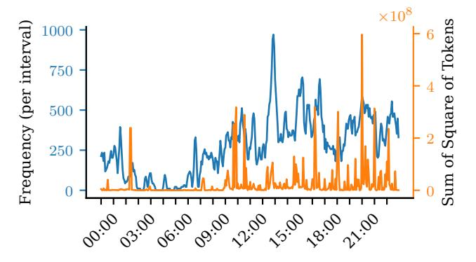

# Request Distribution Over Time

**Figure 1.** Disparity between request frequency and computational demand in production LLM inference.

LLMs uses GPU utilization metrics [1] that fail to detect load spikes from long requests, which maintain steady utilization while degrading service quality. At the intra-GPU level, current schedulers face an efficiency-reliability dilemma: aggressive memory allocation improves utilization but risks out-of-memory evictions [11], while conservative approaches ensure stability but waste resources [9].

One shared limitation of these approaches is the inability to predict real-time computational load and request memory requirement accurately. With reliable prediction, both inter- and intra-GPU scheduling could be optimized as a semi-deterministic problem. While recent transformer-based approaches can predict output lengths, they struggle with input length variability and require additional GPU resources to run the prediction models, which is impractical for real-time scheduling and detracts from the resources available for the inference process and potentially degrades overall system QoS. Also, the variation between LLM requests makes predicting individual request characteristics infeasible.

While individual request lengths are highly variable, the statistical properties of large batches of requests become increasingly predictable as the request count grows. As more requests are aggregated, the average behavior converges toward a stable distribution (Law of Large Numbers), allowing us to make reliable predictions about input/output length patterns despite individual variations. LLM inference system always operates on a batch of requests, based on the batched metrics like total Flops and memory, etc. Thus, the batched prediction aligns with LLM inference. Batched prediction enjoys properties such as reduced error bound, along with batch size and calculation efficiency. This motivates us to develop a lightweight statistical batched resource predictor, towards FLOPs and memory of realtime workloads, in which time window aggregation naturally batches requests. Unlike transformer-based predictors, our approach introduces

minimal computational overhead while providing sufficient accuracy for scheduling decisions.

Using this predictor, we propose PiLLM, a framework targeting at reducing resource waste while maintaining service quality via prediction. Both inter-GPU and intra-GPU scheduling are specially designed around batched workload prediction to address the identified challenges. For inter-GPU scheduling, we calculate total computational requirements (FLOPs) based on predicted average request length and forecasted request count, then derive the optimal GPU count as a function of execution time requirements and computational load. This approach replaces utilization metrics in auto-scaling with a measure of actual workload, enabling precise resource allocation while maintaining SLOs. We further enhance its robustness with a fallback mechanism to launch new instances immediately for unexpected load spikes. For intra-GPU scheduling, our workload predictor provides accurate estimates of future KV cache requirements, allowing the scheduler to achieve both high memory utilization and low eviction rates simultaneously, overcoming the traditional trade-off between these competing objectives.

To maximize resource efficiency, we implement PiLLM on a disaggregated prefill/decode paradigm where these two computation phases can be scheduled independently. This architectural choice enables more fine-grained inter-GPU resource management because the compute-intensive prefill phase and the memory-access-intensive decode phase have distinct resource requirements.

In summary, our key contributions are as follows:

- (1) We identify key inefficiencies in LLM inference systems as unpredictability and develop a lightweight statistical prediction algorithm that models request length distributions.
- (2) We design an elastic inter-GPU dispatch mechanism that dynamically scales resources based on predicted computational requirements, reducing GPU usage by 1.6-3.1 times while maintaining SLO compliance.
- (3) We develop an intelligent intra-GPU scheduler that optimizes memory allocation based on predicted KV cache requirements, achieving 99.5% of state-of-the-art GPU utilization while reducing eviction rates to less than 0.5%.
- (4) We call the prediction-aware system PiLLM and implement it on a disaggregated prefill/decode architecture for fine-grained inter-GPU management. It is evaluated on real-world workloads with natural load fluctuations, demonstrating significant improvements across inter- and intra-GPU levels.

#### 2 Related Work

#### 2.1 Predictable ML Inference Systems

**DNN Inference Predictability.** Clockwork [6] pioneered predictable DNN serving by revealing that its inference is highly deterministic, thus redesigns a multi-level tight scheduling while maintaining consistent quality. Shepherd [19]

extends this approach to request intervals by grouping them to predict arrival patterns, thereby reducing variability and improving resource allocation efficiency. Both systems rely on the fundamental facts that DNN computational loads exhibit high predictability and even the arriving patterns show predictability when grouping, which inspired our exploration of statistical methods to predict LLM loads in a grouping manner against their inherently higher variability.

Uncertainty in LLM Systems. Unlike traditional DNNs, which have fixed computational graphs with predictable memory and processing requirements, LLMs present unique scheduling challenges due to their transformer architecture and autoregressive generation pattern. While DNNs execute the same operations regardless of input content, LLM computation scales quadratically with sequence length and requires maintaining growing key-value caches during generation. This fundamental difference means scheduling techniques optimized for DNNs' predictable workloads cannot be directly applied to LLMs. Existing approaches attempting to address LLM-specific challenges include transformer-based output prediction [21] and distribution sampling [4], but these methods often introduce significant computational overhead or struggle with the combined variability of both input processing and output generation.

LLMSched [23] addresses uncertainty on the stage change and completion time in multi-stage LLM applications by modeling workflows as DAGs composed of different stage types, then calibrating the probability of different stages as a Bayesian Network. This approach quantifies stage switching and completion time uncertainty through entropy, thus enabling priority scheduling of stages that most effectively reduce overall uncertainty. LLMSched demonstrates that LLM computation loads can also be probabilistically modeled, which motivates our statistical prediction approach rather than relying on more computationally expensive neural methods.

#### 2.2 Resource Management and LLM Scheduling

Auto Scaling for Cloud Service. KServe [10] provides inference serving capabilities with auto-scaling that performs well for traditional ML inference frameworks like PyTorch and TensorFlow. However, KServe-based services rely on generic utilization metrics that fail to capture the spike characteristics inherent to LLM workloads, thus causing either resource underprovisioning during spikes or wasteful over-provisioning during normal operation [1]. These spikes occur frequently in LLM applications due to variable input/output lengths, while traditional ML inference rarely encounters such variation because computational and memory loads remain almost fixed.

**LLM Execution Paradigm.** Traditional LLM serving follows a monolithic approach where prefill and decode phases execute on the same hardware, treating the whole prefill and

each decode step as atomic operations while allowing prefill to preempt decode steps [18]. As LLM context windows grow, this pattern leads to severe interruption of the decode phase due to the mismatch in execution time between prefill and decode steps, thus reducing the quality of decode. Chunked prefill strategies like SplitFuse [8] segment long prefill computations to reduce latency impact on decode operations, thereby improving responsiveness without fully separating the phases. In contrast, disaggregated prefill/decode completely separates these phases across dedicated resources, thus allowing them to run independently and reducing the interruption cost to mere state transfer time [22].

Batching Strategy. Current research on batching primarily addresses KV Cache management in GPU memory. Existing strategies lack accurate predictions of input/output lengths, forcing schedulers to either over-estimate or under-estimate memory needs [9, 11]. This leads to suboptimal tradeoffs between GPU utilization and eviction rates. While some methods attempt to predict output lengths using transformers [21] or distribution sampling [4], their high computational complexity and request-wise nature make them impractical for modern LLM inference systems handling numerous concurrent requests.

## 3 Preliminary

#### 3.1 LLM Inference Process

LLM inference consists of prefill and decode phases, with computational characteristics fundamentally different from traditional DNN inference.

In this work,  $r_i$  denotes the i-th inference request, while batch  $\mathcal{B}$  represents requests in processing and  $\mathcal{Q}$  the pending queue. Each request  $r_i$  has an input sequence length  $l_{p,i}$ , current output length  $l_{d,i}$ , maximum allowed output length  $l_{m,i}$ , and the actual output length  $l'_{d,i}$ . The subscripts p and d indicate whether the length is used by the prefill (input processing) or decode (token generation) phase.

The prefill phase processes the entire input sequence at once, with quadratic computational complexity  $O(l_{p,i}^2)$  relative to input length. Due to variable input lengths, prefill computation can vary by orders of magnitude between requests, unlike DNNs with fixed-dimension inputs and thus fixed computation amount.

The decode phase generates tokens sequentially, with each generating step having linear complexity  $O(l_{p,i}+l_{d,i})$  relative to the current sequence length. This phase is memory-intensive. While each step has linear complexity, the entire decode process still exhibits quadratic complexity across all generated tokens.

LLM has a highly variable computation amount and an increasing memory need: prefill is compute-bound with higher intensity, while decode is memory-bound with lower perstep intensity. Both contribute to growing memory usage as

the KV cache expands, requiring careful management. We manage GPUs in model instance granularity, where each instance contains the complete model parameters needed to perform inference.  $n_p$  and  $n_d$  indicate the instances allocated for prefill and decode phases, respectively. The KV cache memory consumption for a sequence of l tokens is  $c_{\rm kV} \cdot l$ .

#### 3.2 Uncertainty Modeling

While request arrival patterns also exhibit uncertainty, existing techniques can address this. The unique challenges in LLM inferences are the varied input/output lengths, as discussed in section 2, with inputs ranging from simple queries to complex documents and outputs varying based on prompt content, sampling parameters, and stopping conditions. Both follow long-tail distributions that significantly complicate resource planning. Our work focuses on the input/output length distributions. We model them as input length distribution ( $l_p \sim \Gamma_p$ ) and output length distribution ( $l_d \sim \Gamma_d$ ).

#### 3.3 Intra- and Inter-GPU Scheduling

LLM inference systems operate with two complementary scheduling objectives: minimizing total GPU count through inter-GPU scheduling and maximizing per-GPU utilization through intra-GPU scheduling.

Inter-GPU scheduling determines the number of model instances  $(n_p, n_d)$  to allocate for the current and next period load. This requires predicting overall computational requirements based on arrival patterns and load distributions. Current approaches like KServe rely on hardware metrics rather than LLM-specific characteristics, thus suffer lag, leading to either underprovisioning during spikes or wasteful overprovisioning during normal operation.

Intra-GPU scheduling manages KV cache memory allocations and request batching within GPUs. Continuous batching systems must decide which requests to batch or evict based on memory constraints and estimated resource needs  $(c_{kv} \cdot (l_{p,i} + l_{d,i}) \text{ v.s. } e(l_{p,i}, l_{d,i}))$ , which relies on per-request estimation. The estimation functions are designed to optimize for different objectives, such as memory utilization and request eviction[11, 12, 20]. However, the absence of accurate per-request predictions for input/output lengths compels existing systems to adopt suboptimal trade-offs. We found that statistical modeling of length distributions is beneficial, as it enables simpler yet effective batched predictions that achieve greater precision and resource utilization. Taking decode for instance, a batched average output length estimation is:

$$\hat{l}_{d,\mathcal{B}} = \mu_d + \frac{\sigma_d}{\sqrt{|\mathcal{B}|}} \cdot \Phi^{-1}(1 - \epsilon), \tag{1}$$

where  $\Phi^{-1}$  is the inverse of the standard normal cumulative distribution function. We will illustrate the parameter calibration in section 4.

