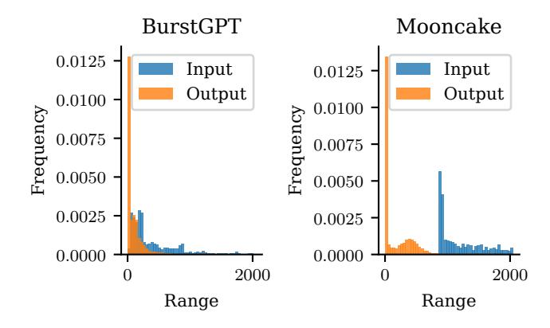

# 4 Methodology

In this section, we present our approach to uncertainty challenges in LLM inference. We first introduce our statistical prediction method for input/output lengths, which performs best when applied to batches of requests rather than individual requests. Building on this foundation, we then redesign intra-GPU scheduling from request-level to batch-level memory management, enabling accurate KV cache estimation that simultaneously optimizes resource utilization and minimizes eviction rates. Finally, we develop a new inter-GPU management approach that dynamically allocates computational resources based on predicted FLOPs requirements and SLOs, with a robust fallback mechanism to handle unexpected load spikes.

#### 4.1 Statistical Prediction for Input/Output Lengths

LLM serving systems struggle with uncertainty in both input and output lengths. Input lengths are known only after the requests arrive, and their distribution follows a heavy tail. Output lengths are also challenging as they remain unknown until generation completes. Both impact resource requirements significantly: input length affects prefill computation quadratically, while output length determines KV cache memory growth.

We observe that while individual request length prediction is difficult, the statistical properties of request batches are more predictable. The distributions of several scenarios are shown in Figure 2, where the distributions are stable and skewed to the left. We are motivated to model the length distributions  $\Gamma_p$  and  $\Gamma_d$  and leverage the Central Limit Theorem to improve prediction accuracy. However, in practice, we do not need a full set of data but only require a sliding window to update the statistics, which may contain hundreds of requests.

**Figure 2.** Input/Output Length Distributions For BurstGPT and MoonCake

For a batch of requests  $\mathcal{B}$ , the average output length  $\bar{l}_{d,\mathcal{B}}$  is represented as  $\bar{l}_{d,\mathcal{B}} = \frac{1}{|\mathcal{B}|} \sum_{r_i \in \mathcal{B}} l'_{d,i}$ . Assuming the request's

actual output length  $l'_{d,i}$  follows the distribution  $\Gamma_d$  with mean  $\mu_d$  and variance  $\sigma^2_d$ , according to the Central Limit Theorem, the average output length  $\bar{l}_{d,\mathcal{B}}$  will converge to a normal distribution:  $\bar{l}_{d,\mathcal{B}} \sim \mathcal{N}(\mu_d, \frac{\sigma^2_d}{|\mathcal{B}|})$ .

This means that as the batch size  $|\mathcal{B}|$  increases, the variance of the average length decreases proportionally, making our prediction more accurate for larger batches. We can establish confidence intervals for our predictions, allowing the system to make informed trade-offs between resource efficiency and risk of memory exhaustion.

First, to estimate  $\mu_d$  and  $\sigma_d^2$ , we maintain historical statistics of request lengths by scenarios via a sliding windowed update. Then, with the estimation of  $\mu_d$  and  $\sigma_d^2$ , we can calculate the required prediction length for an error bound  $\epsilon$  as:

$$\hat{l}_{d,\mathcal{B}} = \mu_d + \frac{\sigma_d}{\sqrt{|\mathcal{B}|}} \cdot \Phi^{-1}(1 - \epsilon),$$

where  $\Phi^{-1}$  is the inverse of the standard normal cumulative distribution function. This formula gives us a prediction bound that will be exceeded only with probability  $\epsilon$ , allowing precise control over the trade-off between resource efficiency and eviction risk. We denote the virtual batch corresponding to the sliding window for request  $r_i$  as  $\mathcal{B}_{\mathcal{W}_i}$ .

Similarly, this method applies to input length prediction, as we make no distributional assumptions beyond the applicability of the Central Limit Theorem. In fact, this method applies to mixed scenarios, demonstrating its ease of use and generalizability. We provide experimental validation in the supplementary Appendix A. Additionally, we introduce simple correction strategies for handling long-tail distributions to further stabilize prediction accuracy in skewed workloads.

Further, we translate the batched length estimation into computation resource estimation, such as FLOPs(F) and memory(M).

$$F_{\text{prefill}} = \alpha \sum_{r_{i} \in \mathcal{Q}_{\text{new}}} l_{p,i}^{2} + \beta \sum_{r_{i} \in \mathcal{Q}_{\text{new}}} l_{p,i} + \gamma,$$

$$F_{\text{decode}} = \lambda \sum_{r_{i} \in \mathcal{Q}_{\text{active}}} (l_{p,i} + l_{d,i}) \cdot \hat{l}_{d,\mathcal{B}} + \mu,$$

$$M_{\text{prefill}} = c_{\text{kv}} \cdot \sum_{r_{i} \in \mathcal{Q}_{\text{new}}} l_{p,i}$$

$$M_{\text{decode}} = c_{\text{kv}} \cdot \sum_{r_{i} \in \mathcal{Q}_{\text{active}}} (l_{p,i} + l_{d,i})$$

$$(2)$$

where  $c_{kv}$  is the size of one token, and  $\alpha$ ,  $\beta$ ,  $\gamma$ ,  $\lambda$ , and  $\mu$  are coefficients that can be calibrated offline. The details are listed at Appendix B. Our prediction-based method utilizes these four metrics to estimate the required number of GPUs.

