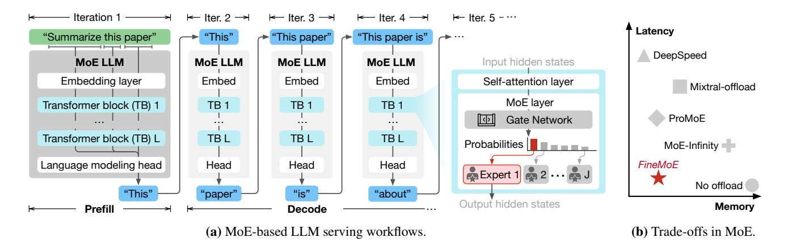

# 1 Introduction

Large Language Models (LLMs) have achieved remarkable success in advancing Natural Language Processing (NLP) research and transforming various applications, including content generation [\[2,](#page-14-0) [7,](#page-14-1) [12,](#page-14-2) [45\]](#page-15-1), search and recommendation [\[34,](#page-15-2) [63\]](#page-15-3), and AI-assisted operations [\[24,](#page-14-3) [33,](#page-14-4) [39\]](#page-15-4). Given the high training costs, modern LLMs have returned to Mixture-of-Experts (MoE) architectures [\[1,](#page-14-5) [11,](#page-14-6) [23,](#page-14-7) [50,](#page-15-5) [57,](#page-15-6) [60\]](#page-15-7) as their backbone implementations. Inside MoE models, each MoE layer comprises a gating network and a collection of experts, with only a subset of experts being activated during computation. This sparse activation mechanism significantly reduces the number of floating point operations (FLOPs), enabling MoE-based LLMs to achieve substantially lower training costs compared to dense LLMs [\[11,](#page-14-6) [23,](#page-14-7) [60\]](#page-15-7).

Despite the computational efficiency, MoE models exhibit substantial memory inefficiency during the serving phase. Though certain model parameters remain inactive during inference, they must still reside in GPU memory to allow for potential future activation. Expert offloading [\[4,](#page-14-8) [16,](#page-14-9) [51,](#page-15-8) [58\]](#page-15-9) has emerged as a promising strategy to address this issue, which predicts inactive experts and transfers them to CPU memory while retaining only the necessary experts in GPU memory, reducing the overall model memory footprint.

However, existing expert offloading solutions struggle to effectively balance the *latency-memory trade-off* in MoE serving. These approaches either suffer from high inference latency [\[4,](#page-14-8) [51\]](#page-15-8) or incur substantial model memory footprints [\[16,](#page-14-9) [58\]](#page-15-9). The key reason is that existing works track expert patterns

Figure 1. Mixture-of-Experts (MoE) Large Language Model (LLM) serving.

and manage experts in *coarse granularity*. They fail to accurately identify and retain only the necessary experts in GPU memory during inference, resulting in frequent and costly on-demand expert loading [\[51\]](#page-15-8) and performance degradation.

In this paper, we propose *FineMoE*, a *fine-grained* expert offloading system that tames the latency-memory trade-off in MoE serving. To track and analyze MoE models' expert selection behaviors in fine granularity, we propose a new data structure called *expert map*, which records the iterationlevel probability distributions output by the gate network. *FineMoE* uses historical expert maps for comparing expert trajectory similarity to guide offloading.[1](#page-1-0) Apart from the expert map, *FineMoE* is designed to track fine-grained input semantic embeddings from individual request prompts processed by the MoE model. Given the collected semantic-based and trajectory-based information, *FineMoE* carefully searches the most accurate expert map for guiding expert prefetching, caching, and offloading through inference iterations. In summary, we make the following contributions:

- We design *FineMoE*, a *fine-grained* expert offloading system that achieves low inference latency while reducing model memory footprints.
- We propose a new data structure, expert map, that tracks fine-grained expert selection behaviors of MoE models. *FineMoE* leverages input semantic embeddings to augment the expert map search to guide expert offloading.
- We prototype *FineMoE* on top of HuggingFace Transformers [\[55\]](#page-15-10) and deploy it on a six-GPU testbed. Extensive experiments with open-source MoE models and real-world workloads show that *FineMoE* reduces inference latency by 47% and improves expert hit rate by 39% compared to state-of-the-art solutions.

