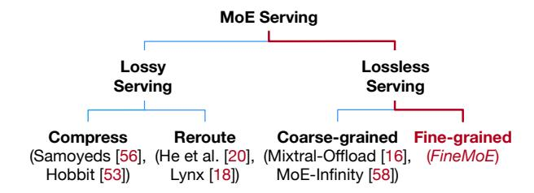
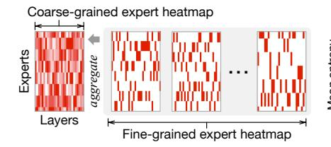
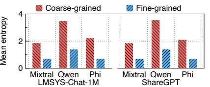
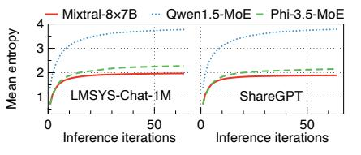
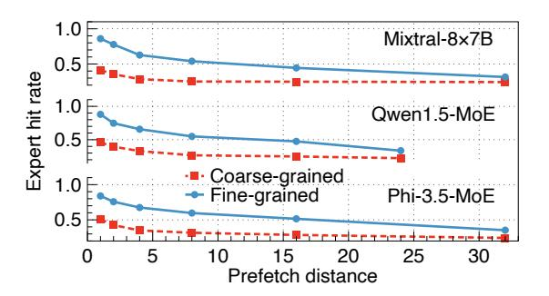

# 2 Background and Motivation

## 2.1 LLM Serving

Unlike traditional Deep Learning (DL) model inference, Large Language Model (LLM) serving consists of two consecutive stages: *prefill* and *decode*. Figure [1a](#page-1-1) illustrates the two stages when an LLM performs inference for a request prompt. In the prefill stage, the LLM first computes the intermediate key-value (KV) states of the prompt tokens, prefills the KV cache [\[3,](#page-14-10) [28,](#page-14-11) [31,](#page-14-12) [37,](#page-15-11) [65\]](#page-15-12), and then generates the first answer token. In the decode stage, the LLM sequentially generates the answer to the prompt token-by-token in an auto-regressive manner, where tokens generated previously are used for generating the next token.

The two stages have their own unique characteristics. The prefill stage only requires one *iteration*[2](#page-1-2) , processing all tokens in parallel and generating the first answer token. The decode stage spans several iterations, generating one token per iteration until the answer is completed. Due to the different characteristics of the two stages, recent studies [\[43,](#page-15-13) [65\]](#page-15-12) have identified that the prefill stage is compute-bounded, while the decode stage is considered memory-bounded. Therefore, people typically quantify the serving performance of LLM two stages using different metrics. For the prefill stage, Time-To-First-Token (TTFT) is commonly employed, which measures the latency from receiving the user request until generating the first answer token. For the decode stage, Tokens-Per-Second (TPS) or Time-Per-Output-Token (TPOT) is used to measure the generation rate of LLM serving.

## 2.2 MoE-based LLM Serving

By integrating MoE layers in Transformer blocks [\[54\]](#page-15-14), MoE architectures [\[61\]](#page-15-15) have emerged as a popular backbone for modern LLMs, such as Mixtral [\[23\]](#page-14-7), Snowflake Arctic [\[50\]](#page-15-5), and DeepSeek-MoE [\[11\]](#page-14-6). Figure [1a](#page-1-1) illustrates MoE-based LLMs' typical structures, where feed-forward network (FFN)

1 In this paper, "trajectory" is defined as the collection of probability distributions over experts observed through layers.

2An iteration refers to a single step in auto-regressive inference that generates one new token. The iteration time denotes the end-to-end latency of this step.

**Figure 2.** The design space of MoE-based LLM serving.

modules are replaced by MoE layers.3 Each MoE layer consists of a gate network and a set of expert networks. Inside each Transformer block, the self-attention module first calculates the attentions [54] based on input hidden states, and then the gate network determines which expert(s) to activate for computing the output representations. Compared to traditional dense LLMs, MoE-based LLMs only activate a subset of parameters during training and inference, reducing computational overhead while delivering superior generation performance compared to dense LLMs with a comparable number of parameters [1, 11, 23, 50, 57, 60].

Despite the benefits of saving training computations, MoE-based LLM serving still suffers from GPU memory inefficiency as MoE inference requires loading all model parameters into GPU memory, including those inactive experts. Table 1 characterizes three popular MoE models: Mixtral-8×7B [23], Qwen1.5-MoE [60], and Phi-3.5-MoE [1]. During inference, they exhibit 72%, 81%, and 84% inactive parameters, respectively, due to the sparsity of expert activation in MoE. This corresponds to 67, 23, and 70 GB of inactive GPU memory, resulting in low memory efficiency and serving throughput. Therefore, to efficiently serve large MoE models, we must seek a solution to the memory inefficiency inherited from MoE architecture.

## 2.3 Latency-Memory Trade-Off

Recently, a few studies have been proposed to improve MoE-based LLM serving efficiency. Figure 2 describes the design space in MoE serving. Existing major studies can be categorized into two types: **Lossy serving** applies compression [44], pruning [30], and quantization [27] techniques to the original MoE models to reduce the serving memory requirements. However, this line of work achieves serving efficiency by sacrificing the generation quality. **Lossless serving** focuses on *offloading* model weights (parameters [4, 41] or experts [16, 51, 58]) that are sparsely utilized in temporal or spatial patterns from GPU memory to CPU memory, aiming to preserve reasonable inference latency. Specifically, expert offloading seeks to predict the activation of experts in advance, prefetching or caching only the necessary experts

**Table 1.** Characteristics of three MoE models.

| MoE Models        | Parameters (active / total) | Experts Per Layer (active / total) | Num. of Layers |
|-------------------|-----------------------------|------------------------------------|-------------------|
| Mixtral-8×7B [23] | 12.9B / 46.7B               | 2/8                                | 32                |
| Qwen1.5-MoE [60]  | 2.7B / 14.3B                | 4 / 60                             | 24                |
| Phi-3.5-MoE [1]   | 6.6B / 42B                  | 2 / 16                             | 32                |

in GPU memory during inference. We opt for lossless serving to design *FineMoE* because this line of methods avoids modifying models, hence assuring generation quality.

However, existing offloading solutions cannot achieve an optimal spot in the latency-memory trade-off when serving MoE-based LLMs. Figure 1b compares the performance (*i.e.*, inference latency and memory footprint) of existing state-of-the-art (SOTA) offloading solutions, which either provide low inference latency but suffer from large memory footprint (*e.g.*, No-offload and MoE-Infinity [58]), or vice versa (*e.g.*, ProMoE [51], Mixtral-Offloading [16], and DeepSpeed-Inference [4]).

The key reason behind this dilemma is that MoE-based decoder-only LLMs have balanced expert routing [51], leaving existing solutions hard to find effective patterns for guiding expert offloading. Existing research has identified two main reasons for this dilemma: First, most MoE-based LLMs are decoder-only architectures, which exhibit uniform expert activation patterns and low expert access skewness compared to encoder-decoder MoE LLMs [18, 51]. Second, recent MoE-based LLMs employ a load-balancing loss [1, 11, 23, 50, 57], which encourages the gate network to distribute tokens more uniformly across experts within each MoE layer, making expert usage more balanced during training. This balanced routing diminishes the predictability of expert patterns, thus making existing solutions ineffective.

#### 2.4 Existing MoE Offloading Solutions

Existing expert offloading approaches [16, 58] rely on coarsegrained expert patterns, which are inefficient for guiding offloading. We define coarse-grained information as the expert patterns collected at the request level, where information is aggregated over multiple iterations of a request prompt. For example, MoE-Infinity [58] tracks request-level expert activations. Fine-grained information is defined as the expert patterns observed separately during each inference iteration. Figure 3a shows examples of coarse-grained and finegrained expert activation heatmaps for Mixtral-8×7B [23]. The heatmap records the expert activations across 32 MoE layers, where each layer contains eight experts and activates two experts out of eight to compute representations. While fine-grained (iteration-level) heatmaps show clear expert activation patterns, the aggregated coarse-grained (request-level) heatmap diminishes predictability.

&lt;sup>3For simplicity, we only show the process of one single request prompt.

- (a) Coarse-grained *vs.* fine-grained expert heatmaps for Mixtral-8×7B with LMSYS-Chat-1M. Heavier colors indicate more expert activations.
- (b) Mean entropy per layer of three MoE models and two datasets for coarse-grained and finegrained expert patterns. Higher entropy indicates lower predictability.
- (c) Mean entropy per layer of three MoE models and two datasets when aggregating expert patterns through inference iterations, which diminishes predictability.

Figure 3. Expert pattern and predictability analysis in coarse granularity (request-level) and fine granularity (iteration-level).

To demonstrate this point, we analyze the Shannon entropy [\[48\]](#page-15-18) of expert activations per MoE layer for three popular MoE models. Entropy is an essential metric to quantify the uncertainty and unpredictability of variables in information theory. A balanced expert activation pattern (*e.g.*, probability distribution [0.25, 0.25, 0.25, 0.25] of four experts) results in a high entropy, which indicates the pattern is less predictable and harder to select experts. Figure [3b](#page-3-0) presents the mean entropy computed per layer for three MoE models (Mixtral-8×7B [\[23\]](#page-14-7), Qwen1.5-MoE [\[60\]](#page-15-7), and Phi-3.5- MoE [\[1\]](#page-14-5)) across two realistic datasets LMSYS-Chat-1M [\[64\]](#page-15-19) and ShareGPT [\[49\]](#page-15-20). Coarse-grained expert patterns have significantly higher entropy than fine-grained patterns, meaning that expert patterns in coarse granularity can be less effective for predictions. Figure [3c](#page-3-0) shows the mean entropy per layer when aggregating expert patterns across inference iterations, where expert selection becomes increasingly unpredictable as generation progresses. Qwen1.5-MoE reaches a higher entropy plateau due to its larger expert selection space (60 experts × 24 layers). Similarly, Phi-3.5-MoE (16 × 32) exhibits higher entropy than Mixtral-8×7B (8 × 32). After about ten iterations, expert patterns become blurred and the entropy plateaus, indicating that further iterations contribute only marginal additional unpredictability. While entropy is low at the beginning of inference, it gradually increases with iterations as more expert activation information is aggregated, thereby becoming more unpredictable.

In contrast to coarse-grained expert offloading solutions, we argue that expert offloading should be carefully guided by fine-grained designs: analyzing iteration-level patterns, understanding models' expert selection preferences, and leveraging semantic characteristics of request prompts.

## 2.5 Problems of Coarse-Grained Offloading

Existing coarse-grained expert offloading solutions exhibit three problems:

1) Insufficient latency-memory trade-off. Existing solutions prefetch and offload experts in coarse granularity, either heavily focusing on reducing inference latency but incurring

Figure 4. Expert hit rates of coarse-grained and finegrained expert offloading designs when serving Mixtral-8×7B, Qwen1.5-MoE, and Phi-3.5-MoE with LMSYS-Chat-1M at different prefetch distances, respectively.

large memory footprint [\[58\]](#page-15-9) or reducing memory footprint but severely increasing inference latency [\[4,](#page-14-8) [16\]](#page-14-9).

- 2) Low expert hit rates. Existing solutions employ coarsegrained expert pattern tracking methods (*e.g.*, Expert Activation Matrix in MoE-Infinity [\[58\]](#page-15-9)), which produce ineffective expert patterns for guiding offloading decisions, leading to low expert hit rates and high inference latency.
- 3) Ignorance of MoE models' and prompts' heterogeneity. Existing solutions largely ignore the unique characteristics of different MoE models and input prompts and serve them in a one-fits-all manner [\[4,](#page-14-8) [16,](#page-14-9) [51,](#page-15-8) [58\]](#page-15-9), which omits opportunities for fine-grained optimizations adaptive to heterogeneous models and prompts in MoE serving.

Figure [4](#page-3-1) shows the expert hit rates of serving three popular MoE-based LLMs, Mixtral-8×7B [\[23\]](#page-14-7), Qwen1.5-MoE [\[60\]](#page-15-7), and Phi-3.5-MoE [\[1\]](#page-14-5) using LMSYS-Chat-1M dataset [\[64\]](#page-15-19) with coarse-grained and fine-grained expert offloading designs at different prefetch distances, respectively. Prefetch distance refers to the number of layers ahead that a prefetch instruction is issued before the target layer activates its experts. By leveraging fine-grained expert offloading, we can achieve

significantly higher expert hit rates over coarse-grained methods and preserve better performance by adapting to varying prefetch distances.

