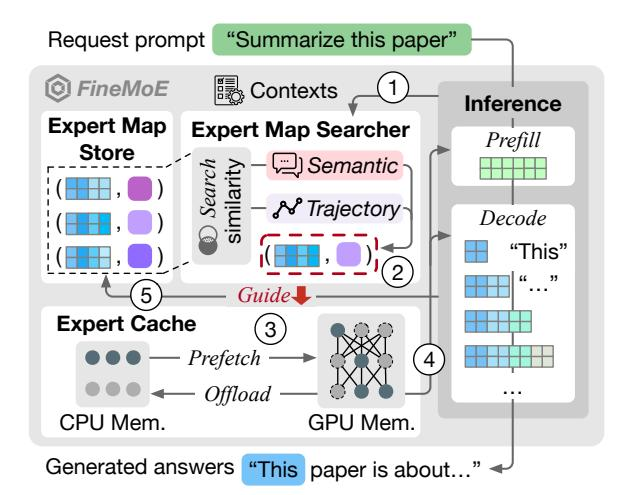
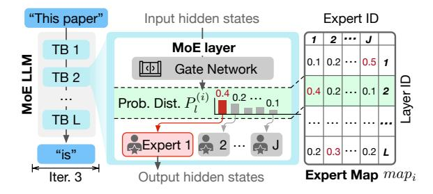

# 3 *FineMoE*'s Overview

## 3.1 Objectives and Challenges

*FineMoE* is designed to achieve the following three goals:

Memory-efficient MoE serving with minimal inference latency. We have demonstrated that existing expert offloading solutions [\[16,](#page-14-9) [51,](#page-15-8) [58\]](#page-15-9) fail to tame the latency-memory trade-off in MoE serving ([§2.3\)](#page-2-3). We aim to achieve both low memory footprint and inference latency by proposing finegrained expert offloading.

Minimize expert miss due to mispredictions in expert prefetching. Expert prefetching, involving future expert activation predictions, is an essential step in expert offloading solutions. However, a recent study [\[51\]](#page-15-8) has shown that *expert miss* due to mispredictions can cause high on-demand expert loading delay in inference. We should minimize expert miss and mitigate mispredictions in expert offloading.

Adapt to heterogeneous MoE models and prompts. MoE inference can serve heterogeneous models [\[11,](#page-14-6) [23,](#page-14-7) [50,](#page-15-5) [57,](#page-15-6) [60\]](#page-15-7) with varying prompts [\[49,](#page-15-20) [64\]](#page-15-19) in real-world scenarios. While existing solutions handle different models and prompts with a one-fits-all design, we should design our expert offloading to adapt to the heterogeneity in MoE serving.

We must address three critical challenges to realize the above objectives:

How to maximize expert hit rate when prefetching and offloading experts? Expert hit rate directly relates to the inference latency. With more experts being hit, fewer experts need to be loaded on demand. We propose a fine-grained expert offloading solution to achieve a high expert hit rate.

How to adapt to different MoE models and prompts? Heterogeneous MoE models and input prompts exhibit unique system and semantic characteristics. We should craft our solution with fine-grained optimizations to enable adaptivity.

How to avoid additional system overheads when managing experts? Our design must not introduce additional system overheads when serving existing MoE LLMs. We apply a series of system optimizations in *FineMoE* to ensure serving efficiency and minimize additional overheads.

## 3.2 Architecture and Workflow

Figure [5](#page-4-0) describes the architecture and workflow of *FineMoE*, which consists of three main components:

Expert Map Store. We record *expert maps*, a new data structure defined in *FineMoE*, to track *fine-grained* expert activation patterns from historical request prompts. expert maps provide nuance expert selection preferences over existing coarse-grained expert tracking methods (*e.g.*, Expert Activation Matrix in MoE-Infinity [\[58\]](#page-15-9)). The Expert Map

Figure 5. *FineMoE*'s architecture and workflow.

Store dynamically keeps the most useful and unique expert maps for real-time inferences.

Expert Map Searcher. When a request prompt arrives, *FineMoE* searches the Expert Map Store for appropriate expert maps to guide expert prefetching before inference. expert map search is guided by calculating similarity scores in two folds: *semantic* and *trajectory* similarity.

Expert Cache. After receiving the searched expert maps, *FineMoE* prefetches experts from CPU memory to GPU to perform computations in inference. *FineMoE* evicts and offloads low-priority expert weights to CPU memory if exceeding Expert Cache capacity.

*FineMoE* follows the five steps below to enable memoryefficient MoE serving with minimal inference latency:

Step 1 : Inference context collection. Before every inference iteration, *FineMoE* collects necessary *contexts*, such as semantic embeddings and previous expert activation trajectories ([§4.1\)](#page-5-0), and feeds them to the Expert Map Searcher for hybrid similarity searching.

Step 2 : Expert map similarity searching. After receiving iteration-level contexts, the Expert Map Searcher identifies the most similar expert maps by comparing the input context data with historical context data in the Expert Map Store ([§4.2\)](#page-6-0). The retrieved expert maps are forwarded to the Expert Cache to guide expert prefetching and offloading decisions.

Step 3 : Guided expert prefetching and offloading. We dynamically compute expert selection thresholds to determine which expert(s) to prefetch and offload in the MoE model guided by the searched expert maps ([§4.3\)](#page-7-0). Then, *FineMoE* prefetches the expert weights from CPU to GPU memory and offloads cached experts from GPU to CPU when reaching the cache limit ([§4.5\)](#page-8-0).

Step 4 : Expert serving. The whole inference process consists of one iteration in the Prefill stage and multiple iterations in the Decode stage. For each MoE layer in every iteration, FineMoE directly serves the expert required by the gating network if the corresponding weights are available in the GPU memory (defined as an expert hit). Otherwise, FineMoE on-demand loads the expert weights from CPU to GPU to perform lossless serving (defined as an expert miss).

Step (5): Expert map update. FineMoE observes new expert maps produced after each iteration and updates them in the Expert Map Store (§4.4). When reaching the store capacity (e.g., 1K expert maps), FineMoE deduplicates the Expert Map Store by identifying and dropping redundant expert maps to maintain diversity, maximizing the possibility of providing effective expert maps for any request prompts.

#### 3.3 Problem Formulation

We consider serving an MoE-based LLM with L MoE layers on a GPU cluster, where each MoE layer has one gating network and J experts. The gating network of each layer selects top  $K \in [1, J]$  experts for computation. The MoE model processes and generates answers for a workload consisting of W unique request prompts. Let  $[W] := \{1, \ldots, w, \ldots, W\}$  denote the set of all requests,  $[L] := \{1, \ldots, l, \ldots, L\}$  denote the set of all layers in a MoE model, and  $[J] := \{1, \ldots, j, \ldots, J\}$  denote the set of all experts in a layer, respectively. Each request prompt  $w \in [W]$  consists of multiple iterations processed during the prefill and decode stages. Let  $E_{l,j}^{(i)}$  denote the j-th expert at the l-th layer in the i-th iteration, where  $l \in [L]$ ,  $j \in [J]$ , and  $i \in [w]$ . During each iteration i, we can make at most l-l-l-l-l-l-l-l-l-l-

$$R_{l,j}^{(i)} = \begin{cases} 1, & \text{if } (E_{l,j}^{(i)} \in E_{activate}^{(i)}) \land (E_{l,j}^{(i)} \notin E_{cache}^{(i)}), \\ 0, & \text{otherwise,} \end{cases}$$

where  $R_{l,j}^{(i)} = 1$  means  $E_{l,j}^{(i)}$  is a miss and requires on-demand loading from CPU memory. Since all experts in an MoE model are typically designed to have the same weight size, we assume experts' loading time  $T_e$  and memory footprint  $M_e$  are homogenous.4 Therefore, the total on-demand loading latency T is summed across all iterations for each expert during the inference process:

$$T := T_e \cdot \sum_{w \in [W]} \sum_{i \in [w]} \sum_{l \in [L]} \sum_{j \in [J]} R_{l,j}^{(i)}.$$

Finally, employing the above definitions, we formulate the MoE expert offloading as an integer linear programming (ILP)

**Figure 6.** Expert selections tracked by an expert map.

optimization problem:

$$\min_{\{E_{l,j}^{(i)}\}} \left( T_e \cdot \sum_{w \in [W]} \sum_{i \in [w]} \sum_{l \in [L]} \sum_{j \in [J]} R_{l,j}^i \right) 
\text{s.t. } |E_{cache}^{(i)}| \le L \cdot J, \quad \forall i \in [w], \ \forall w \in [W], \tag{1}$$

$$|E_{activate}^{(i)}| = L \cdot K, \quad \forall i \in [w], \ \forall w \in [W], \eqno(2)$$

$$|E_{cache}^{(i)}| \cdot M_e \le M, \quad \forall i \in [w], \ \forall w \in [W].$$
 (3)

The objective is to minimize the on-demand loading latency (ideally T=0 with perfect predictions) while limiting the total memory footprint of cached experts to satisfy the available GPU memory M. Constraint 1 denotes the total number of prefetched experts should not exceed the total number of all experts in the MoE model. Constraint 2 represents the total number of activated experts, which must be the same as the total number of top K experts summed across all L layers. Constraint 3 describes the total memory footprint of prefetched experts must be limited by the available GPU memory size. Note that solving the ILP problem is already NP-hard [10], while in reality, prefetching experts always have mispredictions that further complicate the problem. Therefore, we opt for a heuristic-based design for FineMoE.

## 4 FineMoE's Design

