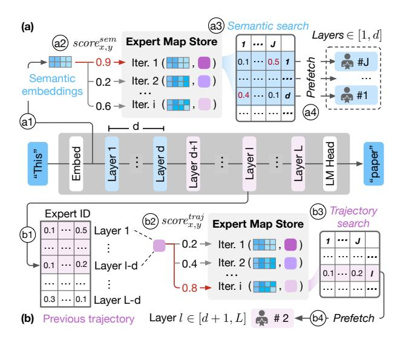
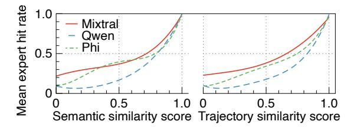

# 4.1 Expert Maps

We propose a new data structure, *Expert Map*, to track expert activation patterns with a fine granularity. Figure 6 depicts the structure of an expert map. During the *i*-th iteration, the *l*-th self-attention layer first calculates the attention states. The gate network receives attentions and computes a probability distribution  $P_i^{(i)} \in \mathbb{R}^J$  over all the experts at Layer l:

$$\mathbf{P}_{l}^{(i)} := \left\{ p_{l,1}^{(i)}, \dots, p_{l,j}^{(i)}, \dots, p_{l,J}^{(i)} \right\}, \quad \sum_{i \in [I]} p_{l,j}^{(i)} = 1, \ \forall p_{l,j}^{(i)} \geq 0.$$

Then, top  $K \in [1, J]$  experts are selected from  $P_l^{(i)}$  to compute representations for Layer l. We collect the probability distributions  $P_l^{(i)}$  across all L layers to form the expert map of Iteration i:

$$map_i := \{\mathbf{P}_1^{(i)}, \dots, \mathbf{P}_l^{(i)}, \dots, \mathbf{P}_L^{(i)}\}, \quad l \in [L].$$

&lt;sup>4We only consider selective experts. Some MoE models, such as Qwen1.5-MoE-A2.7B, have a few always-on experts that are not offloadable.

**Figure 7.** Workflow of *FineMoE*'s expert map search.

By tracking expert maps, we guide *FineMoE* to discover fine-grained expert patterns—the iteration-level expert selection preferences via probability distributions. Intuitively, analyzing probability distributions enables *FineMoE* to not only identify which experts are binarily selected or omitted, but also to assess the confidence or preference assigned to each expert from the perspective of the gate networks.

The design of expert maps has two key advantages over existing coarse-grained expert tracking methods (e.g., MoE-Infinity [58] tracks the request-level expert hit counts). First, existing works only focus on aggregated request-level expert activations, whereas an expert map tracks individual iterations with detailed expert selections. Second, existing works only record the expert hit counts, whereas we track detailed probability distributions. Note that expert maps can easily recover coarse-grained information by applying a top K selection operator to the probability distributions and aggregating expert counts over iterations, therefore generalizing to existing tracking methods.

### 4.2 Expert Map Search

Given the historical expert maps defined in §4.1, *FineMoE* searches expert maps that provide the most accurate expert activation predictions with two fine-grained metrics: semantic similarity (§4.2.1) and trajectory similarity (§4.2.2). We also show that they are both effective in searching accurate historical expert maps for prediction and offloading (§4.2.3).

Existing solutions [16, 51, 58] *cannot* observe previous expert patterns for prediction and prefetching before the target layer is ready to activate experts for the initial layers  $l \in [1, d]$ , where l represents the current layer index in an iteration and d is referred as the *prefetch distance*. When predicting and prefetching experts for MoE models, *prefetch distance* is used

to avoid impacting inference latency [51, 62]. Prefetch distance is the number of layers ahead that a prefetch instruction is issued before the target layer activates its experts, similar to the same term in memory prefetching [29]. An ideal prefetch distance should perfectly overlap the prediction and prefetching operation overheads with the inference process.

Therefore, existing approaches [16, 51, 58] typically employ coarse-grained rules to prefetch experts for initial layers  $l \in [1, d]$ . For example, MoE-Infinity [58] prefetches the most popular experts across all historical data points. Even for layers  $l \in [d+1, L]$ , existing approaches use coarse-grained (request-level) metrics for predicting and prefetching experts, leading to low offloading accuracy.

In contrast, *FineMoE* leverages fine-grained iteration-level metrics tailored to the prefetch distance *d*, employing semantic embeddings for layers prior to the prefetch distance and expert trajectories for layers subsequent to it. Figure 7 shows that *FineMoE* employs two fine-grained search approaches to jointly search expert maps for guiding expert prefetching: *Semantic-based expert map search* compares the input embeddings with historical embeddings to find expert maps with similar inputs, whereas *trajectory-based search* observes previous expert trajectories (*i.e.*, probability distributions) and searches for similar expert maps. We combine both semantic and trajectory features to improve *FineMoE*'s map-searching and expert offloading accuracy.

4.2.1 Semantic-based Expert Map Search. Recent studies [25] demonstrate that semantic embeddings, i.e., embedding layer's output after processing raw tokens, can potentially indicate expert selection behaviors. When serving request prompts and recording their expert maps, we record the semantic embeddings for each inference iteration. Existing MoE-based LLMs all contain an embedding layer for token semantic encoding, where words or subwords that appear in similar contexts will have similar embeddings [38]. It's natural to extract the semantic embeddings using the output from the model's original embedding layer. Figure 7(a) shows the semantic-based expert map search in four steps: a1) extract semantic embeddings from the embedding layer, a2) compute similarity scores using semantic embeddings with historical data points in the Expert Map Store, a3) search similar expert maps based on similarity scores, and a4) prefetch experts with high probabilities for layers  $l \in [1, d]$ .

For any input prompts, we compute pairwise cosine similarity  $score^{sem} \in \mathbb{R}^{B \times C}$  between the semantic embedding  $sem^{new} \in \mathbb{R}^{B \times h}$  and the collection of historical semantic embeddings  $sem^{old} \in \mathbb{R}^{C \times h}$  in the Expert Map Store:

$$score_{x,y}^{sem} := \frac{sem_x^{new} \cdot sem_y^{old}}{\|sem_x^{new}\| \cdot \|sem_y^{old}\|}, \quad x \in [B], \ y \in [C], \quad (4)$$

where B is the batch size of input prompts, C is the Expert Map Store capacity, and h is the hidden dimension size. Then, for prompt x, the historical Iteration y with the highest score

**Figure 8.** Mean expert hit rates of different semantic and trajectory similarity scores with LMSYS-Chat-1M.

is selected. We use partial expert maps from the selected iteration,  $\{P_1^{(y)}, \dots, P_d^{(y)}\} \in map_u^{old}$ , to guide layers  $l \in [1, d]$ .

**4.2.2 Trajectory-based Expert Map Search.** We leverage expert probability trajectories of previous (l-d) layers to search expert maps for layers  $l \in [d+1, L]$ . Specifically, when l = d+1, we use the past expert trajectories from Layer 1 for prediction; when l = d+2, we use the past trajectories from Layers 1 and 2; and so on. When l = L (last layer), we use the past trajectories from Layers 1 to L-d for prediction. Figure 7(b) shows the trajectory-based expert search for a layer  $l \in [d+1, L]$  in four steps: b1) collect previous trajectory  $\{P_1, \ldots, P_{l-d}\}$  from Layers 1 to l-d, b2) compute similarity scores using collected trajectories with historical data points in the Expert Map Store, b3) search similar expert maps based on similarity scores, and b4) prefetch experts with high probabilities for the layer  $l \in [d+1, L]$ . We repeat this process until the last layer (Layer L) is completed.

Similar to the semantic-based search, we compute pairwise cosine similarity  $score^{traj} \in \mathbb{R}^{B \times C}$  between the observed trajectories,  $map^{new} \in \mathbb{R}^{B \times (l-d)J}$ , and the collection of historical expert maps,  $map^{old} \in \mathbb{R}^{C \times (l-d)J}$ , in the Expert Map Store:

$$score_{x,y}^{traj} := \frac{map_x^{new} \cdot map_y^{old}}{\|map_x^{new}\| \cdot \|map_y^{old}\|}, \quad x \in [B], \ y \in [C]. \tag{5}$$

We select the historical iteration with the highest score. Then, we use  $\mathbf{P}_l^{(y)} \in map_y^{old}$  from the selected expert map to guide the expert prefetching for the target layer  $l \in [d+1,L]$ .

By combining the two expert map search methods, we carefully customize the map that guides expert prefetching for every inference iteration in MoE serving. With this design, expert map search introduces negligible overhead to the end-to-end inference latency, which we demonstrate in §6.8.

