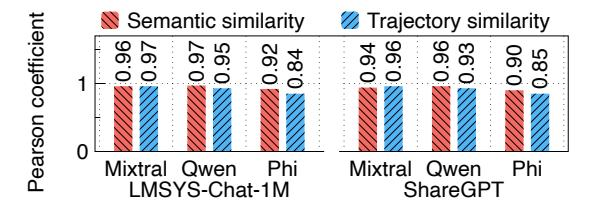

# 4.2.3 Effectiveness of Semantic and Trajectory Similar-

ity. To verify how semantic and trajectory similarity scores can guide expert offloading, we run three MoE models (Mixtral-8×7B, Qwen1.5-MoE, and Phi-3.5-MoE) with two datasets (LMSYS-Chat-1M and ShareGPT). For each model and dataset, we first run prompts and record their semantic embeddings and expert trajectories, where each prompt generates one data point consisting of a semantic embedding and an expert map. Then, we exhaust all pairwise cases by calculating their

**Figure 9.** Pearson correlation coefficients between semantic and trajectory similarity scores and expert hit rates.

semantic and trajectory similarity and expert hit rate (*i.e.*, overlapped expert ratio). Figure 8 shows the mean expert hit rates of different semantic and trajectory similarity scores for three MoE models with LMSYS-Chat-1M. Both semantic and trajectory similarity can effectively indicate the accuracy of historical prompts or expert maps for offloading.

To *statistically* quantify the correlations between similarity score and expert hit rate, we calculate the Pearson correlation coefficients [9] using all paired semantic and trajectory similarity scores and corresponding expert hit rates in Figure 8. The Pearson coefficient is commonly used to measure correlations between variables, where a coefficient close to 1 indicates a strong positive correlation and a coefficient close to 0 means a weak correlation. Figure 9 shows the Pearson coefficients between similarity score and expert hit rate with three MoE models and two datasets. The results show that high similarity scores potentially relate to high expert hit rates.

### 4.3 Expert Prefetching

Given the searched and customized expert map  $P_l^{(i)}$  for a layer  $l \in [L]$  in Iteration i, we explain how it guides FineMoE to dynamically prefetch experts in fine granularity.

**Similarity-aware expert selection.** With the different contexts collected during iterations, expert maps searched by FineMoE also have varying similarity scores.5 Figures 8 and 9 demonstrated that similarity scores can effectively indicate the search confidence, where high searched similarity scores potentially mean high expert hit rates. Hence, we design FineMoE's expert prefetching to be similarity-aware. For a layer  $l \in [L]$  with a  $score \in [-1, 1]$  to prefetch, we first dynamically compute an expert selection threshold  $\delta_l \in [0, 1]$ :

$$\delta_l := \text{Clip}(1 - score, 0, 1) = \max(0, \min(1 - score, 1)),$$

where *score* is the cosine similarity score computed in Equations 4 and 5. Given searched  $P_l$ , we find the set of experts to prefetch  $E_{prefetch}$  by iteratively picking the expert with the highest probability from  $P_l = \{p_{l,1}, \dots, p_{l,j}, \dots, p_{l,l}\}$  until the

&lt;sup>5In the following paper, we use "similarity scores" in both search contexts for simplicity, *i.e.*, semantic similarity in semantic-based expert map search and trajectory similarity in trajectory-based search, respectively.

summed probability of  $E_{prefetch}$  exceeds  $\delta_l$ :

$$\min_{\{E_{l,j}\}} |E_{prefetch}| \tag{6}$$

s.t. 
$$\sum_{E_{l,j} \in E_{prefetch}} p_{l,j} \ge \delta_l, \ j \in [J], \ \forall l \in [L], \tag{7}$$

$$|E_{prefetch}| \ge K, K \le [J],$$
 (8)

where K is the number of experts needed to activate per layer (e.g., Mixtral-8×7B activates two experts per layer). Constraint 7 requires the total probability of selected experts to prefetch per layer to be greater than  $\delta_l$ . Constraint 8 represents the minimum number of selected experts must be larger than the number of experts to activate required by the MoE model. Intuitively, we assign a higher  $\delta$  to low-score expert maps so that more experts are prefetched to mitigate mispredictions and assign a lower  $\delta$  for high-score expert maps to reduce the memory footprint. Experts with higher probabilities are prioritized to be prefetched.

Asynchronous expert map searching and prefetching. Existing studies [16, 58] predict and prefetch experts synchronously during inference, severely hindering the inference performance. For example, MoE-Infinity [58] cannot compute forward functions before finishing expert prediction and prefetching at every MoE layer [59]. To minimize the system overhead and inference latency, we decouple the map searching and expert prefetching from the inference process using an asynchronous Publisher-Subscriber architecture (Figure 7). The Expert Map Store is a message broker that keeps messages from both the inference process and the Expert Map Searcher. As the inference proceeds, FineMoE's inference process continuously publishes and writes the inference contexts (i.e., semantic embeddings and expert probability distributions) to the Expert Map Store. At the same time, the Expert Map Searcher subscribes to the context data, searches expert maps based on new context data, and prefetches experts to the Expert Cache in an asynchronous manner.

## 4.4 Expert Map Store Management

Practically, we design *FineMoE*'s Expert Map Store to maintain a capacity *C* for storing unique expert maps. To effectively guide inference across diverse prompts, it makes sense to identify and deduplicate redundant expert maps.

**Expert map deduplication.** Since *FineMoE* uses two approaches (*i.e.*, semantic-based and trajectory-based) to compute similarity, we unify the two similarity scores to compute the pairwise redundancy scores between new iteration data and historical iteration data:

$$RDY_{x,y} := \frac{d}{L} \cdot score_{x,y}^{sem} + \frac{L-d}{L} \cdot score_{x,y}^{traj}, \ x \in [B], \ y \in [C],$$

where  $score_{x,y}^{sem} \in \mathbb{R}^{B \times C}$  and  $score_{x,y}^{traj} \in \mathbb{R}^{B \times C}$  are semantic-based and trajectory-based pairwise similarity scores calculated from Equations 4 and 5, d is the prefetch distance, L is

the total number of layers, B is the batch size of new interaction data, and C is the Expert Map Store capacity. Intuitively, as shown in Figure 7, the semantic-based and trajectory-based similarity scores contribute to the search expert map in proportion to  $\frac{d}{L}$  and  $\frac{L-d}{L}$ , respectively. Therefore, we follow the same ratio to unify and compute the redundancy score. Whenever new iterations' context data arrive at the Expert Map Store, we compute the pairwise redundancy score  $RDY_{x,y}$  to determine which old iterations to drop. Hence, we update the old iterations y (columns in  $RDY_{x,y}$ ) with new iterations x (corresponding rows in  $RDY_{x,y}$ ) in the Expert Map Store.

**Theoretical analysis.** The expert map deduplication can be formulated as a Minimum Sphere Covering problem [17]. Each expert map is a vectorized patch, and the full sphere represents all possible expert selections. The objective is to cover as much of the sphere as possible using a small number of maps, keeping storage overhead low. Studies [15, 46] have proved that maintaining at least 2L I expert maps guarantees a lower bound of 75% expert map similarity (i.e., we can find an expert map that is at least 75% similar to any new iterations), and keeping  $\frac{1}{2}LJ\ln(LJ)$  expert maps provides a lower bound of 98% similarity, where L and J are the numbers of layers and experts per layer in the MoE model, respectively. Given that modern MoE-based LLMs generally have  $L \in [8, 128]$ and  $I \in [24, 96]$ , we can approximate the Expert Map Store's maximal requirement to be less than 50K expert maps with 200 MB CPU memory [58].

#### 4.5 Expert Caching and Eviction

Similar to existing expert offloading solutions [16, 51, 58], we design *FineMoE* to maintain an Expert Cache on GPUs to reuse expert weights when serving different request prompts. Given searched expert maps from §4.2, we guide *FineMoE*'s Expert Cache to compute two priority scores for individual experts: 1) a *prefetching priority* to decide the orders to prefetch experts in the searched maps, and 2) an *eviction priority* to determine the orders to evict experts in the Expert Cache.

**Expert prefetching priority.** Recall the set of experts to prefetch  $E_{prefetch}$  is determined in Equation 6. For each expert  $E_{l,j} \in E_{prefetch}$ , we define the prefetching priority to be

$$PRI_{l,j}^{prefetch} := \frac{p_{l,j}}{l - l_{now}}, \quad l \in [L], \ j \in [J],$$

where  $p_{l,j}$  is the expert probability from the searched expert map, and  $l_{now}$  is the current layer that the inference process stays at. Intuitively, experts with a higher probability  $p_{l,j}$  to be activated should be prefetched sooner, and experts that sit closer to the current layer (*i.e.*, smaller  $l - l_{now}$ ) should also be prioritized.

**Expert eviction priority.** Similar to MoE-Infinity [58], *FineMoE*'s expert caching is based on the least frequently used (LFU) caching algorithm. We integrate the searched map to jointly determine the eviction priority. For each expert

, ∈ *cache*, we define the eviction priority to be

$$PRI_{l,j}^{evict} := \frac{1}{p_{l,j} \cdot freq_{l,j}}, \quad l \in [L], \ j \in [J],$$

where *freq*, is the cache visit frequency and , is the probability from the searched map for an expert , ∈ *cache*. Intuitively, when reaching the Expert Cache limit, we want to first evict experts who are less frequently hit and have lower probabilities of being activated. Note that similar to existing works [\[51,](#page-15-8) [58\]](#page-15-9), we do not consider the recent usage of experts as opposed to the classic least recently used (LRU) algorithm [\[16\]](#page-14-9). Since the expert usage is layer-wise sequential, *i.e.*, one layer following another, prioritizing recently used experts is against the nature of sequential forward computation.

On-demand expert loading. Mispredictions of expert prefetching lead to expert miss in the Expert Cache, as the MoE model cannot find available experts designated by the gate networks. Whenever an expert miss occurs, *FineMoE* pauses all expert prefetching tasks and immediately loads missed experts from CPU to GPU memory for fast serving.

