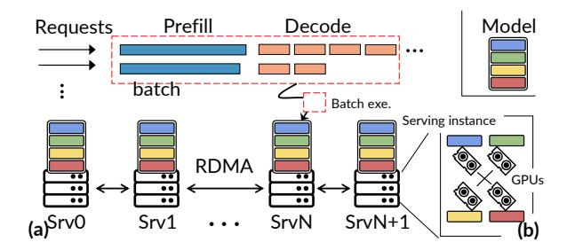
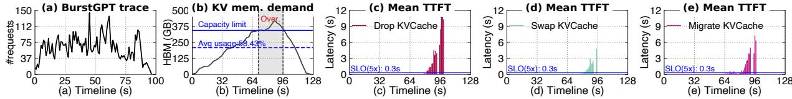
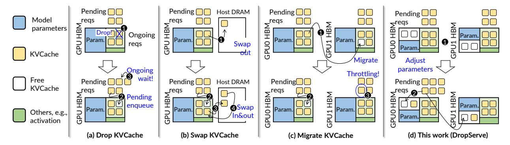
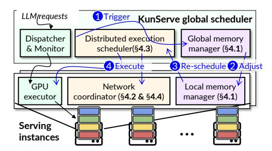
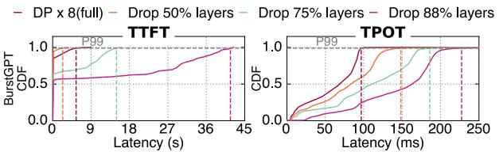

# 1 Introduction

Transformer-based large language models (LLMs) are reshaping the computing industry, which generate output in a token-by-token streaming fashion with auto-regressive inference. The tokens are used by downstream tasks such as chatbots [\[36\]](#page-15-0), copilots [\[26\]](#page-14-0), and interactive agents [\[24\]](#page-14-1). Such tasks require human interaction, so serving LLMs has tight latency requirements, e.g., less than 1 second [\[13,](#page-14-2) [55\]](#page-15-1). The smaller, the better [\[25\]](#page-14-3). Specifically, both the time to generate the first token (TTFT) and the time between subsequent tokens (TPOT) are important metrics.

A key feature of LLM inference is that the computation is *stateful*: before generating the final token, the intermediate results of previously generated tokens (termed *KVCache*) are kept in the scarce GPU memory (HBM) to accelerate future token generation. Such a stateful generation introduces a key issue: the serving latency could spike (up to 239 × in BurstGPT [\[48\]](#page-15-2), see [§2.2](#page-2-0) and others in [§5\)](#page-8-0) when the stored KVCache exhausts the precious HBM. Such overloading is common under real-world request bursts [\[23,](#page-14-4) [38\]](#page-15-3) since the KVCache is proportional to the number of requests processed (or to be processed). Such overloading significantly impacts latency, because requests must wait for GPUs to free up sufficient memory for processing. Unfortunately, it could take seconds for LLMs to generate the final token so as to release memory due to the long and unpredictable token generation process.

State-of-the-art approaches adjust KVCache stored in GPU memory to handle overloading [\[30,](#page-15-4) [40,](#page-15-5) [44,](#page-15-6) [50\]](#page-15-7). When a GPU lacks sufficient HBM and causes request queuing, the system either drops KVCache of existing requests, swaps it out, or migrates it to an available spare GPU to make room for

<sup>†</sup>Work done while Yuxin was an intern at Institute of Parallel and Distributed Systems, Shanghai Jiao Tong University. Yuxin was affiliated with Huazhong University of Science and Technology.

Xingda Wei is the corresponding author [\(wxdwfc@sjtu.edu.cn\)](wxdwfc@sjtu.edu.cn).

queued requests (detailed in [§2.3\)](#page-3-0). We argue that adjusting KVCache does not fundamentally resolve the queuing issue caused by memory overloading, because these methods do not release sufficient memory for all requests, i.e., they replace one set of queued requests with another. Thus, a portion of requests must still be queued, still resulting in sharp tail latency increases (e.g., more than 100 ×).

This paper answers a key question: *how can we effectively handle the latency spikes caused by memory overloading in LLM serving?* To answer this question, we propose a new system mechanism—parameter-centric memory management to instantly free up abundant GPU memory upon overloading for all requests to eliminate queuing. Our method is motivated by two insights. First, the HBM usage is dominated by both KVCache and model parameters (34–74% per GPU, see Table [1\)](#page-3-1), so dropping a portion of parameters can free up sufficient memory for processing all requests. While intuitive, dropping parameters inevitably disrupts the inference process, making the GPUs with dropped parameters unable to process requests. Thus, our second insight is that, due to the massive computational requirements of model serving, modern LLMs are served with a cluster of GPUs where the parameters are replicated across multiple GPUs [\[5,](#page-14-5) [6,](#page-14-6) [12,](#page-14-7) [14,](#page-14-8) [37,](#page-15-8) [38,](#page-15-3) [44\]](#page-15-6). As a result, as long as we carefully drop parameters to ensure complete copies exist cluster-wide, we can correctly process requests with dropped parameters using cooperative execution.

Our parameter-centric memory management operates in a three-step process. First, upon detecting that the serving system has suffered or is about to suffer from memory overload, we derive a drop plan and execute it across GPUs to free up sufficient memory. Afterward, requests executed on GPUs with dropped parameters are seamlessly rescheduled to groups of GPUs with complete parameters to ensure complete execution. These requests are executed using parallel inference techniques across GPUs with pipeline parallelism, since other techniques like tensor parallelism have more stringent network requirements. Finally, once the memory demand of the KVCache decreases, we restore parameters on the original GPUs and reschedule the requests accordingly to achieve the lowest inference latency.

Although the idea may appear simple, achieving parametercentric memory management necessitates tackling a set of challenges. First, generating an efficient drop plan should holistically consider the memory freed up by the dropped parameters as well as the performance overhead introduced by dropping too many parameters. Meanwhile, we need a system mechanism to allow existing GPU kernels highly optimized for LLMs to use the HBM freed up by dropped parameters without modifications. To this end, we first leverage the predictable performance pattern of pipeline parallelism—the more parameters dropped, the more performance overhead

incurred—to quickly derive a drop plan that minimizes the performance overhead while providing sufficient memory. Next, we design a unified GPU virtual memory management system with advanced GPU virtual memory features [\[4\]](#page-14-9) to allow unmodified kernels to access the memory used for parameters for KVCache ([§4.1\)](#page-4-0).

Second, efficiently resuming requests after dropping requires exchanging KVCache between GPUs, since it is coupled with the parameters. However, such an exchange would significantly interfere with the pipeline-executed requests, because transferring large KVCache saturates the network used for forwarding activations. Observing that the activation transfer is more critical and the network usage is small, we design a coordinated network transfer engine that prioritizes the activation transfer to ensure both transfers are not affected ([§4.2\)](#page-5-0).

Finally, the pipelined execution across multiple GPUs after parameter dropping causes GPU bubbles [\[8\]](#page-14-10), resulting in increased serving latencies and degraded throughput. The throughput degradation is particularly harmful in our setup, because if requests are processed at a slower rate, it could lead to another round of memory overloading. To tackle this problem, we identify the root cause of bubbles as suboptimal batch formulation in state-of-the-art systems like Sarathi-Serve [\[8\]](#page-14-10). By leveraging the observation that under overloading many requests are queued, we holistically form microbatches of queued requests using a new execution estimation metric combined with a lookahead batch formulation algorithm. Our scheduling minimizes the pipeline bubbles thanks to the holistic formulation during pipelined execution ([§4.3\)](#page-6-0).

We built KUNSERVE, the first LLM serving system with parameter-centric memory management. Under various real-world traces and datasets, when compared with the state-of-the-art baselines including Llumnix [\[44\]](#page-15-6), vLLM [\[30\]](#page-15-4) and InferCept [\[7\]](#page-14-11), KUNSERVE achieves up to 12.7-72.2 × tail latency reduction in these workloads, which further results in 7.2–12.8% lower SLO violations under common SLO factors. In summary, this paper makes the following contributions:

- A new parameter-centric memory management design for coping with memory overloading under LLM serving ([§3\)](#page-4-1).
- A set of new techniques to make parameter-centric memory management efficient ([§4\)](#page-4-2).
- Extensive evaluations confirming the benefits of KUN-SERVE ([§5\)](#page-8-0).

KUNSERVE is open-sourced at [https://github.com/SJTU-](https://github.com/SJTU-IPADS/kunserve)[IPADS/kunserve.](https://github.com/SJTU-IPADS/kunserve)

<span id="page-2-2"></span>

Figure 1: An illustration of a typical LLM serving scenario: (a) the model is deployed on different servers with model parallelism and prefill and decode requests are processed in a batched way. exe. is abbreviation for execution.

### 2 Background and Motivation

### 2.1 Preliminaries of LLM and LLM serving

**LLM basics.** LLM is a transformer-based [46] deep learning model. Compared with traditional DNN, a key difference is that it executes requests in an *auto-regressive* pattern with a *prefill* and *decode* phase. In the prefill phase, the input is fed to the model to generate the first token of the output. The decode phase then iteratively generates the rest of the output in a token-by-token way, where each iteration takes the previously generated token as well as the prefill input as the context. The decode<sup>1</sup> ends when the model generates a special end-of-sequence (EOS) token.

During LLM inference, since the same prefix of input is shared across all the iterations, the internal results (termed *KVCache*) are cached in the GPU memory (HBM) for acceleration. This makes the computation patterns of prefill and decode different [28, 38, 55]: the prefill is compute-bound, while the decode is memory-bound. To improve GPU utilization, modern LLM inference frameworks fuse prefill and decode requests into a single batch [8, 30].

**Serving metrics: TTFT and TPOT.** As the output tokens are generated iteratively, current systems serve requests in a streaming fashion, i.e., once a token is generated, it is immediately returned to the user. Thus, both the *prefill latency* (**Time-To-First-Token**, TTFT) and the *time to emit each token* (**Time-Per-O**utput-**T**oken, TPOT) matter.

**Deploying LLM instances with parallelism and replication.** LLMs can be deployed on a single GPU or multiple GPUs with parallelism [32, 42, 54]. Pipeline parallelism (PP) partitions model parameters by layers, where layers belonging to the same group (i.e., stage) are executed on the same GPU. Tensor parallelism (TP) partitions each layer, while different stages can reside on the same GPU. Parallelism comes at the cost of extra latency. For methods with high communication

requirements like TP, parallelism is only applied to GPUs within the same server, because their interconnects are fast. PP on the other hand, can apply to GPUs across servers thanks to its ultra-low communication volume. However, PP suffers from bubbles [9] especially for requests with a small batch size. TP and PP can be applied together.

In this paper, we define the minimal set of GPUs that have a single copy of the model parameters as a *serving instance*. The GPUs of an instance can be within the same server or across servers, but typically within the same server for the lowest serving latency unless the model exceeds capacity of a single server, which is rare (e.g., Llama-3-405B). For a serving cluster, a common practice is to deploy multiple instances with replicated models [5, 6, 38, 44], as shown in Figure 1, because a single instance has limited serving capacity.

### <span id="page-2-0"></span>2.2 TTFT Spikes from Memory Overloading

Huge HBM demands and memory overloading of LLM serving. The overall memory demand for LLM serving is huge. For example, when serving a Qwen-2.5-14B model, each token consumes 192 KB of memory, which is already relatively small due to the use of GQA [10], a memory-efficient attention mechanism. A typical burst still introduces an accumulation of 243 K tokens per GPU on BurstGPT trace (see Figure 2), consuming 45 GB KVCache memory per GPU.

We attribute GPU memory overloading to two causes. First, real-world traces exhibit spiked loads: Figure 2 (a) shows a real-world trace on BurstGPT [48], where the incoming request rate increases by 2 × at time 45s with no clear pattern. Since the KVCache demand is also proportional to the request rate, the memory demand can easily exceed the GPU memory capacity. Second, each request's KVCache may reside in GPU for a long time, with an unpredictable duration, depending on how long LLMs generate the EOS. For BurstGPT dataset, the average stay time for a request is 11 seconds, with a variance of 14.9 seconds. Thus, even the HBM is sufficient to hold incoming requests, GPUs still suffer from memory overloading due to the unfinished requests.

Figure 2 (b) shows how existing serving systems behave under BurstGPT. During a 640s serving period (§5.5), we observed two overloading events on vLLM [30], a state-of-the-art LLM serving system. The timing of overloading is strongly related to the request spikes. Note that we have chosen a practical setup where the overall HBM provisioned for KVCache is 2.1 × higher than the average requirement. We use a standard approach [44] that counts the memory demands by considering both the in-processing requests and head-of-line queuing requests.

**TTFT spikes.** GPU memory overloading severely degrades serving performance. As shown in Figure 2 (c), the TTFT

<span id="page-2-1"></span><sup>&</sup>lt;sup>1</sup>We use the term *decode* to refer to the execution of a single iteration in the decode phase in this paper.

<span id="page-3-2"></span>

Figure 2: Analysis of TTFT increases due to GPU memory overloading (abbreviated as "Over." in figure). (a) The incoming request rate of BurstGPT trace [48]. (b) KVCache memory demand on vLLM [30] and (c)–(e) requests TTFT of existing solutions (§2.3).

<span id="page-3-3"></span>

Figure 3: (a)—(c) Existing methodologies to address memory overloading of KVCache. (d) How KunServe tackles this issue via parameter dropping ( $\mathbf{0}$ ) and remapping memory to enlarge KVCache region ( $\mathbf{2}$ ).

increases significantly after the overloading happens (see (b)). The increase comes from the queuing delays while waiting for sufficient memory to be freed. The queuing time can be lengthy because the memory can only be freed once the ongoing request batch finishes. As we have mentioned before, the ongoing requests may take a long time to finish (e.g., up to 150s in BurstGPT).

### <span id="page-3-0"></span>2.3 Shortcomings of Current Solutions

**Drop the KVCache [30, 40, 50] (Figure 3 (a)).** A straightforward solution is to drop some KVCache of ongoing requests (♠). Subsequently, queued requests can be processed with the freed GPU memory (♠). However, requests with dropped KVCache must be re-enqueued and recomputed, which also suffers the queuing overhead (♠) even without considering the recomputation cost. As a result, Figure 2 (c) shows that simply dropping the KVCache faces up to 239 × TTFT increases during memory overloading, even with a modest average memory load (56.3%).

Swap the KVCache [7, 30, 52, 55] (Figure 3 (b)). A classic solution to handle memory overloading is swapping: when it happens, the system swaps out the overflowed KVCache to other storage (e.g., CPU DRAM) to free the GPU memory for execution (①). The key problem is that as the GPU memory is still insufficient, there will inevitably be queued requests, even without considering the swapping overhead. For example, under overloading, InferCept [7] concurrently swaps out the KVCache of ongoing requests to hide the transfer overhead, but the queued requests are still waiting for ongoing

<span id="page-3-1"></span>Table 1: Popular LLM models, their parameter memory usage, the number of GPUs belonging to an instance, and the parameter memory usage ratio. Note that within an instance, Qwen-3-235B and DeepSeek-V3-671B are configured with expert parallelism with degrees 8 and 32, respectively, a common serving setup [20].

| Model            | Model size | #GPU/instance | Ratio (%) |
|------------------|------------|---------------|-----------|
| Qwen-2.5-14B     | 28 GB      | 1 (80 GB)     | 34.4      |
| Qwen-2.5-72B     | 136 GB     | 4 (320 GB)    | 42.3      |
| Llama-3.1-405B   | 756 GB     | 16 (1,280 GB) | 59.1      |
| Qwen-3-235B      | 479 GB     | 8 (640 GB)    | 74.8      |
| DeepSeek-V3-671B | 1,572 GB   | 32 (2,560 GB) | 61.4      |

requests to finish. The waiting time can be substantial because the overall decode time is orders of magnitude higher than TTFT. As a result, we still observed a 92 × TTFT spike on InferCept [7] in Figure 2 (d). Worse still, the swapped-out requests (3) further suffer high TPOT (see Figure 13).

Migrate the KVCache [44] (Figure 3 (c)). Finally, observing that a serving cluster typically has multiple instances, a recent work (Llumnix [44]) migrates requests from a memory-overloaded GPU to other (relatively) spare GPUs (①) for pending requests (②). The observation is that while no single GPU can hold all the pending requests, we can migrate requests to reduce fragmentation to free up sufficient memory. However, the queued requests can still be stalled because memory is occupied by migrating requests or the destination node is also memory-overloaded (③). Worse still, under

<span id="page-4-3"></span>

Figure 4: System overview of KUNSERVE.

spike workloads, there is little room for using migration to free up memory because the overall memory KVCache is insufficient even without considering fragmentation. Thus, as shown in Figure 2 (e), migration still leads to a  $148 \times P99$  TTFT increase (compared to the P50).

### <span id="page-4-1"></span>3 System Overview

Approach: online parameter dropping. As mentioned in the introduction, KUNSERVE is based on two key observations of LLM serving: (1) parameters typically take up a considerable portion of HBM per GPU (see Table 1) that can be used for KVCache and (2) parameters are replicated across instances so dropping them for KVCache does not impact LLM serving. Figure 3 (d) illustrates KUNSERVE's main approach and a comparison with other baselines assuming two instances and each instance uses one GPU. When the HBM used for KVCache is exhausted on GPU0 and GPU1, we instantly drop the second half of layers on GPU0 and the first half of layers on GPU1 (1). Then, the queued requests are rescheduled on both GPUs (2) for execution via pipeline parallelism.

Discussion: why pipeline parallelism? We chose pipeline parallelism because the network requirement can be easily satisfied with the interconnects between instances. Specifically, it requires orders of magnitude smaller communications than other parallelism setups that support execution after the parameter drop like tensor parallelism. While instances could link together via fast interconnects like NVLink for tensor parallelism, the domain of NVLink is much smaller than networks that could serve pipeline parallelism well like RDMA [35]. Thus, under overloading, we may be unable to find sufficient instances connected by NVLink.

**System architecture.** Figure 4 illustrates our system architecture as well as the workflow of parameter-centric memory management for handling memory overloading. KUNSERVE is a cluster-serving system that manages a set of LLM serving instances. Requests are routed through a global dispatcher, which enqueues them to the local executor of each instance for execution. Our dispatcher incorporates the load-balancing

<span id="page-4-4"></span>

Figure 5: A comparison of the latency of different parallelism on BurstGPT dataset. All setups are evaluated with 8 GPUs.

design from Llumnix [44]. The global monitor collects usage information and calculates the load metric for each instance.

Once a memory overloading event is detected by the monitor, it invokes our global memory manager (①) to generate dropping plans. The plan is then forwarded to the local manager on the involved instances (②) to adjust the memory according to the plan (details in §4.1).

After parameter dropping, KUNSERVE re-scheduled queued requests and ongoing requests to execute on instances with enlarged memory using pipelined parallelism (③). To ensure a smooth resumption of the requests whose KVCache is not on the target instances to avoid computation waste, our network coordinator exchanges the KVCache of ongoing requests between instances without blocking the activation transfer of pipelined execution (§4.2). Meanwhile, our optimized pipelined scheduling minimizes the bubbles in the upcoming execution (§4.3).

Finally, once the memory demand goes down, KUNSERVE dynamically restores parameters such that future requests can execute with lower latency. (§4.4).

#### <span id="page-4-2"></span>4 Detailed Design and Implementation

### <span id="page-4-0"></span>4.1 Parameter Drop under Memory Overload

Upon overloading, KUNSERVE needs to generate a drop plan to free up sufficient memory. Besides the memory requirement, the plan has to meet the following requirements: (1) we need to generate the plan quickly online, (2) the plan needs to ensure a correct execution and (3) the plan needs to minimize the performance loss caused by parameters drop.

For (2), we only need to ensure that all the instances combined have a complete copy of parameters. However, dropping too many parameters incurs a performance cost. For example, suppose we are serving a 7-layer model with 7 instances. While dropping 6 layers on all instances can free 85% of the HBM for KVCache, it forces the scheduler to split the batch into microbatches with smaller sizes, reducing the GPU batch execution efficiency [21] and making the system more vulnerable to pipeline bubbles. Figure 5 compares the serving latencies for different degrees of parameter dropping. We can clearly see that the more parameters are dropped, the higher the execution latency.

```
Input:
            \mathbf{G} = \{g_0, g_1, \dots\} , existing group assignment,
            g_i = \{I_0, I_1, ...\}, instances belonging to a group,
            I_i = \{l_0, l_1, ...\}, layers belonging to an instance,
            R: the total memory requirement to free.
Output:
           a new group assignment.
1 \text{ freed} = 0
2 Q = PriorityQueue(G, sortBy = |g|) \triangleright min-heap
3 while |0| \ge 2 and freed < R:
      g0, g1 = Q.pop_front(), Q.pop_front()
5
      L_{g0} = \{ 1 | 1 \in I, I \in g0 \}
6
      L_{g1} = \{ l | l \in I, I \in g1 \}
7
      duplicated_layers = L_{go} \cap L_{g1}
      new_g = merge(g0, g1) ▶ Form a new group
      freed += size(duplicated_layers)
10
      Q.push(new_g)
11 return Q.to_set()
```

Figure 6: The pseudocode of drop plan generation algorithm.

A key takeaway from Figure 5 is that the performance loss is strongly correlated with the number of instances involved in processing a request, i.e., pipeline stages. Thus, we design a greedy-based parameter dropping algorithm by grouping as few instances as possible to minimize performance loss.

Algorithm 6 shows the details of our method that groups instances into groups to free up memory. The initial configurations (G) follow the setups without a drop, e.g., each instance itself is a group. To support greedy grouping, the group records the number of instances involved  $(g_i)$  and all instances are stored in a priority queue (Q).

Upon overloading, we first compute the memory demand of all queued requests (*R*) and enter line 1. Afterward, we iteratively group instances and then drop parameters to free more space (lines 3–9). For example, if there are three groups with sizes of 1, 2, and 3, we will select the two groups with sizes of 1 and 2 to form a new group (lines 5–6). For the selected groups, we drop a copy of the redundant parameters (line 7) and update the available memory (line 9). At the end of the iteration, the selected two groups are merged into a new group and inserted back into the priority queue (line 8).

The iteration continues until the memory requirement is satisfied or it fails to find a drop plan (line 3). In case we cannot find a plan, we fallback to the KVCache-centric solution to ensure continuous execution and autoscale the instance numbers. The complexity of the plan generation is  $O(N \log N)$ , so we can quickly execute it online even with a large number of instances.

**Local instance memory management.** A key challenge of executing the drop plan at each instance is how to allow existing attention kernels to use the freed parameter memory. As shown in Figure 7 (a), the kernels are written with a single

```
template <...>
_global_void PagedAttentionKernel(
    T *_restrict_k_cache_addr,
    // Shape: [num blocks, ...]
    T *_restrict_v_cache_addr,
    ...)
    (...)

(a)

// Allocate a physical address cuMemCreate(...)
// Unmap/map a physical address to a virtual address cuMemUnmap(...) cuMemMap(...) cuMemSetAccess(...)

(b)
```

Figure 7: (a) The GPU kernel signature of the pagedattention kernel [2]. (b) CUDA virtual memory management APIs [4].

static memory layout, e.g., [kcache\_addr, kcache\_addr + num\_blocks \* block\_size], not multiple virtual memory ranges provisioned dynamically. One possible solution is to rewrite these kernels to suit the new memory layout. However, efficiently rewriting LLM kernels is nontrivial due to the complex and evolving nature of LLM kernels. Simple rewrites lead to performance drops that require months of iterative development to optimize [39].

To tackle the problem, we observe that recent GPUs have introduced application-controlled virtual memory management APIs: as shown in Figure 7 (b). For example, cuMemCreate allows allocating a piece of GPU physical memory and cuMemMap can map it to an arbitrary virtual address. With such APIs, we can dynamically change the virtual address space of KVCache without modifying the kernel code. The overhead of calling these APIs is in the microsecond level (5 ms on our platform), which is negligible to the LLM inference time. Specifically, our local instance memory management holistically manages the GPU physical memory for both the parameters and the KVCache with cuMemCreate. Afterward, when executing the drop plan received from the global coordinator, we first identify the physical memory of the dropped parameters. Then we extend the memory for KV-Cache by mapping the tail of the KVCache memory to the freed physical memory with cuMemCreate.

