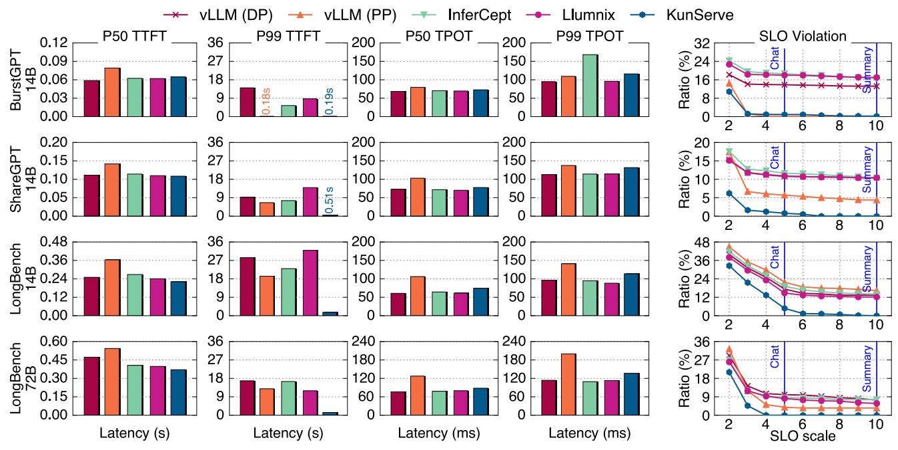
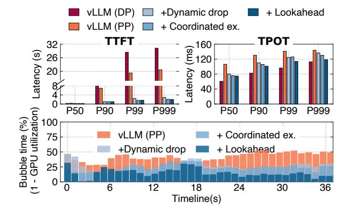
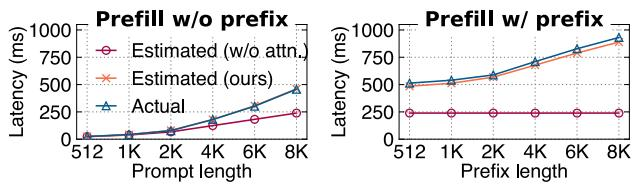
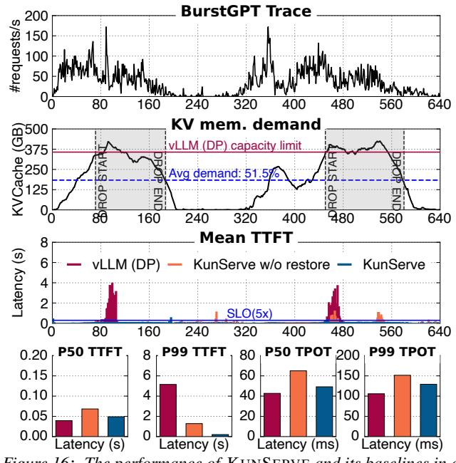
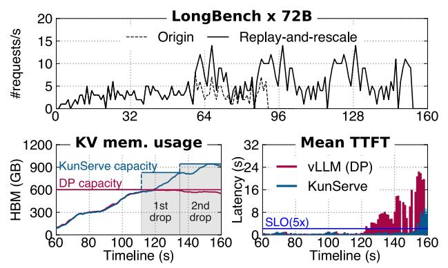

# 5.2 End-to-end Results

End-to-end serving performance. We first measure the endto-end latency of serving requests when running BurstGPT

*Figure 13: The end-to-end latency results. Column from 1 to 4 is the end-to-end metrics of different workloads. The last column is the SLO violation of TTFT and TPOT with different SLO scales.*

with different datasets on different systems, where the latency is measured from the client's perspective, i.e., the time from the client sending a request to receiving the tokens.

The second column of Figure [12](#page-9-1) presents how the mean TTFT changes over time given a measured time window (e.g., 100s), and Figure [13](#page-10-0) presents the zoomed-in view of the P50 and P99 latencies when evaluating different workloads on different models. First, KUNSERVE has 12.7–72.2 × faster P99 TTFT than other baselines, because it frees up sufficient memory under memory overloading, which enables requests queued in other systems to be served with a larger batch size. For other systems, they either suffer from recomputation overhead (vLLM), or queuing overhead waiting for swapping (InferCept) or migration (Llumnix) under memory overloading. Specifically, the timeline plotted in Figure [12](#page-9-1) clearly shows that the TTFT increase coincides with the increased KVCache demands (the first column in Figure [12\)](#page-9-1).

Although vLLM (PP) has a larger KVCache capacity, it still suffers from medium and tail latency increases due to the lower throughput. As shown in the third column of Figure [12,](#page-9-1) the average throughput of PP is 3.3–21.8% slower than other systems, because PP has bubbles during execution. Such a lower throughput leads to more KVCache capacity being required under bursts since pending requests are not digested by the system. Meanwhile, unlike KUNSERVE that schedules pending requests to eliminate bubbles, vanilla pipelined execution cannot simply adopt lookahead batch formulation

techniques ([§4.3\)](#page-6-0) because it requires waiting for sufficient requests to be scheduled. Such waiting also leads to increased end-to-end latencies.

Compared to other baselines, KUNSERVE trades a little increase in P50 TPOT, and P99 TPOT because it executes requests in a larger batch to eliminate queuing. For example, in LongBench-14B workload, the P50 TPOT of KUNSERVE is 15.8–22.7% higher than other baselines. We believe it is a reasonable trade-off because such increases are still within the SLOs of targeted applications, which we describe next. Interestingly, KUNSERVE even has a little P50 TTFT improvement in the LongBench workload. This is because the long and diverse input of requests in this workload makes the system more prone to memory overloading caused by severe memory fragmentation [\[44\]](#page-15-6). Thus, the many queued requests affect normal requests.

SLO attainment. SLO is an important metric for serving systems [\[32,](#page-15-10) [55\]](#page-15-1), which defines the maximum acceptable latency for a request. Requests whose latency exceeds the SLO are not useful because users may abandon them [\[40\]](#page-15-5). Because different applications have different maximum acceptable latency requirements (SLOs), we evaluate the SLO violation of all systems under different SLO scale factors, similar to previous works [\[32,](#page-15-10) [38,](#page-15-3) [43,](#page-15-22) [55\]](#page-15-1).

Specifically, the last column of Figure [13](#page-10-0) shows the SLO violation of all systems with different SLO scale factors, where a scale factor of means that the maximal tolerable latency

Figure 14: An ablation study of running KUNSERVE on Qwen-2.5-14B on LongBench dataset. A smaller bubble time directly implies a better GPU utilization.

is N times the P50 latency of the best baseline. To help understand how the reduced SLO violations of KunServe benefit end-to-end applications, we also mark the typical scale for our evaluated applications, i.e., we set 5 for chat—a tight SLO as it requires quick responsiveness, while for document summarization, we set a looser factor of 10, following previous works [55]. We can see that KunServe achieves 7.2—12.8% average SLO violation reductions on various workloads, and more importantly, it almost eliminates all violations with a scale larger than 4 for all workloads. Other baselines cannot eliminate SLO violations even with an extremely loose factor of 10 because during bursts, there are considerable numbers of queued requests suffering from 45— $840 \times tail$  latency increases.

Multi-GPU instance performance. Due to space limitations, we only present the results of the model (Qwen-2.5-72B) that requires multi-GPU for serving on the LongBench dataset. Results on other datasets are similar. As shown in Figure 12 and Figure 13, the trend is similar to that of single-GPU instances: KUNSERVE reduces the P99 latency by 8.4–11.9× compared to other baselines, at the cost of a slight (18.3–22.7%) increase in P50 TPOT and P99 TPOT. The multi-GPU model achieves similar results because each instance (containing multiple GPUs) can be viewed as a whole as a single logical GPU. The multi-GPU model benefits even more from dropping parameters because the relative ratio of parameter memory is large, as shown in Table 1.

#### **5.3** Ablation Studies

To study the effectiveness of each technique proposed in §4, we conducted an ablation study on the system performance with different techniques incrementally enabled. Figure 14 shows the detailed study results on the LongBench dataset with Qwen-2.5-14B model. We omit other workloads and models due to space limitation since they have similar results.

Figure 15: A comparison of execution latency estimated with our cost model and the real execution time of a Qwen-2.5-14B model in A800 GPUs. Left: the execution without prefix attention while right: the execution with prefix attention.

We report the end-to-end request latencies during the burst period in Figure 12.

Effectiveness of dynamic parameter drop. First, we can see that parameter drop contributes (+Dynamic drop) to the most tail latency reductions. On the LongBench workload, the P90, P99 and P999 TTFT of KUNSERVE are reduced by 8.8 ×, 11.7 × and 10.3 × compared to vLLM (DP). The key reason is that it completely eliminates queuing delays. Specifically, under bursts, there are 87 queued requests (whose TTFT > SLO(5 ×)) in this evaluation, KUNSERVE executes them with enlarged GPU memory freed by dropping parameters. Though a larger batch size and pipeline bubbles lead to a TPOT increase in request processing (21–31.9% increase compared to the original DP scheduling), it is still orders of magnitude smaller than queuing introduced by insufficient memory of vanilla vLLM.

Effectiveness of coordinated exchange. Second, with coordinated exchange (+ Coordinated ex.), KUNSERVE further reduces the P99 and P999 TTFT by 1.5 ×, and 1.4 × respectively. Meanwhile, it reduces the P90 and P999 TPOT by 5%. Coordinated exchange benefits both the TTFT and TPOT because without it, the prefill of new requests as well as their decode requests cannot execute smoothly, because the intermediate activation suffers significant stalls due to exchanging the KVCache. Since the exchange time (1.3s) is larger than the typical execution time (e.g., 221ms for prefill and 60ms for decode), the stall is non-trivial.

Effectiveness of lookahead batch formulation. With lookahead batch formulation (+ Lookahead), we further reduce the P90, P99, and P999 TPOT by 4.5%, 10.6%, and 9.7%, respectively. The reduction in latency directly comes from the more efficient pipeline execution: without lookahead batch formulation, KUNSERVE suffers 21.9% bubble time (the ratio of idle GPU cycles) on average during pipelined execution, while with it, the bubble time is only 8.3%. The reduced bubble time further improves throughput by 20%.

### **5.4** Batch Formulation Cost Model Accuracy

To evaluate the accuracy of KUNSERVE's cost model described in §4.3, we compare it with a baseline cost model

Figure 16: The performance of KUNSERVE and its baselines in a long run (640s) of BurstGPT.

neglecting attention computation cost found in existing work [56] and the ground truth. To demonstrate the generality of our model in both prefill and chunked prefill, we evaluate both requests without attention chunk ( $R4^0$  in Figure 9 (c)) and with it ( $R4^1$ ). As shown in Figure 15, for both cases, our cost model shows less than 5% deviation while the current formulation without considering attention has up to 48% and 74% deviations for requests without and with prefix attention, respectively. This confirms the importance of considering the attention computation cost in the cost model.

### 5.5 Effectiveness of Dynamic Restoration

To show the effectiveness of dynamic parameter restoration, Figure 16 presents the serving performance over a long run of BurstGPT workload with multiple overloading periods. To help understand the behavior of KUNSERVE, we mark the time periods with dropping as grey boxes, other periods are running without parameter drop.

First, we observe that dynamic parameter restoration reduces the P50 latencies of TTFT and TPOT by 28 % and 23 %, respectively, due to the reduction of unnecessary pipeline execution. Second, restoration improves the P99 TTFT and TPOT by  $6.4 \times$  and  $1.2 \times$ , respectively. Without restoration, KUNSERVE falls back to vLLM (PP), resulting in lower throughput during normal periods, and consequently suffers from larger bursts with insufficient memory even with the dropped parameters, as illustrated at the beginning of the second wave in the third row of Figure 16 (time 440s).

Figure 17: An evaluation of KUNSERVE running Qwen-2.5-72B under extreme bursts.

#### **5.6** Performance under Extreme Bursts

While KUNSERVE drops parameters to mitigate queuing, the memory that can be freed is bounded by the model size (see Table 1), so we have a limit in handling overloading caused by bursts. Nevertheless, KUNSERVE can handle bursts much longer than existing systems, i.e., longer than any burst we have seen in the BurstGPT trace.

To evaluate the limit in handling bursts with KUNSERVE, Figure 17 shows the performance of KUNSERVE and vLLM when running under an unrealistic extreme burst. Specifically, to evaluate an extreme burst, we use a BurstGPT setup as follows: upon meeting the first burst, we repeatedly replay the bursts until all evaluating systems are out of memory. The setup is shown in the first row of Figure 17 while the second row compares the performance of KUNSERVE and vLLM (DP). The evaluated model is Qwen-2.5-72B. First, KunServe reaches the memory limit in 152s, which is  $1.5 \times$ longer (starting from 60s) than vLLM thanks to the dropped memory. During this period, KUNSERVE triggers 2 times of parameter dropping, resulting in 57% incrementally freed KVCache memory. Before KUNSERVE reaches the memory limit, KUNSERVE meets no SLO  $(5 \times)$  violations while vLLM suffers up to  $42 \times TTFT$  increase.

While KUNSERVE also suffers from latency increases when out of memory, we don't encounter such a situation under real-world traces. More importantly, the much longer standing time of KUNSERVE allows the serving systems to smoothly scale up new instances to handle the bursts.

### 6 Discussion

**Supporting MoE models.** Our current implementation focuses on dense models, while Mixture of Experts (MoE) models are becoming increasingly popular recently: A key feature is that the inference of a request only activates a small subset of model parameters. For common MoE serving configurations like expert parallelism (EP) [20], KUNSERVE

seamlessly supports them because EP only changes the memory layout within an instance, while KUNSERVE focuses on managing the GPU memory across serving instances. More importantly, KUNSERVE is still effective for MoE models because KUNSERVE only relies on the assumption that the model weights occupy a large portion of the GPU memory on an instance, which holds even with a sparse activation of experts (see Table [1\)](#page-3-1). The assumption holds because though a request only requires a small portion of the model parameters, an instance still needs to load all the (large) model parameters to handle batches of requests that may activate all the experts.

Compatibility with different parallelism. KUNSERVE is compatible with different parallelism in LLM serving. KUN-SERVE only changes the parameter layout across instances in layer granularity, which is orthogonal to both the intralayer layout change (e.g., EP and TP) within one instance and instance cooperation in SP. Thanks to the LLM's modular structure, the intra-instance and inter-instance parallelism techniques can be applied together [\[42,](#page-15-11) [51\]](#page-15-21).

Comparison with autoscaling. Autoscaling—adding more instances to handle overloads—is also a common approach to handle memory overloading [\[53\]](#page-15-23). A key difference is that KUNSERVE does not have the cold start time—the time to make an instance capable of serving. Thus, KUNSERVE is better than autoscaling in cases where dropping alone is able to handle the overloading, as the cold start time is typically non-trivial for LLM providers [\[40\]](#page-15-5). Nevertheless, for long bursts (see [§5.6\)](#page-12-3), KUNSERVE still incorporates autoscaling since the memory that can be freed by dropping is limited: the continuously coming requests from the burst will exhaust all the free memory freed by dropping.

