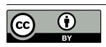

# Keywords

LLM Serving; Cloud computing; Parameter-centric memory management

[This work is licensed under a Creative Commons Attribution 4.0 International](https://creativecommons.org/licenses/by/4.0) [License.](https://creativecommons.org/licenses/by/4.0)

*EUROSYS '26, Edinburgh, Scotland Uk* © 2026 Copyright held by the owner/author(s). ACM ISBN 979-8-4007-2212-7/2026/04 <https://doi.org/10.1145/3767295.3769348>

### ACM Reference Format:

Rongxin Cheng, Yuxin Lai† , Xingda Wei, Rong Chen, Haibo Chen. 2026. KUNSERVE: Parameter-centric Memory Management for Efficient Memory Overloading Handling in LLM Serving. In *21st European Conference on Computer Systems (EUROSYS '26), April 27–30, 2026, Edinburgh, Scotland Uk.* ACM, New York, NY, USA, [17](#page-16-0) pages.<https://doi.org/10.1145/3767295.3769348>

