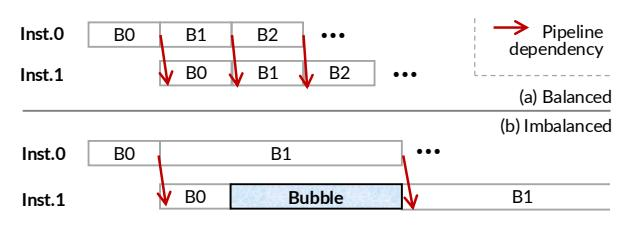
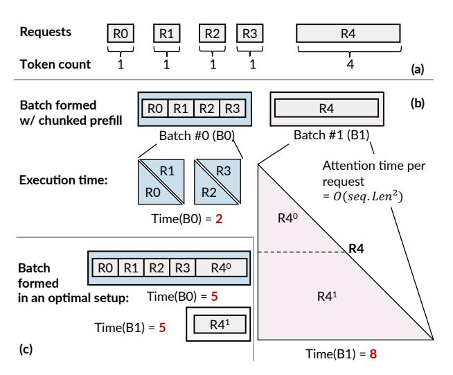
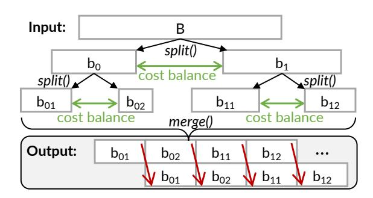

# 4.2 Smooth KVCache Transition of Requests

Because the KVCache has a one-to-one mapping with the model parameters, we cannot simply execute ongoing decode requests due to the lack of KVCache. For example, suppose a request has executed on instance A, and A has formed a group with instance B due to memory overloading. After the drop, A will only have parameters of layers 0–4, while B will have layers 5–7. Hence, B cannot directly execute the 5–7 layers of a request originally on A because the required KVCache is on A. Similarly, A cannot execute the 0–4 layers of a request originally on B. One intuitive solution is to recompute the KVCache on B. This is expensive since it causes queued requests to wait for the recomputation even without considering the recomputation time.

**Network-based KVCache exchange.** We choose to exchange the KVCache through the network to avoid recomputation. The KVCache is exchanged because after A and B

Figure 8: An illustration of pipeline execution bubbles caused by imbalanced execution time of microbatches.

have formed a group, ongoing requests on A need to transfer their KVCache to B, while B needs to do the same vice versa. A drawback of the exchange is that the requests with the exchanged KVCache will be stalled during the exchange, which we found to be acceptable in practice. This is because the network between instances such as RDMA is sufficient for transferring the KVCache quickly. For example, KVCache exchange typically introduces 1–2 s stall time on our 200 Gbps network. This means a 10 ms increase at most in the TPOT metric of a response with 200 decode tokens.

Note that during the stall, we can still schedule new requests queued due to memory overloading to fully utilize the GPUs. While in principle we can leverage techniques like attention offloading (also called model-attention disaggregation) [16] to concurrently execute stalled requests during the KVCache exchange, we found the excessive complexity of the implementation is not worth the effort.

Coordinated KVCache exchange. Although straightforward, KVCache exchange could block new request if not implemented properly, because the exchange competes for bandwidth with activation transfers in pipelined execution. Since the exchange time is much longer than forwarding the activation, When the activation is waiting for the exchange to finish, it will leave the GPUs idle, causing non-negligible performance loss. Observing that the activation transfer is much smaller yet more critical, we design a coordinated exchange mechanism to prioritize the activation transfer. Specifically, we transfer KVCache in finer-grained chunks such that the transferring a chunk takes similar time to executing a pipeline stage. After transferring one chunk, we will check whether there will be activation transfer. If so, we pause the KVCache transfer and let the activation transfer go first.

#### 4.3 Efficient Serving after Parameter Drop

Key problem: pipeline bubbles caused by unbalanced microbatch execution time. A problem of pipeline execution after parameter drop is that the system suffers from degraded throughput due to pipeline bubbles. The bubbles arise from the imbalanced execution time of different microbatches, as illustrated in Figure 8 (b). For example, when B1's execution

Figure 9: (a) An illustration of serving requests to execute. (b) The imbalanced batch execution time of existing chunking method. (c) A balanced formulated batch configuration.

time is longer than B0, Inst.1 must wait for B1 to finish before it can execute the layers on B2.

#### A preliminary on the state-of-the-art pipeline batching.

Modern pipeline implementations rely on chunked prefill to reduce pipeline bubbles. Specifically, they [8, 30] form microbatches in a token-count-based manner, which balances the execution time of different microbatches by ensuring each microbatch has a similar number of tokens. As shown in Figure 9 (a), suppose 5 requests (R0–R4) arrive at an instance in turn, and the budget for each microbatch is 4 tokens. The scheduler first merges incoming requests into one microbatch (R0–R3 in (b)). R4 itself forms another microbatch (B1). Note that if R4 exceeds the budget, the scheduler will chunk it into two segments for execution.

Inefficiency of token-count-based chunking. A key issue is that the microbatch execution time is not linearly proportional to the total token count, because the attention computation of each request is quadratic to its token count, as shown in Figure 9 (b). Moreover, if a request is chunked into two parts, the latter chunk is slower than the former even when the tokens are the same, because the latter chunk has to additionally compute the attention with the former chunk.

The lookahead batch formulation. Fortunately, under bursts, we have sufficient requests queued. Thus, we can re-form the microbatches across them by looking ahead at all requests queued. To efficiently find the balanced microbatch configuration, we propose a heuristic divide-and-conquer algorithm.

Our method works in two steps. First, we adopted a retrofitted cost model to precisely estimate the execution time of a

Figure 10: An illustration of how lookahead batch formulation recursively generate balanced microbatches.

Input:  $\mathbf{B} = [[r0 \mid |r|] \dots]]$ , the initial batch contain one that has all requests, MIN, the minimal tokens per batch. derived by dividing total token numbers, profiled off-line. Output: a balanced micro batch set [b0, b1, ..., ]. 1  $\mathbf{B} = \text{balance\_micro\_batch}(\mathbf{B})$ return B 3 Function balance\_micro\_batch(B): 4 if  $|B[0]| \leq MIN$ : 5 | **return** B ▶ Don't chunk if with few tokens 6 res = []7 For b in B: b0, b1 = b.split(0.5 \* cost(b))8 9 res = res || balance micro batch(b0) res = res || balance\_micro\_batch(b1) 10 return res

Figure 11: The pseudocode of the divide-and-conquer microbatch formulation algorithm.

microbatch. Second, we recursively generate the microbatch configurations according to the cost model. Specifically, balancing can be done by looking ahead all tokens to be chunked in a recursive manner, as shown in Figure 10. The initial batch contains a single microbatch with all tokens, which is then recursively split into two cost-balanced microbatches until it reaches a balanced setup.

Figure 11 shows the detailed pseudocode. The algorithm complexity is  $O(\log L)$  so it can be quickly solved online. For simplicity, we omit the details of split, which divides requests in a batch into chunks and returns a new microbatch set whose aggregated cost is equal to the objective  $(0.5 \times cost(b))$ . This ensures that each microbatch has sufficient tokens to fully utilize the GPU. One thing to note is that the generation halts once the number of tokens to form a batch is below a threshold (line 4–5).

A key to the effectiveness of the above algorithm is to accurately estimate the execution time (i.e., cost) of a microbatch.

We derive the cost model using a bottom-up approach: we first model the cost of executing a chunk of a request, then we sum the cost of all chunks in a microbatch as its cost. Specifically, suppose we have a microbatch set  $\mathcal{B}$ , denoted by  $\mathcal{B} = \{b_1, b_2, \ldots, b_m\}$ , The chunks are chunked from a request set of size n, denoted by  $\mathcal{R} = \{r_1, r_2, \ldots, r_n\}$ . The cost of a chunk  $c_{ij}$ ,  $\cos c_{ij}$ , can be formulated as follows:

$$cost_{c_{ij}} = \alpha \left( \underbrace{p_{ij}c_{ij}}_{p_{ij}c_{ij}} + \underbrace{\frac{c_{ij}^2 + c_{ij}}{2}}_{self-attn} + \beta \underbrace{c_{ij}}_{c_{ij}} + \gamma \right) + \beta \underbrace{c_{ij}}_{c_{ij}} + \gamma$$
(1)

The equation consists of four parts: the cost to compute attention with previous tokens (**prefix-attn**); the cost to compute attention with the chunk itself (**self-attn**); the cost of computing the activations (**FFN** (Feed-Forward Network)) for tokens; and others. The prefix tokens of each chunk can be calculated as  $p_{ij} = \sum_{k=1}^{j-1} c_{ik}$ . The **prefix-attn** and **self-attn** models the quadratic cost of attention computation missed by existing models, e.g., NanoFlow [56] does not consider **self-attn**, while DistServe [55] does not take **prefix-attn** into account.

Our model depends on several hyperparameters (e.g.,  $\alpha$ ) that can be determined through offline profiling: before the system is deployed for serving, we run multiple inference samples offline, collect their execution times, and then use the least squares method [49] to determine all hyperparameters.

Given the cost of each chunk, we can sum all the costs of chunks in a microbatch to get the cost of the microbatch:

$$b_k = \{c_{ij} \mid x_{ij} = k \land c_{ij} > 0\}, \quad \forall k \in \{1, ..., m\}$$
 (2)

$$cost_{b_k} = \sum_{\substack{(i,j) \\ x_{ij} = k}} cost_{c_{ij}} - (|b_k| - 1)\gamma \tag{3}$$

Note that the term  $-(|b_k|-1)\lambda$  reflects the elimination of duplicated parameter-loading when executing a batch, as requests in a batch share the same model parameter. Like other hyperparameters,  $\lambda$  can be fitted with offline profiling.

Empirically, our cost model accurately models the execution time of a microbatch for common sequence lengths in Figure 15. As a result, the pipelined execution with our lookahead formulation can significantly reduce the execution bubbles (see Figure 14).

**Discussion:** the generality of lookahead batch formulation and cost model. While in principle, we could also apply lookahead batch formulation to general LLM serving with pipeline execution, it has one obstacle that the formulation assumes a sufficient number of requests queued to "lookahead" to be effective. Under normal serving without bursts, waiting

for requests to be looked ahead may add additional latency, which we leave possible solutions as a future work.

Besides, readers may findEq. [1](#page-7-2) still has a part that has a linear correlation with the number of tokens (FFN), so if the cost is dominated by FFN, existing token-count-based cost models may suffice. We argue that our retrofitted cost model is still important because the quadratic terms (prefixattn and self-attn) would become significant when the token count increases (e.g., for requests with more than 4K tokens, which are common in real-world workloads [\[15\]](#page-14-19), see [§5.1\)](#page-8-2), so existing works can leverage our model for a more accurate estimation of microbatch execution time.

