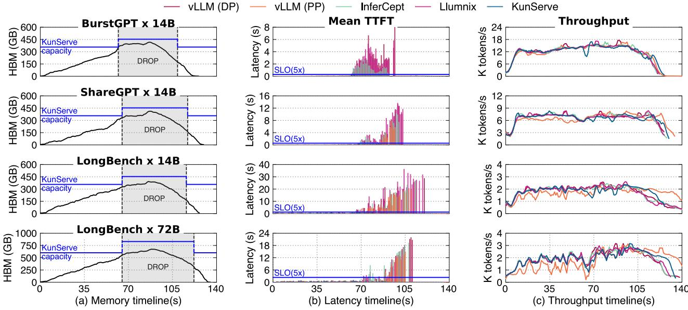

# 5.1 Experiment setup

Testbed. We evaluate KUNSERVE on two clusters listed in Table [2.](#page-9-0) Cluster A has one GPU per server so it is typically used for running small models (e.g., 14 B models). Cluster B has multiple GPUs per server interconnected with fast NVLink, so it is suitable for running larger models (e.g., 72 B models) with tensor parallelism.

Evaluated models. Similar to prior works [\[8,](#page-14-10) [38,](#page-15-3) [55\]](#page-15-1), we choose open-source models with leading accuracy: Qwen-2.5- 14B and Qwen-2.5-72B [\[45\]](#page-15-18). Both models adopt GQA [\[11\]](#page-14-20) to reduce KVCache size while maintaining high accuracy. We do not choose models with huge KVCache usage (e.g., models with MHA [\[46\]](#page-15-9)) that could easily exhaust GPU memory though KUNSERVE is more effective when serving such models. This is because these models are being replaced by more KVCache-efficient variants. Table [1](#page-3-1) lists instance configurations of each model. For the 72B model, we use tensor parallelism to serve requests on multiple GPUs.

Evaluated traces and datasets. Since memory overloading is sensitive to the request arrival pattern, we use a real-world trace BurstGPT [\[48\]](#page-15-2) with known request arrival information (i.e., the invocation time of each request) as our main evaluated application. Following the guide of BurstGPT, we scale BurstGPT's RPS to fit the serving capacity of our testbed using a scaling method that preserves the temporal pattern of the trace. Specifically, we upscale the trace with TraceUpscaler [\[41\]](#page-15-19), and ensure that the average memory demand is lower than 60% of the total memory during the entire evaluation of the trace.

Besides the arrival pattern, LLM serving is also sensitive to the input and output length of requests. Thus, given the trace, we further evaluate requests from representative datasets representing different scenarios, similar to prior works [\[32,](#page-15-10) [34\]](#page-15-20):

- BurstGPT. It is the original dataset of BurstGPT [\[48\]](#page-15-2), representing a conversion workload so both TTFT and TPOT are important. The average input and output lengths are 642 and 262, respectively.
- ShareGPT. ShareGPT [\[3\]](#page-14-21) is another popular chatbot dataset that is widely evaluated on [\[8,](#page-14-10) [44,](#page-15-6) [51,](#page-15-21) [55\]](#page-15-1). Its input and output lengths are longer than BurstGPT, representing a workload that is more sensitive to GPU memory provisioning. The maximal input length is 4K, and the average input and output lengths are 1,660 and 373, respectively. Like BurstGPT, low TTFT and TPOT are both important for benchmark using this dataset.
- LongBench. LongBench [\[15\]](#page-14-19) is another popular dataset used for evaluating document summarization tasks [\[55\]](#page-15-1), e.g., summarizing news, articles and scientific papers. The average input length is 5.9 K and the average output length

*Figure 12: First column: the memory usage pattern of* KUNSERVE*. Second column: the mean TTFT during the evaluation. Third column: the throughput during the evaluation.*

is 499. Since the user expects a quick response to the summarized content, TTFT is also important.

Baselines. We compared with the state-of-the-art LLM serving systems with various techniques to cope with memory overloading. For all systems, we have carefully tuned their configurations to meet the optimal performance without memory overloading. We have also enabled all known serving optimizations to these systems even though the vanilla systems are not optimized (e.g., InferCept [\[7\]](#page-14-11)). For those with our optimizations, we have calibrated that our optimizations enabled better performance than the original open-sourced codebase. More specifically, our baselines are:

• vLLM (default + PP) [\[30\]](#page-15-4). We compare two configurations of vLLM (release v0.6.3): The default configuration stores the entire parameters on each instance, while pipelined parallelism (PP) further frees half of the parameters on each instance and leverages PP to execute requests across two instances. This setup frees up more memory for KVCache, but it also introduces pipelined execution overhead. By default, vLLM uses recomputation to cope with memory overloading. We compared the vLLM with swapping to InferCept described below.

Before the evaluation, we carefully tuned the configurations of vLLM. Specifically, we tuned the block size to achieve the best performance under our setup. We chose 64 because (1) it is small enough to avoid memory fragmentation while (2) it is sufficiently large to achieve good performance [\[21\]](#page-14-16).

*Table 2: Testbed configurations. and denote the number of servers and GPUs per host, respectively. Bandwidth (unidirectional) is reported for both networks.*

|                             | Cluster A (𝑠 × 𝑔)  | Cluster B (𝑠 × 𝑔)  |
|-----------------------------|--------------------|--------------------|
| GPU                         | A800 80 GB (8 × 1) | H800 80 GB (2 × 8) |
| Scale-up Network (GPU-GPU)  | N/A                | 300 GB/s NVLink    |
| Scale-out Network (GPU-GPU) | 200 Gbps RDMA      | 400 Gbps RDMA      |

- InferCept [\[7\]](#page-14-11). InferCept designs an optimized swap mechanism that eliminates IO idle time atop vLLM. We tried to compare its original open-sourced version, but found its performance is 1.2–5.1 × slower in TTFT and 1.2–1.9 × in TPOT than the chosen vLLM release even without memory overloading. This is because it was implemented on an old version of vLLM (v0.2.0), where important optimizations (e.g., FlashAttention/FlashInfer kernels [\[17,](#page-14-22) [21\]](#page-14-16), chunked prefill [\[8\]](#page-14-10)) are missing. Therefore, we integrated our scheduler and attention backend into the original InferCept for a fair comparison.
- Llumnix [\[44\]](#page-15-6). Llumnix adopts load balancing to cope with memory overloading of an instance, and migrates KVCache between instances to free sufficient memory in case of insufficient memory even with load balancing. We compared with the latest version of Llumnix (release v0.1.0).

