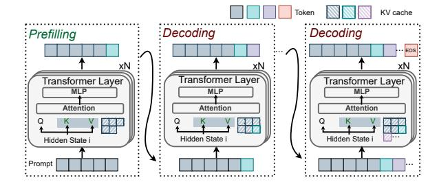

# 1 Introduction

The rapid adoption of large language models (LLMs) has driven a significant increase in the demand for efficient and scalable serving systems. These LLMs, including variants like GPT-4o [\[35\]](#page-14-0), Llama3 [\[3\]](#page-14-1), and DeepSeek [\[25\]](#page-14-2), are frequently updated to meet evolving user needs, driving substantial growth in model size and context lengths. Inference of LLM serving is split into two stages: prefill to process input prompts, and decode to generate subsequent output tokens. Both stages require model weights to reside in GPU memory and generate KV caches for all tokens to avoid redundant computations [\[41,](#page-14-3) [56\]](#page-15-1). However, this mechanism has led to ballooning memory usage, with GPU memory becoming a bottleneck even as GPU streaming multiprocessors (SMs) remain underutilized, which leads to an imbalance between memory and computation resources.

In recent years, researchers have made significant efforts to tackle this issue. Some methods offload KV caches to host or disk storage [\[1,](#page-14-4) [22,](#page-14-5) [28\]](#page-14-6), while others discard KV caches of tokens and recompute them to free up GPU memory [\[22,](#page-14-5) [32,](#page-14-7) [51,](#page-15-2) [53\]](#page-15-3). Although these strategies can alleviate GPU memory pressure to some extent, they often result in suboptimal throughput and latency. For instance, offloading KV caches introduces significant overhead due to PCIe bandwidth limitations, while recomputing tokens can be computationally expensive, especially for long sequences. To mitigate this overhead, HCache [\[12\]](#page-14-8) stores hidden states to enable fast restoration and recompute KV caches for all tokens of an evicted request. In this context, HCache performs KV cache recomputation at a coarse-grained, request-level granularity. Similarly, KVPR [\[18\]](#page-14-9) recomputes KV caches of preempted

∗Wenyan Chen is currently a Research Fellow at NTU Singapore.

requests using the corresponding input activations, which are first transferred from the CPU, while asynchronously transferring the remaining KV caches to the GPU. A fundamental limitation of these fast restoration solutions is that they need to store the entire KV cache during decoding for all ongoing requests, neglecting opportunities to enhance the concurrent request capacity within limited GPU memory.

To fill this gap, we propose a fine-grained adaptive tokenwise caching mechanism that only retains KV states of partial active tokens in GPU memory while dynamically evicting and recomputing other older tokens during decoding. This strategy significantly reduces the memory footprint of KV caches, enabling higher request concurrency. While prior systems like HCache [12] considered token-wise recomputation impractical due to the inefficiency of small-batch GEMM kernels during restoration, our mechanism successfully overcomes this bottleneck. By batching recomputed tokens from all ongoing requests during decoding, we make token-wise recomputation efficient, thereby unlocking the full benefits of fine-grained management. Preliminary experiments (see § 2.3) demonstrate that configuring an appropriate cache ratio under varying system loads improves throughput by 57% with negligible degradation in time-per-output-token (TPOT). To further mitigate the overhead associated with recomputing the partial KV cache, we introduce layer-wise kernel fusion, which combines recomputation of evicted tokens and new token decoding into a single GPU kernel. This eliminates redundant kernel launches and enhances SM utilization, reducing TPOT by 25% (§ 2.4). These optimizations are interdependent: the evicted token ratio dictates thread allocation for fused kernels, while thread allocation inversely impacts caching decisions. Their parallel execution per iteration necessitates co-optimization for peak efficiency.

Building on these insights, we present eLLM, a system engineered to elevate <u>LLM</u> serving performance through joint optimization of adaptive KV caching and kernel fusion. Central to our design is a granular KV cache management mechanism that operates at both token and layer levels. Unlike conventional caching methods used in systems such as vLLM [22], HCache [12], and KVPR [18], which retain full-layer KV states per request as indivisible units during the decoding stage, eLLM selectively caches key-value pairs for individual tokens at specific layers during decoding, enabling flexible caching strategies at finer granularities.

On top of the new caching mechanism, eLLM further implements dual-level optimizations designed to maximize throughput while maintaining compliance with TPOT SLOs (service-level objectives). At the request level, it dynamically adjusts batch sizes and token cache ratios using real-time system metrics and execution states. At the layer level, eLLM reduces recomputation latency through communication-computation overlap techniques for evicted tokens and host-swapped KV states, while optimizing thread allocation for

**Figure 1.** The workflow of LLM serving using KV caches.

fused kernels based on instantaneous computational demands. This closed-loop system continuously refines batch sizes, eviction ratios, and thread assignments, resolving interdependencies between caching and fusion while adapting to fluctuating request patterns and sequence lengths.

We have implemented eLLM on top of vLLM [22] and evaluated its performance using real-world invocation traces from Azure [6] on a 4 A100 GPU cluster. Experimental results demonstrate that eLLM achieves up to 3.03× higher throughput and 2.63× lower latency compared to state-of-the-art systems, while simultaneously delivering up to 15% higher SM utilization. Additionally, it maintains similar performance benefits across diverse request loads, models, and datasets. Key contributions of this paper include:

- ▶ We develop an adaptive token-wise and layer-wise KV caching mechanism that enables fine-grained caching at both token and layer granularities, thereby supporting joint optimization across request and layer levels.
- ▶ We present dual-level optimizations that dynamically adjust batch sizes and uncached token ratios at the request level, and overlap communication-computation overhead with kernel fusion at the layer level, aiming to maximize throughput while maintaining TPOT SLOs.
- ▶ We propose a closed-loop adaptation mechanism that continuously monitors system metrics and per-request execution states. It iteratively refines the batch size, evicted token ratio, and thread allocation, thereby further enhancing LLM serving performance.

