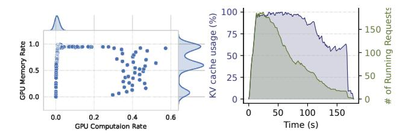
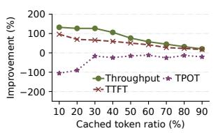
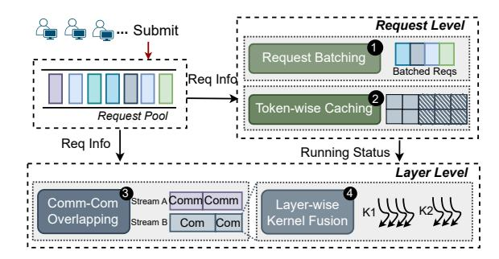

# 2 Background and Motivation

#### 2.1 LLM Serving Basics

Transformer-based LLMs. An LLM consists of multiple Transformer layers [43], each containing attention-based and multilayer perceptron (MLP) components. As illustrated in Fig. 1, during inference, the LLM takes a sequence of input tokens (i.e., the prompt) and autoregressively generates subsequent tokens until a stopping condition is met—such as reaching the maximum output length or producing an <EOS>. This generation process can be divided into two distinct phases: the *prefilling* phase and the *decoding* phase.

In the *prefilling* phase, the LLM processes the entire input sequence to compute hidden states for each token. These hidden states are then projected into query (Q), key (K), and value (V) matrices at each layer. These matrices are

(a) Distribution of memory and (b) Trends of KV cache usage computation and number of running requests

**Figure 2.** Distribution of memory and computation metrics for serving Llama2-13B model with 50 req/s on an A100 GPU.

passed through the multi-head attention (MHA) and MLP modules to generate the first output token. Since the full input sequence is known in advance, this phase benefits from highly parallelized matrix-matrix operations, enabling efficient utilization of GPU resources.

In contrast, the *decoding* phase proceeds sequentially, generating one output token per iteration until the stopping criterion is satisfied. In each step, the previously generated token serves as the new input. Each layer computes the Q, K, and V embeddings for this new token, updates the KV cache, and performs multi-head attention by combining the current token's Q embedding with the cached K and V vectors from all previous tokens. This phase primarily involves matrix-vector operations, which generally result in lower SM utilization compared to the prefilling phase.

**KV Caches.** To reduce recomputation overhead, LLMs typically utilize KV caches to store the intermediate key and value tensors for each token. These tensors are crucial for calculating attention scores when generating the next token and are accumulated as more output tokens are produced. The KV caches are computed as:  $K = XW^K$ ,  $V = XW^V$ , where X is the input token embedding, and  $W^K$  and  $W^V$  are the weight matrices for the key and value, respectively. These tensors are often stored in GPU memory to avoid redundant computations during the *decoding* phase; their size grows linearly with the number of generated tokens.

## 2.2 Imbalance between Memory and Computation

Modern accelerators, such as GPUs, are limited by their memory capacity, as integrating a large amount of RAM on these devices remains a significant challenge [33]. When running LLMs on GPUs, memory becomes a critical bottleneck for serving, primarily due to the KV cache storage mechanism [8, 22] and the substantial size of LLM weights, leaving SM resources underutilized.

To demonstrate this point, we conducted experiments using Llama2-13B (MHA) [42] on the ShareGPT dataset, executing it on an A100 GPU with 80GB memory. We analyzed the behavior of various performance metrics. The shaded regions on the upper and right sides of Fig. 2(a) represent the density distribution of GPU computation and memory utilization points, respectively. The results reveal that memory

usage is significantly higher, consistently ranging from 50% to 100% of the GPU's memory capacity. In contrast, computational utilization is relatively low, primarily staying between 0% and 10% of the GPU's computational capacity.

Moreover, as illustrated in Fig. 2(b), the KV cache consumption exhibits rapid growth during initial request scaling, reaching full memory capacity as token generation progresses. Notably, even after numerous requests complete execution and vacate compute resources, the KV cache footprint remains persistently elevated due to the accumulating output tokens of remaining active requests. This reveals a critical resource disparity: While SMs become underutilized as computation demands decrease, the memory subsystem remains fully saturated.

To evaluate whether this imbalance persists across more memory-efficient architectures, we further examine DeepSeek-V2-Lite (16B) [9], which incorporates Multi-Head Latent Attention (MLA) to significantly compress KV cache. Under identical settings, the MLA-based model still yields a median GPU utilization of only 35%, despite reaching 97.4% memory occupancy. This confirms that even with architectural optimizations designed to alleviate memory pressure, the serving process remains fundamentally memory-constrained. Such a persistent disparity prevents GPU computational capabilities from being fully exploited even when SM capacity is available—a core bottleneck that ultimately degrades overall system throughput.

## 2.3 Benefits of Partial Token-wise Caching

To address memory bottlenecks, current research predominantly focuses on an *all-or-nothing* caching strategy for KV caches, in which the KVs of all tokens are either fully preserved or entirely discarded for overloaded requests. This approach generally falls into two categories: (1) swapping the KV caches of all tokens within a request to host memory or storage devices [1, 11, 20, 28] and retrieving them when needed, and (2) discarding the KV caches for an entire request and recomputing them on demand [22, 30, 32]. While simple, these coarse-grained strategies degrade throughput and amplify inference latency under dynamic loads and variable prompt lengths. A fundamental limitation of both methods is their reliance on retaining full KV caches in GPU memory throughout decoding, even with optimizations like fast cache recovery [12], which severely restricts concurrent requests.

Partial token-wise caching presents a fine-grained solution to these challenges. As depicted in Fig. 3(a), this approach dynamically adapts to system load and memory constraints by recomputing KV caches for a targeted subset of tokens (e.g., 40%) at the sequence's start within the same layer during current-token decoding, while only retaining full KV caches for the remaining tokens in GPU memory. Upon decoding the current token at its respective layer, the temporary KV caches for the recomputed tokens are instantly evicted. This achieves two critical advantages: (1) it reclaims

(a) Token-wise caching

(b) Benefit of token-wise caching

**Figure 3.** Illustration of partial token-wise caching. (a) For a prompt of length *n*, the KV caches of the first *s* tokens are evicted from memory during decoding, resulting in a cached token ratio of (n-s)/n; (b) Adjusting the cached ratio based on the system load.

GPU memory to support higher request concurrency during decoding, and (2) it exploits underutilized computational resources-particularly idle SMs-to minimize overhead. Crucially, recomputing early-sequence tokens incurs negligible latency, as attention operations for shorter sequences are inherently efficient. The synergistic result is reduced inference latency, improved throughput, and scalable concurrency. Furthermore, the strategy enables a dynamic trade-off between memory and computation, allowing runtime optimization tailored to fluctuating workloads and hardware states. We demonstrate the advantage of partial token-wise caching in a real-world scenario, as illustrated in Fig. 3(b). Using the same model and GPU setup as described in § 2.2 and the ShareGPT dataset, the request submission follows the original request arrivals from the Azure trace in DynamoLLM [40]. The submitted requests exceeded the memory capacity for the entire first 400 seconds. At the 200-second mark, we apply partial caching (50% cache ratio) to all ongoing requests to alleviate memory pressure. As a result, the number of concurrently executed requests nearly doubles. This higher concurrency reduces request waiting times and optimizes GPU utilization, achieving a TTFT (time to first token) reduction of 48.05% and an SM utilization increase of 8.7%

To further evaluate this hypothesis, we conducted experiments using the same settings as described in § 2.2. As shown in Fig. 4, both output token throughput and TTFT consistently improved Figure with the use of partial token improvement with different caching as fewer KVs were cache ratios.

4. Performance

cached, compared to the pure swapping-based and pure recomputation-based policies. However, TPOT increases as fewer KVs are cached, due to the additional recomputation required. Interestingly, as the cached token ratio increases, there is a point where TPOT becomes almost unaffected while TTFT and throughput performance improve significantly-by up to 57% under the fixed load.

**Insight** #1: Partial token-wise caching improves the concurrency of requests processed in batches, thereby increasing

(a) Kernel fusion illustration

(b) Benefits of kernel fusion

**Figure 5.** (a) Layer-wise kernel fusion: Decoding token  $T_8$  at layer i (kernel K2) requires the KV caches of tokens  $T_1$  to  $T_7$ at the same layer. While the caches for tokens  $T_4$  to  $T_7$  are retained in memory, the remaining caches must be recomputed before decoding the current layer. Simultaneously, the recomputation of KV caches for tokens  $T_1$  to  $T_3$  at the next layer, i + 1 (kernel K1), can be performed in parallel with K2 through kernel fusion. (b) Benefits of kernel fusion.

throughput for serving LLMs and reducing TTFT. Additionally, by strategically optimizing the cache ratio, TPOT performance can be maintained without any degradation.

#### 2.4 Benefits of Layer-wise Kernel Fusion

Adaptive KV caching enables concurrent recomputation of existing tokens' KV caches and decoding of new tokens, leveraging kernel fusion to further optimize inference latency. A prominent implementation of this is vertical kernel fusion [16, 39, 45, 47, 49, 55]. This technique pipelines multiple kernels into a single fused operation, offering two key advantages: (1) it reduces kernel launch overhead by minimizing frequent scheduling, and (2) it eliminates redundant global memory access by retaining intermediate results in registers or shared memory rather than writing and reloading them between kernels. These optimizations collectively reduce both computational and I/O bottlenecks. Complementing this, horizontal kernel fusion [10, 24, 29], executes multiple independent kernels concurrently within a single kernel, dynamically allocating distinct thread groups to each operation. This approach is particularly effective for kernels without data dependencies, optimizing resource use for workloads with heterogeneous computational demands [24].

In most inference scenarios, the SMs may not be fully utilized, creating an ideal scenario for horizontal kernel fusion. By fusing the recomputation kernel (K1 in Fig. 5(a) for tokens  $T_1$  to  $T_3$  of layer i+1) with the decoding kernel (K2 in Fig. 5(a) for a new generating token  $T_8$  of layer i), we can leverage the distinct resource demands of these kernels. Specifically, *K*1 is compute-intensive, while K2 is memory-intensive [37]. This fusion enables the decoding operation for token  $T_8$  to utilize the well-prepared KV caches of tokens  $T_1$  to  $T_7$ , thereby reducing decoding time. As demonstrated in Fig. 5(b), this kernel fusion policy achieves significant performance improvements compared to unfused implementation (evicted token ratio is 40%). Specifically, it achieves up to 18% higher

output token throughput and a 25% reduction in TPOT under different thread allocations (0.5:0.5 and 0.25:0.75) among K1 and K2. Here, the smaller allocation in each ratio (0.5 and 0.25) is assigned to K2, while the larger portion (0.5 and 0.75) is reserved for K1, reflecting K1's greater demand for GPU computational resources. However, the improvement in TTFT is negative, as using horizontal kernel fusion requires sacrificing a layer of memory resource to temporarily store the KV cache generated by K1. This increased memory usage for parallel decoding requests causes delays in TTFT for certain prefilling requests.

Insight #2: Horizontal kernel fusion optimizes GPU resource utilization by merging kernels with complementary resource requirements. By strategically fine-tuning thread allocation across these combined operations, this approach boosts token throughput and reduces TPOT, further enhancing the advantages of adaptive token-wise KV caching.

#### 2.5 Challenges

Although adaptive token-wise caching and efficient kernel fusion can significantly improve the performance of LLM serving, jointly optimizing both throughput and latency [2] remains complex due to the following challenges.

*C*1: *Dynamic optimization under fluctuating request arrivals and sequence generation lengths.* As the request volume increases and sequences grow longer, memory demands for KV caches scale proportionally, while computational costs rise significantly due to the exponential growth in tokens requiring recomputation to free memory under token-wise KV caching. To sustain low token generation latency while maximizing throughput, the token cache ratio must be dynamically adjusted to balance GPU memory usage with computational intensity—posing a complex optimization challenge. Simultaneously, thread allocation in horizontally fused kernels must adapt in real-time to evolving recomputation workloads and decoding complexities as the number and length of active sequences fluctuate.

*C*2: *Interdependence between token-wise caching and kernel fusion.* Token-wise caching and kernel fusion are synergistic yet codependent strategies for optimizing LLM serving efficiency, but their nuanced interactions remain inadequately addressed. For instance, the token caching ratio directly governs KV cache memory overhead, while kernel fusion—despite boosting compute efficiency—imposes added memory costs for storing fused-kernel KV states. Furthermore, the recomputation burden of uncached tokens dictates thread allocation trade-offs between recomputation and decoding kernels. These intertwined dependencies underscore the necessity for joint optimization of caching policies and fused kernel configurations to navigate the memory-compute-latency equilibrium. This interdependence further intensifies the challenge of dynamic optimization.

**Figure 6.** The overall system architecture of eLLM. Comm denotes <u>comm</u>unication and Com represents <u>computing</u> operation, orchestrated at the layer level.

