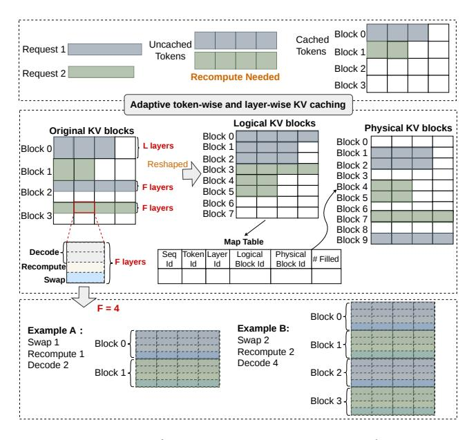

# 3 eLLM Design

To tackle these challenges, we propose eLLM, a system designed to co-optimize token-wise adaptive caching and layerwise kernel fusion in dynamic environments. The goal of eLLM is to maximize token generation throughput while ensuring that the TPOT SLOs for the entire inference process are met. Additionally, by reducing the waiting time for requests, eLLM inherently enhances the TTFT performance.

#### 3.1 System Overview

Fig. 6 presents the architecture of eLLM, a dual-level optimization framework comprising **Request-level** and **Layer-level** mechanisms. At the request level, incoming user inference requests are queued in a pooled buffer, where the *Request Batching* component **①** dynamically determines the optimal batch size to maximize concurrent processing while balancing memory and computational constraints. Simultaneously, the *Token-wise Caching* component **②** allocates a cached-token ratio per request to manage memory footprint. These parameters are iteratively refined to adapt to fluctuating workloads, ensuring efficient resource utilization.

At the layer level, *Comm-Com Overlapping* **3** orchestrates synchronization between uncached-token recomputation and cached-token transfers across host and GPU memory, leveraging dedicated CUDA streams to parallelize communication and computation. Complementing this, *Layer-wise Kernel Fusion* **3** merges recomputation kernels for uncached tokens with decoding kernels, while optimizing thread allocation for diverse computational kernels based on real-time workload demands. This dual-layer strategy minimizes latency by overlapping recomputation with token transfers.

eLLM employs closed-loop adaptation, continuously monitoring system metrics (e.g., memory pressure, request queue status) and per-request execution states (e.g., sequence lengths). By dynamically adjusting batch sizes, cached-token ratios, thread allocations, and kernel fusion strategies, the system maintains high throughput and low latency across varying request loads. This holistic optimization ensures efficient coordination between host-GPU communication and

**Figure 7.** eLLM's new KV management mechanism.

computational workflows, maximizing hardware utilization under dynamic inference conditions.

To facilitate this two-level optimization, eLLM redesigns the KV caching mechanism atop modern GPU memory architecture to support adaptive token caching, caching of specific layers for kernel fusion, and efficient swapping of uncached tokens between host and GPU memory.

