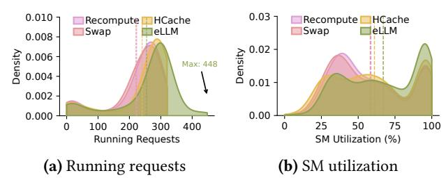
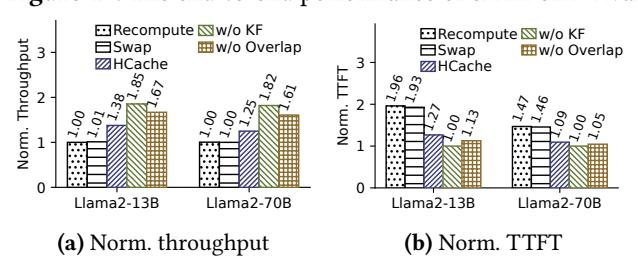

# 5 System Implementation

The eLLM framework is implemented as an extension of vLLM [22], comprising 3,500 lines of Python code and 1,700

**Table 1.** Models and datasets used in the experiments.

| Dataset       |            |     | # Layers | # GPUs | SLO (ms) |
|---------------|------------|-----|----------|--------|----------|
| ShareGPT [36] | Llama2-13B | MHA | 40       | 1 A100 | 50       |
|               | Llama2-70B | GQA | 80       | 4 A100 | 500      |
| L-Eval [5]    | Llama2-13B | MHA | 40       | 1 A100 | 60       |
|               | Llama2-70B | GQA | 80       | 4 A100 | 200      |

lines of CUDA kernel-level optimizations. To maintain backward compatibility, we retain vLLM's core APIs, ensuring seamless integration with third-party LLMs.

Request batching and token-wise caching. eLLM employs real-time request metadata at the start of scheduling. This metadata is fed to a constrained optimization pipeline leveraging SciPy's SLSQP solver, which computes near-optimal batch sizes and uncached-token ratios under current system constraints. These parameters are then propagated to the scheduler to govern concurrent sequence execution limits. Furthermore, each SequenceGroup maintains a dedicated uncached-token ratio variable, which directly controls the partitioning of KV cache blocks between GPU and CPU memory.

Comm-com overlapping. eLLM uses CUDA streams (via torch.cuda.stream) to parallelize computation and communication operations. Specifically, cached token data transfers and uncached token recomputation are executed concurrently via asynchronous CUDA streams. This ensures independent task progression, eliminating synchronization bottlenecks and enabling sustained GPU utilization by overlapping memory-bound and compute-bound operations.

Layer-wise kernel fusion. eLLM precompiles CUDA kernels into shared libraries (.so files) to optimize performance for recomputation and decoding operations. For both kernel types, it generates diverse thread configurations by iterating over 31 values in the range [32, 1024] (with a step size of 32). At runtime, eLLM dynamically selects the optimal .so file based on layer-specific computational requirements, ensuring that thread counts are tuned to align with hardware constraints and workload characteristics.

#### 6 Evaluation

In this section, we present a comprehensive evaluation of eLLM to demonstrate its superiority over the state-of-the-art LLM inference systems through extensive experimentation across diverse workloads and dataset configurations.

## 6.1 Experimental Setup

Hardware and software configurations. We conducted the evaluations on a server equipped with 4 NVIDIA A100 GPUs, each GPU memory capacity is 80GB. Notably, the GPUs utilize PCIe4.0×16 interconnects without NVLink. The inference service is running in a Docker container that leverages CUDA 12.4 and NVIDIA Driver 550.107.02. Additionally, the server is powered by a 96-core Intel Xeon(R) Gold 6342 CPU @2.80GHz processor and 256GB of host memory.

Models and datasets. We evaluated eLLM across four distinct model and dataset configurations, as summarized in Tab. 1. For Llama2-13B, experiments were conducted on a single GPU, while Llama2-70B utilized a tensor parallel (TP) configuration spanning four GPUs. Llama2-13B employs standard MHA, whereas Llama2-70B incorporates Grouped Ouery Attention (GOA) to optimize memory footprint [42]. Evaluating both models allows us to assess eLLM's effectiveness across different attention architectures and varied levels of intrinsic KV memory pressure. We allocated 40GB of host memory for Llama2-13B and 160GB for Llama2-70B to accommodate the swapped KV caches. Our datasets included ShareGPT [36] and the paper assistant subset from L-Eval [5], with the latter comprising long-context dialogues. Specifically, ShareGPT exhibits average input and output lengths of 222 and 1,346, respectively, while L-Eval demonstrates significantly longer contexts, with average input and output lengths of 35,956 and 5,189, respectively.

**Baselines.** eLLM was evaluated against three baselines: 1) vLLM-Recompute [22], which discards all KV caches of preempted requests when GPU memory is full and recomputes them when GPU memory becomes available. 2) vLLM-Swap [22], it swaps the KV caches of preempted requests to host memory when GPU memory is exhausted and restores them to GPU memory when space is available. These two strategies are implemented in vLLM [22]. 3) HCache [12], which is designed to facilitate the faster restoration of multiturn conversations or long-context prompts by storing hidden states of specific layers. We implemented HCache's core functionality in vLLM, recreating its StatePartitionAlgorithm. The fast hidden state restoration works like eLLM's recomputation function, while KV cache swapping between GPU and host during restoration is similar to eLLM's Comm-Com Overlapping. This balances the host-GPU transmission and the computation capability of GPU SMs.

Request generation. Dynamic requests were generated using prompts from the datasets listed in Table 1. We utilized Azure LLM invocation traces of conversation from DynamoLLM [6, 40], which exhibit high temporal variability (average request interval: 22.15ms, standard deviation: 37.49ms). From this dataset, we selected the first 3000 time-interval samples, corresponding to an average request rate of 25 req/s. To align with the different prompt characteristics, we halved the original intervals for ShareGPT (shorter prompts), averaging 50 req/s, and doubled them for L-Eval (longer prompts), averaging 12.5 req/s. Each end-to-end experiment ran for approximately 1.25 hours for ShareGPT and 2.92 hours for L-Eval, including a 2-minute warm-up period and five measurement trials to ensure statistical robustness.

**Metrics.** We evaluated eLLM's performance using TTFT and output token throughput (Throughput) with SLO compliance of TPOT. To ensure fairness, we integrated Eq. (5)

**Figure 10.** The e2e performance of eLLM on ShareGPT. Numbers on each bar in (a)/(b) indicate the throughput improvement/latency reduction of eLLM normalized to the minimum baseline. For (c), the values show the actual SLO attainment.

(r = 0) into *vLLM-Recompute*, *vLLM-Swap*, and *HCache*, allowing them to update the estimated batch size for maximum requests while maintaining SLO requirements for TPOT.

#### 6.2 End-to-End Performance

Token throughput. Our analysis in Fig. 10(a) demonstrates that eLLM achieves significantly higher throughput than baseline methods. Specifically, for Llama2-13B, eLLM outperforms vLLM-Recompute by 2.64× and vLLM-Swap by 2.61×, while delivering a 1.91× improvement over HCache. For the larger Llama2-70B model, eLLM maintains this advantage, achieving 2.0× and 1.6× improvements over vLLM-Recompute/vLLM-Swap and HCache, respectively. These results highlight eLLM's ability to fully exploit GPU memory and computational resources to maximize throughput while adhering to TPOT constraints. The baselines face inherent limitations. vLLM-Recompute and vLLM-Swap prioritize recomputation or host memory-approaches that sacrifice efficiency. HCache improves by caching intermediate hidden states, but only mitigates KV-cache restore overhead and still underperforms eLLM. The gap widens as eLLM combines fine-grained token- and layer-wise optimizations, enabling holistic GPU utilization throughout inference.

TTFT. As output throughput increases, TTFT should theoretically decrease, as higher throughput enables faster request processing and reduces waiting times in the prefilling stage. To validate this, we analyzed TTFT results in Fig. 10(b). The findings demonstrate that eLLM consistently outperforms baselines, achieving up to 2.63× lower TTFT across the two models. For Llama2-13B, eLLM achieves a 2.63× reduction over vLLM-Recompute, 2.59× over vLLM-Swap, and 1.7× over *HCache*. For Llama2-70B, the improvements are 1.62× and 1.61× over vLLM-Recompute and vLLM-Swap, respectively, and 1.21× over HCache. These results highlight eLLM's ability to decrease TTFT while sustaining high throughput. The key reason is eLLM's token-wise caching strategy, which increases concurrent request processing in the queue, directly decreasing prefill waiting times. Moreover, the overlapping and kernel fusion mechanisms in layer-level also reduce the TPOT, leading to a further reduction in TTFT.

**SLO Attainment.** Fig. 10(c) shows each system's SLO compliance. eLLM achieves 97.3% (Llama2-13B) and 98.6% (Llama2-70B) SLO compliance, significantly outperforming

**Figure 11.** The runtime behaviors of eLLM on various systems with Llama2-70B on ShareGPT. The vertical lines represent the average running requests/SM utilization.

*vLLM-Recompute* and *vLLM-Swap*, which exhibit compliance below 88% for both models. While *HCache* demonstrates higher compliance (92.8% for Llama2-13B and 92.9% for Llama2-70B), these values still trail eLLM's results. In terms of throughput efficiency, the average TPOT for *vLLM-Recompute*, *vLLM-Swap*, *HCache*, and eLLM are 63.91, 64.57, 54.54, and 48.39 ms (Llama2-13B), and 680.82, 667.01, 522.2, and 501.74 ms (Llama2-70B), respectively. This data underscores eLLM's dual capability to meet stringent SLO requirements while maintaining superior throughput performance.

**Behaviors of Runtime.** To better understand eLLM's runtime behaviors, we analyzed the distributions of average SM utilization and running requests across all systems on Llama2-70B, as shown in Fig. 11. For running requests, we track the number of current requests at 5-second intervals. Fig. 11(a) presents the density distribution of running requests across different systems. The average number of running requests is 223.16 for *vLLM-Recompute*, 220.94 for *vLLM-Swap*, 240.71 for *HCache*, and 254.64 for eLLM. Furthermore, the maximum number of running requests for eLLM reaches 448, surpassing the other baselines. The reason behind the high number of running requests is that adaptive token-wise and layer-wise caching reduces the memory usage per request. Specifically, the average cached ratio of eLLM is 0.64, resulting in over 36% memory savings.

Regarding SM utilization, we used the nvidia dmon command to trace this metric at 1-second intervals. As shown in Fig. 11(b), when SM utilization exceeds 80%, eLLM achieves the highest density. The average utilization of eLLM is also the highest. Specifically, the average SM utilization for *vLLM-Recompute*, *vLLM-Swap*, *HCache*, and eLLM is 58.65%, 58.20%, 61.20%, and 67.02%, respectively. This represents a significant 15% improvement in SM utilization for eLLM. This enhancement is primarily due to eLLM's optimized processing of higher concurrent requests and its kernel fusion strategy, which efficiently fused memory-sensitive decoding kernels and compute-sensitive recomputing kernels.

**Energy Efficiency.** eLLM achieves high resource utilization, which may lead to increased energy consumption due to the adoption of recomputation during decoding. However, its higher token throughput allows eLLM to deliver greater energy efficiency per generated token. Specifically, eLLM

Figure 12. The end-to-end performance of eLLM on L-Eval.

**Figure 13.** The performance of individual modules in eLLM. The value is normalized by the minimal throughput/TTFT for all systems. w/o KF means disabling *Kernel Fusion*, w/o Overlap denotes disabling *Comm-Com Overlapping*.

achieves 1.43× higher token/watt throughput than *HCache* and 2.21× higher than *vLLM-Swap*. Since both *HCache* and *vLLM-Swap* are offloading strategies using slower memory, these results demonstrate that eLLM is significantly more cost-efficient per watt of power consumed.

Long-context Prompts. To evaluate eLLM's performance on long-context prompts, we used the L-Eval dataset and compared it with baselines, using the real-world loads with intervals doubled from the original Azure trace. Results are shown in Fig. 12, highlighting that eLLM consistently outperforms other methods. In Fig. 12(a), by caching only 0.53 of the prefix length on average, which leads to over 47% memory saving, it achieves up to 3.03× higher throughput than baselines. In Fig. 12(b), eLLM reduces TTFT by 1.79× compared to other baselines. It also maintains a higher SLO attainment rate-96.6% for Llama2-13B and 97.4% for Llama2-70B. In contrast with ShareGPT results in Fig. 10, eLLM's advantages become more pronounced with longer L-Eval prompts. Specifically: compared to vLLM-Recompute, eLLM increases throughput by 2.73× and reduces TTFT by 1.76×. Versus *vLLM-Swap*, it enhances throughput by 3.03× and cuts TTFT by 1.71×. Against HCache, eLLM improves throughput by 1.61× and lowers TTFT by 1.37×. These results confirm eLLM's effectiveness in handling long-context prompts.

