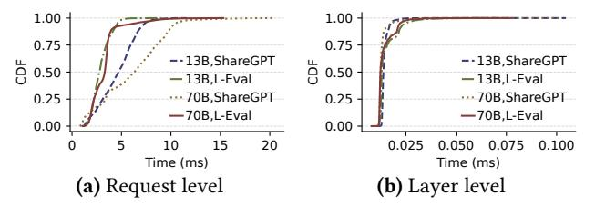

# 6.3 Evaluation of Individual Components

**Disable** *Comm-Com Overlapping*. By deactivating the *Comm-Com Overlapping* module, eLLM is forced to delay swapping the next layer's KV caches until the current layer completes recomputation. This sequential approach increases TPOT due to prolonged recomputation times across all layers. Despite this limitation, eLLM maintains superior throughput and TTFT performance compared to baselines while satisfying TTFT SLOs. As depicted in Fig. 13(a),

**Figure 14.** The TTFT performance of eLLM with various loads on L-Eval. The relative load is the load after scaling the original Azure trace data by x times.

throughput improves by  $1.67\times$  for Llama2-13B and  $1.61\times$  for Llama2-70B. Similarly, Fig. 13(b) shows mean TTFT reductions of up to  $1.73\times$  for Llama2-13B and  $1.4\times$  for Llama2-70B. These improvements stem from token-wise caching and layer-wise kernel fusion, which boost concurrency during recomputation and accelerate per-layer decoding latency. The results emphasize the critical role of *Comm-Com Overlapping* in eLLM's design: Its absence causes measurable performance degradation, underscoring its necessity for optimizing throughput and TTFT under TPOT SLO constraints.

**Disable Kernel Fusion**. When Kernel Fusion is disabled, eLLM sequentially recomputes uncached tokens and decodes new tokens for each layer. While this impairs GPU SMs efficiency compared to fused implementations, the retained benefits of request-level optimization and Comm-Com Overlapping still enhance both throughput and TTFT. As illustrated in Fig. 13(a), eLLM without Layer-wise Kernel Fusion (w/o KF) achieves up to 1.85× and 1.83× higher throughput compared to *vLLM-Recompute* and *vLLM-Swap* for both Llama2 models, and 1.34× for Llama2-13B and 1.46× for Llama2-70B improvements over HCache. For TTFT, Fig. 13(b) shows that eLLM w/o KF delivers a 1.96× faster TTFT than baselines. These gains surpass those of eLLM w/o Overlap, demonstrating that Comm-Com Overlapping effectively minimizes execution time when properly configured, particularly through optimizing the layers of recomputation and transferring between host and GPU. Additionally, these results also prove that Layer-wise Kernel Fusion remains critical for fully utilizing SMs to achieve peak performance.

## 6.4 System Stability Under Scaling Loads

To evaluate eLLM's stability under varying load conditions, we scaled the original Azure trace to  $0.5 \times \sim 3.0 \times$  the base request rate (12.5 $\sim$ 75 req/s in 12.5 req/s steps). We then compared eLLM with baselines using long prompts from L-Eval. The load was increased incrementally for each system configuration until a sharp inflection point in the TTFT identified saturation. Throughout the test, no requests were dropped, ensuring all queries waited in the pending queue.

**Request throughput.** As shown in Fig. 14, the TTFT for all systems increases with higher request rates. This increase is initially gradual but becomes sharp once a certain load threshold is reached. For Llama2-70B, eLLM maintains stable

Figure 15. SLO attainment across various loads on L-Eval.

TTFT performance up to a relative load of 2.5×. In contrast, TTFT increases dramatically at only 2× relative load when using HCache, vLLM-Swap, and vLLM-Recompute approaches. This demonstrates that eLLM achieves a 1.25× higher request throughput compared to baselines by fully utilizing both memory and computational resources. Regarding the Llama2-13B model, GPU computational resource saturation under high request rates results in a consistent TTFT knee point at 2× relative load for eLLM and HCache. Although eLLM accommodates a similar number of requests as HCache in a steady state under Llama2-13B model, its partial tokenwise caching mechanism allows it to fit more requests into GPU memory for concurrent decoding. This results in a substantially higher token throughput in the decoding phase, as illustrated in § 6.2. This advantage is further demonstrated by eLLM's lower TTFT compared to HCache, highlighting its superior efficiency under heavy loads.

**Goodput.** Furthermore, eLLM achieves the highest goodput, as illustrated in Fig. 15. Following the definition of goodput in DistServe [56], which is the maximum request rate that satisfies an SLO attainment of at least 90%, eLLM achieves the highest goodput among the evaluated systems. Specifically, under a relative load of 3×, eLLM sustains approximately 90% SLO compliance for Llama2-13B, representing a 1.5× improvement over *HCache* and a 6× improvement over *vLLM-Swap* and *vLLM-Recompute*. For Llama2-70B, eLLM achieves 1.67× the goodput of *HCache* and over 5× that of *vLLM-Swap* and *vLLM-Recompute*. This further demonstrates eLLM's efficiency in handling intensive workloads.

## **6.5** Sensitivity Analysis of Parameter *F*

We conducted a sensitivity analysis of parameter *F* using Llama2-70B. As shown in

| <b>Table 2.</b> Sensitivity of F |       |       |       |  |  |  |
|----------------------------------|-------|-------|-------|--|--|--|
| F                                | 2     | 4     | 8     |  |  |  |
| Memory fragmentation             |       |       |       |  |  |  |
| Map overhead                     | 6.67% | 3.84% | 1.47% |  |  |  |
| Norm. throughput                 | 1.13× | 1.31× | 1.0   |  |  |  |

Tab. 2, the average memory fragmentation rates were 1.18%, 1.38%, and 2.30%, while map access overhead constituted 6.67%, 3.84%, and 1.47% of the average request processing time for F=2, F=4, and F=8, respectively. When F is set to 4, the system maximizes end-to-end token throughput, achieving improvements of 1.14× and 1.31× compared to F=2 and F=8, respectively. These findings indicate that F=4 optimally balances the trade-off between memory efficiency and computational performance.

Memory stability in long-running scenarios. The fragmentation efficiency remains stable over long durations because eLLM manages KV cache in fixed-size blocks, similar to PagedAttention, where freed blocks are returned to a global free list immediately upon request completion, eliminating the need for periodic compaction or garbage collection. The fragmentation in eLLM is strictly bounded: overhead is primarily limited to internal fragmentation within partially filled tail blocks (less than one block per active request), while external fragmentation is mitigated by block-granular reuse. Consequently, long-term execution maintains a stable free-block pool without progressive memory exhaustion, ensuring sustained performance under continuous workloads.

## 6.6 Robustness of Latency Model

The latency models in § 4.2.1 consider only computation and may therefore slightly underestimate latency, as the decoding phase is memory-bandwidth-bound. However, this has a negligible impact on optimizing b and r because: (1) total latency is the sum of recomputation and decoding times, so any decoding-time error affects only a fraction of the overall estimate; (2) b and r jointly determine both latency and GPU-memory usage via their coupling (Eq. (1)), so pinpoint-accurate latency figures are less critical; and (3) selecting b and r is only one ingredient in end-to-end latency optimization, eLLM applies additional techniques that further reduce latency. Because decoding occupies just one segment of the total latency, the model remains effective even in the presence of minor GPU-memory-bandwidth biases.

To validate this robustness, we conducted empirical measurements across heterogeneous GPUs and performed sensitivity analyses. Empirical validation on a V100 GPU with Llama2-13B yields a MAPE (mean absolute percentage error) of 0.13 for T(b,r), confirming the model's accuracy across legacy architectures. Beyond these intrinsic biases, we further investigate eLLM's sensitivity to parameter inaccuracies by perturbing FLOPs and peak bandwidth by  $\pm 20\%$  on an A100 GPU. Even with these significant perturbations, eLLM exhibits minimal performance degradation: a  $\pm 20\%$  overestimation results in a 1.6% throughput decrease and a 5.4% TTFT increase, while a  $\pm 20\%$  underestimation leads to a 1.9% throughput decrease and a 3.4% TTFT increase.

These results indicate that estimation errors merely cause a slight shift in the chosen operating point rather than system instability. For evolving architectures (e.g., NVIDIA H100 or Blackwell-based B200), eLLM remains robust as long as architecture-specific constants are updated. Inaccuracies primarily affect the marginal optimality of the configuration rather than the fundamental applicability of the design, ensuring reliability across rapid hardware generational shifts.

## 6.7 System Overhead

**Request-level overhead.** We evaluated the overhead associated with optimizing b for request batching and r for

**Figure 16.** The system overhead across various models and datasets. 13B and 70B denote Llama2-13B and Llama2-70B.

token-wise caching. As illustrated in Fig. 16(a), all processing overheads across various models and datasets remain under 21 ms, and 90% of them are less than 10 ms. For Llama2-13B, the average overhead on ShareGPT and L-Eval datasets is 4.58 ms and 2.91 ms, respectively. For Llama2-70B, these values increase slightly to 6.04 ms and 3.25 ms. These results demonstrate that eLLM can quickly identify the optimal b and r under dynamic workloads, enhancing the serving efficiency with TPOT SLOs compliance.

Furthermore, eLLM exhibits excellent scalability. When scaling Llama2-70B on ShareGPT from 4 to 8 GPUs and doubling the global batch upper bound from 512 to 1024, the average solving overhead increases only from 6.04 ms to 7.41 ms. This marginal increase indicates that eLLM efficiently handles larger batch sizes and higher degrees of parallelism with negligible computational penalty.

**Layer-level overhead.** Layer-level overhead originates from two primary sources: 1) indexing the layer address of a request's token in the map table and 2) determining the optimal thread configuration for kernel fusion. For the first source, we assessed the overhead associated with querying the map table to retrieve a layer's index. As illustrated in Fig. 16(b), the average latency across all models and datasets is under 0.015 ms, with 90% of measurements below 0.025 ms and a peak of 0.105 ms. This confirms that map-table lookup overhead is negligible. Regarding the second source, the overhead involves calculating the  $V_{K1}$  and  $V_{K2}$  ratio with fixed parameter volumes, which is mostly constant and averages approximately 0.03 ms.

