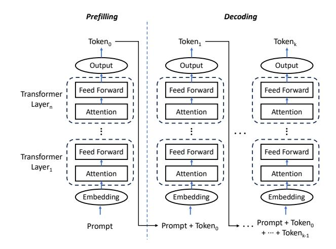
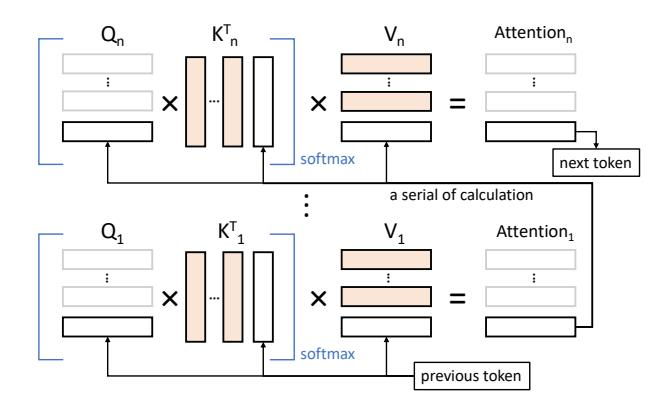

# 1 Introduction

Generative artificial intelligence is widely used today, e.g., ChatGPT [\[2\]](#page-12-0) and DALLE [\[3\]](#page-12-1). These applications are powered by large language models (LLMs), e.g., GPT [\[12\]](#page-13-0), Llama 2 [\[34\]](#page-13-1), and Gemma [\[33\]](#page-13-2). LLM service providers package such pretrained models into applications to deliver LLM serving.

To accommodate diverse quality-of-service requirements and reduce development costs, LLM providers often offer a series of models with similar architectures but different sizes, referred to as a model family.

For example, OpenAI allows users to choose between GPT-3.5 and GPT-4. The open-source Llama 2 family [\[34\]](#page-13-1) also offers models of varying sizes, e.g., 7B, 13B, and 70B.

Recent work has introduced batching and caching to optimize LLM serving; for example, Orca [\[42\]](#page-14-1) proposes selective batching, and KV-cache [\[27\]](#page-13-3) reuses computational results from previous attention by saving the attention keys and values. However, the above optimization techniques apply only to a single model at a time. For batching, variations in model architecture and computational load violate the

homogeneity required for efficient GPU parallelism, making it challenging to batch requests across multiple models. KV-cache stores intermediate results that are specific to a model's architecture and parameters; therefore, sharing KV-cache across requests for different-sized models from the same family is difficult.

This paper takes a first step toward optimizing LLM serving for model families. We make three observations.

- 1. First, the Transformer architecture, which is the foundation of LLMs, exhibits redundancy. Prior work has shown that discarding some attention heads or layers does not significantly affect performance. We discuss this in detail in Section 2.4.
- Second, models from the same family, despite differences in tensor shapes (e.g., number of layers, head size, and hidden size), share a common structure of stacked Transformer layers. This uniformity makes batching and caching feasible across multi-tier models.
- 3. Third, current LLM service providers promote a modelless paradigm, wherein users specify performance requirements (e.g., latency and quality) rather than a specific model.

Based on these observations, we design MFS, an efficient multi-tier LLM serving system for model families. At its core is the largest model in the family, fine-tuned to encapsulate all smaller models, establishing a multi-tier structure. This design saves GPU memory by sharing model parameters and enables batch processing across requests targeting different model sizes.

To present MFS, we first introduce how to transform a model family into a multi-tier structure, a process we refer to as "Knowledge Precipitation". Starting from a pre-trained model, we perform full-parameter fine-tuning on a small dataset and terminate computation early at intermediate layers. Our experiments show that Knowledge Precipitation achieves performance comparable to the corresponding baseline models in the family. Subsequently, building on the fine-tuned multi-tier model, we design a computationally and memory-efficient tier-level batching algorithm and implement KV-cache sharing across requests targeting different model sizes. We do not prescribe a specific algorithm for choosing a model size per request; rather, we provide an inference architecture that is memory- and computation-efficient. Various state-of-the-art scheduling algorithms, such as speculative sampling, can be integrated into this architecture. Additionally, users can manually specify the desired model size when submitting a request, as supported by most LLM service providers. We further explore scheduling policies for our multi-tier model in the system evaluation.

We evaluate the generation quality of MFS as well as its job completion time (JCT) and GPU memory footprint when

**Figure 1.** Illustration of the LLM inference procedure (w/o KV-cache). Some details of the Transformer structure, e.g., residual connections, layer normalization, and positional encoding, are omitted from the figure.

serving a model family. Our experiments show that, as measured by metrics such as MMLU, the Knowledge Precipitation algorithm employed by MFS maintains generation quality across model families such as Llama 2 and Gemma. Furthermore, for serving model families, MFS reduces tokengeneration latency by 56.1% in batching scenarios compared to Orca [42], decreases GPU memory usage by 47.8% with the KV-cache sharing technique enabled, and improves GPU utilization by 35.9% over a state-of-the-art speculative sampling baseline [7].

#### 2 Background and Motivation

In this section, we first introduce the workflow of LLM inference and the key optimization techniques proposed in prior work. We then introduce model families and the current challenges in serving systems for model families. Finally, we present the theoretical foundations that create opportunities to utilize and optimize model families in a serving system.

#### 2.1 LLM Inference

Prefilling and decoding. The inference process of an LLM can be divided into two stages: prefilling and decoding (Figure 1). In the prefilling stage, the model receives the entire input sequence (the prompt), which may include contextual cues or specific user queries, and fully processes it to establish an initial context state. Specifically, all input tokens are passed through the model's Transformer layers to produce contextualized embeddings that condition subsequent generation. The process then enters the decoding stage, in which tokens are generated sequentially. For each new token, the model conditions on both the original prompt and all

**Figure 2.** Illustration of the KV-cache. The orange areas indicate results that have been cached. To generate the (n+1)-th token, we first extract the query/key/value vectors  $(Q_n/K_n/V_n)$  for the n-th token from the last iteration. Together with the cached key/value vectors of previous tokens  $(1, 2, \ldots, n-1)$ , we can efficiently compute the n-th attention output and generate the next token.

previously generated tokens to ensure coherence and contextual relevance. After each token is produced, it is immediately incorporated into the attention computations across Transformer layers to generate the next token. Decoding continues until (i) a user-specified or system-imposed maximum sequence length is reached, or (ii) the model emits an end-of-sequence (< *eos* >) token.

**KV-cache.** Within the Transformer architecture, the attention mechanism requires three intermediate vectors for each token: query (Q), key (K), and value (V). To generate the next token, the model must compute (or retrieve) Q, K, and V for all preceding tokens (Figure 2). The KV-cache stores the K and V vectors of previous tokens to avoid recomputation. Instead of recalculating K/V for all prior tokens, the model retrieves them from the cache, leveraging past computation to reduce latency for subsequent tokens and maintain responsiveness during long generations.

**Batching.** Batching is a foundational technique in LLM inference. It groups multiple inference requests so that the model processes them as a single batch rather than individually. Traditionally, requests are collected until a predefined batch size is reached and then processed together through the model's computational pipeline.

Recent work [42] has introduced continuous batching to account for the varying lengths of LLM responses. With continuous batching, individual requests can join or leave the batch at the end of each iteration (corresponding to the generation of one token). As a result, incoming requests experience minimal delay and are processed as soon as slots become available. This technique enables simultaneous processing of requests of different lengths without padding, significantly reducing wait time and improving throughput.

Sampling. Because the output of LLM inference is a probability distribution over tokens, sampling methods are used to generate coherent response sequences. In one approach, models generate multiple candidate tokens per iteration and select a sequence with high joint probability to enhance semantic coherence. A recent and efficient technique is speculative sampling [7], which employs a dual-model approach: a small draft model quickly proposes multiple tokens sequentially, and a larger target model verifies and refines them in parallel. This approach accelerates generation while maintaining the quality of the larger model.

#### 2.2 Model Serving and Model Families

**Model families.** In the context of LLMs, a model family refers to a series of pre-trained models that share a similar architecture but differ in parameter size—specifically, the number of layers, the number of attention heads, and the hidden size.

| Model/Parameter | 7B   | 13B  | 70B  |
|-----------------|------|------|------|
| Layer Number    | 32   | 40   | 80   |
| Head Number     | 32   | 40   | 64   |
| Hidden Size     | 4096 | 5120 | 8192 |

Table 1. Specification of the Llama 2 model family.

As shown in Table 1, within the Llama 2 family, scaling from Llama 2–7B to Llama 2–70B increases the number of layers/heads/hidden size from 32/32/4096 to 80/64/8192, respectively. The sizes of the fully connected layers are adjusted proportionally. At the same time, all Llama 2 models use the same Transformer variant, which applies techniques such as pre-normalization, RMSNorm [44], SwiGLU [31], and grouped-query attention. Model families allow service providers to offer tailored services based on user needs while leveraging similarities between models to reduce development and maintenance costs.

**Model serving system.** A model serving system manages and executes model inference at scale, especially where low latency and high throughput are crucial. Such systems provide the infrastructure to handle variable workloads, dynamically manage resources, and efficiently execute multiple requests simultaneously. Related work includes INFaaS [28], Tabi [37], and Cocktail [16]. INFaaS automatically selects appropriate models for different devices and batch sizes, adapting quickly to workload changes. Cocktail improves performance through ensemble learning, using multiple small models in parallel and dynamically adjusting ensembles to optimize cost. Tabi features a multi-level inference engine that simplifies queries with smaller models before processing them with larger models; however, it targets discriminative rather than generative models. Systems such as Clockwork [15], BatchMaker [14], Orca [42], and vLLM [22] further optimize serving with techniques such as execution time prediction, batching, and GPU memory management.

#### 2.3 Challenges of Serving Model Families

2.3.1 GPU Memory Challenges. The growth in model size far outpaces the increase in GPU memory. From CNNs (e.g., ResNet and AlexNet) to LLMs, model sizes have grown from tens or hundreds of millions to tens of billions of parameters. In contrast, GPU memory has increased more modestly (e.g., from 32 GB in the V100 to 80 GB in the H800). Consequently, GPU memory footprint is a critical concern for LLM serving. Although inference, unlike training, does not require storing gradients and optimizer states (which consume most GPU memory), it still demands substantial memory to hold the model parameters themselves. Moreover, serving systems for model families may need to host multiple LLMs concurrently, further exacerbating memory pressure.

The KV-cache also significantly consumes GPU memory. For example, a Llama 2–70B model with a 512-token input requires at least 1.25 GB for its KV-cache. This is estimated by doubling the hidden size (8192) to account for key and value vectors, multiplying by 80 layers, and using 2 bytes per element in FP16. The extensive memory usage of KVcache intensifies pressure on limited GPU resources, thereby limiting the capacity for concurrent requests.

For model families, storing and managing KV-caches for multiple models adds complexity. In addition, KV-cache cannot be shared across models, further taxing GPU memory resources.

#### 2.3.2 Underutilization of GPU Compute Resources.

In LLM inference, the decoding stage underutilizes GPU compute resources. Because KV-cache avoids redundant computation, each iteration processes only the vectors related to the most recent token. Meanwhile, only a single token is generated per iteration, leading to poor utilization of GPU parallelism. Although batching multiple requests can improve utilization, existing methods do not support batching across different models within a family, limiting efficiency in model-family serving scenarios.

2.3.3 Cost per LLM Query Matters. Efficiently managing the cost per LLM query is crucial for the financial viability of LLM services. As models become larger and more complex, their computational requirements increase, raising operational costs. To meet strict latency demands, service providers often overprovision compute resources, particularly GPUs, which can reduce cost effectiveness. Balancing computational expense with performance is essential to ensure each query delivers maximum value at minimal cost. In the context of model families, this balance is even more challenging because different models require different resource allocations, further complicating cost management and efficiency.

#### 2.4 Observations and Opportunities

We next discuss key observations and opportunities in serving model families of LLMs. We focus on the structural uniformity within a model family, the redundancy of Transformer architectures, and the shift toward model-less inference systems. These insights are crucial for improving deployment efficiency and performance.

Structural uniformity within a model family. Models in the same series often share an identical architectural framework with variations primarily in scale. While specific parameters (e.g., the number of layers, hidden size, and number of attention heads) differ, the overall design—such as the use of stacked Transformer layers and the connectivity pattern among them—remains the same. For instance, the Llama 2 series includes Llama 2–7B, Llama 2–13B, and Llama 2–70B, all of which employ a common Transformer variant. This consistency provides a foundation for applying uniform optimizations such as batching and KV-cache strategies across models in the same series.

Redundancy within Transformers. Prior studies show that some Transformer layers and attention heads can be pruned without significantly affecting performance, indicating redundancy.

To exploit this redundancy, researchers propose structured pruning [\[17\]](#page-13-12), which reduces model complexity by removing entire components (e.g., neurons or channels). In Transformers, structured pruning commonly targets heads and layers. Head pruning addresses redundancy among attention heads: not all heads contribute equally to performance. In practice, a small subset often plays critical and linguistically interpretable roles, such as encoding positional, syntactic, or rare-word information. For example, pruning up to 38 out of 48 heads in an encoder resulted in only a 0.15 BLEU decrease on the English–Russian WMT dataset [\[35\]](#page-13-13). Layer pruning selectively removes layers to reduce network depth and improve inference efficiency. Because layers execute serially, reducing depth can substantially decrease latency. Layer pruning can be implemented straightforwardly; for instance, LayerDrop applies structured dropout during training, enabling dynamic depth adjustment under computational or latency constraints.

This redundancy presents opportunities to share model parameters across tasks and models, potentially reducing GPU memory usage and increasing computational efficiency, leading to more resource-efficient deployments of LLMs.

Shift toward model-less inference systems. Inference serving systems increasingly adopt a model-less approach, where the focus is on meeting specified performance metrics rather than invoking predefined models. This shift opens opportunities to adapt model architectures for specific operational goals. By tailoring model structure to task requirements instead of adhering to a fixed architecture, service providers can achieve greater efficiency and effectiveness.

Opportunity. We explore the feasibility of employing a single model to encapsulate multiple tiers within a series. For instance, can Llama 2–70B be structured to also perform the functions of Llama 2–13B and Llama 2–7B? Achieving this would require adapting pre-trained parameters to enable such flexibility. While this approach challenges conventional pre-training practices, it could streamline model management by reducing the number of distinct models that must be maintained and deployed.

Exploring the potential of multi-tier models for LLM serving reveals several advantages. Within a series, batching becomes more feasible due to shared architectural elements (e.g., identical layers or parameters at certain depths). This commonality also facilitates KV-cache sharing among different requests, further optimizing memory usage and reducing redundant computation. Additionally, in approaches such as speculative sampling, draft and target models can share partial computation results and KV-caches. This synergy improves token-generation efficiency, reduces latency, and increases resource utilization across the serving system. Such multi-tier configurations can increase throughput and scalability in LLM serving.

